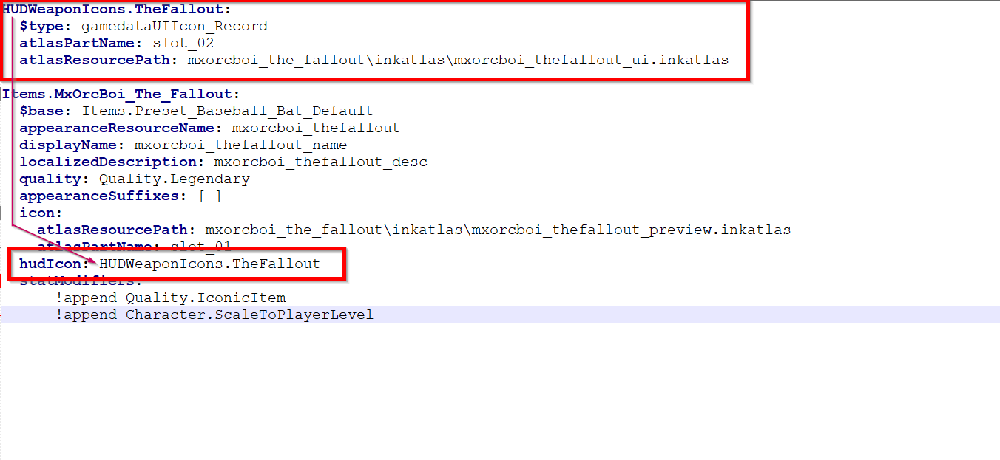

# Your own HUD icons

## Summary

**Created by** [MxOrcBoi](http://127.0.0.1:5000/u/YRvTJDa38nMHXIZUnmSdbzZv4lw2 "mention")\
**Published July 15. 2023**

This guide is a subsection of the [weapons.md](../items-equipment/adding-new-items/weapons.md "mention") ArchiveXL guide and details the process of adding a HUD icon. The same principle applies for other parts of the UI.

## Adding custom player HUD icon

<figure><figcaption>
Custom HUD created for the rebar club.
</figcaption></figure>

To add custom HUD icon:

1. Add `base\gameplay\gui\widgets\ammo_counter\atlas_ammo_counter.inkatlas` and `base\gameplay\gui\widgets\ammo_counter\atlas_ammo_counter.xbm` to your project.
2. [Export](../../textures/images-importing-editing-exporting.md) `base\gameplay\gui\widgets\ammo_counter\atlas_ammo_counter.xbm` as PNG and create a custom icon in chosen editing software. (You can refer to [creating custom inventory icons](adding-items-preview-images/) if you need further reference material).
3. [Import](../../3d-modelling/exporting-and-importing-meshes/) your PNG over the xbm with those settings:

<figure><figcaption>
HUD Icon import settings.
</figcaption></figure>

4. Edit the inkatlas file as in the [icon creation guide](adding-items-preview-images/#hooking-up-the-inkatlas).

## Editing the .yaml file

Now that you have a custom preview icon, it's time to hook it up. You do this by editing the .yaml file.&#x20;

You'll find written instructions below the screenshot.

<figure><figcaption></figcaption></figure>

#### The base record

Add a `HUDWeaponIcons` entry at the root level of your .yaml (no indent). Give it a name, such as `HUDWeaponIcons.TheFallout` in the screenshot above.

It has the following properties (indent level 1):

<table><thead><tr><th width="222">Key</th><th width="248">Value</th><th>Explanation</th></tr></thead><tbody><tr><td><code>$type</code></td><td><code>gamedataUIIcon_Record</code></td><td>This tells the game that it's a UI icon</td></tr><tr><td><code>atlasResourcePath</code></td><td>path/to/your/file.inkatlas</td><td>relative path to your inkatlas file (right-click it in Wolvenkit and select "Copy relative path")</td></tr><tr><td><code>atlasPartName</code></td><td>slot_02</td><td>name of the icon's slot in the inkatlas. If you don't know it, see <a href="adding-items-preview-images/#hooking-up-the-inkatlas">here</a>.</td></tr></tbody></table>

#### Making the weapon use it

Add a new property to the weapon that refers to the record you have created above:

| `hudIcon` | `HUDWeaponIcons.TheFallout` |
| --------- | --------------------------- |

That's it! After starting the game,&#x20;
