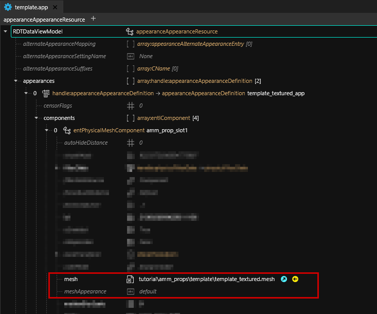
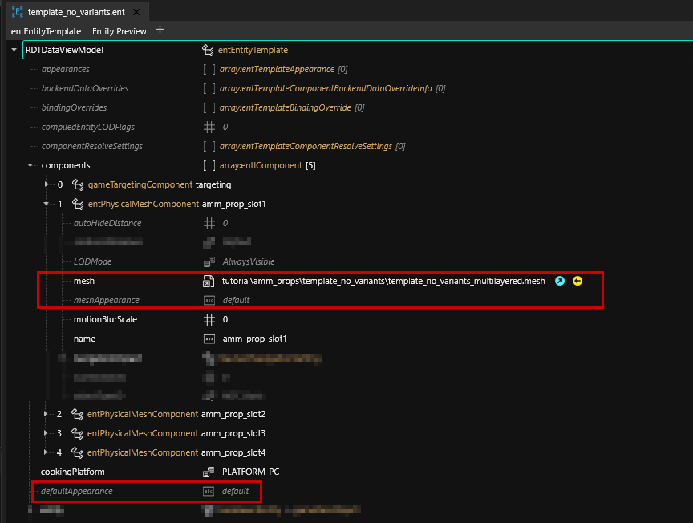

# Custom props

## Summary <a href="#summary" id="summary"></a>

**Created by @manavortex**\
**Published April 2023, updated July 2023**

This guide will teach you how to create AMM props in two variants:&#x20;

* the "vanilla" way by using a [mesh entity](../../files-and-what-they-do/entity-.ent-files.md#mesh-component-entity-simple-entity) with a [.mesh](../../files-and-what-they-do/3d-objects-.mesh-files.md) file with only one appearance
* customizable by chaining a [`root entity`](../../files-and-what-they-do/entity-.ent-files.md#root-entity), an [`.app`](../../files-and-what-they-do/appearance-.app-files.md), and a [`.mesh`](../../files-and-what-they-do/3d-objects-.mesh-files.md) file with multiple appearances.&#x20;


For a guide on how to make meshes out of 2d textures, see [here](your-image-as-custom-mesh.md).


Its focus is on the **file structure** and the **relations between the files**. If you want more hands-on tips what you can do with materials, check [here](textured-items-and-cyberpunk-materials.md) or [here](../../materials/).&#x20;

**It uses the following versions:**

* Cyberpunk 2077 game version 1.6.1 (DLSS)
* [WolvenKit](https://github.com/WolvenKit/WolvenKit-nightly-releases/releases) >= 8.8.1
* [Appearance Menu Mod](https://www.nexusmods.com/cyberpunk2077/mods/790) (>= version 2.1, anything earlier won't have customizable appearances)
* Optional, but recommended if you want to create multiple props: [Notepad++](https://notepad-plus-plus.org/downloads/)

**Level of difficulty:** You know how to read.

## Setting up the project

This section will tell you how to get the files, then give you an [explanation](custom-props.md#explanation-what-did-you-just-download) of what they do and finally show you a [diagram](custom-props.md#diagram) on how they hang together.


At any part during the process, you can [install the mod](http://127.0.0.1:5000/s/-MP\_ozZVx2gRZUPXkd4r/wolvenkit-app/menu/toolbar#install-and-launch) and launch the game to spawn the props with AMM. In the decor tab, search for

`Tutorial item`\
`Tutorial item (customizable)`


1. Create a project in Wolvenkit and give it a name. This will later be the name of your archive file.
2. Download the AMM prop template from [Nexus](https://www.nexusmods.com/cyberpunk2077/mods/8011). Download **the complete source folder**, as it will have the files as depicted below.
3.  Prepare your Wolvenkit project by merging the source folder you downloaded with the one from your project. By the end of it, you should have the following files:

    <figure><figcaption></figcaption></figure>


4. Optional, but recommended: Start the game and spawn the props, as in the green hint box at [the beginning of this section](custom-props.md#setting-up-the-project).
5. Optional, but very recommended: Read through the next section to understand what's going on here.
6. If you're the more hands-on kind of learner, skip to [#using-other-meshes](custom-props.md#using-other-meshes "mention") or [#creating-another-prop](custom-props.md#creating-another-prop "mention") to fuck around and find out.


The first part of the structure is up to you, although for the sake of the tutorial you might want to stick to it. There's a section later on [how to change your paths](custom-props.md#the-final-touches).

The second part (under "resources") is where AMM will look for custom props. You can't change it other than creating subfolders under "Custom Props".


### Explanation: what did you just download?


This section gives an explanation of the included files, explaining the difference in file structure between props with vs without variants.&#x20;

If you don't want to know this, you can skip ahead to [#using-other-meshes](custom-props.md#using-other-meshes "mention") or [#creating-another-prop](custom-props.md#creating-another-prop "mention") to get crackin', or check the [diagram](custom-props.md#diagram) to see how the files connect.


#### LUA file

This file registers your prop with AMM. File content looks like this:

```lua
return {
  -- put your name. Unless that's what you're called, not judging.
  modder = "your_name_here",
  
  -- you're supposed to put your _OWN_ thing here
  unique_identifier = "amm_custom_props_tutorial",

  props = {
    {
      name = "Tutorial item (customizable)",
      path = "tutorial\\amm_props\\template\\template.ent",
      category = "Misc",
      distanceFromGround = 1,
      appearances = {
          "template_item_textured",
          "template_item_multilayered",
      }
    }, 
    {
      name = "Tutorial item",
      path = "tutorial\\amm_props\\template_no_variants\\template_no_variants.ent",
      category = "Misc",
      distanceFromGround = 1,
    },
  }
}
```

Without a `lua` file, AMM (as of version 2.1) won't be able to spawn your props.&#x20;

Here's what the lines do:


<table data-header-hidden><thead><tr><th width="237"></th><th></th></tr></thead><tbody><tr><td><code>name</code></td><td>what you search for in AMM</td></tr><tr><td><code>category</code></td><td>what AMM sorty by (you can only reuse exisitng categories)</td></tr><tr><td><code>distanceFromGround</code></td><td>how far away from the ground should your prop be? (This moves the origin in Blender's 3d viewport)</td></tr><tr><td><code>appearances</code></td><td>If you're using a root entity, these are the appearance names to switch through and the entries in AMM's "appearance" dropdown / spawn tab</td></tr></tbody></table>


When you edit the .lua, it's usually enough to `reload all mods` in CET.&#x20;


#### Entity file

Defined in your `LUA` file, this file holds the game entity that AMM spawns when you click the button. There are two ways of using entity files:&#x20;

[**Mesh entity**](../../files-and-what-they-do/entity-.ent-files.md#mesh-component-entity-simple-entity) **(the legacy version)**

One entity file per variant. The props will not have appearances — AMM's prop browser has one entry per entity file (e.g. `cube_black`, `cube_white`, `cube_glowing`).&#x20;

Edit this kind of prop by opening the following file in Wolvenkit:

<pre><code><strong>tutorial\amm_props\template_no_variants\template_no_variants.ent
</strong></code></pre>


**Fun fact:** The cluttered prop browser annoyed manavortex so much that she joined the AMM developer team, helped Max implement the alternative workflow described below the picture, and wrote this guide!&#x20;

It was bad!


You add props by putting meshes directly into the components array:&#x20;

<figure><figcaption><p>tutorial\amm_props\template_no_variants\template_no_variants.ent<br>Mesh/Component entity, loading something directly. You can read more about the theory <a href="../../files-and-what-they-do/entity-.ent-files.md#mesh-component-entity-simple-entity">here</a> — you don't need to know for the rest of this guide.</p></figcaption></figure>

[**Root entity**](../../files-and-what-they-do/entity-.ent-files.md#root-entity)

One entity file per prop, one entry in AMM's prop browser (e.g. `cube`). After spawning it, you can toggle its appearances (`white`, `black`, `glowing`) the same way you do it with NPCs.


If you have [added clothing items](../items-equipment/adding-new-items/), then this will be familiar to you. If you haven't, please ignore the link and keep reading — this is the simpler version!


Edit this kind of prop by opening the following file in Wolvenkit:

```
tutorial\amm_props\template\template.ent
```

Instead of adding items directly via the components array, we link **appearances** to an [.app file](../../files-and-what-they-do/appearance-.app-files.md). The only component we keep in the [root entity](../../files-and-what-they-do/entity-.ent-files.md#root-entity) is the **targeting component** for the CET cursor: this way, it will be added to each appearance in the .app file.

<figure><figcaption><p>tutorial\amm_props\template\template.ent<br>Root entity, pointing towards an .app file. You can read more about the theory <a href="../../files-and-what-they-do/entity-.ent-files.md#root-entity">here</a> — you don't need to know for the rest of this guide.</p></figcaption></figure>

#### Appearance file

[This file](../../files-and-what-they-do/appearance-.app-files.md) holds a list of `appearances`. Inside each `appearance`, you can define any number of things to be loaded (components) and specify or override their behaviour.


We will only use `entPhysicalMeshComponent`s, and they must be named  `amm_prop_slot1` .. `amm_prop_slot4` if you want to enable scaling.



If you have more than four mesh files assigned to your app's components, the prop will no longer be scaleable (as of AMM 2.1). You can get around this limitation by **making meshes with more submeshes** instead of having individual files.


#### template\_textured.mesh

A pre-configured [mesh](../../files-and-what-they-do/3d-objects-.mesh-files.md) for a textured material. Uses the following files in the subfolder `textures`:

* `template_01_d.xbm`: A diffuse (albedo) map, colouring the mesh
* `template_01_n.xbm`: A normal (bump) map, adding depth to the object.


If you stick to this naming convention and have your filenames end in `_d` or `_n`, Wolvenkit will recognize and identify the correct settings for image import.


You can learn more about textured materials [here](../../materials/#textured). This is not necessary for the purpose of this guide.

#### template\_multilayered.mesh

A pre-configured [mesh](../../files-and-what-they-do/3d-objects-.mesh-files.md) for a multilayered material. Uses the following files in the subfolder `textures`:

* `6_layers.mlsetup`: A [multilayer setup](../items-equipment/editing-existing-items/changing-materials-colors-and-textures.md#multilayered-material) with colour properties
* `6_layers.mlmask`: A [multilayer mask](../../materials/multilayered/), determining which parts of the mesh are affected by which layer of the mlsetup. In this case, it just contains six blank layers.
* `template_01_n.xbm`: A normal (bump) map, adding depth to the object.

You can learn more about multilayered materials [here](../../materials/#multilayered). This is not necessary for the purpose of this guide.


If you have downloaded the example Wolvenkit project, you can now install it and launch the game, seeing everything in action.


### Diagram

Okay, now that we've gone through the theory, let's have a quick overview how everything hangs together:

#### Without variants

<figure><figcaption><p>No app file, directly pulling in a mesh with defined appearance</p></figcaption></figure>

#### With variants

<figure><figcaption><p>The better option — not actually that much more complex, is it? :)</p></figcaption></figure>

## Using other meshes

You can point the file at a different mesh by changing the depot path of the component. If you have no idea how to do that, read on!&#x20;

### With variants

1. Open the `appearance` file `tutorial\amm_props\template\template.app`
2. Find the array `appearances` at the top of the file
3. For each appearance, open the `components` array
4. Click on the first component `amm_prop_slot1`.  In the panel to the right of the tree, change the following properties:
   * `mesh -> DepotPath`. Put the relative path to your .mesh (right-click on the file)
   * `mesh -> meshAppearance`. Put something that [actually exists in your file](../../files-and-what-they-do/3d-objects-.mesh-files.md#step-1-appearances), otherwise the first appearance from the list will be used as default.

<figure><figcaption><p>For props with variants: <code>template.app</code></p></figcaption></figure>

5. If you want to use more than one mesh, repeat the process for the other components. If you want to use more than 4, check [#why-only-4-components](custom-props.md#why-only-4-components "mention") below.
6. Repeat the process for the other appearances.
7. Save the file and start the game. If you've done everything right, you will now see your new mesh.

### Without variants

1. Open the  [`mesh entity`](../../files-and-what-they-do/entity-.ent-files.md#mesh-component-entity-simple-entity) `tutorial\amm_props\template_no_variants\template_no_variants.ent`
2. Find the `components` array and open it
3. Click on the first component `amm_prop_slot1`.  In the panel to the right of the tree, change the following properties:
   * `mesh -> DepotPath`. Put the relative path to your .mesh (right-click on the file)
   * `mesh -> meshAppearance`. Put something that [actually exists in your file](../../files-and-what-they-do/3d-objects-.mesh-files.md#step-1-appearances), otherwise the first appearance from the list will be used as default.

<figure><figcaption><p>For props without appearances: <code>template_no_variants.ent</code></p></figcaption></figure>


4. If you want to load more than one mesh, repeat the process for the other components. If you want to use more than four, read [#why-only-4-components](custom-props.md#why-only-4-components "mention")
5. Finally, change the `defaultAppearance` to [a valid appearance in your .mesh file](../../files-and-what-they-do/3d-objects-.mesh-files.md#step-1-appearances). If no appearance with this name can be found, the prop will be invisible when it spawns.

### Why only 4 components?

Currently (October 31 2023), AppearanceMenuMod can only **scale objects** by targeting their components by name. For that reason, yours have to be named as they are.

If you use more than 4 components or change their name, then your prop will no longer scale.

## Creating another prop


This step is **optional**. If you just want to see how this works, you can pack your project with Wolvenkit and search AMM for "tutorial item". However, assuming that you actually want to make cool things, you will be doing this a lot.


If you want to create another prop, here's the fastest non-script way to go about it (tried and tested by manavortex):

1. In Windows Explorer, duplicate the `template` folder
2. Rename the new folder (`template - Copy`) to the name of your prop (e.g. `baseball`).&#x20;


It's important that you stick to a schema here, because otherwise, the search and replace approach below will not work and you have to change all the paths by hand. Use the exact same value to replace `template` in both the folder and the file names!


3. Rename all files inside of the folder: replace `template` with the name of your prop (e.g. `baseball`).&#x20;
4. Right-click on your folder and export the entire thing to json.
5. Switch to the `raw` tab in Wolvenkit and open your json files in Notepad++
6.  Via `Search and Replace in Files` (Ctrl+Shift+F), replace `template` with the name of your new prop and folder (e.g. `baseball`). Replace it in all files, **using Match case**:

    <figure><figcaption><p>Make sure to check "<strong>Match case</strong>", or you will be unable to re-import the .ent file!</p></figcaption></figure>
7. **Optional**: If you have changed the folder structure (e.g. moved your folder from the subfolder `stuff` to the subfolder `misc`), run another `Search and Replace in Files` (Ctrl+Shift+F) to adjust your file paths.
8. In the project browser's raw section, right-click on the folder and select `Convert from json`. This will have updated the relationships between the files to your renamed files.
9. Delete the files / appearances that you don't need. Save and close the mesh file.
10. Import your meshes and textures over the ones from the template. For a guide on how to do that, check [here](textured-items-and-cyberpunk-materials.md#importing-a-mesh).&#x20;
11. Add another entry to the props array in your `LUA` file:

```
    {
      name = "Baseball (customizable)",
      path = "tutorial\\amm_props\\baseball\\baseball.ent",
      category = "Misc",
      distanceFromGround = 1,
      appearances = {
          "baseball_textured",
          "baseball_multilayered",
      }
    }, 
```

Now you can launch the game and check your prop. If everything went well, you should see something like this now:

<figure><figcaption><p>Not a moon</p></figcaption></figure>

If not, it is time to hit up the [troubleshooting](custom-props.md#troubleshooting).

## The final touches

Before you can share your custom props, you **have** to change the folder structure and file paths. Otherwise, two people overwrite `tutorial.lua`, and one of the mods stops working.

You can find a step-by-step guide on the process [here](moving-and-renaming-in-existing-projects.md).

## Troubleshooting

This section will only cover troubleshooting steps for this guide. \
For anything related to mesh imports, see [here](textured-items-and-cyberpunk-materials.md#troubleshooting). \
For general 3d model troubleshooting (including import errors), see [here](../../3d-modelling/troubleshooting-your-mesh-edits.md).

### My prop doesn't even list in AMM!

The problem is in your .lua file. Use [this tool](https://www.tutorialspoint.com/execute\_lua\_online.php) to check the syntax and make sure that there are no errors - usually, it is missing/extra commas and/or missing/extra braces.&#x20;

If the syntax is okay and your prop still doesn't show up, double-check your category and make sure that it is one of the existing ones.

### My prop won't spawn!

#### ... and I can't target it!

AMM can't find your .ent file. Make sure that your .lua points to the correct path in your archive (right-click -> copy relative path and paste it to your lua file.&#x20;


Make sure that you don't delete any quotation marks or commas while you do that. If you're unsure, you can double-check [this step](custom-props.md#my-prop-doesnt-even-list-in-amm).


#### ... it all looks good, but there is no prop!

Toy around with the **scaling**. Sometimes, your prop doesn't show because it's the size of Johnny's ego and hovers somewhere above your city block – or the opposite, it's microscopically tiny.  Don't be afraid to change it by the factor 10 or even 100 and see if that does anything.

If that's not it and if you have a customizable prop (with a root entity), try adding an appearance `default` to the mesh. The game will fall back to that one if there are issues with your custom appearances.

### My prop spawns, but something about it is weird!

In general, your answer is probably in the guide on [textured-items-and-cyberpunk-materials.md](textured-items-and-cyberpunk-materials.md "mention"), section 2 ([processing the mesh](textured-items-and-cyberpunk-materials.md#step-2-processing-the-downloaded-mesh)) – check that guide's [troubleshooting section](textured-items-and-cyberpunk-materials.md#troubleshooting).

