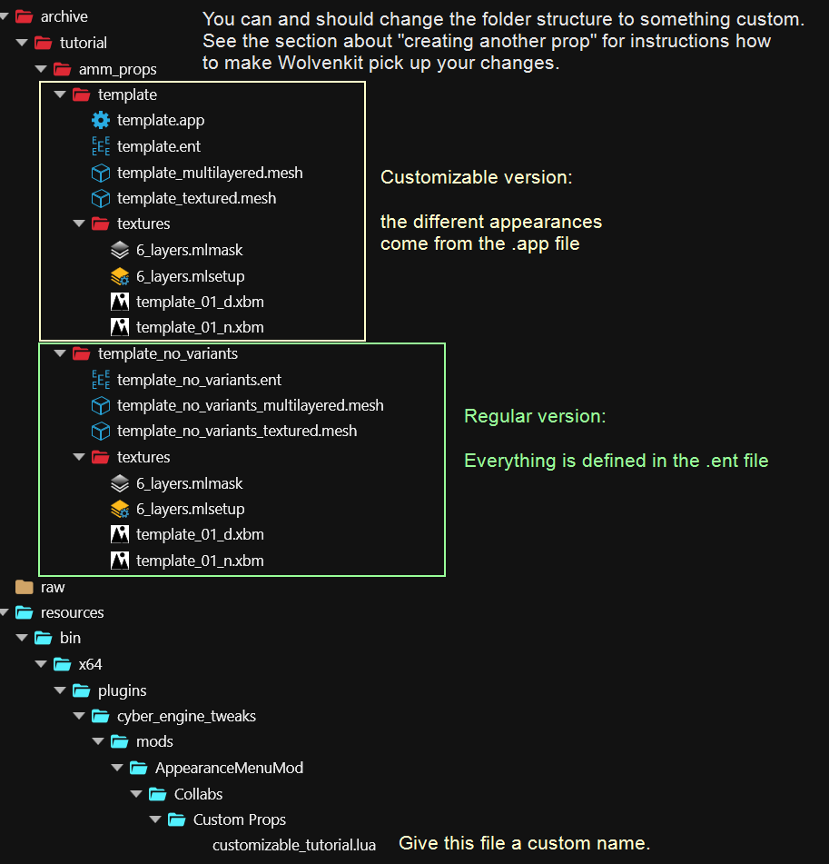
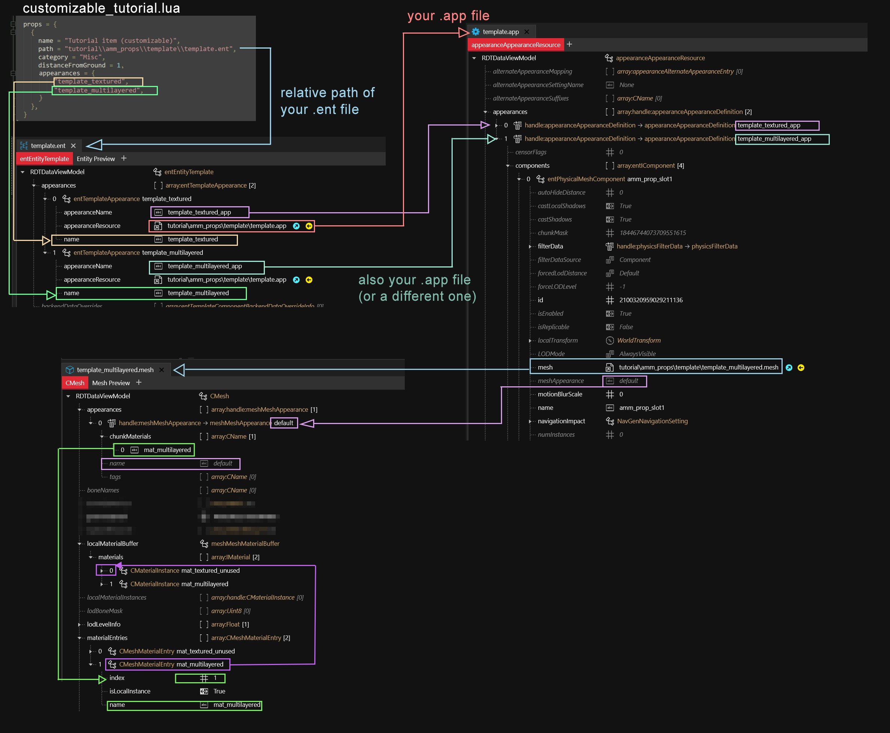
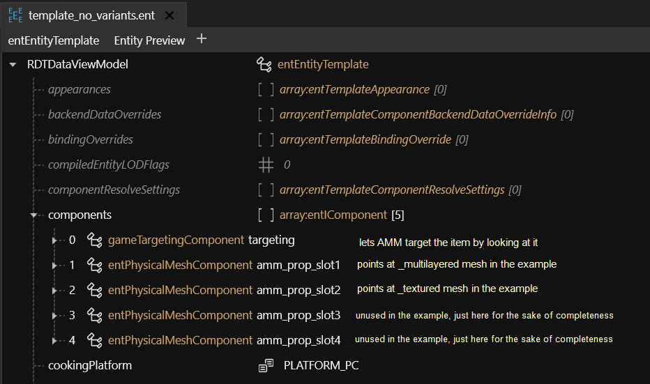
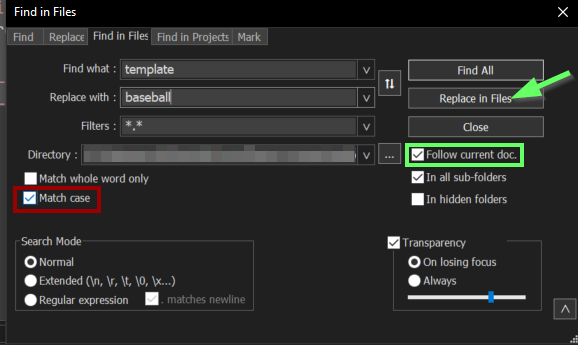

# Custom props

## Summary <a href="#summary" id="summary"></a>

**Created by @manavortex**\
**Published April 82023**

This guide will teach you how to create a customizable by chaining an .ent, an .app, and a .mesh file with multiple appearances. Its focus is on the file structure and the relations between the files. If you want more hands-on tips what you can do with materials, check [here](textured-items-and-cyberpunk-materials.md) or [here](../../materials/).&#x20;

**It uses the following versions:**

* Cyberpunk 2077 game version 1.6.1 (DLSS)
* [WolvenKit](https://github.com/WolvenKit/WolvenKit-nightly-releases/releases) >= 8.8.1
* [Appearance Menu Mod](https://www.nexusmods.com/cyberpunk2077/mods/790) (>= version 2.1, anything earlier won't have customizable appearances)
* Optional, but recommended if you want to create multiple props: [Notepad++](https://notepad-plus-plus.org/downloads/)

**Level of difficulty:** You know how to read.

## Setting up the project

1. Create a project in Wolvenkit and give it a name. This will later be the name of your archive file.
2. Download the AMM prop template from [Nexus](https://www.nexusmods.com/cyberpunk2077/mods/8011) or from manavortex's [mega](https://mega.nz/file/LFk02RJS#Vnb5XnNayICKNEFVeAVM7\_LunydUFDNHyAiW6SR41g8), or download the complete [source folder](https://mega.nz/file/OYVBAByY#\_FYr6OpKYK3q5\_bcyKjtnljFv\_dwqyHkTNKL0zG84Pg) for Wolvenkit. It will have prepared files, which is faster than doing everything from scratch by yourself.
3.  Prepare your Wolvenkit project and make sure that you have the following files:

    <figure><figcaption></figcaption></figure>


The first part of the structure is up to you, although for the sake of the tutorial you might want to stick to it and [change it at the end](moving-and-renaming-in-existing-projects.md). The section about [Creating another prop](custom-props.md#creating-another-prop) will tell you how to change file and folder names in all the files.

The second part (under "resources") is where AMM will look for custom props. You can't change it other than creating subfolders under "Custom Props".


### Explanation

#### LUA file

This file registers your prop with AMM. File content looks like this:

```lua
return {
  -- put your name. Unless that's what you're called, not judging.
  modder = "your_name_here",
  
  -- you're supposed to put your _OWN_ thing here
  unique_identifier = "amm_custom_props_tutorial",

  props = {
    {
      name = "Tutorial item (customizable)",
      path = "tutorial\\amm_props\\template\\template.ent",
      category = "Misc",
      distanceFromGround = 1,
      appearances = {
          "template_item_textured",
          "template_item_multilayered",
      }
    }, 
    {
      name = "Tutorial item",
      path = "tutorial\\amm_props\\template_no_variants\\template_no_variants.ent",
      category = "Misc",
      distanceFromGround = 1,
    },
  }
}
```

Without a `lua` file, AMM (as of version 2.1) won't be able to spawn your props.&#x20;


`name` is what you'll search for in AMM

`category` is for AMM sorting

`distanceFromGround` is pretty self-explanatory (I like floating objects)

`appearances` registers the variant names.


#### Entity file

Where AMM looks up how to load a prop, as defined in your `LUA` file. Think of it as a dictionary between the appearance names as defined in the lua and the actual game files.

As you can see, it has a `components` array. We will make use of this by placing the `gameTargetingComponent` here, which will let AMM focus the prop via cursor.

As of AMM 2.1, props finally support appearance switching like NPCs! We do this by loading an .app file, which will hold different components per appearance:

<figure><figcaption><p>Root entity, pointing towards an .app file</p></figcaption></figure>

As a reminder, this is how the old variant used to look:

<figure><figcaption><p>Mesh/Component entity, loading something directly</p></figcaption></figure>

#### Appearance file

This file holds the specifics by defining a list of `appearances`. Inside each appearance, you can define any number of things to be loaded (components) and specify or override their behaviour.


We will only use `entPhysicalMeshComponent`s, and they must be named  `amm_prop_slot1` .. `amm_prop_slot4` if you want to enable scaling.



If you have more than four mesh files assigned to your app's components, the prop will no longer be scaleable (as of AMM 2.1). You can get around this limitation by making meshes with more submeshes instead of individual files.


#### template\_textured.mesh

A pre-configured mesh for a textured material. Uses the following files in the subfolder `textures`:

* `template_01_d.xbm`: A diffuse (albedo) map, colouring the mesh
* `template_01_n.xbm`: A normal (bump) map, adding depth to the object.


If you stick to this naming convention and have your filenames end in `_d` or `_n`, Wolvenkit will recognize and identify the correct settings for image import.


#### template\_multilayered.mesh

A pre-configured mesh for a textured material. Uses the following files in the subfolder `textures`:

* `6_layers.mlsetup`: A [multilayer setup](../items-equipment/editing-existing-items/changing-materials-colors-and-textures.md#multilayered-material) with colour properties
* `6_layers.mlmask`: A [multilayer mask](../../materials/multilayered.md), determining which parts of the mesh are affected by which layer of the mlsetup. In this case, it just contains six blank layers.
* `template_01_n.xbm`: A normal (bump) map, adding depth to the object.


If you have downloaded the example Wolvenkit project, you can now install it and launch the game, seeing everything in action.


### Diagram

Here's how the files connect:

<figure><figcaption><p>Looks scary, but is pretty straightforward. Follow the arrows through the files.</p></figcaption></figure>

### Props without variants (the traditional way)

Creating props without variants is even easier than doing it with the `.app`, as we can simply put the `components` directly into the `.ent` file and call it a day:

<figure><figcaption><p>This is the traditional (vanilla) way to do things, you're probably already familiar with it.</p></figcaption></figure>

## Creating another prop


This step is **optional**. If you just want to see how this works, you can pack your project with Wolvenkit and search AMM for "tutorial item". However, assuming that you actually want to make cool things, you will be doing this a lot.


If you want to create another prop, here's the fastest non-script way to go about it (tried and tested by manavortex):

1. In Windows Explorer, duplicate the `template` folder
2. Rename the new folder (`template - Copy`) to the name of your prop (e.g. `baseball`)
3. Rename all files inside of the folder: replace `template` with the name of your prop (e.g. `baseball`). Make sure that it is the same as the containing folder, or you'll have to clean up things by hand later.
4. Right-click on your folder and export the entire thing to json.
5. Switch to the `raw` tab in Wolvenkit and open your json files in Notepad++
6.  Via `Search and Replace in Files` (Ctrl+Shift+F), replace `template` with the name of your new prop and folder (e.g. `baseball`). Replace it in all files, **using Match case**:

    <figure><figcaption><p>Make sure to check "<strong>Match case</strong>", or you will be unable to re-import the .ent file!</p></figcaption></figure>
7. **Optional**: If you have changed the folder structure (e.g. moved your folder from the subfolder `stuff` to the subfolder `misc`), run another `Search and Replace in Files` (Ctrl+Shift+F) to adjust your file paths.
8. In the project browser's raw section, right-click on the folder and select `Convert from json`. This will have updated the relationships between the files to your renamed files.
9. Delete the files / appearances that you don't need. Save and close the mesh file.
10. Import your meshes and textures over the ones from the template. For a guide on how to do that, check [here](textured-items-and-cyberpunk-materials.md#importing-a-mesh).&#x20;
11. Add another entry to the props array in your `LUA` file:

```
    {
      name = "Baseball (customizable)",
      path = "tutorial\\amm_props\\baseball\\baseball.ent",
      category = "Misc",
      distanceFromGround = 1,
      appearances = {
          "baseball_textured",
          "baseball_multilayered",
      }
    }, 
```

Now you can launch the game and check your prop. If everything went well, you should see something like this now:

If not, it is time to hit up the [troubleshooting](custom-props.md#troubleshooting).


If you want to learn more about materials, you can check out [this guide](textured-items-and-cyberpunk-materials.md) or browse the documentation section's [material pages](../../materials/).


<figure><figcaption><p>Not a moon</p></figcaption></figure>

## Troubleshooting

This section will only cover troubleshooting steps for this guide. \
For anything related to mesh imports, see [here](textured-items-and-cyberpunk-materials.md#troubleshooting). \
For general 3d model troubleshooting (including import errors), see [here](../../3d-modelling/troubleshooting-your-mesh-edits.md).

### My prop doesn't spawn and AMM won't target it!

AMM can't find your .ent file. Check the paths in the lua.

###
