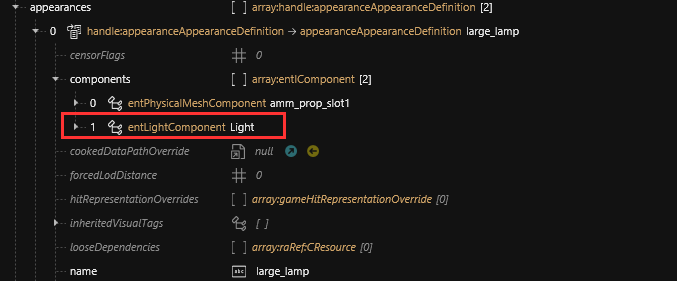
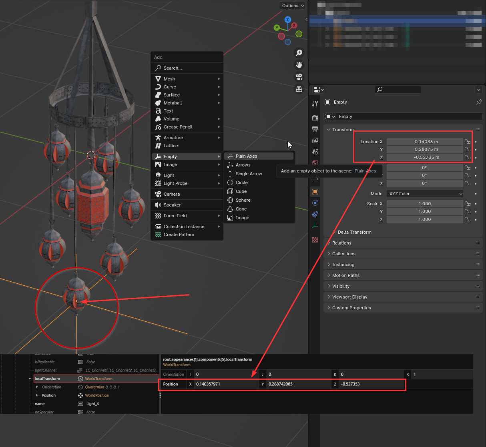

# AMM light components

## Summary

Published: Feb 09 2024 by [manavortex](https://app.gitbook.com/u/NfZBoxGegfUqB33J9HXuCs6PVaC3 "mention")\
Last documented edit: Feb 09 2024 by [manavortex](https://app.gitbook.com/u/NfZBoxGegfUqB33J9HXuCs6PVaC3 "mention")

This page will show you how to add a light component to AMM props.

### Wait, this is not what I want!

For a quick overview on lights and their properties, check [cheat-sheet-lights.md](../../../references-lists-and-overviews/cheat-sheet-lights.md "mention") (currently WIP)

For an explanation about light, check [lights-explained.md](../../../files-and-what-they-do/lights-explained.md "mention") (currently WIP)

## Adding lights to AMM props


You can learn more about effect components (e.g. how to remove or create effect spawns) on the [effect-components.md](../../../files-and-what-they-do/components/documented-components/effect-components.md "mention") page.


This is as easy as finding the right component, adding it to your prop (either in the [root entity](../../../files-and-what-they-do/entity-.ent-files/#root-entity) or in each appearance in the [.app file](../../../files-and-what-they-do/appearance-.app-files.md#appearances)) and naming it **Light:**

<figure><figcaption>
For a list of props to steal those components from, check <a data-mention href="../../../references-lists-and-overviews/cheat-sheet-lights.md">cheat-sheet-lights.md</a>
</figcaption></figure>

This enables the AMM light panel in the target tools.


Not all light components actually support colour and intensity changes. Candlelight, for example, does not.


## Placing your light components

Your lights will be anywhere relative to your prop. How can you position them relative to the actual object?

1. Add an Empty in Blender (Viewport, Hotkey: `Shift+A` -> Empty -> Plain Axes)
2. Move the empty to the position where you want your light to be
3. Switch to the Object tab and see its location transform:

<figure><figcaption></figcaption></figure>

4. In Wolvenkit, find the `localTransform` property inside your light component
5. Copy the values from the "Transform" field in Blender into the `Position` input fields (without the `m`)
6. Save and see your effect changing positions!


If your light doesn't seem to be in the right spot, try multiplying the value for z with -1

