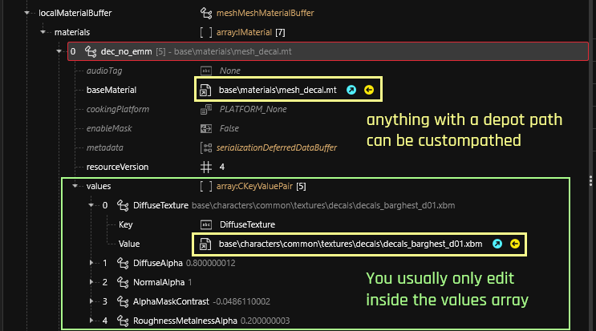

# Custompathing assets

**Published: January 16 2024  by @madmaximusjb**

This guide will teach you how to set game assets as new files. Don't worry, it's really simple!\
We're taking this Liberty handgun mesh (I think it used to belong to some Dexter guy\`?) and make our own copy of the file.

## Prerequisites

You need a [Wolvenkit Project](https://app.gitbook.com/s/-MP\_ozZVx2gRZUPXkd4r/wolvenkit-app/usage/wolvenkit-projects). But if you're reading this, you probably have one already.

Step 1: Getting a file to custompath

You can either download a template file (for example, from the [wiki's repository](https://github.com/CDPR-Modding-Documentation/Cyberpunk-Modding-Docs/tree/main/\_resources\_and\_assets/icons)), or simply find a game file and and [add it to your project](https://app.gitbook.com/s/-MP\_ozZVx2gRZUPXkd4r/wolvenkit-app/editor/asset-browser#adding-files-to-projects).

Once you have the file, you can move it wherever you want it, either in the Windows Explorer or in Wolvenkit's [project explorer](https://app.gitbook.com/s/-MP\_ozZVx2gRZUPXkd4r/wolvenkit-app/editor/project-explorer):

Once you're done, we can proceed to the next section.

## Custompathing (in) game files

You have added a game file to your project, or you have downloaded a template file, and now want to change the references.&#x20;

If your file type isn't included in the lists of examples, you need to look through the file, or use Wolvenkit's [file validation](https://app.gitbook.com/s/-MP\_ozZVx2gRZUPXkd4r/wolvenkit-app/file-validation)

### .mesh


For more information about .this, check [3d-objects-.mesh-files](../../files-and-what-they-do/3d-objects-.mesh-files/ "mention")


Find your `CMaterialInstance` in either `localMaterialBuffer.materials` or `preloadLocalMaterials`, then change any depot paths in the properties:

<figure><figcaption></figcaption></figure>

### .inkatlas


For more information about this, check [game-icons-the-inkatlas-file.md](../../files-and-what-they-do/game-icons-the-inkatlas-file.md "mention")


For modded files, you only need slot 0 - 1 and 2 can be blank.

The `texture` property is optional.

<figure><figcaption></figcaption></figure>

## Until next time, chooms!
