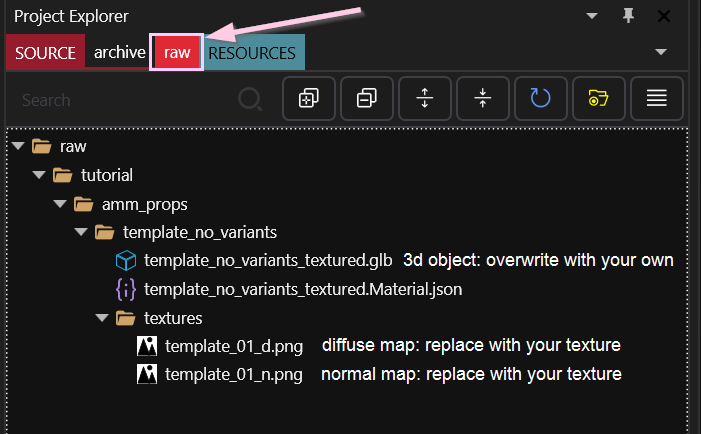
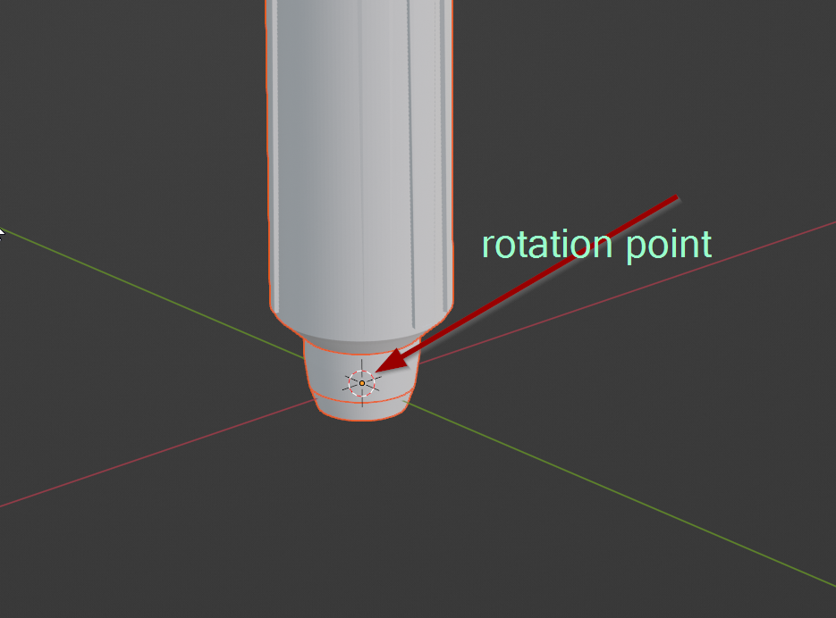
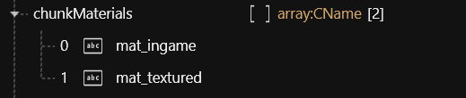
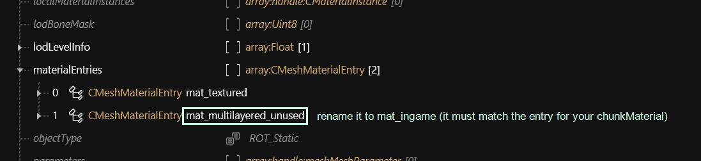
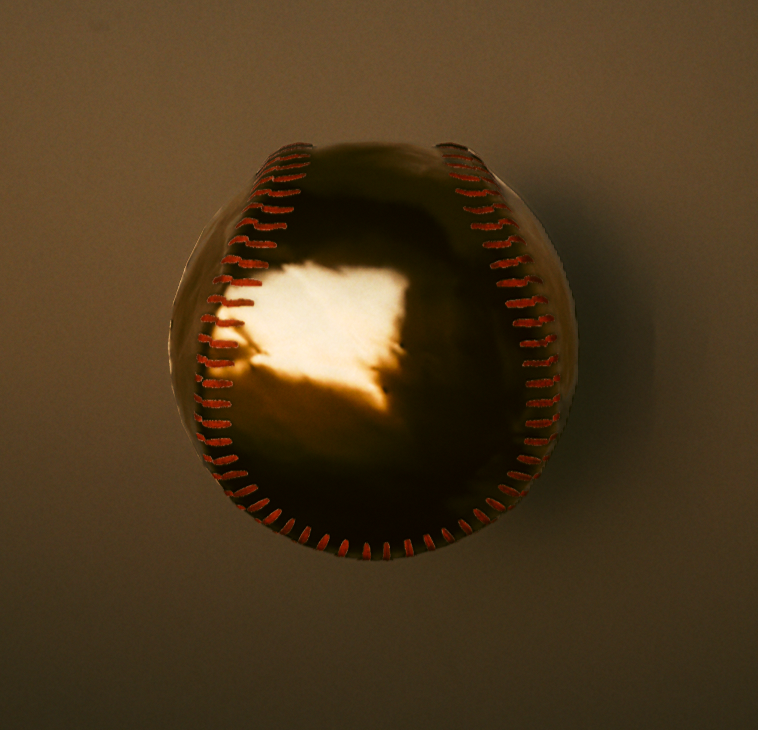

# Textured items and Cyberpunk materials

## Summary <a href="#summary" id="summary"></a>

**Created by @manavortex**\
**Published February 11 2023**

This guide will walk you through **importing 3d objects** into Cyberpunk 2077, which can then be spawned via [Appearance Menu Mod](https://www.nexusmods.com/cyberpunk2077/mods/790).&#x20;

**It uses the following versions:**

* Cyberpunk 2077 game version 1.6.1 (DLSS)
* [WolvenKit](https://github.com/WolvenKit/WolvenKit-nightly-releases/releases) >= 8.8.1
* [Appearance Menu Mod](https://www.nexusmods.com/cyberpunk2077/mods/790) (version 2.0.2, but pretty much any version will do)

**Level of difficulty:** You know how to read.


If you only want to know how to apply Cyberpunk materials to parts of your mesh, check "[Splitting off submeshes](textured-items-and-cyberpunk-materials.md#splitting-off-submeshes-mildly-advanced)" below.

For a guide about changing materials, check [here.](../items-equipment/editing-existing-items/changing-materials-colors-and-textures.md)&#x20;



If you want to understand how material loading works, check the [mesh page](../../files-and-what-they-do/3d-objects-.mesh-files.md).

You can find explanation and documentation about materials [here](../../materials/).&#x20;


## Where to find models

You can find many free 3d models across the web.&#x20;

For game design or rendering, usually textured:

* &#x20;[sketchfab](https://sketchfab.com)
* [Turbosquid](https://turbosquid.com)
* [CGTrader](https://cgtrader.com)

For 3d printing, usually not textured:

* [thingyverse](https://www.thingiverse.com/)
* [MyMiniFactory](https://www.myminifactory.com/)
* [Pinshape](https://pinshape.com/)

You can also search Google for "`thing_I_want` free 3d model" or "`thing_I_want` free `<format>` file" (\<format> = STL, OBJ, FBX), or check [STLFinder](https://www.stlfinder.com/) or the pages on [this list](https://www.3printr.com/3dmodels/categories/free-models).

## Setting up the project

This section is already covered in the guide for [custom props](custom-props.md#setting-up-the-project), using the source folder variant, or directly download [this archive](https://mega.nz/file/GUsSwSxY#Ast7L44g\_YimuKrcbwNCLvYL\_DworhpEQsaH05RNGJw) and extract it into your Wolvenkit project.

Optional: Complete the [creating another prop](custom-props.md#creating-another-prop) section from the custom props guide, or alter one of the two existing template items.&#x20;


This guide will assume that you are editing `template_no_variants.mesh`, as our focus is on mesh import and material assignment. You can delete the folder `amm_props\template`, since we won't need it.


Delete obsolete files (Windows Explorer or WKit):

* `amm_props\template`
* `amm_props\template_no_variants\template_no_variants_multilayered.mesh`
* `textures\6_layers.mlmask`
* `textures\6_layers.mlsetup`

## Importing a mesh

### Step 1: Exporting


The first step to importing a mesh is exporting a mesh, since the import needs to overwrite already-existing files.


In Wolvenkit, open the Export Tool (Tools -> Export), and export everything in your folder: the mesh(es) you want to use and the textures.

This will create the following files under the project's `raw` section:

<figure><figcaption></figcaption></figure>

### Step 3: Importing

**Optional:** Download [this archive](https://mega.nz/file/vd0X3Yaa#tcakXF6\_t0k\_EouthuKcJSPL3o2nI6b\_zVWi528Kv5k) - I have prepared it for import. It contains both the original glb from sketchfab and the version I prepared for import:

<figure><figcaption><p>File content as archive, April 8 2023</p></figcaption></figure>

**After you have exported the files from Wolvenkit**, use the Windows Explorer to overwrite them with the files that you want to bring into the game. They need to have the same names!

Use `baseball_02_d.png`, as the other one doesn't have transparency.


The import/export process has [its own guide](../../3d-modelling/exporting-and-importing-meshes/). There's also a [troubleshooting page](../../3d-modelling/self-made-normal-maps/troubleshooting-normal-maps.md) if you're stuck.


Now that all files are in place, open the Import Tool in Wolvenkit (Tools -> Import), and re-import the files. The Wolvenkit preview should show your new imported mesh.

The next step is to [assign materials](textured-items-and-cyberpunk-materials.md#material-assignments) to the object.

#### Wait, where did Step 2 go?


Good! You've been paying attention! \
\
Step 2 is to prepare the downloaded 3d asset to work with Cyberpunk. Depending on your target file, this can be any level of difficult, but the steps below should be enough for most meshes.


### Step 2: Processing the downloaded mesh


All of these steps will be taking place in Blender.


The files you download will have all sorts of structures. In the end, you want to end up with a flat hierarchy of object(s):

```
Scene Collection
    ▽ submesh_00_LOD_1
    ▽ submesh_01_LOD_1
    ▽ submesh_02_LOD_1
    ▽ submesh_03_LOD_1
```

LOD\_1 indicates the level of detail, whereas the submeshes need to be numbered explicitly (or Wolvenkit will number them for you, which messes up the material assignments. You'll want to avoid this).


The easiest way to get there is by running [this python script](https://raw.githubusercontent.com/manavortex/code\_snippets/master/py/cyberpunk/util/prepare\_submeshes\_for\_export.py) (source: manavortex's github) in Blender after import:\
\- Switch to the "Scripting" perspective\
\- Create a new file\
\- Paste the contents of the script into the file\
\- Hit the "play" button



A mesh that I imported with 9 **simultaneously visible** submeshes made the game crash with a likelihood of \~ 80% when I spawned or de-spawned it (scaling was fine). You might want to create two separate files if you have too many objects.

Since it clearly works for e.g. the body mesh, make of this what you will.


#### Submesh by material

Sketchfab meshes often use dozens of submeshes, but we want to split by cyberpunk's logic:&#x20;


Every submesh can have its own material assigned in the mesh, and can be hidden or displayed via chunkmask. This is how you assign Cyberpunk materials to parts of your imported asset.


I've always found it easiest to join all meshes into a single one:

* In **Object Mode**, select all meshes but one
* Select the last mesh
* Press Ctrl+J to merge everything into that last mesh
* Switch to Edit Mode
* Select everything (Shortcut: A)
* Separate (Shortcut: P) and select "By Material"\
  
* **Optional**, but recommended: run the script again to get properly numbered submeshes.

This will let us assign one material per "section" of your mesh.


Especially when exporting meshes from sketchfab, there are often duplicate materials. Feel free to fuse everything that you want to e.g. slap black plastic on.


#### Splitting off submeshes (mildly advanced)

I usually join everything into one object that'll have the same material in the game, unless I want to hide parts of it to make variants.

But the opposite is also possible: You can split off parts from the original object, putting them into their own submeshes. I have done this in the [baseball example](https://mega.nz/file/vd0X3Yaa#tcakXF6\_t0k\_EouthuKcJSPL3o2nI6b\_zVWi528Kv5k): the seams will get a texture, and the rest of the mesh will be coloured with a cyberpunk material.

You do that by changing into the edit mode, then selecting everything that you want to split off ("Select Linked" or "Select More" is your friend here),  and **splitting** it (P -> Split Selection).


You can duplicate your selection first (Shift+D, ESC)


Now, switch back to Object mode and select your new mesh before going back to Edit Mode. Make sure to [**scale**](../../3d-modelling/self-made-normal-maps/#step-0-preparing-the-viewport) your new mesh, so that it is slightly above the surface of the old one - otherwise, you will have two things in the same place, which will look like shit.

Make sure to [correctly name your new submesh](textured-items-and-cyberpunk-materials.md#step-2-processing-the-downloaded-mesh), or run [the script](https://raw.githubusercontent.com/manavortex/code\_snippets/master/py/cyberpunk/util/prepare\_submeshes\_for\_export.py) again.

#### Unparent


You can complete unparent + apply transformations via [Blender script](https://github.com/manavortex/code\_snippets/blob/master/py/cyberpunk/util/prepare\_submeshes\_for\_export.py): Switch to the Blender "Scripting" perspective, create a new file, paste the code from mana's github, and click the play button.


Select everything (click the viewport and press A), then unparent the objects by pressing Alt+P. Select "Clear and Keep Transformation".

#### Applying transformations

Since those are saved relatively and Wolvenkit will ignore them, your objects might end up larger or smaler than you expect them, or be in different places.&#x20;

Select your objects in the viewport, then press Ctrl+A and choose "All Transforms".&#x20;

#### Scale it

Scale your 3d object in Blender until it has the size you expect it to be in-game.&#x20;

If you do this in the object mode, you need to [apply transformations](textured-items-and-cyberpunk-materials.md#applying-transformations) afterwards. Alternatively, you can scale the vertices in edit mode.


If your mesh still scales weirdly in Wolvenkit / the game, you can create a new mesh in Blender, delete its vertices in edit mode, and then join your original object on top of it.



If you need a reference object, you can use this [lightsaber](https://mega.nz/file/aJkXxTaT#3hCUT\_qULkYu4VfL3QVXYE8NJ77sTPCftZiTPRs\_6a0) from my [props](https://www.nexusmods.com/cyberpunk2077/mods/7391).


#### Origin

Keep in mind that your prop will rotate around the world origin, and position it accordingly.

<figure><figcaption><p>AMM will rotate your object around the point 0,0,0. </p></figcaption></figure>


Once you are done, import the glb file over your original mesh (you can consult the [troubleshooting section ](textured-items-and-cyberpunk-materials.md#troubleshooting)below).

Your import has been successful when the preview in Wolvenkit changes (you might have to select another file first).


## Material assignments


For an overview of materials that you might want to use for something, check [here](../../references-lists-and-overviews/cheat-sheet-materials.md).&#x20;

You can check a material's properties by opening the file inside of Wolvenkit and checking the last entry of the "parameters" array, or search for "files using this" and looking at how they're doing things.


### Setting up our materials


You can find explanation and documentation about materials [here](../../materials/).&#x20;


#### Add a new material entry

1. Select the entry "texture" inside the array `materialEntries`
2. Duplicate it
3. Select the new entry
4. Change the name to `mlsetup`&#x20;
5. Change the index to `1`

#### Assign the submesh

Open the array `appearances`, select the first appearance (`default`) and select the array `chunkMaterials`.  Create a new entry, or duplicate the existing one. Make sure the list order shows

```
0    mlsetup
1    textured
```

#### Transfer the material

1. Open `baseball_textured.mesh`&#x20;
2. Find the CMaterialInstance "texture" inside `localMaterialBuffer.materials`.&#x20;
3. Select it, then copy it via right-click (Copy (Selection) from Array/Buffer)
4. Switch to `baseball_tml.mesh`
5. Select `localMaterialBuffer.materials`
6. Paste the textured material (Right click, Paste (Selection in) to Array/Buffer)
7. You can now delete the second mesh, as you don't need it anymore.

#### Change the material parameters

Let's update paths and values. Still inside of `localMaterialBuffer.materials`, change the following properties:

| Material | name of KeyValuePair | value                                                                                                     |
| -------- | -------------------- | --------------------------------------------------------------------------------------------------------- |
| textured | Normal               | `your_name\your_prop_pack\baseball\baseball_n01.xbm`                                                      |
|          | BaseColor            | `your_name\your_prop_pack\baseball\baseball_d01.xbm`                                                      |
| mlsetup  | GlobalNormal         | `your_name\your_prop_pack\baseball\baseball_n01.xbm`                                                      |
|          | MultilayerMask       | delete it                                                                                                 |
|          | MultilayerSetup      | `base\characters\garment\gang_nomad\legs\l1_021_pants__cargo_computer\textures\leather_red_basic.mlsetup` |

For the leather texture, I've just picked a random mlsetup from the game files (which I found by searching Wolvenkit for `leather > .mlsetup`). If you want to make your own mlsetups, see [here](../items-equipment/editing-existing-items/changing-materials-colors-and-textures.md#exporting-the-.mlsetup).


Save the mesh. You can check the "Mesh Preview" tab if the materials show up. If the mesh turns invisible, you'll want to double-check your paths, though!


### Let's set up our entity file

1. Open the baseball's entity file (`your_name\your_prop_pack\baseball\baseball.ent`).&#x20;
2. Open the `components` array.
3. Select the second component (`amm_prop_slot1`)
4. Change the mesh -> depotPath to the path of your baseball mesh (`your_name\your_prop_pack\baseball\baseball_ml.mesh`).&#x20;
5. Leave `meshAppearance` on `default`, unless your mesh has multiple appearances: This is where you select which entry in the mesh's appearance array will be used.
6. **D**elete the other **`amm_prop_slot`** components. (These are where you would add more mesh files to your prop - but keeping them makes your prop be full of glowing cubes).
7. Save the entity file.


If you have more than four mesh files assigned to your entity's components, the prop will no longer be scaleable (as of AMM 2.0.2). You can get around this limitation by making meshes with more submeshes instead of individual files.


### AMM: Let's set up our lua file

Open the lua file under `resources\bin\x64\plugins\cyber_engine_tweaks\mods\AppearanceMenuMod\Collabs\Custom Props\your_prop_pack.lua`.

Set modder to your name and unique\_identifier to anything, e.g. `your_name_your_props`. Now, adjust the first entry in the "props" list to point to your entity file:&#x20;

```lua
return {  
  modder = "your_name",

  unique_identifier = "your_prop_pack",

  props = {
    {
      name = "Baseball",
      path = "your_name\\your_prop_pack\\baseball\\baseball.ent",
      category = "Misc",
      distanceFromGround = 1,
    },
  }
}

```


The "path" parameter is the relative path to your entity file, but every backslash has to be doubled.


"name" is what you'll search for in AMM. "distanceFromGround" is pretty self-explanatory, but I prefer it if my objects are floating.


Save the lua file, install your mod, and launch the game. Time to test!


<figure><figcaption><p>Not a moon</p></figcaption></figure>

## Material assignments

For an explanation how materials are assigned to a mesh, check[ this page](broken-reference) - this guide will just tell you what to do.


You can copy entire materials between meshes: select one, right-click, and pick one of the "copy from…" entries.



Open template\_no\_variants\_textured.mesh in WKit. All of the following operations will take place in that file.


### Adjust your chunkMaterials

Open `appearances/default/chunkMaterials`. You need to have one per submesh.

<figure><figcaption></figcaption></figure>

For a more detailed explanation/guide, see the next section. If you don't care, you can skip straight to the next section and fix up the [material entries](textured-items-and-cyberpunk-materials.md#material-entries).

#### Explanation:&#x20;

`chunkMaterials` are where you assign materials by submeshes. The identifier here is the **name**.\
Before changes, the first (and only) submesh will use the material  `mat_textured`. Our newly imported mesh (the baseball) has _two_.

&#x20;Add a new chunkMaterial to the array by either

* &#x20;right-click the existing chunkMaterial and select `duplicate`
* select the array `chunkMaterials` and then click the yellow (+) button int he side panel

then change the name of the **first** entry to `mat_ingame`:&#x20;


You can name your materials whatever you like, as long as you stick to the following rules:

* You need one chunk material per submesh
* chunkMaterials needs to be **in the same order** as your submeshes — if you're uncertain, check the "Mesh Preview" tab
* The names should be lower case without spaces and special characters. Numbers are fine!


### Material entries

1.  Find the array `materialEntries` at the root level of the mesh and open it. It will have two entries:\


    <figure><figcaption></figcaption></figure>
2. Select the second entry and change its name to the one from your chunkMaterial (`mat_ingame`). Numerical order does not matter here.

#### Explanation:&#x20;

MaterialEntries are a **lookup map** between the material names in the chunkMaterials and the actual materials (see [here](broken-reference) for an explanation). You can have **local** or **external** materials or a mix of both; check [this page](../../materials/re-using-materials-.mi.md#maximally-lazy-external-materials) for an explanation.


Now, we adjust the materials — we'll just change a few properties to show you how it works, and then you can go play.&#x20;

For another guide on how to edit materials in detail, check [here.](../items-equipment/editing-existing-items/changing-materials-colors-and-textures.md)&#x20;


### Setting up the materials

Find the array `localMaterialBuffer/materials` and open it. It contains two materials. Wolvenkit will display the names corresponding to the [material entries](textured-items-and-cyberpunk-materials.md#material-entries) so you can see which is which.


For an explanation of material parameters, see [this page](../../materials/).&#x20;


The first one, `mat_textured`, is the one that we will use for the seams. If you imported your textures by overwriting the original export, you shouldn't need to do anything here.&#x20;

Instead, we will change the second material, `mat_ingame`.

#### Re-using an mlsetup

If you rather want to make your own mlsetups, see [here](../items-equipment/editing-existing-items/changing-materials-colors-and-textures.md#exporting-the-.mlsetup).

* Select `mat_ingame`
* Expand the material and its `values` array
* Delete the parameter `MultilayerMask`
* GlobalNormal: Re-use the same as your textured material (by default: `tutorial\amm_props\template\textures\template_01_n.xbm`)
* **MultilayerSetup**:  Set it to `base\characters\garment\gang_nomad\legs\l1_021_pants__cargo_computer\textures\leather_red_basic.mlsetup`

<figure><figcaption><p>Not a moon</p></figcaption></figure>

#### Make it gold, baby!

* Select `mat_ingame`
* Delete all parameters from the values array
* Set the baseMaterial to `base\environment\decoration\containers\cases\coffin\textures\m_z_gold.mi`
*

    <figure><figcaption><p>Also not a moon</p></figcaption></figure>

The possibilities are basically endless, so go and explore them already! For a nifty list with materials to get you started, check [here](../../references-lists-and-overviews/cheat-sheet-materials.md).ing related to AMM, see [here](custom-props.md).&#x20;

## Troubleshooting

This section will only cover troubleshooting steps for this guide. For general 3d model troubleshooting (including import errors), see [here](../../3d-modelling/troubleshooting-your-mesh-edits.md).

### My prop doesn't spawn and AMM won't target it!

AMM can't find your .ent file. Check the paths in the lua.

### My prop is invisible (but AMM targets it)!

This can be one of the following issues:&#x20;

* the path from .ent to .mesh is wrong
* the mesh appearance in the .ent file can't be found (check spelling in both .ent and .mesh)
* the mesh appearances's chunk materials can't be found (check spelling in the .mesh, both in the chunkMaterial assignments and the CMaterialInstance in `localMaterialBuffer.materials`)
* Check your mesh's **face orientation** in Blender — inside-facing meshes are usually transparent.
* Check your mesh's chunkmasks in the .ent file: maybe you have accidentally hidden a submesh?

If that doesn't help as well, try assigning a default game material (search for anything ending in .mt and put the path in your material's `baseMaterial.DepotPath`).&#x20;

* Try assigning a default game material by searching for&#x20;

### My prop is all over the place / too big / too small

Check the [scaling](textured-items-and-cyberpunk-materials.md#scale-it) in Blender and make sure that you have [applied transformations](textured-items-and-cyberpunk-materials.md#applying-transformations).

### I don't have a normal map texture, but my import looks shit without one

Use `engine\textures\editor\normal.xbm`

### Some of my props are much "lighter" than others!

These ones will have a blue normal map as opposed to a yellow one. Invert the blue normal texture before importing it..&#x20;

##
