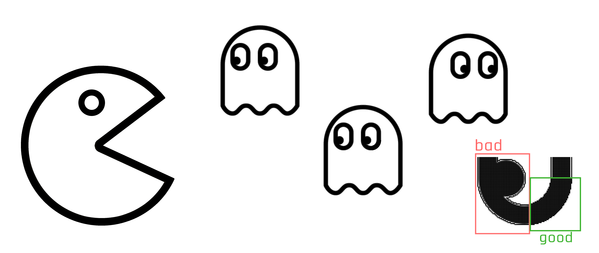
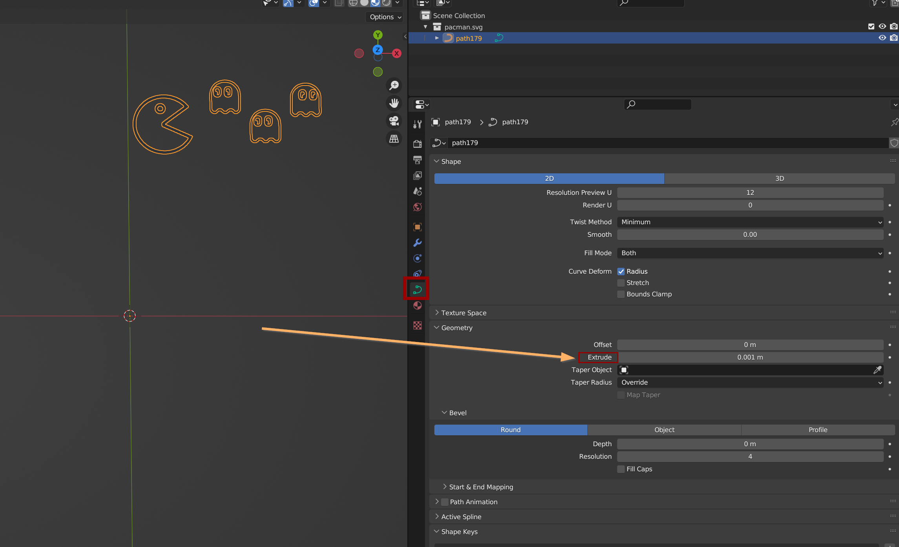
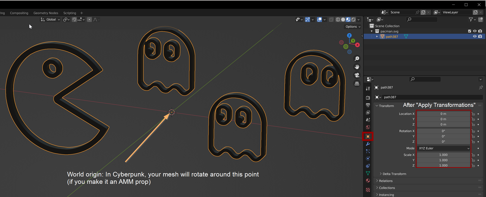
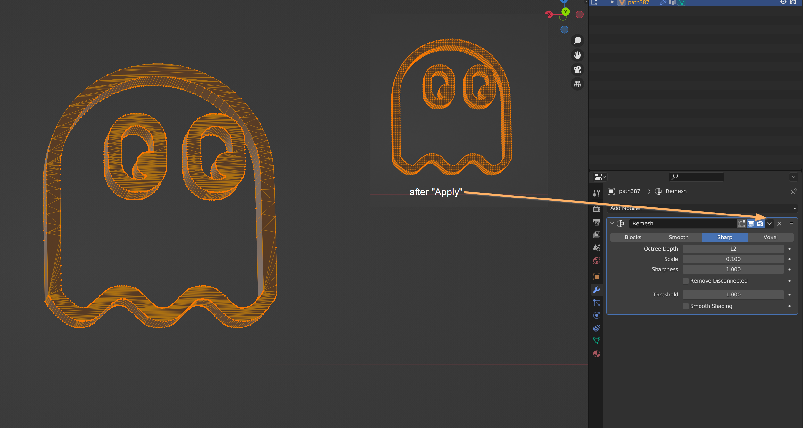
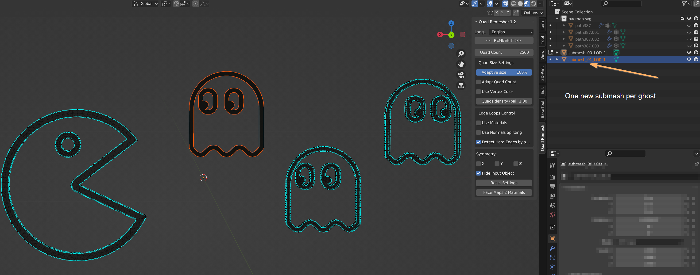
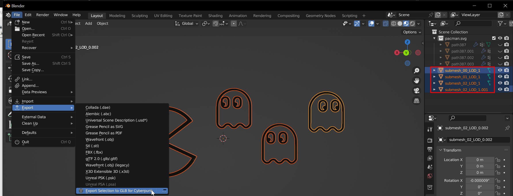
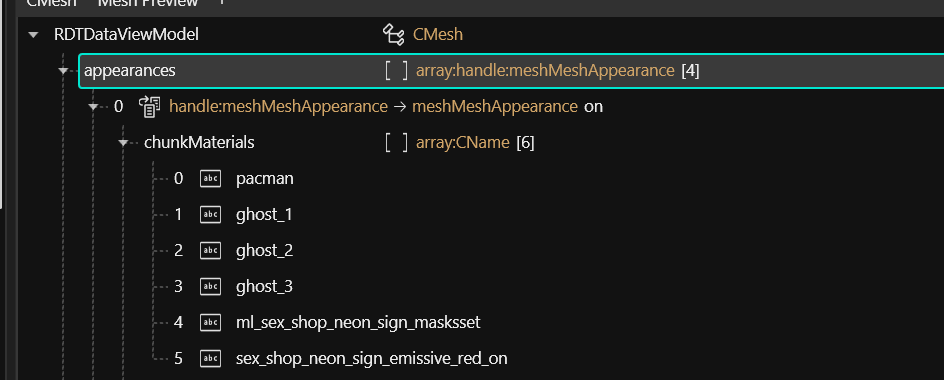
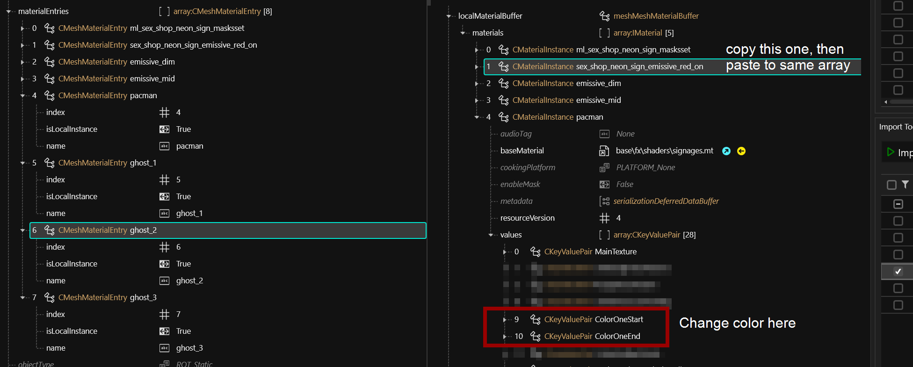
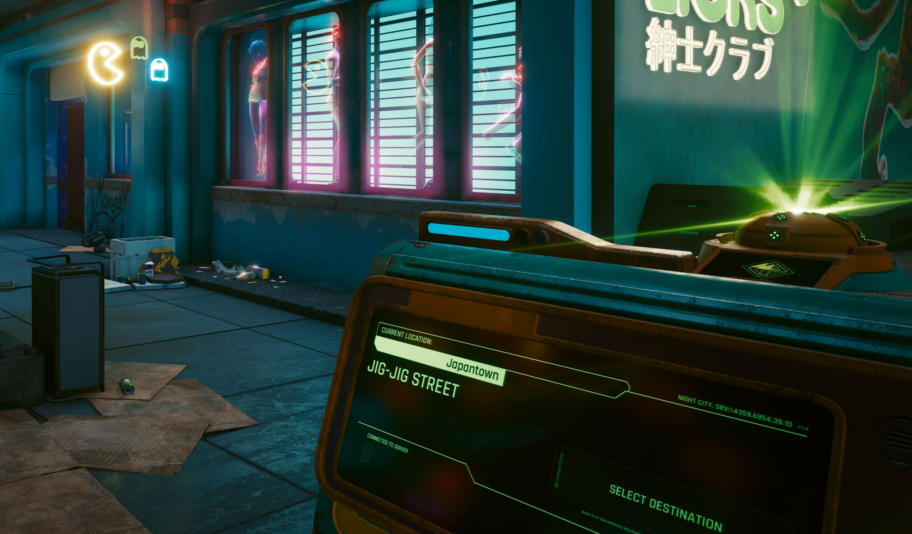

# Your image as custom mesh

## **Summary**

**Created by @manavortex**\
**Published August 2023**

#### **This guide uses the following tools and versions:**

<table><thead><tr><th width="199"></th><th></th></tr></thead><tbody><tr><td><a href="https://inkscape.org/release/inkscape-1.3/">Inkscape</a> 1.3</td><td>Converting your picture into an svg which you can then import into Blender to create a mesh</td></tr><tr><td><a href="https://www.blender.org/download/releases/3-6/">Blender</a> 3.6</td><td>Converting your SVG to a 3d object that you can import into Cyberpunk. You also need the <a href="https://github.com/WolvenKit/Cyberpunk-Blender-add-on/releases">WKit Plugin</a>.</td></tr><tr><td><a href="https://github.com/WolvenKit/Wolvenkit/releases">Wolvenkit</a> (recent)</td><td>converting your mesh to an in-game-item</td></tr></tbody></table>


This guide will take you through the steps of replacing one of Cyberpunk's neon signs with a custom mesh. If you want to add custom props to the game, you can check out the corresponding [AMM guide](custom-props.md) after you're done with this one!


## Step 0: Make or find an image

Start with an image. We're aiming for our own neon sign here, and we'll aassign the colours later in Wolvenkit, so make sure that it is something with clean lines and good contrasts. I'll use this:

<figure><figcaption></figcaption></figure>


Make sure that your image is as clean as possible.&#x20;


## Step 1: Convert to SVG

I started by following [this guide](https://linuxhint.com/convert-png-to-svg-inkscape/), but I'll write you a TL;DR

1. Open Inkscape and create a new document
2. Select File -> Import and import your .png from step 0
3. Make sure that your image is **selected** (click on it if you're not sure, it will have that resizing handle)
4. From the menu, select Path -> Trace Bitmap (it doesn't have to be a bitmap)
5. Pick your options in the right-hand panel. I won't cover them in detail here, check the [linked guide ](https://linuxhint.com/convert-png-to-svg-inkscape/)or noodle around until the result looks OK.
6. Press the Apply button at the bottom
7. Your new traced path will be auto-selected for you.
8. Select File -> Save As and save it as an \*.svg file.

Time to switch to Blender to turn it into a mesh!

## Step 2: Making a mesh

For this, I've originally followed [this](https://devforum.roblox.com/t/converting-svgs-to-meshes/884514) guide, but here's a TL;DR for you again:

1. In Blender, select File -> Import -> Scalable Vector Graphic (SVG)
2. Import your SVG. It will show up as solid black:

<figure><figcaption>
 In case you end up with an object rather than a curve (a spiraly thingy rather than a フ), you used the wrong import.
</figcaption></figure>

3. With an active selection, find the curve properties panel in the bottom right (the green icon).&#x20;
4. In the "Geometry" section and find "Extrude".&#x20;
5. Set it to something like 0.001 — play around with it until your mesh is appropriately extruded.
   1. Do not bevel it! We want the corners nice and sharp, we can always make it round l,ater.
6. Once you're satisfied, transform the curve into a mesh: Object -> Convert -> Mesh

We're now leaving the previous guide.

## Step 3: Fixing up the mesh for Cyberpunk

Scale, rotate, and move your curve to the centre of the viewport

1. Fix **rotation**: Press `R` -> `X` -> `90`
2. Fix **scale**: Press `S` and move the mouse
3. Fix position:&#x20;
   1. Press `G` -> `Z` to move the mesh up and down
   2. Press `G` -> `X` to move the mesh left and right
   3. You don't need to move it on the y axis
4. Apply transformations: Press `Ctrl+A` -> `T`

<figure><figcaption></figcaption></figure>

### Cleaning up the geometry


You will get much better results with the Blender AddOn QuadRemesher; however, after the first 30 days it costs money. You can download a trial version [here](https://exoside.com/quadremesher/quadremesher-download/).


Let's reduce poly count and clean up our mesh. For a detailed guide, see [here](https://all3dp.com/2/blender-simplify-mesh-simply-explained/), I'm going to give you a TL;DR again:

### Remesh modifier

1. Switch to the "Modifiers" tab in the sidebar panel on the right (the wrench, below the one highlighted in the screenshot above)
2. From the dropdown, select Generate -> Remesh
3. Your mesh will be a black box now. Don't panic, we'll fix this by **setting the modifier proprerties:**

| Setting      | Value | explanation                          |
| ------------ | ----- | ------------------------------------ |
| Mode         | sharp | Remesh type: preserving sharp edges  |
| Octree Depth | 8     | Level of detail                      |
| Scale        | 0.1   | Size of quads in the remeshed object |
| Sharpness    | 1     | Preserve sharp edges                 |

Switch back to Object Mode (press Tab) and apply the modifier. The result should be something like this:

<figure><figcaption>
You can play around further, trying to get the poly count down. We'll leave it at this for now.
</figcaption></figure>

Now, triangulate: switch to edit mode, select everything, and press Ctrl+T. It's necessary for the Cyberpunk reimport.


For better results, I cheated: I split off the ghosts' eyes, the ghosts themselves and Pacman, and used Quad Remesher on each of them. This guide will show you the basics, you can make prettier meshes on your own later once you got it to work.


### Creating an UV map

Switch to the Object Data Properties in the right sidebar, fold out "UV Maps" and click the + button. This is necessary for material projection, and Wolvenkit won't let you import if you didn't do it.

## Naming

Rename your original mesh to `submesh_00_LOD_1` — we need that for the import in Wolvenkit.

### Optional: More submeshes for more colours

You can assign one material per submesh. To split off a part of the mesh,&#x20;

1. Change back to Edit Mode
2. Turn on X-Ray (Alt+Z) and select the shape that you want to split off
3. Press `P` -> `S` (Split -> Selection)
4. Rinse and repeat until you have all the submeshes split off

<figure><figcaption></figcaption></figure>

## Creating a Wolvenkit project

Time to pull up Wolvenkit.

Assuming you have Wolvenkit [installed](https://app.gitbook.com/s/-MP\_ozZVx2gRZUPXkd4r/getting-started/download), you can now [create a new project](https://app.gitbook.com/s/-MP\_ozZVx2gRZUPXkd4r/wolvenkit-app/usage/wolvenkit-projects#creating-a-new-wolvenkit-mod-project). Let's find ourselves an in-game neon sign to replace by searching in the Asset Browser for `neon > .mesh` and scrolling through the entries until we find one that we like.


You can obviously use any kind of mesh or material here!


I'll be replacing `base\environment\decoration\advertising\signage\sex_shop_neon_sign\sex_shop_neon_sign_b.mesh`, the heart-shaped ad banner.&#x20;

1. Decide on a mesh and add it to your project.
2. [Export the mesh](../../3d-modelling/exporting-and-importing-meshes/)
3. In the project explorer, right-click on the exported file (`sex_shop_neon_sign_b.glb`) and open it in the Windows Explorer. We will now overwrite this file in Blender.

## Exporting

In Blender,

1. select all the meshes that you want included (in Object Mode)
2. use the [Cyberpunk Blender Plugin](https://github.com/WolvenKit/Cyberpunk-Blender-add-on/releases) to overwrite the file from the previous step.&#x20;

<figure><figcaption></figcaption></figure>

In Wolvenkit, use the Import Tool to import `sex_shop_neon_sign_b.glb`. The preview in the `File Information` panel should update.

## Assigning Materials


I'll give the TL;DR version, you should be able to follow along. If not, feel free to read up on [how materials work in meshes](../../files-and-what-they-do/3d-objects-.mesh-files.md#material-assignment) or find us on [Discord](https://discord.gg/redmodding)!


Open `sex_shop_neon_sign_b.mesh` in Wolvenkit and open the appearance `on` (as this is the one they're using on Jig Jig Street).&#x20;

### ChunkMaterials

At the very top of the mesh, we'll need to change the chunk masks as follows:

<figure><figcaption></figcaption></figure>

### MaterialEntries

Now, we register the materials:&#x20;

1. Find the array `materialEntries`&#x20;
2. Add four new entries (or duplicate one four times, or…)
3. Name them according to the entries in the ChunkMaterials step
4. Make sure that their indices match the array positions

### LocalMaterials

… and finally, we actually add the materials.

1. Find and expand the array `localMaterialBuffer` and its child `materials`
2. Copy the second entry, `sex_shop_neon_sign_emissive_red_on` via right-click menu
3. paste it into `materials`
4. Duplicate it three more times
5. In the new material entries, find the property `ColorOneStart` and change it in the side panel.&#x20;
6. Repeat for each material, then save the mesh.

<figure><figcaption></figcaption></figure>

## Let's pack the project!

In Wolvenkit's top bar, select `Install` and then boot up Cyberpunk. Let's hit up Jig Jig Street to look at our sign…

<figure><figcaption></figcaption></figure>


Please remember that **before sharing your custom neon**, you **have** to change the paths, or you'll conflict with the next modder! You can find a full guide on the fastest way to do that [here](moving-and-renaming-in-existing-projects.md).

