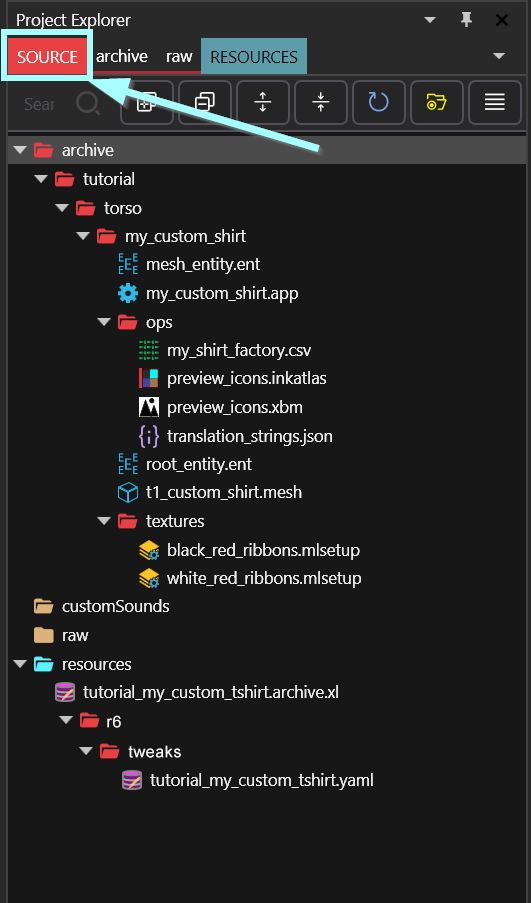
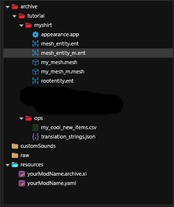
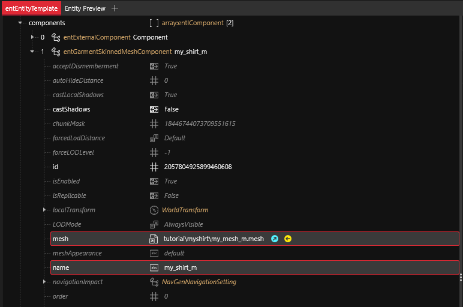
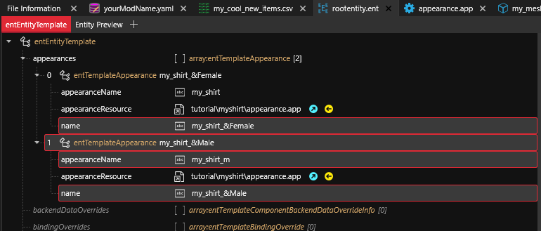
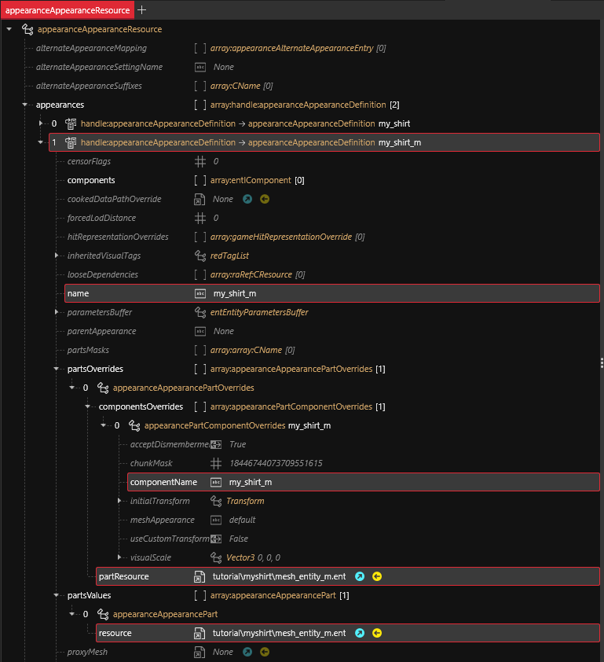

# Adding new items

## Summary <a href="#summary" id="summary"></a>

**Created by @manavortex**\
**Published November 04 2022**

This guide will walk you through **adding your own items** to Cyberpunk 2077, which can then be spawned via console.&#x20;

**It uses the following versions:**

* Cyberpunk 2077 game version 1.6.2 Hotfix
* [WolvenKit](https://github.com/WolvenKit/WolvenKit-nightly-releases/releases) >= 8.9.0
* [TweakXL](https://www.nexusmods.com/cyberpunk2077/mods/4197) 1.1.4
* [ArchiveXL](https://www.nexusmods.com/cyberpunk2077/mods/4198) 1.4.3
* [Red4ext](https://www.nexusmods.com/cyberpunk2077/mods/2380) 1.12.0
* [Cyber Engine Tweaks ](https://www.nexusmods.com/cyberpunk2077/mods/107)(optional, for spawning items)

**Assumed skill level:** \
You should be able to find your way around WolvenKit, but I aim to keep this as noob-friendly as possible.


**For experienced modders**

I have repeatedly observed that newbies are fine with this guide, while people who know how to mod are not. Watch out for **boxes like this one** to avoid those pitfalls.


_The guide was created after reading_ [_this one_](https://drive.google.com/file/d/1aQjb8MpimB9LDNl7y1iTXH13MUvMrKsH/view) _and being left with a bunch of question marks. To get a deeper understanding, refer to the initial guide and follow the linked resources or consult ArchiveXL's_ [_documentation_](https://github.com/psiberx/cp2077-archive-xl)_._


To troubleshoot your ArchiveXL mods, you can make use of the FileValidation in Wolvenkit >= 8.9.1. As of Jul 22nd that isn't yet released, but you can download a [Nightly](https://github.com/WolvenKit/WolvenKit-nightly-releases/releases/) (for example [this one](https://github.com/WolvenKit/WolvenKit-nightly-releases/releases/tag/8.9.1-nightly.2023-09-09), as it's pretty stable).



There is a new way of connecting your files: [dynamic variants](../../../core-mods-explained/archivexl.md#dynamic-variants).  There is no detailed guide yet, but if you want to create lots of options, then you will definitely want to check out this approach, as it cuts down your file structure overhead by virtually eliminating the root entity and .app file.&#x20;


## Grab the example files

* Create a new Wolvenkit project
* Download the prepared files from [Nexus](https://www.nexusmods.com/cyberpunk2077/mods/8268) and extract them to the root of your new project (overwriting the "source" folder)


**If you would rather start from scratch:** Check the detailed instructions [here](adding-new-items-files-from-scratch.md).

Understanding of the file structure is **not required** as long as you **follow the guide to the letter**, but if you want it anyway, see the [item structure explained](archive-xl-item-structure-explained.md) sub-page.



⚠ Do not edit those files outside of WolvenKit, and whatever you do, do not let Microsoft Excel touch the clothing.csv! ⚠


### You should now have the following files:


<figure><figcaption><p>These files do not contain an Atelier store. If you want to add one, see <a href="../../everything-else/adding-items-atelier-integration.md">here</a>.</p></figcaption></figure>

### Start the game


**Wait, am I not supposed to do anything first??**

Actually, no! This is how you later debug your custom items — by packing your project and checking that everything works in-game. So we're starting with a dry run here.


Press "Install and Launch" in WolvenKit. This will do the following things:

1. Copy all supported file entries from `source` to their destination under `packed`, overwriting older files (but not removing files that you renamed!)
2. Copy all files under `packed` into your game directory, again overwriting older files
3. Launch the game.
4.  Spawn one of the tutorial items via Cyber Engine Tweaks: \
    `Game.AddToInventory("Items.my_custom_shirt_redwhite")`

    `Game.AddToInventory("Items.my_custom_shirt_redblack")`

You should now see ~~your~~ the tutorial item. If not, consult the section [**Troubleshooting**](./#troubleshooting) below, or retrace your steps and make sure that everything works before proceeding to the step below.

## Great! You added items! Now what?

You've successfully pushed a button and everything worked, but so far, you haven't done anything. If you're okay with this, then you're done now.&#x20;


To start changing the existing files, check the [Item Structure Explained](archive-xl-item-structure-explained.md) page for "Making Changes" headers.


Otherwise, you will want to complete one or more of the following steps:

* add [something other](different-equipment-slots.md) than a torso item
* Add more [appearances](./#adding-an-appearance-example-blackblue)&#x20;
* Add [variants](./#adding-a-male-instance) for different genders or different camera modes
* customize your [preview images](../../custom-icons-and-ui/adding-items-preview-images/)
* [Add an atelier store](../../everything-else/adding-items-atelier-integration.md)

## Diagram

This is how everything connects. Looks pretty scary, but is actually simple: whenever you want to rename or repath[^1] something, make sure that you catch **both ends of the arrow**.

You can find a breakdown-by-entry on the [corresponding wiki page](archive-xl-item-structure-explained.md).


With ArchiveXL >= 1.5, there is a **new way** of making these connections, saving most of the work of making many variants. You can still complete this guide and then see the documentation for dynamic loading [on its own page](../../../core-mods-explained/archivexl.md#dynamic-variants).

If you want to do more than 5 variants (for both body genders and camera modes), that approach is strongly recommended. Since there isn't a detailed guide yet, you can find us on [Discord](https://discord.com/invite/redmodding) in the #archive-xl channel.


<figure><figcaption><p>Don't panic, we've got this.</p></figcaption></figure>


## Adding an appearance (example: blackblue)


Before you add an appearance, make sure that your item is loading up correctly and looking as expected. If you have to debug, you will have to look through every appearance you made!

**For experienced modders**: This includes you! :)



If you would rather have a step-by-step guide for a gendered variant, see [the next section](./#adding-a-male-instance).


To add an appearance, you will have to touch the following files:

1. \***.yaml**: Adding an entry
2. **appearance.app**: Adding a mapping between rootentity and mesh's appearance
3. **rootentity.ent**: Adding a mapping between yaml's appearance and app's appearance
4. \*_.mesh_:
   1. Adding a MeshMaterialEntry
   2. Adding a MaterialInstance
   3. Adding a material
   4. Connecting those things


For a diagram of how everything connects, go [here](archive-xl-item-structure-explained.md#the-final-result). To follow the&#x20;


### Step 1: Register it in your \*.yaml

1. Duplicate the entire appearance block for an already working item.\
   ⚠Mind the indent!
2. Change the first line to a unique name like `Items.my_custom_shirt_blueblack`
3. Set the new appearance name for the `rootentity.ent`\
   `appearanceName: appearance_root_entity_black_blue`
4.  For lookups in your translation file (`translation_strings.json`): Change the values of `displayName` and `localizedDescription` to the corresponding **secondary keys** in the json file.\
    This is optional.

    ```
      displayName: my_shirt_localization_name_black_blue
      localizedDescription: my_shirt_localization_desc
    ```

    ℹIf you make any mistakes here, the worst that happens is an empty string.
5.  Now, add a new entrie to your .json file:


    ```
    localizationPersistenceOnScreenEntry - []   
    	femaleVariant: my item - now in black and blue
    	maleVariant:  
    	secondaryKey:  my_shirt_localization_name_black_blue
    ```

The total entry should look like this:

```
Items.my_custom_shirt_blueblack:
  $base: Items.GenericInnerChestClothing
  entityName: my_custom_shirt_factory_name
  appearanceName: appearance_root_entity_black_blue
  displayName: my_shirt_localization_name_black_blue
  localizedDescription: my_shirt_localization_desc
  quality: Quality.Legendary
  appearanceSuffixes: []
```

### Step 2: Add it to the rootentity.ent

Find the step-by-step guide in the [root entity section](archive-xl-item-structure-explained.md#root-entity-making-changes) on the "[Item structure explained](archive-xl-item-structure-explained.md)" page.

If you want to add a [dynamic appearance](../../../core-mods-explained/archivexl.md#dynamic-variants), make sure to add the `DynamicAppearance` tag here.

### Step 3: Add it to my\_custom\_shirt.app

Find the step-by-step guide in the [appearance section](archive-xl-item-structure-explained.md#appearance-making-changes) on the "[Item structure explained](archive-xl-item-structure-explained.md)" page

### Step 4: Add it to the .mesh

This tutorial assumes you already know how to [recolour an item](../editing-existing-items/changing-materials-colors-and-textures.md). Quick reminder about the mlsetup:

1. Export it to json
2. edit the `mlsetup.json` with the [MLSetupBuilder](https://github.com/Neurolinked/MlsetupBuilder)
3. Import it back

Find the step-by-step guide in the [mesh file section](archive-xl-item-structure-explained.md#mesh-making-changes) on the "[Item structure explained](archive-xl-item-structure-explained.md)" page

### Test it

Now, log into the game and spawn the item variant. The name is the header you defined in the yaml file, in this case

```
Game.AddToInventory('Items.my_custom_shirt_blueblack')
```

## Adding a Male Instance


This part of the tutorial isn't fully up-to-date with the overhauled file structure yet, so keep that in mind when studying the screenshots.



Also, this part is super easy to follow and even if you make a mistake, fixing it won't be a problem. But hey, you've put in a lot of work and made great progress, so why not take a sec and back up your project files? Better safe than sorry, right?&#x20;


Before we proceed with the tutorial, it's important to address a common issue you might have encountered while creating your mod.

If you've tested the mod on a Male V, you might have noticed some weird glitches like mesh clipping or wonky shapes.

You see, we've been using a mesh designed specifically for Female V, and that's why we've been running into some roadblocks. But don't worry, we're here to help you overcome this challenge!

### Preparing the mesh file for the male variant&#x20;

To fix this issue, we'll need a mesh that's compatible with Male V.&#x20;

In the interest of keeping things simple, we've found just the mesh for you! It's called `t1_024_ma_tshirt__sweater.mesh` and it can be found in the `base\characters\garment\citizen_casual\torso\t1_024_tshirt__sweater` directory.


If you plan on using other meshes for your mod, ensure that it has `ma` or `pma` in its name.&#x20;

Keep in mind that some `ma` meshes may still have clipping issues when paired with certain types of clothing, while `pma` meshes are specifically designed for V and don't have this problem.&#x20;

If you decide to create your own mesh, be sure to fix any potential issues before using it in your mod. Check out our [<mark style="color:yellow;">3D modeling guide</mark>](https://wiki.redmodding.org/cyberpunk-2077-modding/modding-know-how/3d-modelling) for helpful tips and resources.&#x20;

Remember, a little extra effort in the beginning can save you a lot of headaches down the line!


Now, add the file to your project, move it to the `tutorial\torso\my_custom_shirt\` folder and rename it from `t1_024_ma_tshirt__sweater.mesh` to `my_mesh_m.mesh`.&#x20;

Next, follow the steps you used for the original `my_mesh.mesh` by removing any unnecessary entries and adjusting the indices.


To avoid any issues, it's crucial to pay close attention to this step and double-check that the correct materials are present in the `localMaterialBuffer` and `materialEntries`, and that the indices are adjusted correctly.&#x20;

This will ensure that your mod works as intended without any glitches or errors. If you need a refresher, [<mark style="color:yellow;">click here</mark>](./#optional-but-very-recommended-clean-out-obsolete-entries) to return to that section.


### Creating a .ent File for Your Custom Mesh

It's time to set up the .ent file for our mesh. Don't worry, it's easy!&#x20;

Start by making a copy of the `mesh_entity.ent` file that you previously created for the female version by duplicating it, and rename it to `mesh_entity_m.ent`.

<figure><figcaption><p><em>duplicating <strong>mesh_entity.ent</strong> and creating the new <strong>mesh_entity_m.ent</strong> for out new mesh</em></p></figcaption></figure>

Inside the `mesh_entity_m.ent` file, find the first component of the type `entGarmentSkinnedMeshComponent`. Set the following values:


```
mesh:   DepotPath:   tutorial\torso\my_custom_shirt\my_mesh_m.mesh      << path to your mesh  
        Flags:       Default                               << leave this alone  
name:   my_shirt_m    << this corresponds to the appearanceOverride in appearance.app  
```


<figure><figcaption><p><em>All of the changes made to <strong>mesh_entity_m.ent</strong> file</em></p></figcaption></figure>

### Edit the yourModName.yaml

Inside the `yourModName.yaml` file set the `appearanceSuffixes` array to `itemsFactoryAppearanceSuffix.Gender`

```
Items.my_custom_shirt_redwhite:
  $base: Items.GenericInnerChestClothing
  entityName: my_custom_shirt_factory_name
  appearanceName: appearance_root_entity_white_red
  displayName: my_shirt_localization_name_white_red
  localizedDescription: my_shirt_localization_desc
  quality: Quality.Legendary
  appearanceSuffixes: [ itemsFactoryAppearanceSuffix.Gender ]
  icon:
    atlasResourcePath: tutorial\torso\my_custom_shirt\ops\preview_icons.inkatlas
    atlasPartName: slot_01
```


If you are unclear about why this step was taken, we recommend [reading up on suffixes](../../../files-and-what-they-do/entity-.ent-files.md#what-are-suffixes)!


### Edit the rootentity.ent

1. Find the array `appearances`.
2. Expand the first entry.
   1. Append _\&Female_ to the name attribute. This will change the name from `appearance_root_entity_white_red` to `appearance_root_entity_white_red&Female`.
3. Duplicate the first (and only) entry to create a new one.
4. Expand the newly create entry
   1. Set `name : appearance_root_entity_white_red&Male`.
   2. Set `appearanceName : my_shirt_m`.

<figure><figcaption><p><em>All of the changes made to <strong>rootentity.ent</strong> file</em></p></figcaption></figure>

### Edit the appearance.app

1. Find the array `appearances`
2. Duplicate the first entry to create a new one and expand it
3. Set the `name` attribute to `my_shirt_m` (as defined in the root\_entity)
4. Find the array `partsValues`
   1. Set the resource path to your new male mesh entity file:\
      `resource : tutorial\myshirt\mesh_entity_m.ent`
5. Find the array `partsOverrides`
   1. Find the array componentOverrides
      1. Set `componentName : my_shirt_m`
   2. Set `partResources : tutorial\torso\my_custom_shirt\mesh_entity_m.ent`

<figure><figcaption><p><em>All of the changes made to <strong>appearance.app</strong> file. Paths are not up-to-date!</em></p></figcaption></figure>

### Testing the mod

To test your mod, it's important to ensure that it works correctly for both male and female V. This means you'll need to have two separate save files, one for male V and one for female V, unless you're using a mod that allows you to quickly switch between them.

Test your mod independently for both cases by loading the appropriate save file and checking that the mod is working as intended. To spawn and equip your item, use the command specified in your YAML file.

```
Game.AddToInventory("Items.my_custom_shirt_redwhite")
```


Consider reviewing the guide to ensure that all steps have been followed correctly and that the values have been set appropriately. Ensure that the mesh is compatible with the male variant of V. If errors persist, review the [<mark style="color:yellow;">troubleshooting section</mark>](./#troubleshooting) for further assistance.


## The final touches

&#x20;If everything is working: Congratulations! You have successfully made a mod!

But before you can share it, you need to do one last thing, which is changing the file structure. Otherwise, everyone will overwrite the same tutorial files, and only one of those mods will work.

You can find a full guide on how to do that [here](../../everything-else/moving-and-renaming-in-existing-projects.md).

## Troubleshooting


The easiest way to spot what's wrong is to use Wolvenkit's new FileValidation feature, which will print warnings and errors to the log file for you, starting at version >= 8.9.1.&#x20;


First of all, check the logs for errors including the name of your mod:&#x20;

* `red4ext/plugins/ArchiveXL/ArchiveXL.log`&#x20;
* `red4ext/plugins/TweakXL/TweakXL.log`

### ArchiveXL added clipping!

You have read right past those warning boxes telling you about [component name prefixes](../../../3d-modelling/garment-support-how-does-it-work.md#component-prefixes). Make sure that you add them back.

### My item warps weirdly

... deforms incorrectly, or is a puddle on the floor?

Most likely, you have ignored the [hint box](./#get-the-files-create-the-structure) when picking your `mesh_entity.ent:` Make sure that you're using an entity file that corresponds with the slot that you are trying to replace (e.g. if your item is a pair of shoes, you need an entity file from `base\characters\garment\player_equipment\feet`).


**If you are here because of a link from a different guide:**&#x20;

You can find out which entity file your item uses by right-clicking on your mesh and selecting "find files using this". Add the .ent file to the list and open it in WolvenKit. Then, [replace the contents](../../npcs/appearances-change-the-looks.md#safely-adding-components) of the "components" array with those of an .ent file from the correct folder — don't forget to change the path to your mesh again!


### I spawn my item, but it's not added to my inventory!


Before you start digging into your file structure, check if there are any leftover yaml files from earlier versions/deploys in your tweaks directory. Do a full text search in e.g. Notepad++ in any files in the folder with the name of the item you want to spawn.


If no additional yaml files are messing things up, then the error is somewhere in the first part of the chain and relatively easy to fix:

<figure><figcaption></figcaption></figure>

Check the following places:

* `yourmodname.archive.xl`:
  * Is the indentation correct, as shown in the picture?
  * Did you make any typos?
* `my_tshirt_factory.csv`:
  * Is there an entry where the first value matches the `entityName` from the yaml (`my_tshirt` in the picture above)?
    * Without leading or trailing spaces?
  * Does the second value of that entry have the correct root entity path? \
    (`tutorial\myshirt\rootentity.ent` in the picture above)\
    _If you moved the `root_entity.ent`, you have to adjust this entry._
* `rootentity.ent:`
  * Do you have an appearance matching your item by `name`?&#x20;
    * Without leading or trailing spaces?
  * Are you using any [**suffixes**](../../../files-and-what-they-do/entity-.ent-files.md#what-are-suffixes)? Are you using the correct ones?&#x20;
    * Try setting an empty suffix array in the .yaml, just to see if that works: \
      `appearanceSuffixes: [  ]`
    * Try creating a fall-back entry without any suffixes in the root\_entity.

### My item shows empty text instead of name/description!

Something went wrong with your json file:

<figure><figcaption></figcaption></figure>

If there are no errors in any of the log files, check the following places:

* `yourmodname.archive.xl`:
  * Does the key `localization - onscreens - en-us` exist?
  * Is the indentation correct, as shown in the picture?
  * Does it point at the correct file (`tutorial\ops\translation_strings.json`), or did you rename or move it?
  * Did you make any typos?
* `yourModName.yaml:`
  * Is the spelling for the key you defined after `displayName` and `localizedDescription` identical to the one in the json file?
* `translation_strings.json`:
  * Is the spelling of the key defined in yaml's `displayName` and `localizedDescription` identical?
  * Did you set the femaleVariant (default)?
  * Are you using quotation marks? If so, switch to singlequotes!
  * If the field for `primary_key` is not empty, then its value must be unique (probably on a per-file basis). Just number them.

### The item spawns, but…

Congratulations, you've made it into the right half of the diagram! The error will be somewhere here:

<figure><figcaption></figcaption></figure>


[File validation](http://127.0.0.1:5000/s/-MP\_ozZVx2gRZUPXkd4r/wolvenkit-app/file-validation) can help you catch the error.



If you set your `mesh_entity.ent` to point at a vanilla mesh, you can rule out your custom mesh and .mlsetup as a source of errors. Original game meshes will always have a working default appearance and will thus always be displayed!


### The game crashes!

That means the chain is working, but something isn't loaded correctly. That's good! Check the following files:

* `appearance.app`: Check the `partsValues` and `partsOverrides` entries. They need to point at the `mesh_entity.ent`, **not** at the mesh.
* `mesh_entity.ent`: Does the `component` entry point to a valid mesh? Try it with a default mesh as detailed above.

If the default mesh is displayed correctly, then we have narrowed down the problem.&#x20;

If the default mesh is not displayed correctly, then there's an issue between the `root_entity` and your `.app` file, or in the `.app` file's internal logic.&#x20;

### Troubleshooting a mesh

For more detailed error handling, check the sections below, or check [this page](../../../3d-modelling/troubleshooting-your-mesh-edits.md).

ℹ In the "Mesh Preview" tab of your mesh, you can "Generate Materials for Appearance". If the correct colours show up, you can at least rule out that the error is in the .\*mesh or its material.

* Make sure that you have the same number of entries in `materialEntries` and `localMaterialBuffer.materials` .
* Go through the `CMaterialInstance`s in `localMaterialBuffer.materials`.
  * Make sure that the files you're loading exist.
  * Make sure that you don't load a mlmask under a key for an mlsetup or vice versa.

If none of that helps, I suggest

* doing a gdb export
* throwing away your mesh (don't close the WKit tab yet), falling back to the original one
* doing a gdb import
* replacing the arrays `appearances`, `localMaterialBuffer.materials` and `materialEntries` with those from your previous mesh.

### My mesh is black and shiny!

Congratulations, this is about the easiest-to-resolve error that you could've had. Your mesh is loaded correctly, there is only a problem with the rendered **material**.

Check your mesh file:

* Check the connection between `appearance`, `materialEntry` and `localMaterial.CMaterialInstance`. Are the names correct?
* Go through the `CMaterialInstance`s in `localMaterialBuffer.materials`.
  * Make sure that the files you're loading exist.
  * Make sure that you don't load a mlmask under a key for an mlsetup or vice versa.

### My mesh has the wrong appearance!

Either an appearance is incorrectly selected, or it is incorrectly resolved. Check the following places for copy-paste/duplication mistakes:

**yourModName.yaml** - is the `appearanceName` correct, or did you forget to change it?\
**rootentity.ent** - does the `name` corresponding to the field above point to the `appearanceName` with the right name in the right appearance file?\
**appearance.app** - does the appearance's `partOverride` set the correct appearance in the `componentsOverride`?

Now, check the mesh file (close and re-open it to make everything refresh):

**appearance** - does it use the correctly named material?\
**materialEntries** - is the index correct, or is it pointing at the index of the actually displayed material?\
**localMaterialBuffer** - does the CMaterialInstance use the correct .mlsetup file?

Finally, check the .mlsetup: does it actually use different colours, or is it just a duplicate?

### My mesh is invisible!

Here we go. This is the big one, and it's Not Fun. The error can be anywhere between the yaml and the mesh. You can rule out one of the files with the following question:

**Does the glitching stop after <10 seconds?**\
If not: the appearance can't be resolved - ignore the `.mesh`\
If yes: the appearance is resolved, but can't be displayed - ignore the `.yaml`


The fastest way to find your error is Wolvenkit's FileValidation (in version >= 8.9.1). Save the `root_entity.ent`,  and the recursive valudation will check the whole chain for errors and print them to the log files for you.

\
As of July 2023, you can download the right version from the [Nightly](https://github.com/WolvenKit/WolvenKit-nightly-releases/releases/) page (for example [this one](https://github.com/WolvenKit/WolvenKit-nightly-releases/releases/tag/8.9.1-nightly.2023-07-21), as it's pretty stable).


ℹIf the appearance is resolved, but not displayed (short glitch), the first thing you should do is to change the path in the `mesh_entity.ent` to one of the game's default meshes. This will rule out errors on your part. (_Yes, even if your mesh worked in another mod. No, I'm not speaking from experience, why do you ask?_)

If the hint above doesn't solve it, proceed to troubleshoot in the same way as "My mesh has the wrong appearance!" above.

### My garment tucks into/under other garments incorrectly

That's due to [garment support](../../../3d-modelling/garment-support-how-does-it-work.md) - check the link to learn more.

### Visual tags aren't working!

If you are **hiding** components via visual tags, these tags have to go into the **appearance** file rather than the root entity.

### I can't find anything, kill me now

Time to restore your files one by one to the last working backup and restart from there.\
Don't delete them, keep them in a different folder - you will be able to copy a lot of stuff over.


By right-clicking on a tab title, you can move it to a new document group for easier copying.


\
Good luck, soldier.

[^1]: move it to a different location than the one it's currently in
