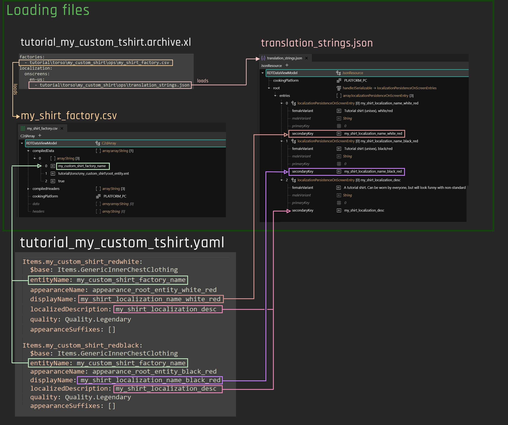
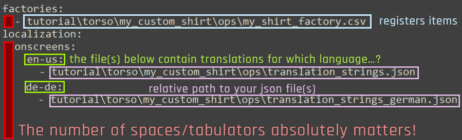
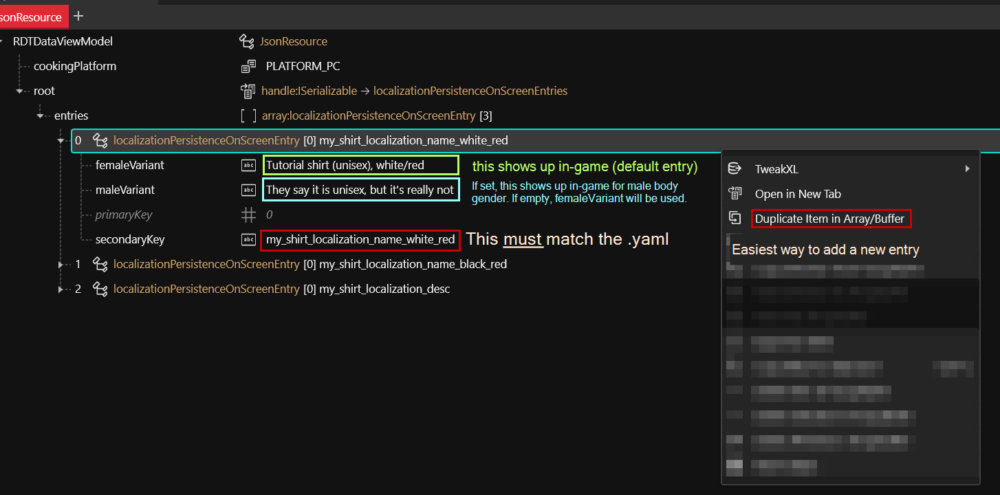
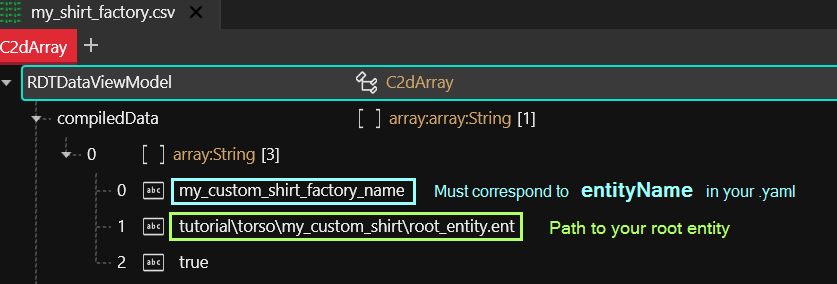
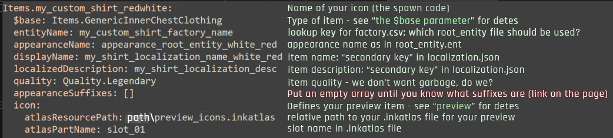
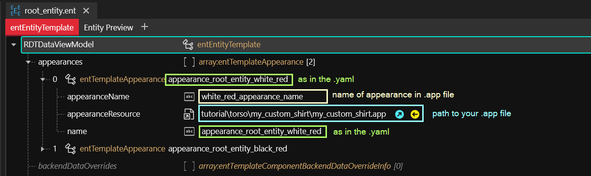
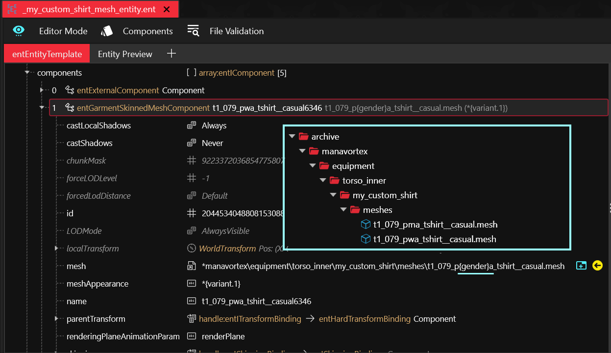
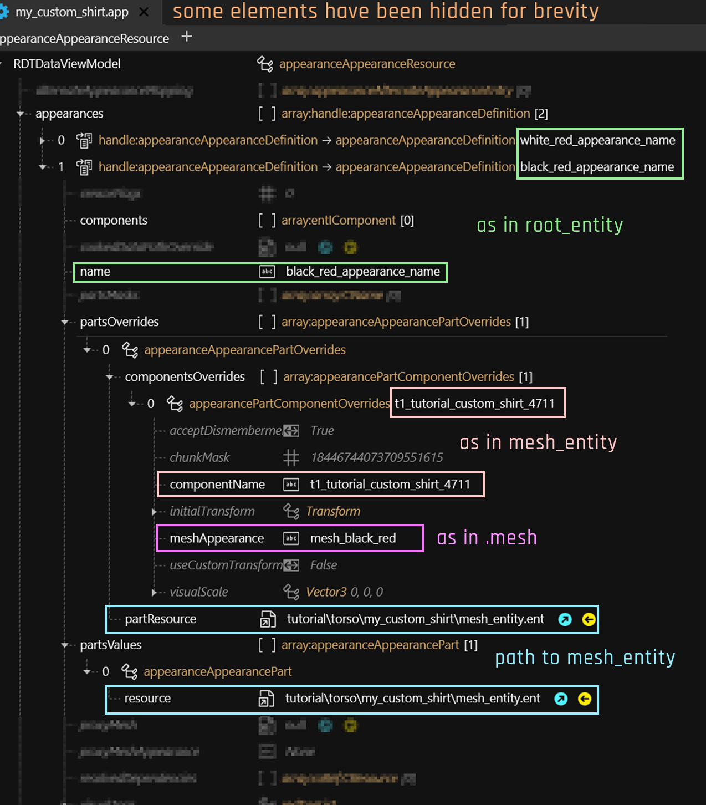
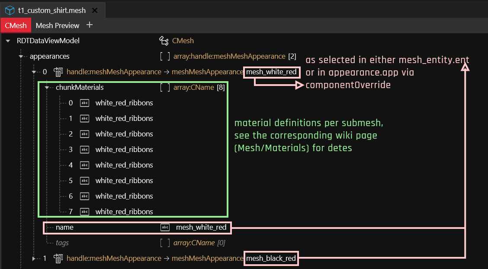

# Archive XL: Item structure explained

## Summary

**Created by @manavortex**\
**Updated June 10 2023**

This page is a part of the [Adding new items](./) guide and explains how the different files interact with each other.


If you have come here from the main page because you want to change the existing files, search for `Making changes` in each section. To add new appearances, the following files are relevant:

* [.yaml](archive-xl-item-structure-explained.md#.yaml-making-changes)
* [root entity](archive-xl-item-structure-explained.md#root-entity-making-changes)
* [app](archive-xl-item-structure-explained.md#appearance-making-changes)
* [mesh](archive-xl-item-structure-explained.md#mesh-making-changes)
* [.json](archive-xl-item-structure-explained.md#.json-making-changes) (translations)


## Structural files: telling the game about your mod

We need **four** files to tell the game about our new items:&#x20;

1. the .xl file, which tells ArchiveXL which files to register
2. the .json file with the translations
3. the factory.csv, telling the game about your custom files
4. the yaml, which tells TweakXL about your item's properties

<figure><figcaption><p>The file structure as used in the <a href="./">Adding New Items</a> guide. Some information has been omitted for brevity.</p></figcaption></figure>

### The .xl file

This file will be in the same directory as your mod's .archive file. It lets ArchiveXL register the [factory](archive-xl-item-structure-explained.md#the-.csv-file-the-factory) (`my_shirt_factory.csv`) and the [localization file](archive-xl-item-structure-explained.md#the-.json-file) (`translation_strings.json`).

You usually touch this only once, unless you want to add more factories or translation files.

<figure><figcaption><p>Example .xl file. Note that anything with a - at the beginning of the line indicates a <strong>list;</strong> you can add more entries!</p></figcaption></figure>

#### .xl: Making changes

You only need to change this file if you have **changed the factory's file path** (moved the file) or want to add a second factory file (there is no need to, though).

### The .json file (custom texts, i18n)

This is the **localization** file for language-specific entries (green boxes on [the xl file](archive-xl-item-structure-explained.md#the-.xl-file)'s screenshot). \
If no entry for a language is defined, then the English one will be used.&#x20;

An entry will look like this:

<figure><figcaption><p>The value under <code>secondaryKey</code> <strong>must</strong> match the entry in your .yaml file, or you will just see an empty string.</p></figcaption></figure>


If you don't need a male-specific translation, you can leave it blank — by default, `femaleVariant` will be used.


#### .json: Making changes

You need to change this file every time you want to add a new text entry to your mod. The easiest way to do this is by duplicating an existing entry.

### The .csv file (the factory)

The factory connects your `.yaml` to the corresponding `rootEntity.ent` via `entity_name`.&#x20;

When reading your .yaml file (e.g.`tutorial_my_custom_tshirt.yaml`, [next section](archive-xl-item-structure-explained.md#the-control-file-yourmodname.yaml)), the game will find entries like this:

```
Items.my_custom_shirt_redwhite:
  entityName: my_custom_shirt_factory_name             << this is for the factory.csv
  appearanceName: appearance_root_entity_white_red     << this is for the root_entity.ent
```

The csv file is where ArchiveXL will find an entry with the yaml's `entityName` in the first field. It will then check the corresponding [root entity](archive-xl-item-structure-explained.md#root\_entity.ent) for an appearance with the name in `appearanceName.`

<figure><figcaption><p>When spawning an item, TweakXL knows which entity file to use by filtering <code>entityName</code> for a match in the first field</p></figcaption></figure>

#### Making changes

You only need to change this file when&#x20;

* you move a root entity (update the path!)
* you add a new entityName — for example, a second t-shirt that you want to have its own root entity.&#x20;

### The control file: yourModName.yaml


When editing this file, please keep in mind that **indent is important**!&#x20;

The first line of each block **must not** have spaces, the blocks below must have the same amount of spaces. More spaces means more nesting.

Making mistakes here might break your entire mod, so if in doubt, run your edited file through an [online yaml validator](https://jsonformatter.org/yaml-validator).


This file controls the adding of items to the game. An entry looks like this:

<figure><figcaption></figcaption></figure>


The entry above will let you add the item via `Game.AddToInventory('Items.my_custom_shirt_redwhite')`


Four **mappings** take place here:

1. `entityName`: Points to the [factory.csv](archive-xl-item-structure-explained.md#the-.csv-file-the-factory) (see documentation there as for what it works)
2. `appearanceName`: In the [root entity](archive-xl-item-structure-explained.md#rootentity.ent) specified in the factory, it will look for an appearance by this name.


The appearance name will only be considered up to the first [suffix](archive-xl-item-structure-explained.md#suffixes-and-whether-you-need-them). If you want to know what those pesky & things are doing, read up the corresponding documentation.&#x20;

You don't need to know this unless you want to add variants for different genders or camera perspectives: we're avoiding them by putting`appearanceSuffixes: []`.


3. `displayName`/`localizedDescription` : In the `translation_strings.json`, find an array where the value for \[3] (the last entry) is identical to this key. Then, check which gender V has, and display either `femaleVariant` or `maleVariant`.
4. `icon:` This hooks up your custom preview.&#x20;

#### What is it, precious? The $base parameter

`$base` defines which slot the item will use. For the full documentation, see "[Different equipment slots](different-equipment-slots.md)".


The inherited properties can cause problems (see "[**Suffixes, and whether you need them**](../../../files-and-what-they-do/entity-.ent-files/.ent-files-suffixes.md)" for more detail).&#x20;

You don't need to know this unless you want to add variants for different genders or camera perspectives: we're avoiding them by putting`appearanceSuffixes: []`.


#### .yaml: Making changes

You need to touch this file every time you want to add a new item (or when you want to change an existing one). It is easiest to duplicate an existing entry.&#x20;

If you want more than just the base properties, check the documentation for [TweakXL's creating records](https://github.com/psiberx/cp2077-tweak-xl/wiki/YAML-Tweaks#creating-records).

## The game files

Now that we're done with the base structure, we can take a look at the game files. Like for any of the vanilla game items, we have four of them. This guide will only hold information that's directly relevant to adding item, but in the individual sections below, you will find links to more documentation about the files.

* [root\_entity.ent](archive-xl-item-structure-explained.md#root\_entity.ent)
* appearance.app
* mesh\_entity.ent
* the mesh file

### Overview

This is how the files connect to each other. If your head explodes now, don't worry: it's not as complicated as it looks, and the item addition guide will walk you through step by step.

<figure><figcaption></figcaption></figure>

### root\_entity.ent


[Would you like to know more?](../../../files-and-what-they-do/entity-.ent-files/#root-entity) Full documentation of the root\_entity is on its own page.

Understanding this is not necessary for the purpose of this guide.


The entry point from your yaml, this file is a glorified lookup dictionary: for any `appearanceName`, it will specify an `.app` file and the name of an appearance in the `.app` file.

An entry looks like this:

<figure><figcaption></figcaption></figure>

#### Suffixes

The root entity's `name` field is where you would put **suffixes** for different appearance variants.&#x20;


You don't need to know [what suffixes are](../../../files-and-what-they-do/entity-.ent-files/.ent-files-suffixes.md) unless you want to make variants for different genders or camera types. In fact, you will want to skip this until you have a confirmed and working mod!

To disable them, each entry in your [.yaml](archive-xl-item-structure-explained.md#the-control-file-yourmodname.yaml) contains the following line:\
&#x20; `appearanceSuffixes: []`&#x20;


#### Root Entity: Making Changes

When you change the path of this file, you need to adjust the path inside the [factory.csv](archive-xl-item-structure-explained.md#the-.csv-file-the-factory).

**Adding a new appearance:**

Expand the list `appearances` and **duplicate** your already working entry.

Change the following fields:\
`appearanceName` => everything before the & must match `appearanceName` in your \*.yaml\
`name` => must match the name you're going to put in your `app.app`

**Example**:

old (copy):

```
	appearanceName: black_red_appearance_name
	name: appearance_root_entity_black_red
```

new:

```
	appearanceName: black_blue_appearance_name
	name: appearance_root_entity_black_blue
```


You do not need to change the `appearanceResource`.


### mesh\_entity.ent


**For experienced modders**

This file replaces the `component` array inside the .app!



Check [here ](different-equipment-slots.md)for how to find the right mesh entity for each equipment slot.


This file holds a collection fo components that determine how our equipment item behaves and moves. Each kind of equipment has different types of components, which is why you need to pick the [right mesh entity file](different-equipment-slots.md#step-2-the-entity-file) for each equipment slot.&#x20;

By bundling them in this file, we save ourselves a lot of copy-pasting inside the .app file. The only component we actually need to change is the one with "Mesh" in its name, typically `entGarmentSkinnedMeshComponent`:

<figure><figcaption><p>The only component we actually need to change is the <code>entGarmentSkinnedMeshComponent</code></p></figcaption></figure>

The component's `name` will be used in `appearance.app`'s materialOverride array (see [below](archive-xl-item-structure-explained.md#appearance-making-changes))


**Would you like to know more?**&#x20;

Full documentation of [mesh\_entity](../../../files-and-what-they-do/entity-.ent-files/#mesh-component-entity-simple-entity)\
More intel on [components](../../../files-and-what-they-do/components/)

Understanding this is not necessary for the purpose of this guide!


#### Mesh Entity: Making Changes

When you move this file, you need to change the path inside every appearance inside the .[app](archive-xl-item-structure-explained.md#appearance.app) file.

Otherwise, you only need to touch this file if you move the .mesh file.

### appearance.app

Contains a list of appearances as mapped by [`rootentity.ent`](archive-xl-item-structure-explained.md#rootentity.ent). Each of the appearances will load `mesh_entity.ent` via partsValues and specify&#x20;


**For experienced modders**

The .app file's component array should be **empty:** this is not an NPC appearance! :)


An entry will look as follows:

<figure><figcaption><p>Appearance.app (annotated)</p></figcaption></figure>

`partsValues` will define what [mesh\_entity](archive-xl-item-structure-explained.md#mesh\_entity.ent) file(s) to load (as a list of components), while `partsOverrides` tells the [mesh](archive-xl-item-structure-explained.md#mesh) which appearance to use.

For ArchivXL >= [1.4.0](https://github.com/psiberx/cp2077-archive-xl/releases/tag/v1.4.0-rc2), appearance overrides can understand the following variables for `meshAppearance`:

|                |                                                                                                                      |
| -------------- | -------------------------------------------------------------------------------------------------------------------- |
| `{gender}`     | m or w depending on V's body gender                                                                                  |
| `{skin_color}` | [skin color appearance name](../../../references-lists-and-overviews/cheat-sheet-face-and-skin/#skin-tones-by-index) |
| `{hair_color}` | [hair color appearance name](../../../references-lists-and-overviews/hair.md#name-in-files-by-index)                 |

#### Appearance: Making changes

When you move this file, remember to change the path inside the `root_entity.ent`

You need to touch this file every time you add a new appearance:&#x20;

1. Open the .app file and expand the list `appearances`.
2. Duplicate an item and select the new one.
3. Change its name to the one you just defined in the .yaml (`black_blue_appearance_name`)
4. In the new appearance, find the array `partsOverrides` and expand it.
5. Select the item inside.
6. Find and expand the Array `appearanceAppearancePartOverrides` and expand it.
7. Select the first item.
8. Open the array `componentsOverride` and select the first item.
9. Change the value of `meshAppearance` to the name of your new appearance in the mesh:

```
componentName: t1_tutorial_custom_shirt_4711   << no need to change this  
mesh_appearance: mesh_black_blue                << corresponds to meshMeshAppearance.name in my_mesh.mesh  
```


You can leave `partsValues` alone - this just points at the file that loads the mesh, and you've already set it up above when setting up the file.


### Mesh


[Would you like to know more?](broken-reference) The documentation for .mesh files lives on their own page!

Understanding this is not necessary for the purpose of this guide, but you might want to reference it once you run into trouble.


The mesh file maps **materials** to appearances. To find out how exactly it does that, find the [material section](broken-reference) on the mesh wiki page.&#x20;

For our purposes it's enough to say that you can **define** your individual appearances here.

<figure><figcaption></figcaption></figure>

#### **Mesh: Making changes**

1. Find the array `appearances` and open it.
   1. Duplicate any `meshMeshAppearance`.
   2. Change the name to the one you've defined in the `appearance.app` above (in this case: `mesh_black_blue`):
   3. Select the array `chunkMaterials` and change the entries in the right-hand panel to the name of your new material (e.g. `black_blue`)
2. Find the array `materials` and open it.
   1. Duplicate the last entry. (Yes, use the last one, please, it's important for step 3).
   2. Select the new last entry
   3.  Set the following values:

       ```
       name:  mesh_black_blue           <<< as defined in step 1 and used by meshMeshAppearance in appearances[]  
       index: <index of item in array>  
       ```

       If you duplicated the last material, you can just increase it by one.
3. Find the array `localMaterialBuffer` and open it
   1. Duplicate any entry with an mlsetup (You will see an entry `MultilayerSetup` under `values`)
   2. Drag it to the last position of the array (that's important, because the materials entries match by numeric index)
   3. Select the new item, open `values`, and select `MultilayerSetup`.
   4. Set `baseMaterial/DepotPath` to the `.mlsetup` file that you want.

&#x20;For further information and guides, check [here](../editing-existing-items/changing-materials-colors-and-textures.md#step-2-finding-the-correct-appearance) or the [mesh knowledge page](broken-reference).

## The final result

This is how everything plays together:

<figure><figcaption></figcaption></figure>

