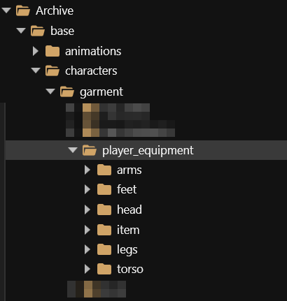

# Different equipment slots

## Summary

**Created by @manavortex**\
**Published June 10 2023**

This page is a part of the [Adding new items](./) guide and contains the steps necessary to create different equipment types.

## Step 1: The .yaml

You define the item slot in your .yaml file by specifying the **root entry type** via `$base:`

```yaml
Items.my_custom_shirt:                      << name of your item (the spawn code)
  $base: Items.GenericInnerChestClothing
  
Items.MyHelmet:
  $base: Items.GenericHeadClothing
```

You can use the following types:

| Base record                          |                                                                          |
| ------------------------------------ | ------------------------------------------------------------------------ |
| Head slot                            | `Items.GenericHeadClothing`                                              |
| Head slot (glasses slot)             | <p><code>Items.Glasses</code><br><code>Items.Visor</code></p>            |
| Head slot (mask)                     | `Items.GenericFaceClothing`                                              |
| Torso (inner, t-shirt)               | `Items.GenericInnerChestClothing`                                        |
| Torso (outer, jacket)                | `Items.GenericOuterChestClothing`                                        |
| Legs                                 | <p><code>Items.GenericLegClothing</code><br><code>Items.Skirt</code></p> |
| Shoes                                | `Items.GenericFootClothing`                                              |
| Outfit (full body, e.g. diving suit) | `Items.Outfit`                                                           |


You can absolutely set up a shirt and then put `$base: Items.GenericHeadClothing` - V is the only person I know of who can wear their undies on their head without impairing their functionality.\
However, before you start abusing the system that way, you might want to look into [EquipmentEx](different-equipment-slots.md#step-1.5-equipmentex).


### Step 1.5: EquipmentEx)

psiberx's mod EquipmentEx ([github](https://github.com/psiberx/cp2077-equipment-ex) | [nexus](https://www.nexusmods.com/cyberpunk2077/mods/6945)) adds a whole new wardrobe system, providing extra slots that CDPR forgot to include with the basegame. This feature requires the mod to be installed — without it, only the `$base` types from step 1 will be considered.

All you need to do is adding the last two lines to your .yaml:

<pre class="language-yaml"><code class="lang-yaml"><strong>Items.MyNecklace:
</strong>  $base: Items.GenericHeadClothing
  placementSlots: 
    - !append OutfitSlots.NecklaceShort
</code></pre>


Find a full list of outfit slots in the [github readme](https://github.com/psiberx/cp2077-equipment-ex#outfit-slots).&#x20;


## Step 2: the entity file

Some item properties are defined in the file `mesh_entity.ent` via **components**. If you use the wrong kind of entity, you might end up with your shirt being a puddle around your feet, or [string cheese](../../../3d-modelling/troubleshooting-your-mesh-edits.md#my-mesh-is-string-cheese-exploding-vertices-a-puddle-on-the-floor). To get around that, you need to make sure to pick a **file** that correspond's to your item's **body part.**&#x20;

You can find all entity files under `base\characters\garment\player_equipment:`

<figure><figcaption><p>Pick any file from inside the correct folder.</p></figcaption></figure>

If you want to be super thorough, you can stick to the right gender&#x20;


If you want to know more about components, check the [wiki page](../../../files-and-what-they-do/components/). This is completely unnecessary for the purpose of this guide!

