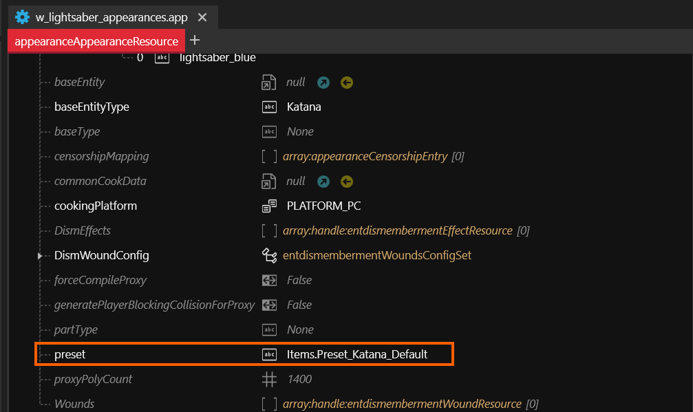
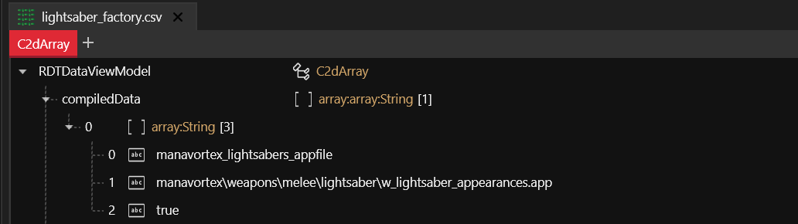
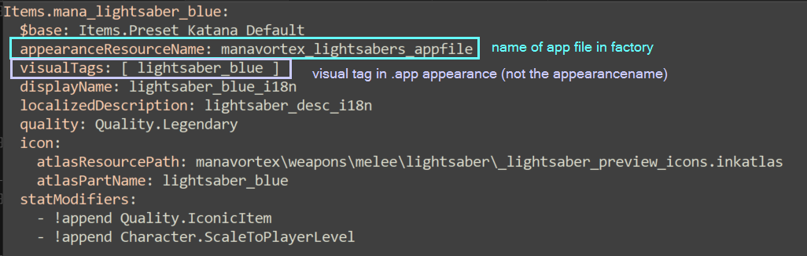
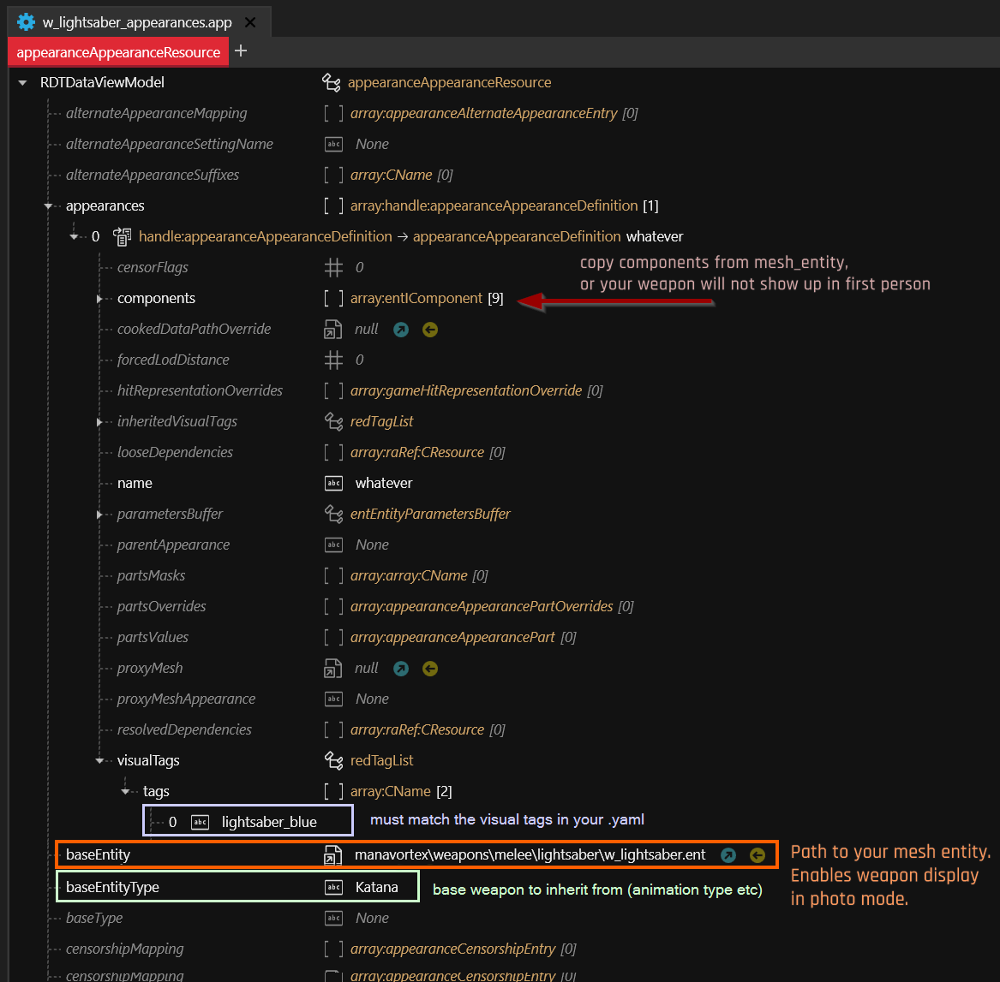

# 🔫 Weapons

## Summary

**Created by @manavortex**\
**Published July 08. 2023**

Weapons work a little different from regular ArchiveXL items, starting right at the root entity. With the help of @**Apart** and **psiberx,** I was able to figure out the process and document it for you.


This guide assumes that you are at least somewhat familiar with ArchiveXL item additions as per the "[Adding new Items](../)" guide. If you have no idea where to start, make sure that you set up a working shirt and then start making the changes below.


## Selecting the base

Start by finding the .app file of an original weapon of the type you want to make (Theres a list [here](https://wiki.redmodding.org/cyberpunk-2077-modding/for-mod-creators/references-lists-and-overviews/equipment/weapons)) and adding it to your project. We will change that file, rather than assembling anything by hand.

In the app file, you can also find the value for the yaml file's `$base` property:

<figure><figcaption></figcaption></figure>

## Getting the mesh\_entity.ent

You need the correct mesh entity to go with your appearance file. You can find them under `base\weapons`\ - search for the name of your weapon, or just navigate through the folders.&#x20;

This file makes the weapon show up in photo mode. Instead of going into the PartsValues, it will be linked in the app file's root as `baseEntity` (there's a screenshot below). Leave it alone for now, it's easier to make the appearances working correctly in the .app file and then copying over an entire component array.

## Factory: .app instead of root\_entity

Instead of a root entity file, you need to point your factory.csv directly to your iron's app file (the one from the section above).

<figure><figcaption></figcaption></figure>

## Appearance selection

An equipment item's lookup chain goes from the `appearanceName` in the yaml to the `root_entity`, where the `appearanceName` will lead to the correct appearance in the `.app` file.

With a weapon, all that happens through **`visualTags`**.

### YAML: Define the field:

<figure><figcaption></figcaption></figure>

Native weapons often use one shared `VisualTags` to reference multiple `appearanceName` and randomize the result. If you want to use a specific native appearance present in a `VisualTags` native group, you can use `appearanceName` to specify which. E.g:\
`visualTags: [ Neon ]`\
`appearanceName: neon2`

### .app file: Define the visual tag

**visualTags (violet)**: Must match the visualTags in your `.yaml` file. If multiple entries match, one will be chosen at random.


Unlike with an entity file, the appearance name doesn't matter. You can name all of them `foo`, and as long as you had the visual tags right, it still works (I would advise against it, though)


<figure><figcaption><p><strong>visualTags (violet)</strong>: Must match the visualTags in your .ent file. If multiple entries match, one will be chosen at random.</p></figcaption></figure>

## Step by step

As the process is finicky and there can be all sorts of sudden unexpected behaviour, here's the best way to go about this.

The list links you to sections of the guide which tell you to change things. **Optimally, you do a dry run with one appearance to make sure that something shows up in the game at all, then start fine-tuning**, but you do you.

Here's what's worked for me (@manavortex):

1. Find the .app file of a suitable base weapon, add it to your project, and rename it. Don't change anything for now, future you might need the original data for troubleshooting later.
2. Find the correct .ent file. It might be linked in the .app's `baseEntity` field. If not, you can find it with the following Wolvenkit search query:&#x20;

```
base\weapons > entities > .ent
```


Optimally, the number of components in the `.ent` file should be the same as in any appearance's `component` array (red arrow on the screenshot above).&#x20;

If it's not, that **could** indicate that you have the wrong .app file. It could also mean nothing, but if you run into trouble in step 6, this might be why.


3. Configure the yaml [as described here](./#yaml-define-the-field)
4. Set up **one** (1) appearance for testing by [assigning the correct visual tags](./#.app-file-define-the-visual-tag). \
   _Do not delete the other appearances yet, future you might need them for troubleshooting._
5. Start the game and make sure that you can spawn a custom weapon with the appearance you picked and that it
   1. shows up in inventory/photo mode
   2. shows up in first person

If that's not the case, check the [mesh entity](#user-content-fn-1)[^1] (see the blue box in step 2).&#x20;

If that doesn't help, you may have taken the wrong .app file - go looking again.


You haven't changed anything at this point: the goal here is to make sure that your visual tags are correct and that you can spawn a weapon addition.&#x20;

It's **crucial** that you make this work — anything you do after this point will add complexity and make troubleshooting more difficult, so this is where you shore up your bases.


6. **Optional:** You just added a weapon to the game that didn't exist before. Take a moment to bask in the success!
7. Custompath your [mesh entity](#user-content-fn-2)[^2]:&#x20;
   1. Create a copy of the file and move it to a custom folder
   2. rename it
   3. Change the `baseEntity` path in your .app file
8. **Optional, but recommended**: Repeat step 5 and make sure that everything spawns
9. Now it's time to actually **change things**. Open your appearance's **component array** and make sure that the **MeshComponents** load your custom stuff (anything that has a `depotPath` pointing to a .mesh file).
10. After you've changed the paths, launch the game and make sure that your weapon
    1. shows up in your inventory with your meshes
    2. shows up in first person with your meshes
    3. shows up in photo mode at all (it shouldn't be invisible, but will still have the default appearance)
    4. all parts and extra meshes are visible
    5. is in the right position in regards to V's hands (~~at least as much as for the Tactician shotgun~~)
    6. all parts and extra meshes show the correct appearances

Fix any issues that might arise before you proceed.


&#x20;This is why we kept the original appearances around: if you run into any issues here, you can compare your stuff with the original, un-changed game variants.&#x20;

Don't forget that you can

* split off meshes or submeshes for individual pieces (for chunkmask hiding or extra materials)
* add more components (duplicate existing ones, or copy them from the mesh entity)


11. Once everything works, delete all the default appearances, then duplicate and adjust the one you customized to show your color variants.
12. Now, finally, copy a working appearance from the .app file to your [mesh entity](#user-content-fn-3)[^3]. This will make your weapon show up in photo mode.
13. Luanch

If you wish to add a custom icon, follow the steps in the [corresponding guide](../../../custom-icons-and-ui/custom-in-game-icons.md).

## Your own HUD icons

To make your own HUD icons for the lower right corner, check [here](../../../custom-icons-and-ui/your-own-hud-icons.md).

## Custom throwing weapons

You can set up throwing weapons just like a regular weapon, but the projectile (when you throw it) will default to . Check [here](throwing-weapons-projectiles.md) for how to have custom projectiles.

## Editing weapon meshes

When exporting an existing weapon mesh for your custom weapon, make sure to **uncheck LOD Filter** — the lower LOD mesh is used for calculating the hitbox.


This is especially important if you add a melee weapon of a different size than the original: if you only replace LOD 1, there will be a separate, invisible hit box that does not align with your new weapon.


<figure><figcaption><p>Mesh export LOD Filter</p></figcaption></figure>

In Blender, put your custom mesh in both LODs.


If your weapon is significantly bigger than the original one, you'll notice that the hitbox won't auto-scale with your mesh. If you know how to solve this problem or want to brainstorm, hit up **`@Mx_OrcBoi`** on Discord!


## Troubleshooting

### My weapon is fully invisible, no matter what I do!

First of all, unequip and re-equip the item. If that doesn't fix it, try **respawning** it.

### My iconic melee weapon ignores its localizedDescription!

That is due to a base game change (bug?): iconic weapons don't show fluff texts anymore (huge thanks to [@RMKSoundSystem on Discord](https://discord.com/channels/717692382849663036/953004282142163014/1174741877120061531) for learning that).&#x20;

To make it work again, you need to either

#### add a blueprint:

Add the following line to your .yaml:

```yaml
  blueprint: Items.Iconic_Melee_Blueprint
```

#### change the base type

Set $base like this:

```yaml
  $base: Items.IconicWeaponModBase
```


[^1]: as linked in your .app's baseEntity field

[^2]: baseEntity in your app file

[^3]: baseEntity in your .app file - you've custompathed it in step 6
