# Adding decals

## Summary

**Published:** Jan 21 2024 by [manavortex](https://app.gitbook.com/u/NfZBoxGegfUqB33J9HXuCs6PVaC3 "mention")\
**Last documented update:** Mar 21 2024 by [manavortex](https://app.gitbook.com/u/NfZBoxGegfUqB33J9HXuCs6PVaC3 "mention")

This guide will teach you how to add decals to existing items.&#x20;


You can find a [#video](adding-decals.md#video "mention") at the end of the guide (courtesy of Island Dancer).

Any **links** in the guide will lead to extra information and are **not required** to complete it.


It will walk you through the following:

[#step-1-cutting-the-decal-mesh](adding-decals.md#step-1-cutting-the-decal-mesh "mention")

1. Adding it to the [mesh entity](../../../files-and-what-they-do/entity-.ent-files/#mesh-component-entity-simple-entity)
2. Setting up the material

### Wait, this is not what I want!

* To add new items to the game, check [adding-new-items](../adding-new-items/ "mention")
* To learn about materials, check the [shaders](../../../materials/shaders/ "mention") section or follow the links from there.

## Prerequisites

#### Software versions

<table><thead><tr><th width="300">Tool/Software</th><th>Version</th></tr></thead><tbody><tr><td>Wolvenkit (<a href="https://github.com/WolvenKit/Wolvenkit/issues">stable</a> | <a href="https://github.com/WolvenKit/WolvenKit-nightly-releases/releases">nightly</a>)</td><td>>= 8.12 for Cyberpunk 2.1</td></tr><tr><td><a href="https://www.blender.org/download/">Blender</a></td><td>>= 4.0</td></tr><tr><td><a data-mention href="../../../modding-tools/wolvenkit-blender-io-suite/">wolvenkit-blender-io-suite</a></td><td>the most recent one, but at least 1.5.2.2</td></tr></tbody></table>

#### The rest

This guide assumes that you have an existing Wolvenkit project with your item and just want to add the decal mesh. If you don't have one, you can grab the template project from [archivexl-dynamic-variants.md](../adding-new-items/archivexl-dynamic-variants.md "mention").

You should have an .xbm texture inside your Wolvenkit project for your decal, and a .png export of the decal that we'll use in Blender. If you don't have a texture, you can&#x20;

1. copy any .xbm
2. [export it to png](../../textures-and-luts/images-importing-editing-exporting.md#exporting-a-texture)
3. Replace this png with your decal
4. [import the png](../../textures-and-luts/images-importing-editing-exporting.md#importing-a-texture) again (`premultiplyAlpha` must be checked)

## Step 1: Cutting the decal mesh

For this guide, I will be using a sock mesh.&#x20;

Start by [exporting your mesh](../../../modding-tools/wolvenkit-blender-io-suite/wkit-blender-plugin-import-export.md#export-from-wolvenkit) from Wolvenkit and [importing it into Blender](../../../modding-tools/wolvenkit-blender-io-suite/wkit-blender-plugin-import-export.md#importing-into-blender). You should see something like this:

<figure>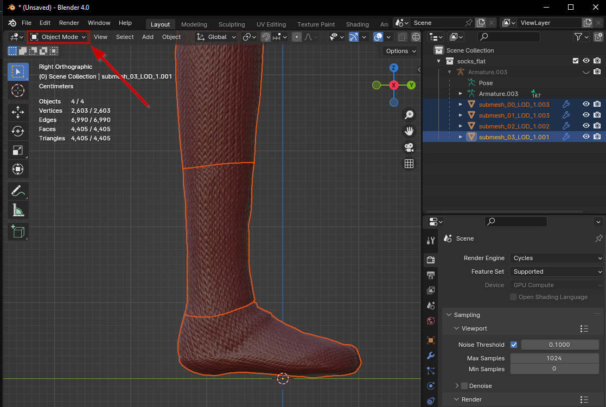<figcaption></figcaption></figure>

1. In the viewport, click on the submesh that you want to have the decal.


&#x20;If you want it to span multiple submeshes, you should merge them into one submesh to cut from. Shift-click to select them all, then **duplicate** them (Hotkey: `Shift-D`) and **join** them together (Hotkey: `Ctrl+J`).


2. Switch to Edit Mode (shortcut: `Tab`)
3. Turn the viewport to the side (shortcut: `Numpad 3`)
4. Turn on X-Ray mode (shortcut: `Alt+Z`). This lets you select right through the mesh, in my example, on both sides of the leg.&#x20;
5. Use the selection tool (shortcut: `W`, it should be active) to select your decal mesh. It should look something like the left side of the screenshot below.


We will refine this later — select generously, too much is a lot better than too little!


6. Duplicate these vertices (Shortcut: `Shift+D`)
7. Split them into a new submesh or new submeshes (Shortcut: `P` -> Selection)
8. You should now have something like the right half of the screenshot.&#x20;

<figure>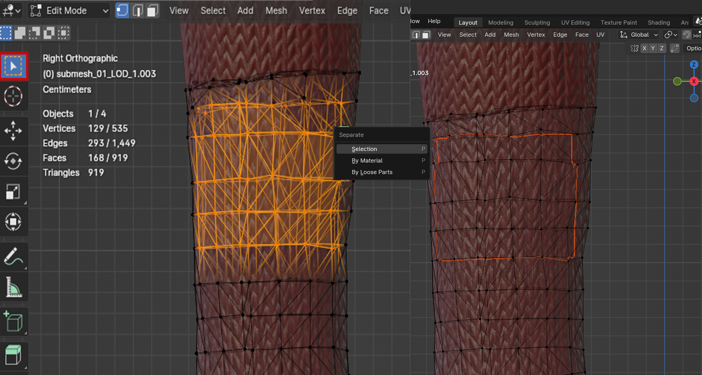<figcaption>
Awesome! Time to refine it further.
</figcaption></figure>

## Step 2: Renaming our new submesh


This guide will add a new chunk to an already-existing mesh.&#x20;

For more advanced cases (such as use with dynamic variants), you can split off the decal into its own file, or you can use an extra appearance that will [hide all other submeshes](../../../files-and-what-they-do/3d-objects-.mesh-files/submeshes-materials-and-chunks.md#chunkmasks-partially-hiding-meshes).&#x20;

**If this is your first rodeo, do not do any of that.**


If you take a look at the outliner, you will notice a new submesh in the scene collection. This is your decal mesh. We need to change its name to register it as a [new chunk](../../../files-and-what-they-do/3d-objects-.mesh-files/submeshes-materials-and-chunks.md).

1. Switch back to Object Mode (Hotkey: `Tab`)
2. In the Outliner, click on your meshes until your decal mesh lights up
3. Change the name: it needs to be the submesh with the highest number (see the red box in the screenshot below). Double-click the name, then change it to (in this example)`submesh_04_LOD_1`.&#x20;


Depending on your mesh, you will end up with a different number than 4!


<figure>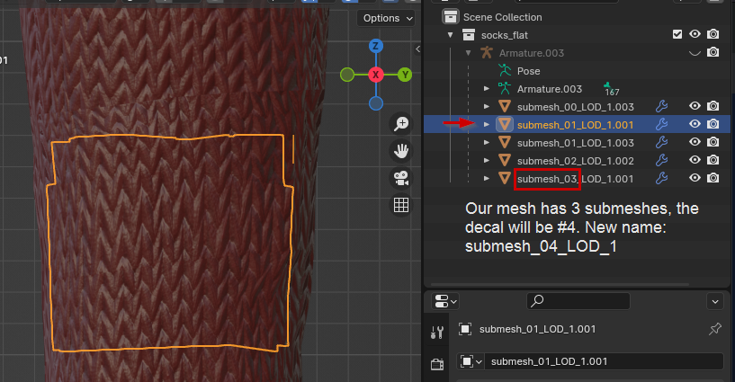<figcaption></figcaption></figure>

## Step 3: Fixing up the decal

With your new submesh selected, it's now time to clean up.

1. Switch back to Edit Mode (Hotkey: `Tab`)
2. &#x20;Cut away all vertices that you don't need. (Hotkey: `X`)


As the decal shader supports transparency, you can be generous here as well. Having too much is better than having too little!


<figure>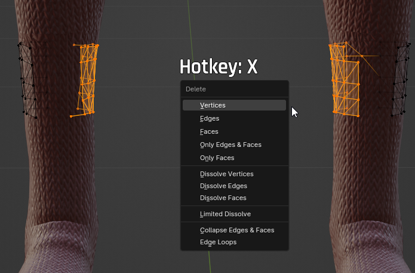<figcaption>
Double-click on the name, then change it to <code>submesh_0x_LOD_1</code>. 
</figcaption></figure>

3. After cutting away everything that you don't want/need as part of your decal, select the rest (Hotkey: `A`)
4.  The decal should be one piece, so let's make sure to merge by distance now (hotkey: `M`).&#x20;

    <figure>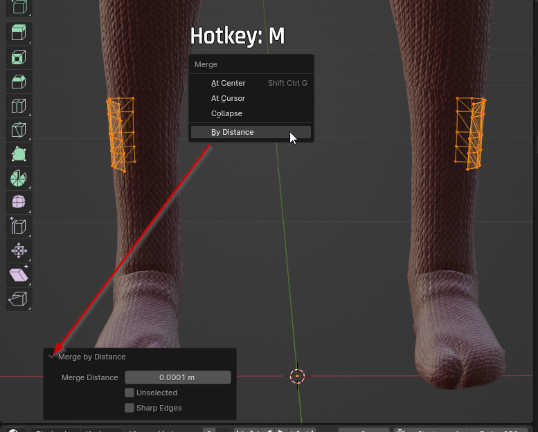<figcaption></figcaption></figure>

Now, let's make sure that our decal is above the surface of the original mesh by using the `Shrinkwrap Modifier`. &#x20;


I'll show you how to do this in a way that preserves potential garment support. If you run into issues with your decal mesh (being invisible or crooked), you can always [delete it later](../../../3d-modelling/troubleshooting-your-mesh-edits.md#option-2-guaranteed-to-work-delete-garmentsupport-from-the-mesh).&#x20;


5. Switch back to Object Mode (Hotkey: `Tab`)
6. Duplicate your mesh (Hotkey: `Shift+D`)
7. Select just one of the two meshes, and switch to the Data tab
8. Delete all shapekeys (starting at the bottom).&#x20;


If your mesh doesn't have any, you can skip step 13 and delete your extra duplicate.


<figure>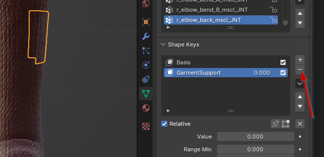<figcaption></figcaption></figure>

9. Now, switch to the `Modifiers` tab. Leave the Armature modifier alone.
10. Add a `Shrinkwrap` Modifier (Deform -> Shrinkwrap).

<figure>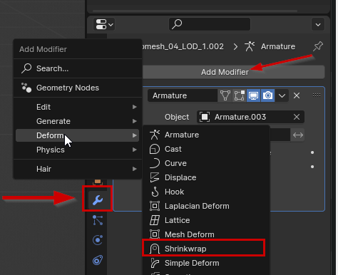<figcaption></figcaption></figure>

11. Configure it. Try the standard parameters below — if you have clipping, you can play around with the modifier after.
    1. `target`: The mesh you originally cut from (you can use the eyedropper symbol)
    2. `Wrap Method`: Select `Nearest Vertex`
    3. `Offset`: `0.0005 m` (sometimes it's necessary to increase it to something like `0.002 m`)
12. Your decal should be floating directly on the surface of your mesh, with just enough offset that it's not clipping. When you're satisfied, apply the shrinkwrap modifier:

<figure>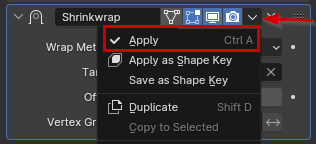<figcaption></figcaption></figure>

13. Now let's merge it with the original submesh with the garment support. Select the duplicate that you made in Step 6.
    1. Switch to Edit Mode (Hotkey: `Tab`)
    2. Select all vertices (Hotkey: `A`)
    3. Delete them (Hotkey: X)
    4. Switch back to Object Mode (Hotkey: `Tab`)
    5. **First,** select your decal mesh (with the offsets) by clicking on it in the Outliner
    6. **Second**, select your empty mesh (with the shapekeys) by shift-clicking on it in the Outliner
    7. Now, join them together (Hotkey: `Ctrl+J`)

You now have a decal mesh with an offset and garment support shapekeys. Awesome! Let's take care of the material now.

## Step 4: Material assignment

With your new submesh selected in Object Mode, switch to the Shading perspective. Delete the existing material assignment and create a new material:

1. Click the X above the node browser to delete the existing material assignment
2. Create a new material

<figure>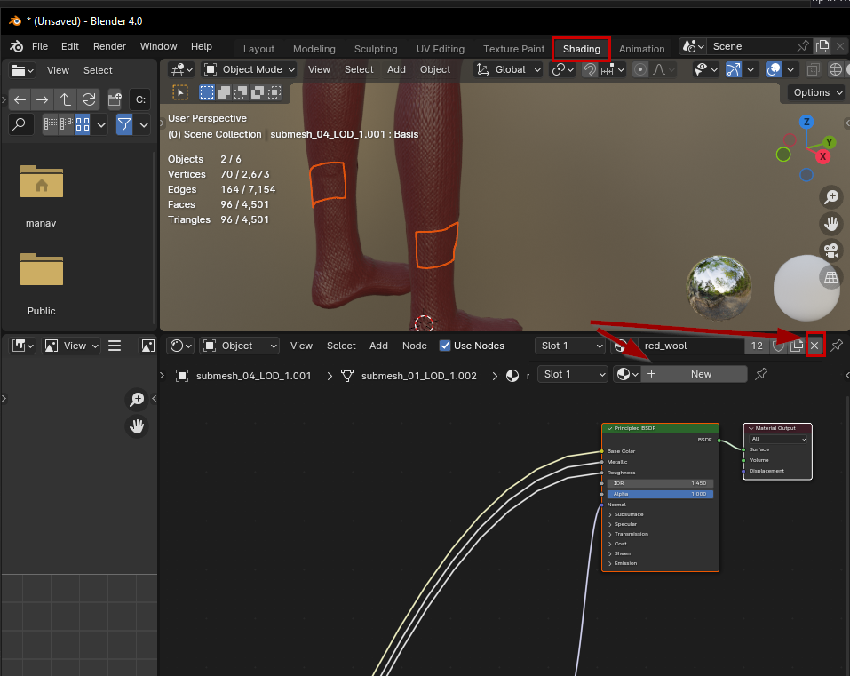<figcaption></figcaption></figure>

3. In the node browser, add a new image texture (Hotkey: Shift+A, Texture -> Image Texture)

<figure>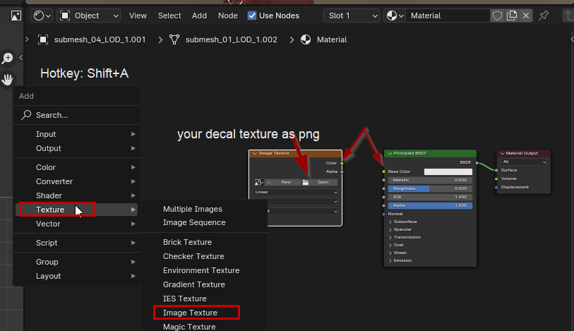<figcaption></figcaption></figure>

4. Click on "open" in the orange node and point the path to your decal png
5. Drag-and-drop the "Color" dot on the orange box to the "Base Color" dot on the green one
6. If your mesh's surface hasn't changed yet, you need to assign the material:&#x20;
   1. Open the Material tab
   2. Switch to Edit mode (Hotkey: `Tab`)
   3. Select all vertices (Hotkey: `A`)
   4.  Assign them to your new material

       <figure>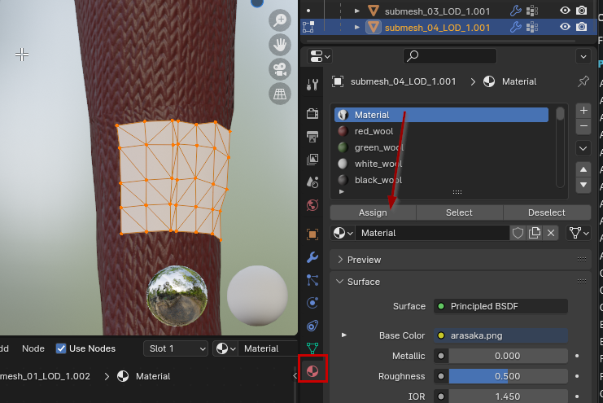<figcaption></figcaption></figure>

## Step 5: UV projection


For more information on this, check [uv-mapping-texturing-a-3d-object.md](../../../materials/uv-mapping-texturing-a-3d-object.md "mention") (but the page will only send you back here).


Our decal is now showing our new material. Make sure that it has exactly one UV map by checking the `Data` tab:

<figure>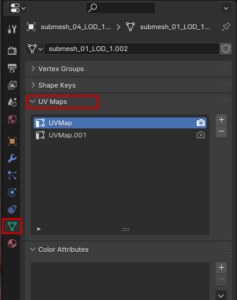<figcaption>
If there is more than one, delete all but the first (starting at the bottom)
</figcaption></figure>

Time to change to the `UV Editing` perspective. You should be in Edit Mode (Hotkey: `Tab` if not) and have all pixels of your decal mesh selected (Hotkey: `A` if not).

You will see something like this (to learn more about UV maps, look up our [theory page](../../../materials/uv-mapping-texturing-a-3d-object.md)):

<figure>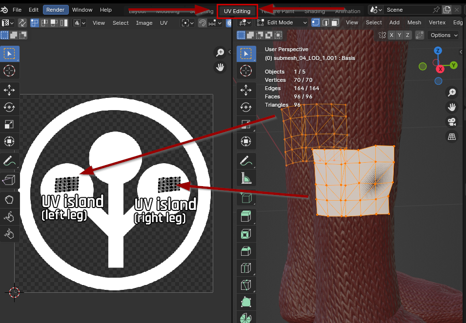<figcaption></figcaption></figure>

We will now unwrap our decal. I'll do both UV islands at once - if you have only one (because your decal is on a jacket or something), then your life will be easier.


You should be unwrapping a roughly rectangular 2d surface that has undergone `merge by distance`. If you haven't done that yet, refer to [Step 3](adding-decals.md#step-3-fixing-up-the-decal), item 4 — or read up on UV seams.&#x20;


1. With everything selected in the `UV Editor` on the left, select UV -> Unwrap -> Unwrap (Hotkey: `Ctrl+U`)
2. This will **unwrap** the mesh. Hopefully, you get nice and clean UV islands. If not, you may have to play puzzle


I'll show you a simple example of doing it by hand. If you want anything more complex, you should hit up Google, as there are plenty of best practices and even Blender add-ons.


At the end, we want a nice and straight grid over the full width and height of the decal, with the correct orientation. Let's start by fixing up the UV islands.&#x20;

3. Select a row or column. From the right-click menu, select one of the following:
   1. `Straighten`:  Will put them all in a line
   2. `Align Auto`, which does one of the following:
      * `Align Horizontally`: Will put them all on the same Y-axis&#x20;
      * `Align Vertically:` Will put them all on the same X-axis&#x20;
4. Keep doing that until you have a nice grid.


While straightening out your UV layout, keep an eye on your decal in the viewport on the right. Sometimes, vertices **need** to be crooked, or your mapping will look like shit.&#x20;

If you can't get a grip on your OCD, you can shift vertices over the mesh's surface by clicking on them, then pressing `G` twice and sliding them along the edges.


5. If you have multiple UV islands, you can move them on top of each other.


Make sure to keep a little offset between the vertices, because Blender's glb export does not play nice with shared UV coordinates — it will split your mesh into a million individual triangles.

If you need an exact identical layout, know that the UV mapping **tiles infinitely**, so you can simply select one of the islands and move it by a full tile in any direction (G -> X -> 1)


6. Check the individual decals in your viewport and fix up any that are flipped/rotated:
   1. Click on a vertex in the viewport
   2. Select linked (Hotkey: `Ctrl+L`)
   3. Fix the UV mapping (Right-click: Flip horizontal/vertical, or rotate)
7. When you are done, [export your mesh from Blender to glb](../../../modding-tools/wolvenkit-blender-io-suite/wkit-blender-plugin-import-export.md#exporting-from-blender). Include all submeshes.

Now it's time to head back to Wolvenkit and activate our new decal chunk.&#x20;


This guide will add a new chunk to an already-existing mesh.&#x20;

For more advanced cases (such as use with dynamic variants), you can split off the decal into its own file, or you can use an extra appearance that will [hide all other submeshes](../../../files-and-what-they-do/3d-objects-.mesh-files/submeshes-materials-and-chunks.md#chunkmasks-partially-hiding-meshes).&#x20;

**If this is your first rodeo, do not do any of that.**


## **Step 6: Adding a new material**

After successfully importing your new submesh into Wolvenkit and open it.&#x20;

### Appearances

First, we need to add your new chunk to each of your [appearances](../../../files-and-what-they-do/3d-objects-.mesh-files/#step-1-appearances). For this example, we will use the material `decal`.

1. Find the `appearances` array at the top of the file and expand it.
2. Under each appearance, find the `chunkMaterials` array and expand it.
3. If you already have an entry for your new submesh, change its value to `decal`. If you don't, right-click on the last entry to duplciate it. You should now have something like this:

<figure>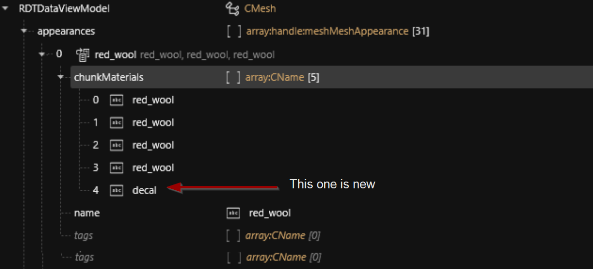<figcaption>
You have to repeat this process for each of your appearances.
</figcaption></figure>

### Material definition

If you save your mesh now, file validation will complain that the `decal` material doesn't exist. It's right; we haven't added a [material definition](../../../files-and-what-they-do/3d-objects-.mesh-files/#material-entry) yet. Let's do that.

1. Find the `materialEntries` array inside your mesh and duplicate the last entry
2. Change its `name` to `decal`
3. Make sure that `isLocalInstance` is checked
4. Increment its `index` by one (e.g. 29 -> 30)

<figure><figcaption></figcaption></figure>

### Material instance

Now that our chunk knows which material it's supposed to look up, we need to provide [the actual material](../../../files-and-what-they-do/3d-objects-.mesh-files/#materialinstance-the-local-material).&#x20;

1. Find the array `localMaterialBuffer`
2. Find the array `materials` (directly underneath)
   1. If it's empty, go back up and find `preloadMaterialBuffer` instead
3. Duplicate the last entry. This is your new decal material. Now we need to make sure it behaves like a decal, too.
   1. Change its baseMaterial to `base\materials\mesh_decal.mt`.\
      _This will tell the game which shader to use, and_ [_mesh\_decal_](../../../references-lists-and-overviews/cheat-sheet-materials.md#decal-materials) _is for exactly this._
   2. Unless your previous material was already using mesh\_decal, right-click on the `values` array and [`Delete all Items in Array/Buffer`](https://app.gitbook.com/s/-MP\_ozZVx2gRZUPXkd4r/wolvenkit-app/editor/file-editor#delete-all-items-in-array-buffer)
   3. As of now, your decal will be completely transparent. Let's change that.
4. Now we need to get the right material properties. The easiest way is to find another material that uses mesh\_decal and steal them from there:
   1. Open the [Asset Browser](https://app.gitbook.com/s/-MP\_ozZVx2gRZUPXkd4r/wolvenkit-app/editor/asset-browser) and search for `base\materials\mesh_decal.mt`
   2. Right-click on the file and select [Find files using this](https://app.gitbook.com/s/-MP\_ozZVx2gRZUPXkd4r/wolvenkit-app/editor/asset-browser#find-files-using-this)
   3. Sort the results by file type by clicking on the column, then find and open a `.mi` or `.mesh`
   4. Find the decal material inside the other file, and [copy everything from its `values` array](https://app.gitbook.com/s/-MP\_ozZVx2gRZUPXkd4r/wolvenkit-app/editor/file-editor#copy-selection-from-array-buffer)
   5. Switch back to your own mesh and copy these values into your mesh\_decal material's `values` array (the one from step 3.3)
5. Adjust the properties. Find the one that says `DiffuseTexture` and point its `DepotPath` to your decal's `.xbm` (right-click it and select [copy relative path](https://app.gitbook.com/s/-MP\_ozZVx2gRZUPXkd4r/wolvenkit-app/editor/project-explorer#copy-relative-path))
   1. If you don't have one, go back to [#prerequisites](adding-decals.md#prerequisites "mention") -> [#the-rest](adding-decals.md#the-rest "mention")
6. The other properties should be numbers only. If you don't know what they do, you can delete them for now.

<figure>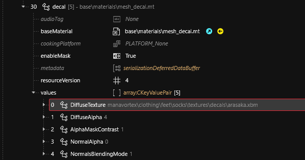<figcaption></figcaption></figure>

## Time to test!

[Install your mod and start the game](https://app.gitbook.com/s/-MP\_ozZVx2gRZUPXkd4r/wolvenkit-app/menu/toolbar#install-and-launch). If you have done everything right, then your mesh should now have a decal!

## Troubleshooting

### Issues with your texture

See [images-importing-editing-exporting.md](../../textures-and-luts/images-importing-editing-exporting.md "mention") -> [#troubleshooting](../../textures-and-luts/images-importing-editing-exporting.md#troubleshooting "mention")

### Issues with the mesh

See [troubleshooting-your-mesh-edits.md](../../../3d-modelling/troubleshooting-your-mesh-edits.md "mention")

### Issues with the material

See [materials-troubleshooting.md](../../../materials/materials-troubleshooting.md "mention")

## Video



