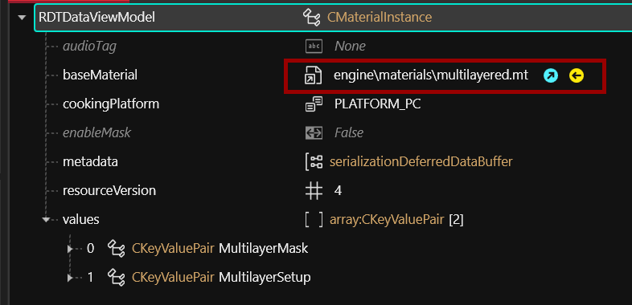
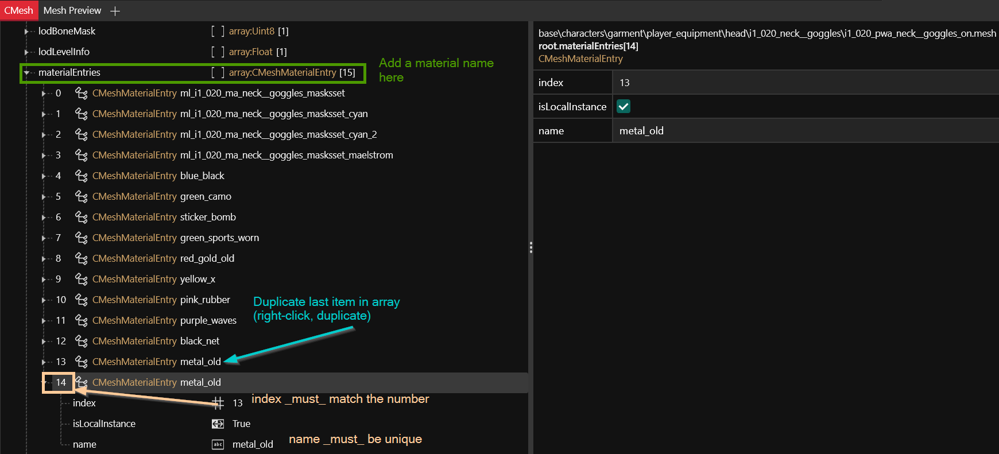

# Changing materials, colors and textures

## Summary <a href="#summary" id="summary"></a>

**Created by @manavortex**\
**Published November 05 2022**

This guide will teach you how to change an item's appearance by editing its MultilayerSetup (\*.mlsetup file), how to rename materials, and how add your own mlsetups (**custompathing**).

It uses the following versions:

* WolvenKit: [8.7.1-nightly.2022-11-06](https://github.com/WolvenKit/WolvenKit/compare/8.7.1-nightly.2022-11-05...8.7.1-nightly.2022-11-06) (but anything > 8.7 will do)
* [MLSetupBuilder](../../../modding-tools/mlsetup-builder.md): [1.6.5](https://github.com/Neurolinked/MlsetupBuilder) (older versions won't be compatible with WKit 8.7 and game version 1.6)


In general, an item's appearance is determined by a [mlsetup](../../../materials/multilayered.md#what-is-the-mlsetup) file containing several material layers.&#x20;

Which of these layers affects which part of your mesh will be determined in the corresponding [mlmask](../../../materials/multilayered.md#what-is-the-mlmask) file.



For an overview of base materials and example files, you can check [here](../../../references-lists-and-overviews/cheat-sheet-materials.md).


## **Step 1: Finding your item**


This tutorial assumes that you already know which mesh and appearance you want to change. If you don't know that, you need to [find the correct game file](replace-a-player-item-with-an-npc-item.md#summary). If you only have a cheat code, see [Spawn Codes](../../../references-lists-and-overviews/equipment/spawn-codes-baseids-hashes.md#the-.app) instead.


We will use the female variant of the puffy vest (as I've already [mapped and documented it](../../../references-lists-and-overviews/equipment/variants-and-appearances.md#reinforced-puffer-vest-4-variants)):

```
base\characters\garment\player_equipment\torso\t2_002_vest__puffy\t2_002_pwa_vest__puffy.mesh
```


Add the item to your project and open it in WolvenKit. You want the original to look up material names, even if you overwrite it with your own mesh.


## Step 2: Finding the correct appearance


If you don't know which appearance you want to edit, check [here](../../../references-lists-and-overviews/equipment/spawn-codes-baseids-hashes.md#the-.app).&#x20;

`default` is the fallback appearance that'll be used if anything can't be resolved by name or index. This is the reason why most item swap mods give you only a single appearance - people didn't set up the [variants](replace-a-player-item-with-an-npc-item.md).


We will change the appearance `bwstripes`, which is used by `Vest_17_basic_01`:

<div align="center">

<figure><figcaption><p>find material bwstripes and remember the name of the chunkMaterial</p></figcaption></figure>

</div>


`chunkMaterials` corresponds to the `chunkMasks`: For submesh\_00, the material at array position 0 will be used, for submesh\_01 the material at position 1, and so on.


This vest has only one chunkMask, so there's only one material.&#x20;

Remember its name (`ml_t2_002_ma_vest__puffy_bwstripes`) and find the corresponding material definition:


Most meshes have their materials under `localMaterialBuffer/materials`. However, some of them (especially those with physics) use `preloadLocalMaterialInstances` instead.


<figure><figcaption><p>It's ml_t2_002_ma_vest__puffy_bwstripes</p></figcaption></figure>

You will (hopefully) see a material with three entries in `values` (order doesn't matter):

<table><thead><tr><th width="213">Key</th><th>Value (DepotPath)</th></tr></thead><tbody><tr><td>MultilayerSetup</td><td><code>base\characters\garment\citizen_casual\torso\t2_002_vest__puffy\textures\ml_t2_002_ma_vest__puffy_bwstripes.mlsetup</code></td></tr><tr><td>MultilayerMask</td><td><code>base\characters\garment\citizen_casual\torso\t2_002_vest__puffy\textures\ml_t2_002_ma_vest__puffy_default.mlmask</code></td></tr><tr><td>GlobalNormal</td><td><code>base\characters\garment\citizen_casual\torso\t2_002_vest__puffy\textures\t2_002_ma_vest__puffy_n01.xbm</code></td></tr></tbody></table>

For the purpose of this guide, all that matters is the mlsetup, which determines all the individual material assignments in this CMaterial. For an explanation of the shader, check [here](../../../materials/multilayered.md).

<figure><figcaption><p>This is the path to the mlsetup file. By editing this, you can change colours and surface materials.</p></figcaption></figure>


If you have your own mlsetup file, this is where you need to set tohe path. See [custompathing](changing-materials-colors-and-textures.md#step-4-optional-custompathing) for further details.



Most materials in Cyberpunk use the `engine\materials\multilayered.mt` material and assign colours via an .mlsetup file. If you're used to textures, you are probably going to hate this. As somebody who has been where you are: **the mlsetup system is cool**. Genuinely. Give it a chance!&#x20;


### multilayered material&#x20;


If you would rather use a textured material, check [here](changing-materials-colors-and-textures.md#other-materials-textured).


A multilayered material consists of multiple layers of materials, projected on the mesh through the mlmask: white parts get affected, black parts are blocked out. (Again, for a full explanation, check [here](../../../materials/multilayered.md)).&#x20;


You can turn any multilayered material into its cyberspace variant by changing the material from `engine\materials\multilayered.mt` to `base\characters\common\cyberspace\silverhand_overlay_cyberspace_mml.mi`


<figure><figcaption></figcaption></figure>

#### Exporting the .mlsetup

We're going to edit the mlsetup file and then import it back, causing a global change in the appearances of every item which uses this particular material file. (If you don't want that, see [Custompathing](changing-materials-colors-and-textures.md#step-4-optional-custompathing) below).

We do that by editing the **MultilayerSetup**:

1. Find the file and add it to your project.
2. Right-click the file and select "Convert to JSON".


If you have set configured MLSB, you can make use of MlSetupBuilder's export feature, rather than doing it via WolvenKit:


Move your new json file in the same folder as the multilayer setup.&#x20;

<figure><figcaption></figcaption></figure>


The json file will be named `ml_t2_002_ma_vest__puffy_bwstripes.mlsetup.json` (`originalFileName.originalExtension.json`)&#x20;


## Step 3: Editing the .mlsetup file

Open up MlSetupBuilder and load your .mlsetup.json file.


If you select WolvenKit's "Open in File Explorer" option, you can copy the path from the explorer's address bar and paste it into the MlSetupBuilder's address bar.


<figure><figcaption></figcaption></figure>

If you want to see which layers correspond to which part of the mesh, you can load it from the library:

<figure><figcaption><p>Optional: Find your mesh in the library</p></figcaption></figure>


This step requires the tool to be [set up correctly](../../../modding-tools/mlsetup-builder.md), which is not part of this guide. Fortunately, it's also optional, as you can tweak values around without seeing the affected areas or material previews.


Change the colours and materials to whatever you want.


TBD: Create/link to material description


Save the file and overwrite the original `.mlsetup.json`:

 (1) (1).png>)

If you have configured MLSB and had both files in the same folders, you will see a notification when the MlSetupBuilder has overwritten your original `*.mlsetup`. This takes a few seconds.

Otherwise, you need to right-click on the json file under "raw" and select "import from JSON".


This is already working. You can pack the project and see it work!


<figure><figcaption></figcaption></figure>


Since you haven't changed anything in the mesh itself, you can (and should) delete it from your mod. Only keep it if you want to do the steps below.


## Step 4 (optional): Custompathing

If you want to put up your own .mlsetup, rather than overwriting the original one, you can do that. All you have to do is changing the DepotPaths to the relative path of your mlsetup.

<figure><figcaption></figcaption></figure>


Keep your folder and file names unique! If you have two mods adding a file at the same location, the second one **will be unable to overwrite it** and will use the first mod's file. That is, unless your mods are in REDmod format, where it'll be the other way around.&#x20;

Understood? No? That's fine. Just keep it unique. :D


## Step 5 (optional): Renaming materials

You can rename a material by changing the "name" property inside the `CMeshMaterialEntry` in the `materials` array:&#x20;

<figure><figcaption></figcaption></figure>


Inside the appearances block, the material assignment to the individual submeshes happens by name, so don't forget to change the `chunkMaterial` names!


## Step 6 (optional): adding new materials

To add a new material to a mesh, you need to create **two** entries. The first of those needs to be in the **materialEntries** array:

<figure><figcaption><p>Edit the new material's index and name. This is crucial!</p></figcaption></figure>

Now, add an entry in the localMaterialBuffer.


If your mesh doesn#t have entries under `localMaterialBuffer`, use `preloadLocalMaterialInstances`  instead.


<figure><figcaption><p>The new material will have the name you defined in the CMeshMaterialEntry in the previous step.</p></figcaption></figure>

You can now use your new material just like the regular, old materials.
