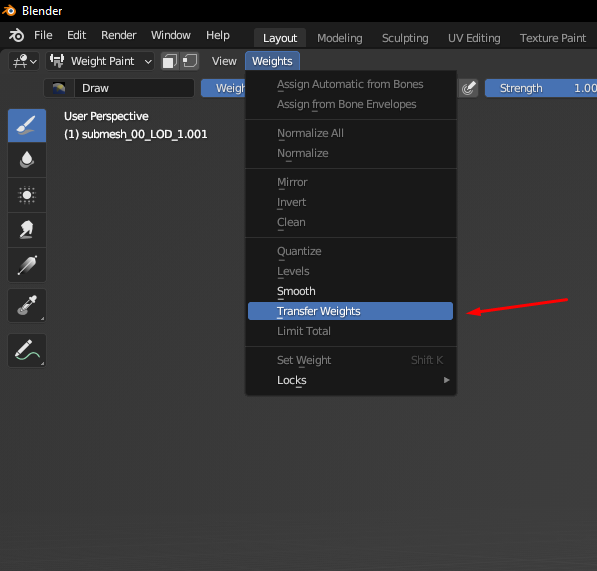
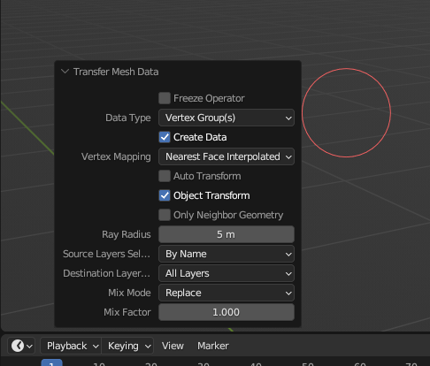
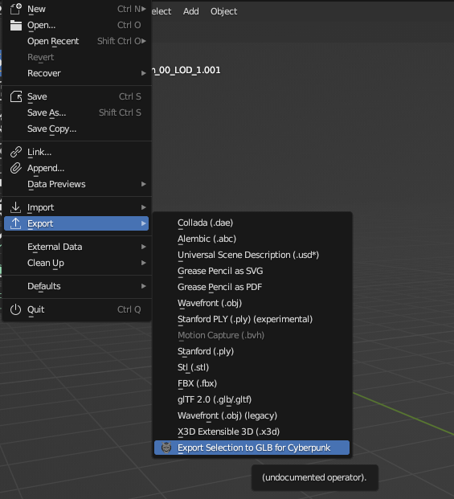
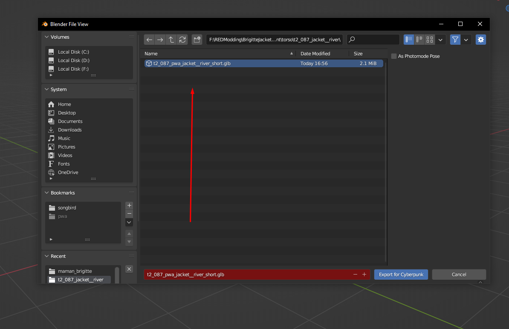
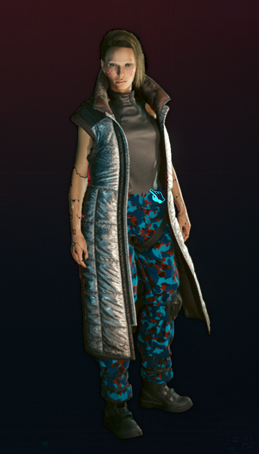

# Replace a player clothes with NPC garment that requires blender editing

This tutorial will teach you how to swap player's clothing items with NPC's that requires blender editing.


This tutorial will not cover changing materials and appearances from an NPC's mesh to player's. For that, visit the tutorial [here](https://wiki.redmodding.org/cyberpunk-2077-modding/for-mod-creators/modding-guides/items-equipment/editing-existing-items/replace-a-player-item-with-an-npc-item).\
To add an item rather than replacing one, see [here](../../adding-new-items/).


Without mesh editing, some NPC meshes will clip quite badly, because they don't have as many poses and animations as V. Some are even worse, since they'll be flying around rather than following V's movements.

In this guide, we'll fix up a coat by **transferring weights** from a different item.\
\
Prerequisites:\
&#x20;                    \- [Blender 3.1 \*Required\* 3.6 \*recommended\*](https://www.blender.org/download/releases/3-6/)\
&#x20;                    \- [Cyberpunk Blender Addon](https://github.com/WolvenKit/Cyberpunk-Blender-add-on/releases/tag/1.3.0)\
&#x20;                    \- Wolvenkit

## **Step 1:  Finding a player item of the same size**

**Prerequisite:** you have the mesh that you want to fix already in your project. For this tutorial, we'll want Maman Brigitte's jacket: `t2_001_wa_jacket__maman_brigitte.mesh`

1. Use the [Wolvenkit Search](http://127.0.0.1:5000/s/-MP\_ozZVx2gRZUPXkd4r/wolvenkit-app/usage/wolvenkit-search-finding-files) to find a player mesh of roughly the same size/length/cut. For this tutorial, we'll use River's coat: \
   `t2_087_pwa_jacket__river_short`
   * For female body gender, search for `_pwa_`
   * For male body gender, search for `_pma_`
2. Add it to [the Wolvenkit project](http://127.0.0.1:5000/s/-MP\_ozZVx2gRZUPXkd4r/wolvenkit-app/usage/wolvenkit-projects)
3. [Export](https://wiki.redmodding.org/cyberpunk-2077-modding/for-mod-creators/3d-modelling/exporting-and-importing-meshes) both meshes

## **Step 2: Import Meshes in Blender**

1. Open Blender
2. delete the standard objects from the scene (Shortcut: A -> X)
3. Import the player mesh (File -> Import -> Cyberpunk GLTF)
4. Import the NPC mesh

<figure><figcaption>
Import mesh option
</figcaption></figure>

## Step 3: Editing meshes in Blender

1. Delete or hide the NPC item's armature
2. Delete the NPC item's armature modifier (or make sure that it points at the player item's armature)

<figure><figcaption>
Delete modfiers on all NPC's submeshes
</figcaption></figure>

### Step 3.1: Weight transfer

Repeat the process for each submesh.&#x20;


If you don't have the same number of submeshes, you can simply use the "biggest" mesh you have (e.g. the coat's base mesh rather than the seams)


1. Select the player item's mesh
2. Select the NPC item's mesh
3. Switch to Weight Paint mode in the dropdown on the top left of your viewport
4. Select "Transfer Weights". Use the settings from the second screenshot.

<figure><figcaption>
Weights transfer
</figcaption></figure>

<figure><figcaption>
Transfer Options
</figcaption></figure>

5. Make sure that the NPC mesh's armature modifier is targeting the player armature:

<figure><figcaption></figcaption></figure>

 

<figure><figcaption></figcaption></figure>


Make sure that you select Object Mode while adding modifiers.\



## Step 4: Exporting your edit and importing it to project

1. Select all submeshes under the NPC's armature
2. Use the Wolvenkit Blender plugin to export them over the player item's mesh (overwrite it)

<figure><figcaption></figcaption></figure>

 

<figure><figcaption></figcaption></figure>

3. Switch to Wolvenkit
4. Import the player item's mesh via Import Tool
5. Optional: copy the NPC's appearances, materials and material definitions to the player mesh
6. Optional: rename the appearances to match those in the original player item
7. [Install your mod](http://127.0.0.1:5000/s/-MP\_ozZVx2gRZUPXkd4r/wolvenkit-app/menu/toolbar#install-and-launch) and test it!

Sometimes you will need to do a bit more of editing but that is not a topic for this tutorial.


If you don't know how to import meshes, visit this [tutorial](https://wiki.redmodding.org/cyberpunk-2077-modding/for-mod-creators/3d-modelling/exporting-and-importing-meshes#importing-to-.mesh)&#x20;

For adding appearances and materials, visit this [tutorial](https://wiki.redmodding.org/cyberpunk-2077-modding/for-mod-creators/modding-guides/items-equipment/editing-existing-items/replace-a-player-item-with-an-npc-item#summary)


## Step 5: Success!

Now you have functional clothing attached to the player and not flying arround.

<figure><figcaption></figcaption></figure>


If you have any questions about modding join [discord](https://discord.gg/Epkq79kd96) server and we will help you out.

