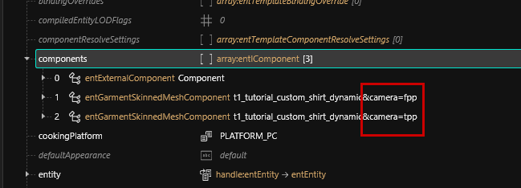
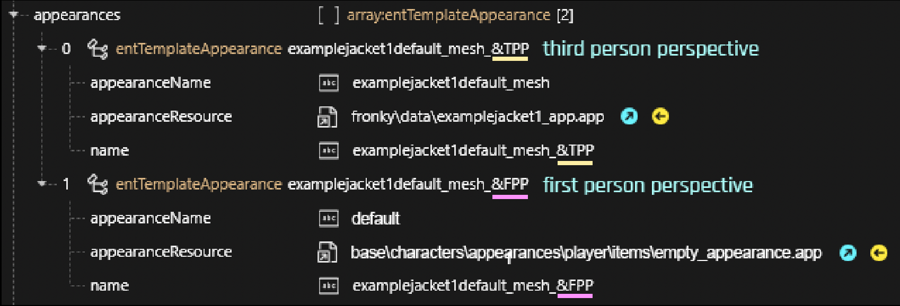
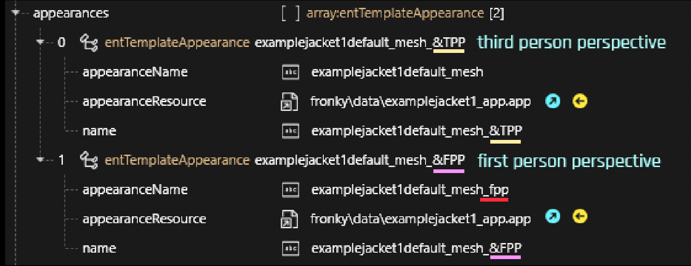
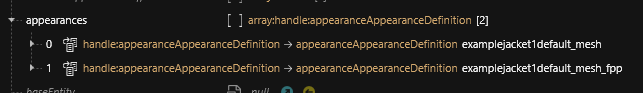
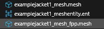
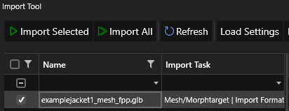

# First Person Perspective Fixes

**Created by** [FronkenZeepa](http://127.0.0.1:5000/u/pj9Ccv6IrMVhmNUW9HVbn6CYZ2B2 "mention")

**Published on October 08 2023**

In this guide, I will do my best to address the most common first person issues I've seen, and how to fix them.&#x20;

## **Prerequisite and other relevant Guides**

This guide assumes that you have an already working in-game item, and at least a basic understanding of WolvenKit.

* [WolvenKit](https://wiki.redmodding.org/wolvenkit/readme)
* [Adding new items](https://wiki.redmodding.org/cyberpunk-2077-modding/for-mod-creators/modding-guides/items-equipment/adding-new-items)
* [File Formats](https://wiki.redmodding.org/cyberpunk-2077-modding/for-mod-creators/files-and-what-they-do/file-formats)
* [Exporting and importing meshes](https://wiki.redmodding.org/cyberpunk-2077-modding/for-mod-creators/3d-modelling/exporting-and-importing-meshes)


To implement anything in this guide, you will need [a Wolvenkit project](http://127.0.0.1:5000/s/-MP\_ozZVx2gRZUPXkd4r/wolvenkit-app/usage/wolvenkit-projects) with the mod's files. You already have that if you're fixing your own mod (hopefully). If not, check out this guide on how to [analyze other mods!](https://wiki.redmodding.org/cyberpunk-2077-modding/for-mod-creators/modding-guides/analysing-other-mods)


### Index

* [Your sleeves render behind your arms](first-person-perspective-fixes.md#problem-1-your-sleeves-render-behind-your-arms)
* [Head/Face/Glasses/Mask/Helmet visible and obstructing vision](first-person-perspective-fixes.md#problem-2-head-face-glasses-mask-helmet-visible-and-obstructing-vision.)
* [You only need to hide a certain part of the clothing, like the collar/fur/stitching](first-person-perspective-fixes.md#problem-3-you-only-need-to-hide-a-certain-part-of-the-clothing-like-the-collar-fur-stitching.)


**If you are modifying someone else's mod**:

If you are changing someone else's mod, the easiest thing is to [name your Wolvenkit project](http://127.0.0.1:5000/s/-MP\_ozZVx2gRZUPXkd4r/wolvenkit-app/usage/wolvenkit-projects#project-naming-and-mod-load-order) the same as the mod's `.archive` file and add all the files from the original mod. You can do that by switching to the [Mod Browser](http://127.0.0.1:5000/s/-MP\_ozZVx2gRZUPXkd4r/wolvenkit-app/editor/asset-browser#mod-browser) and [searching](http://127.0.0.1:5000/s/-MP\_ozZVx2gRZUPXkd4r/wolvenkit-app/usage/wolvenkit-search-finding-files) for `archive:name_of_file`&#x20;

For more information on this, read [here](recolours-and-refits/r-and-r-your-own-wolvenkit-project.md#a-full-repack).



If you're creating a fix for someone else's asset, why not drop them the final files - or a link to this guide?


## Problem #1: Your sleeves render _behind_ your arms

<figure><figcaption>
(This can also present itself as rendering behind the body when you look down, for shirts, pants, shoes, etc.)
</figcaption></figure>

This is probably the most common problem I've seen, and is also thankfully the easiest to fix.

### Solution

1.  Open up the [mesh entity](../../files-and-what-they-do/entity-.ent-files.md#mesh-component-entity-simple-entity) (`.ent`) file for the item you need to fix:

    <figure><figcaption>
There are no appearances in a mesh entity file!
</figcaption></figure>
2.  Expand the `components` array, then find any `component`s with `Mesh` in their types, and check if they require fixing. In my example project, it's both the jacket and the sleeves.&#x20;

    <figure><figcaption>
You might have to hunt around to find the right component, depending on how many there are.
</figcaption></figure>
3.  Scroll down and find the array `renderingPlaneAnimationParam`_,_ which will most likely be grayed out.

    <figure><figcaption></figcaption></figure>
4.  Click on it. In the right pane, change `None` to renderPlane.

    <figure><figcaption>
Make sure to follow the same capitalization, otherwise it won't work!
</figcaption></figure>
5. Repeat this process for any other component, as needed
6. When finished, save the file (either Ctrl + S or the Save button top left).
7.  Install and test the mod in-game. If you did it correctly, your sleeves should now render properly.

    <figure><figcaption>
Oh look, sleeves!
</figcaption></figure>

## Problem #2: It's in your face (#justStormtrooperThings)

<figure><figcaption>
Still better than wearing a <em>real</em> helmet.
</figcaption></figure>

To fix this problem, you need to **hide** your item in first person perspective.&#x20;

This part of the guide will show you how to turn the entire item invisible. If you don't want that, check [#problem-3-partial-hiding-justdraculathings](first-person-perspective-fixes.md#problem-3-partial-hiding-justdraculathings "mention")

### Solution

1. This fix starts in the `.yaml` file (which should live under your Wolvenkit project's `resources` folder in the subfolder `r6/tweaks`, perhaps in a subfolder).
   * If you are editing someone else's mod, you need to copy their `.yaml` to your project. If you don't know which file that is, check their Nexus mod files, as it will be part of the original .zip file.


If you don't have a yaml because you're changing an in-game item for some reason, you need to start at [#fixing-the-root-entity](first-person-perspective-fixes.md#fixing-the-root-entity "mention"). If you [convert it to a dynamic appearance](adding-new-items/archivexl-dynamic-variants.md#the-root\_entity), you can stick to these parts in the rest of the guide.


2. Open the file in any text editor (recommended: [**Notepad++**](https://notepad-plus-plus.org/downloads/))
3.  Helpful documentation on .yaml files resides [here](https://wiki.redmodding.org/cyberpunk-2077-modding/for-mod-creators/modding-guides/items-equipment/adding-new-items/archive-xl-item-structure-explained#the-control-file-yourmodname.yaml). Hopefully it looks something like this:

    <figure><figcaption>
This is my example .yaml file with only <em>one</em> entry. Yours might have more.
</figcaption></figure>
4. Find the line `appearanceSuffixes`_._ If the mod is using [archivexl-dynamic-variants.md](adding-new-items/archivexl-dynamic-variants.md "mention") (there is something called $instances), you can skip this step.
5. If the line isn't there, add it. Use the same number of leading spaces as in the surrounding lines!
6.  Add the line `itemsFactoryAppearanceSuffix.Camera` to the array. If you have something else in there, add a comma.

    <figure><figcaption>
If there's already another entry, add a comma and a space, <em>then</em> add <code>itemsFactoryAppearanceSuffix.Camera</code>.
</figcaption></figure>
7. Repeat this process for any other items in the `.yaml` that you need to fix.&#x20;
8. Save and close the file.

### Fixing the root entity


For dynamic appearances (if the yaml has a key called `$instances`), complete step 1 below and then go to [#hiding-fpp-for-dynamic-variants](first-person-perspective-fixes.md#hiding-fpp-for-dynamic-variants "mention").


1. Switch back to Wolvenkit.
2. Open the [root entity (.ent)](../../files-and-what-they-do/entity-.ent-files.md#root-entity) file (it should have an array called `appearances`)

<figure><figcaption></figcaption></figure>

You now have two ways of hiding the item in first person:

#### Hiding FPP via tag

You can't do that if you're using [archivexl-dynamic-variants.md](adding-new-items/archivexl-dynamic-variants.md "mention").

1. Find the array `tags` at the end of the list.
2. In the panel on the right, click "add new item" (the yellow +) until you have an empt text field.
3. Unless you are using In the text field, enter `EmptyAppearance:FPP`
4. That's it!

#### Dynamic variant: Hiding FPP in the mesh\_entity

To hide components in the [#mesh-component-entity-simple-entity](../../files-and-what-they-do/entity-.ent-files.md#mesh-component-entity-simple-entity "mention"), add suffixes to their names. You can add `&camera=tpp` to a component's name, or you can duplicate it and have two for different meshes (check [#problem-3-partial-hiding-justdraculathings](first-person-perspective-fixes.md#problem-3-partial-hiding-justdraculathings "mention") for details).

<figure><figcaption></figcaption></figure>

#### Dynamic variant: Hiding FPP in the .app

Add `&camera=tpp` to the appearance name(s). They will now no longer appear in First Person mode.

<figure><figcaption></figcaption></figure>

#### Hiding FPP via appearance definition

1. Find and expand the `appearances` array.&#x20;
2.  For each entry in there, you need to complete the following steps (the example project has only one entry).

    1. Select each entry
    2. Duplicate it via right-click menu
    3. For the old entry: Change its `name` to end in `&TPP` (third person perspective)
    4. For the new entry:&#x20;
       1. Change the `name` to end in `&FPP` (first person camera)
       2. Change the depotPath to `base\characters\appearances\player\items\empty_appearance.app`
       3. change the `appearanceName` to `default`

    <figure><figcaption>
Should look like this now.
</figcaption></figure>

3.  Save and close the file. Repeat the whole process for any other items that need to be obliterated in first person. Install and test. If all went well, no more obstructed vision!

    <figure><figcaption>
I can see clearly now!
</figcaption></figure>

## Problem #3: Partial hiding (#justDraculaThings)

<figure><figcaption>
I probably could have chosen a better example, but I'm sure you can see the big clump of fur on the right.
</figcaption></figure>

Fixing this is very similar to Problem #2, just with a few extra steps.

### Solution

1. Create an additional FPP appearance by following the steps in [#hiding-fpp-via-appearance-definition](first-person-perspective-fixes.md#hiding-fpp-via-appearance-definition "mention"). **Skip 2.4.3 and 2.4.4**.&#x20;
2. The `depotPath` should point at the same .app file as the \&TPP appearance.
3. Change the value for appearanceName. For example, add \_fpp

<figure><figcaption></figcaption></figure>

4. Open your .app file and expand the `appearances` array.&#x20;


You need to repeat the following steps for every appearance in the .app.


5. Select an appearance and duplicate it
6. Change its `name` to correspond to the `appearanceName` that you used in your root entity (Step 3)

<figure><figcaption></figcaption></figure>

At this point, it can be done in a few ways, depending on some factors:

#### Finding the right submesh

1. Open up the appearance's `partsValue` array
2. Open the .ent file that is linked inside
3.  In the .ent file, open the `components` array and check any component with Mesh in its name:\

    <figure><figcaption>
You might have to hunt around to find the right component, depending on how many there are.
</figcaption></figure>
4. Open the linked .mesh file in Wolvenkit
5. Select `Mesh Preview`&#x20;

<figure><figcaption>
My example mesh, a lovely fur collar.
</figcaption></figure>

6. In the right-hand panel, you will see a list of checkboxes.


If there is only one submesh, you need to edit it in Blender to split off or delete the offending parts - complete the section [#creating-a-second-.mesh](first-person-perspective-fixes.md#creating-a-second-.mesh "mention") before proceeding. I'll wait.


7. Toggle them off until the part that is in your face turns invisible. In my example, submesh 01 hides the upper collar.
8. Remember the number (01 in the example below)

<figure><figcaption></figcaption></figure>

9. Proceed to the section for [_Chunk Masks_](first-person-perspective-fixes.md#chunk-masks)_._

### Chunk Masks

1. Switch back to the appearance (.app) file&#x20;
2. Expand your first person appearance.
3. Expand the `partsOverrides` array. If it's empty, click on the array itself, then in the right pane, click create item in array.
4.  Expand the `partsValues` array and copy the `appearanceAppearancePart` value over to the `partResource` entry under `partsOverrides`, as shown in the example image.

    <figure><figcaption></figcaption></figure>
5. Select `componentsOverrides` by clicking on it.&#x20;
6. In the right panel, click on the yellow + to create a new item in array.&#x20;
7. Open up the mesh entity (.ent) file and expand the `components` array.&#x20;
8.  Find the component that needs its parts hidden and copy the name. In my example, the component is `examplejacket1_fur`_._

    <figure><figcaption></figcaption></figure>
9.  Back to the appearance (.app) file. Paste the component's name from the mesh entity into the _`componentName`_ field.

    <figure><figcaption></figcaption></figure>
10. Click on `chunkMask` and uncheck the submeshes that you want to hide. (You found out which ones that were in [#finding-the-right-submesh](first-person-perspective-fixes.md#finding-the-right-submesh "mention") - In my example it was submesh 01)

<figure><figcaption></figcaption></figure>

11. Optional: If you need to hide more parts or affect more components/meshes, rinse and repeat.
12. Save the appearance (.app) file and install the mod to test. If all went well, there should no longer be parts clipping into view.

<figure><figcaption>
Results may vary depending on the item, but this is much better, no?
</figcaption></figure>

### Creating a second .mesh


The clean way to do this is to split the original mesh into submeshes, which you can then hide via chunkmasks. If you want to do that, skip straight to [#editing-the-.mesh](first-person-perspective-fixes.md#editing-the-.mesh "mention")


To show a different item (one with the clipping bits removed) in first person perspective, we need to create a second .mesh file that we can display. This guide will show you how.

1. Duplicate the `.mesh` file that's clipping in first person. For my example. I'm using the jacket mesh
2. Change its name to end in \_fpp (or do whatever you want, but this guide assumes...)

<figure><figcaption></figcaption></figure>

3. In the `.app` file, open your first person appearance.&#x20;
4. Add a `partsOverride` by following the steps under [#chunk-masks](first-person-perspective-fixes.md#chunk-masks "mention") (skip step 10)
5. Change the depotPath to your new \_fpp mesh file.&#x20;
6. Save and close the .app – it is now pointing at  your .fpp mesh.


TODO: This needs a screenshot


### Editing the .mesh

For the next step, we need to export our .mesh file and edit it. You can use any 3d editing program, but this guide will use  [Blender 3.6](https://www.blender.org/download/)  and the [wolvenkit-blender-io-suite](../../modding-tools/wolvenkit-blender-io-suite/ "mention").&#x20;

1. Optional, but recommended: If you don't have the [wolvenkit-blender-io-suite](../../modding-tools/wolvenkit-blender-io-suite/ "mention") installed, do that now.
2. In Wolvenkit, find the [Export Tool](http://127.0.0.1:5000/s/-MP\_ozZVx2gRZUPXkd4r/wolvenkit-app/usage/import-export)
3. Export your \_fpp .mesh file.
   * If the export throws an error, uncheck the Export Materials option in the settings panel (you don't need it)
4. You now have a `.glb` file in your project's `raw` folder. You can find it like this:
   1. Switch the Project Explorer to the `source` or `raw` tab&#x20;
   2. Right-click on your exported file
   3. Select the option to show it in Windows Explorer

Now, hit up the [3d-editing-submeshes.md](../../3d-modelling/3d-editing-submeshes.md "mention") page and edit your mesh.&#x20;

When you are done, use the [Wolvenkit Import Tool](http://127.0.0.1:5000/s/-MP\_ozZVx2gRZUPXkd4r/wolvenkit-app/tools/tools-import-export#import-tool) to import back the .glb file.&#x20;

<figure><figcaption></figcaption></figure>


If you stuck to the guide, you shouldn't run into any errors. If you do, check the [troubleshooting-your-mesh-edits.md](../../3d-modelling/troubleshooting-your-mesh-edits.md "mention") page, or reach out to us on [Discord](https://discord.gg/redmodding) in `#mod-dev-chat.`


5. [Install and launch](http://127.0.0.1:5000/s/-MP\_ozZVx2gRZUPXkd4r/wolvenkit-app/menu/toolbar#install-and-launch) the project
6. ???
7. Profit
