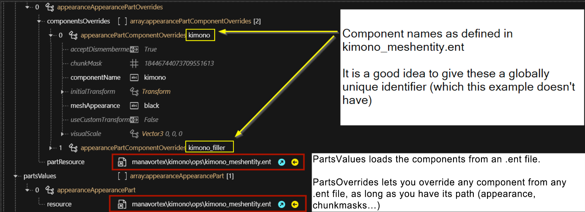
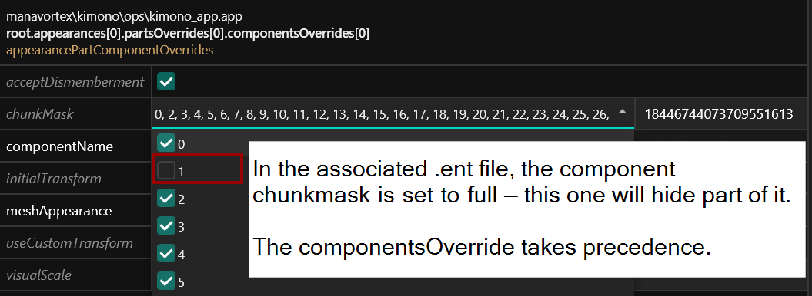
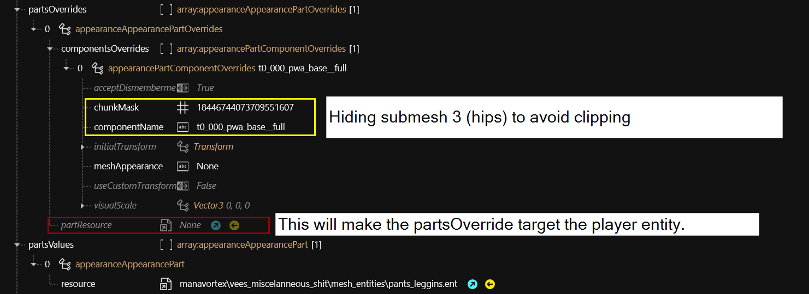
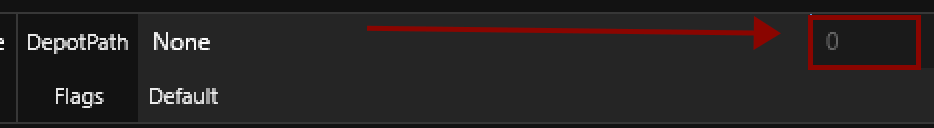
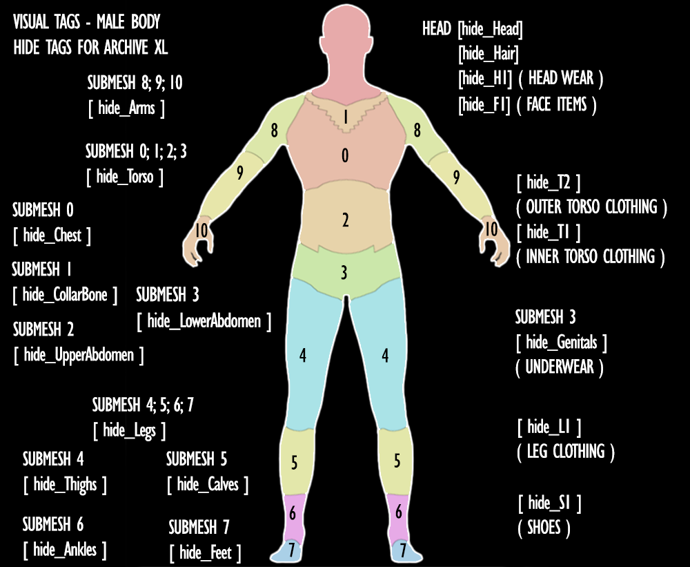
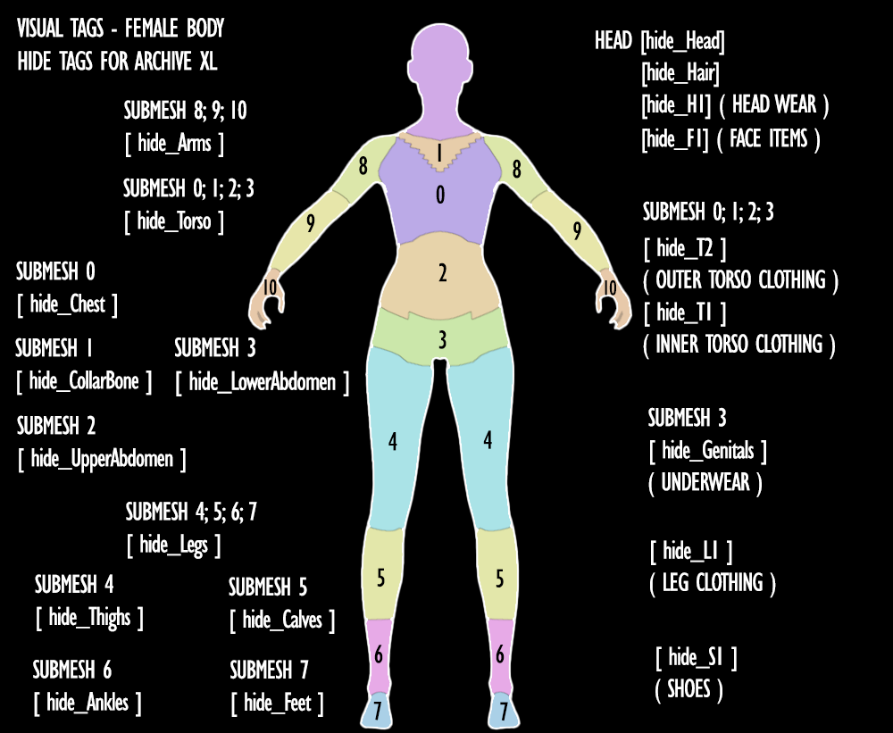

# Influencing other items

### Summary <a href="#summary" id="summary"></a>

**Created by @manavortex**\
**Published November 12 2022**

## Requirement: ArchiveXL >= 1.1.6

This guide will explain how to influence meshes by directly in the .app file, overriding whatever is defined for the components in the .ent file which loads them.

## PartsOverrides


This section assumes that you're loading appearance parts via [associated .ent file](adding-new-items/#mesh\_entity.ent) rather than including them as components.


In the .app file, each appearance lets you define [PartsOverrides](adding-new-items/#appearance.app), which — as the name implies — let you override the appearance of parts. An entry looks as follows:

<figure><figcaption><p>Overwrite the component "<code>kimono</code>" and "<code>kimono_filler</code>", which are defined in the file "<code>kimono_meshentity.ent</code>"<br>This is the reason why Cyberpunk has all the player components stored in .ent files!</p></figcaption></figure>

Where **partsValues** lets you define the individual entity files that you'll load, **partsOverrides** lets you assign properties which take precedence over those defined in the .ent file:

<figure><figcaption><p>componentsOverride > .ent file</p></figcaption></figure>


Components need to be **unambiguously** identified by their name as defined in the .ent file. For that reason, it's good practice to have globally unique identifiers.&#x20;


Starting with version >= [1.4.0](https://github.com/psiberx/cp2077-archive-xl/releases/tag/v1.4.0-rc2), ArchivXL can understand the following variables for `meshAppearance` in `appearanceOverrides`:

|                |                                                                                                                   |
| -------------- | ----------------------------------------------------------------------------------------------------------------- |
| `{gender}`     | m or w depending on V's body gender                                                                               |
| `{skin_color}` | [skin color appearance name](../../references-lists-and-overviews/cheat-sheet-face-and-skin/#skin-tones-by-index) |
| `{hair_color}` | [hair color appearance name](../../references-lists-and-overviews/hair.md#name-in-files-by-index)                 |

So depending on your PC's body gender and colouring, the meshAppearance `my_app_{gender}`**`{skin_color}_{`**`hair_color}` could translate to `my_app_w__01_ca_pale__blue_red_ombre`.

#### Arms


If you want to affect V's arms (for example, hiding clipping shoulders under a jacket), you might have to override the following components:

The male equivalent will have `pma` instead of `pwa`


```
a0_001_pwa_base_hq__full              // default arms
a0_001_pwa_base_hq__full8640          
left_arm                              
right_arm                             
a0_000_pwa_base__fists                // fists (fighting arms)
a0_005_wa__strongarms_holstered_r     // gorilla arms (holstered)
a0_005_wa__strongarms_holstered_l    
a0_005_wa__strongarms_r               // gorilla arms
a0_005_wa__strongarms_l
a0_005_wa__strongarms_photo_mode_r    // gorilla arms (photo mode)
a0_005_wa__strongarms_photo_mode_l
a0_002_wa__monowire_whip_l_cableless  // monowire
a0_002_wa__monowire_whip_r_cableless
```

You can find the corresponding entity files in `base\characters\common\player_base_bodies > .ent`, the file names will start with `a0_.`

#### Body

The player base body component name is

```
t0_000_pwa_base__full
t0_000_pma_base__full
```


### ArchiveXL

Normally, you can override only components from .ent files that you include via partsValues **in the same appearance**. ArchiveXL expands this by letting you manipulate **any** components that are loaded as part of the player.ent:

<figure><figcaption><p>This is hiding a submesh of the default body, which isn't part of the referenced <code>pants_leggins.ent.</code><br>This is only possible because of ArchiveXL!</p></figcaption></figure>

To delete an already existing reference, set the numeric value to the right of the depot path to 0: \


<figure><figcaption></figcaption></figure>

## VisualTags

In the .app file, each appearance will contain an array by the name of `visualTags.tags`. These will let you hide parts of other meshes.


This mechanism is how e.g. your sunglasses disappear when you put on a helmet.


They can be used **additionally** to partsOverrides.

<figure><figcaption></figcaption></figure>

### ArchiveXL

The following tags are used by the base game; however, to make use of them, you require [ArchiveXL](https://github.com/psiberx/cp2077-archive-xl).&#x20;

<table><thead><tr><th width="241">Tag</th><th width="517">Effect</th></tr></thead><tbody><tr><td><code>hide_H1</code></td><td>Hides item in the <code>Head</code> slot (<em>hats, caps, headbands</em>)</td></tr><tr><td><code>hide_F1</code></td><td>Hides item in the <code>Eyes</code> slot (<em>sunglasses, face masks</em>)</td></tr><tr><td><code>hide_T1</code></td><td>Hides item in the <code>Chest</code> slot (<em>shirts, tops</em>)</td></tr><tr><td><code>hide_T2</code></td><td>Hides item in the <code>Torso</code> slot (<em>jackets, coats</em>)</td></tr><tr><td><code>hide_L1</code></td><td>Hides item in the <code>Legs</code> slot (<em>pants, skirts</em>)</td></tr><tr><td><code>hide_S1</code></td><td>Hides item in the <code>Feet</code> slot (<em>shoes</em>)</td></tr><tr><td><code>hide_T1part</code></td><td>Torso item: controls the partial suffix (<code>&#x26;Full</code>/<code>&#x26;Part</code>)</td></tr><tr><td><code>hide_Hair</code></td><td>Hides hair (<em>hair</em>)</td></tr><tr><td><code>hide_Genitals</code></td><td>Replaces genitals/underwear with blank mesh, angel style.</td></tr></tbody></table>


`hide_Genitals` will hide **only** the genitals, not the entire body submesh!


ArchiveXL additionally defines the following [visual tags](https://github.com/psiberx/cp2077-archive-xl#adding-visual-tags):

<table><thead><tr><th width="278.3333333333333">Tag</th><th width="132">submesh(es)</th><th>hides…</th></tr></thead><tbody><tr><td><code>hide_Head</code></td><td></td><td>head.</td></tr><tr><td><code>hide_Chest</code></td><td>0</td><td>chest</td></tr><tr><td><code>hide_CollarBone</code></td><td>1</td><td>collarbone</td></tr><tr><td><code>hide_UpperAbdomen</code></td><td>2</td><td>stomach region</td></tr><tr><td><code>hide_LowerAbdomen</code></td><td>3</td><td>hips</td></tr><tr><td><code>hide_Torso</code></td><td>0, 1, 2, 3</td><td>entire torso</td></tr><tr><td><code>hide_Arms</code></td><td>8, 9, 10</td><td>arms and hands</td></tr><tr><td><code>hide_Thighs</code></td><td>4</td><td>thighs (upper legs)</td></tr><tr><td><code>hide_Calves</code></td><td>5</td><td>calves</td></tr><tr><td><code>hide_Ankles</code></td><td>6</td><td>ankles</td></tr><tr><td><code>hide_Feet</code></td><td>7</td><td>feet</td></tr><tr><td><code>hide_Legs</code></td><td>4, 5, 6, 7</td><td>entire leg (including feet)</td></tr><tr><td><code>hide_L1</code></td><td></td><td>Leg clothing</td></tr><tr><td><code>hide_S1</code></td><td></td><td>Shoes</td></tr></tbody></table>


<div>

<figure><figcaption><p>male version - image by LadyLea</p></figcaption></figure>

 

<figure><figcaption><p>female version - image by LadyLea</p></figcaption></figure>

</div>


