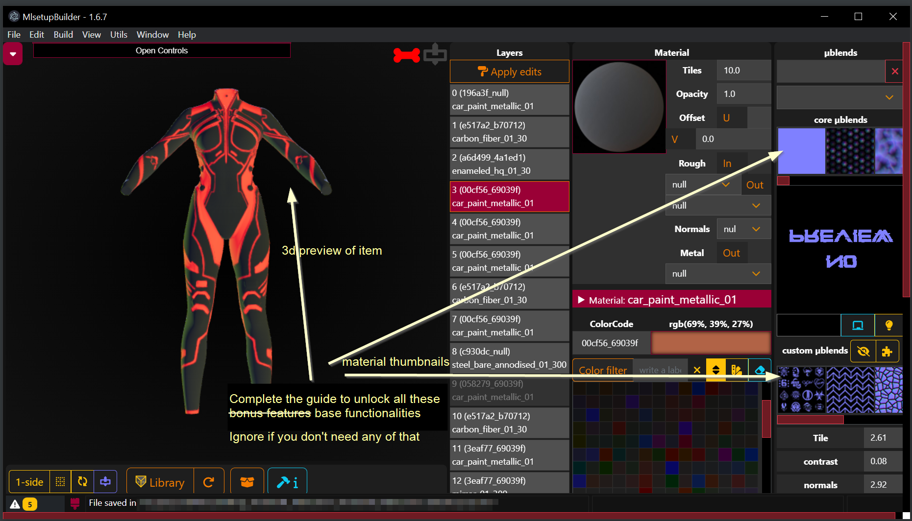
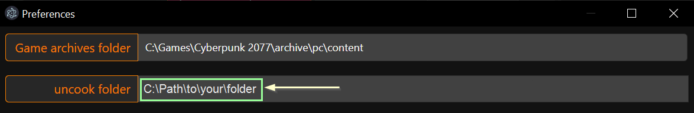
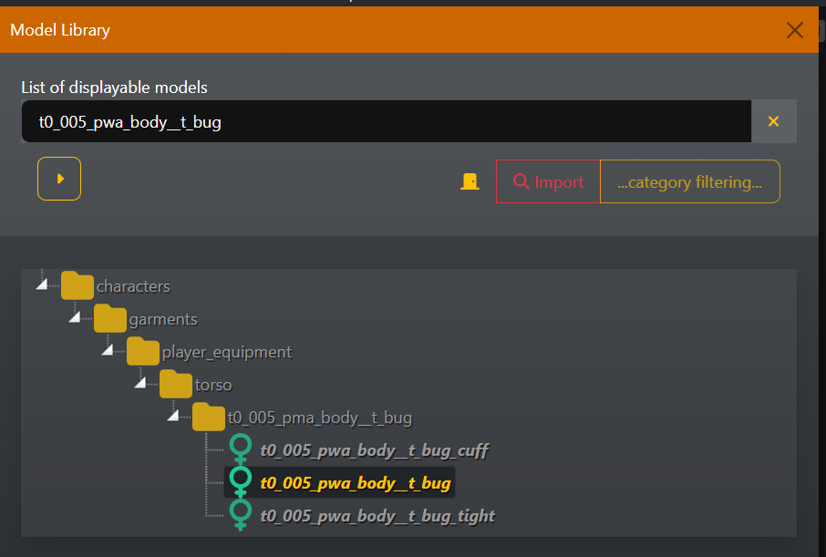
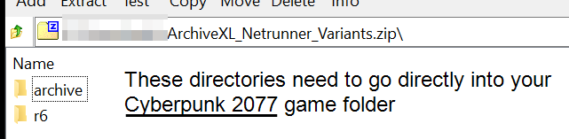

# Recolours and Refits

## Summary 

**Created by @manavortex**\
**Published August 20 2023**


If you just want to change the emissive colour, check [r-and-r-emissive.md](r-and-r-emissive.md "mention")


This will guide you to the process of making your own custom edit of my [Netrunner Suits mod](https://www.nexusmods.com/cyberpunk2077/mods/9314). It has several sections, which you can find linked below (but please check the wiki's navigation tree anyway).

#### **Assumed level of skill**:&#x20;

You know how to read — if you can read and struggle with this guide, then it's not yet good enough. Please reach out to [manavortex](http://127.0.0.1:5000/u/NfZBoxGegfUqB33J9HXuCs6PVaC3 "mention") on the [Redmodding Discord](https://discord.gg/redmodding) so that I can improve it.&#x20;


The steps in this guide teach you how to recolour or refit almost every item in Cyberpunk. Keep reading!


#### **Time to complete:**&#x20;

* Setup:
  * If Wolvenkit is already set up: \~ 5 - 30 minutes for MLSB
  * Full setup: 30 minutes to \~2 hours (most of which you can spend afk)
* Recolouring: 5 minutes once you know how it works, < 1h to get there
* Refits:
  * &#x20;Import Export: 5 minutes once you know how it works,  < 1h to get there
  * Actual refitting: as long as you fucking want >.<


If you are editing modded items, you should **seek permission** first. For your personal use, you can (legally) do what you want, but making mods takes **time and effort**.&#x20;

Please respect mod creators' wishes in that regard.&#x20;

You can check find the standard permissions on a mod's Nexus page, `Description` tab, under the **Permissions and Credit** header right next to the requirements.


### Tools and versions used

<table data-header-hidden><thead><tr><th width="216">Name of program</th><th>version and download</th><th>What is it and why do I need it?</th></tr></thead><tbody><tr><td>Wolvenkit (short: WKit)</td><td>>= 8.9.1 (<a href="https://github.com/WolvenKit/WolvenKit/releases/">stable</a> | <a href="https://github.com/WolvenKit/WolvenKit-nightly-releases/releases/">nightly</a>)</td><td><strong>The</strong> Cyberpunk modding tool — this lets you browse files and pack your custom mod.</td></tr><tr><td>For recolours: MLSetupBuilder (short: MLSB)</td><td>>= 1.6.7 (most recent — see the <a href="https://wiki.redmodding.org/cyberpunk-2077-modding/for-mod-creators/modding-tools/mlsetup-builder">wiki</a>)</td><td>A plugin for Wolvenkit, installed from inside Wolvenkit. You need this to make recolours.</td></tr><tr><td>For refits: Blender</td><td><a href="https://www.blender.org/download/releases/3-6/">3.6</a></td><td>A fully-blown 3d editing software (free and open source). You only need this if you want to do <strong>refits</strong>.</td></tr><tr><td>For refits: Cyberpunk Blender IO suite</td><td><a href="https://github.com/WolvenKit/Cyberpunk-Blender-add-on/releases/tag/1.4.0rc1">1.4.0</a></td><td>Optional, but recommended: the Blender plugin for integration with Wolvenkit</td></tr></tbody></table>

### Skipping and skimming

#### TL;DR

Do not skip or skim anything. Also, if you find a TL;DR block, this sums up all sections until the next header (in this case, until [#overview](./#overview "mention")).

<figure><figcaption>
Don't skim - think of the kitten!
</figcaption></figure>

I'm writing these guides with the minimal amount of fluff and no background information — that will be **linked**, but not **included,** which is the opposite approach from the rest of the internet and the [Lord of the Rings](https://www.reddit.com/r/lotrmemes/comments/om4sso/the\_books\_are\_just\_one\_very\_long\_food\_blog\_post/).&#x20;

The sections are annotated with a rough estimate of how long a total newbie would need. They're guesses, so if you're slightly off, don't worry. If you're _wildly_ off, you might want to get in touch.

If you skip or skim in these guides, you will get in trouble. Unless a section's first paragraph offers you to read on somewhere else, **do not skip**. Don't skim and do _ok it was something like this_. You're supposed to stick to the road, where you won't run into monsters, and the guide will not tell you what to do if you encounter any.

The bright side of this approach is that you **don't need to understand what you're doing** as long as you do what the guide says.

#### Links

You will find two kinds of links. It's usually clearly annotated which is which.1

The first will help you **do something**, leading to other guides on this wiki. They usually link the specific section that you need to complete. Please be thorough here as well, as the rules above apply.

The second contains **background information** and **references** (like "here's how this can look"). They are optional, you can browse or ignore them, and skim all you want.

## Overview


To do this, you must have MLSetupBuilder running at least minimally. If you don't, then please complete the section "[Step 0: Setup](./#r-and-r-step-0-setup)" below.


This guide will walk you through the following steps

1. Doing the [necessary setup](./#r-and-r-step-0-setup)
   * If you already have MLSB working, please read [#netrunner-suit-preview](./#netrunner-suit-preview "mention")!
2. Creating a [Wolvenkit project](r-and-r-your-own-wolvenkit-project.md) with the right files
3. [Editing a colour variant](r-and-r-colour-editing.md) of your choice in MLSB
4. [Refitting the Netrunner suit](broken-reference) to a different body

## R\&R Step 0: Setup

This section will link you to guides for installing Wolvenkit and MLSetupBuilder, which allows you to use the cool preview of which parts of an item you're colouring.

You will also be told how to download and extract the files for the [#netrunner-suit-preview](./#netrunner-suit-preview "mention").

If you have done both, you can skip it and proceed with [creating a Wolvenkit project](r-and-r-your-own-wolvenkit-project.md).

1. [Download and install Wolvenkit](http://127.0.0.1:5000/s/-MP\_ozZVx2gRZUPXkd4r/getting-started/download): You need Wolvenkit on your computer, and you need to be able to start it. Follow the steps in the linked guide until you can open the program.
2. Follow the steps under [Configure Wolvenkit](http://127.0.0.1:5000/s/-MP\_ozZVx2gRZUPXkd4r/getting-started/eli5-getting-started/configure-modding-tools#steps) until you reach `Configure MLSetupBuilder`.
3.  Make a decision if you want to use these features **independently of the Netrunner suit**:

    <figure><figcaption></figcaption></figure>
4. **Yes:** you need to **configure** [**MLSetupBuilder**](../../../modding-tools/mlsetup-builder.md#configuration). Follow the steps on the linked list until you have a full depot, then proceed with [#netrunner-suit-preview](./#netrunner-suit-preview "mention")
   * If you can't set up a depot in MLSB (because computer go brr), you might want to hit up the [Redmodding Discord](https://discord.gg/9wPeb4es) to find help with your problem, or file an issue on github ([Wolvenkit](https://github.com/WolvenKit/WolvenKit/releases/) | [MLSB](https://github.com/Neurolinked/MlsetupBuilder)). You can still use the [#netrunner-suit-preview](./#netrunner-suit-preview "mention").
5. **No:** You have to options now. Please pick one.
   * Partial preview: I've prepared a bunch of files for you. [#netrunner-suit-preview](./#netrunner-suit-preview "mention") will show you where to put them.
   * No preview at all: This will make it harder because you're recolouring blind, but if you're cool with that, you can proceed with [r-and-r-your-own-wolvenkit-project.md](r-and-r-your-own-wolvenkit-project.md "mention").

### Netrunner Suit Preview

In this step, we'll enable custom previews by downloading the files I've prepared and extracting them into MLSB's depot. It should take you no more than five minutes.


The Netrunner suit uses custom multilayer masks. To get an accurate preview in MLSetupBuilder, you **need** to complete this section. &#x20;

You can make recolours blindly by just tweaking the colour values without knowing which parts of the mesh they affect, so you can skip this step and [#install-the-mod](./#install-the-mod "mention"),


#### MLSB's Uncook Folder

This is where MLSB (and Wolvenkit) store the files they extracted.&#x20;

1. Go to [this](https://www.nexusmods.com/cyberpunk2077/mods/9316/) Nexus page. You can find two files here, one with the **modded** multilayer masks, one with the **original** ones
2. Download the archive with the **modded** mlsetup
3. Extract the entire archive into MLSB's **uncook folder**, or drag and drop the `base` folder from inside the archive there. You can find the path in MLSB's settings:

<figure><figcaption>
Find the uncook folder under MLSB's File -> Preferences
</figcaption></figure>

4. Open the Model Library and search for `t0_005_pwa_body__t_bug`.&#x20;

<figure><figcaption>
Interface version MLSB 1.6.7 - 1.6.8 will look different. Select <code>t0_005_pwa_body__t_bug.</code>
</figcaption></figure>

5. Click on the entry. If a 3d model shows up, you're done here and can go on.
6. If no model shows up, select View -> Logs from the taskbar. It will complain about files being in the wrong spot. You need to make sure that the files you downloaded in Step 1 end up in exactly these folders and none other.\
   \
   If the file paths are ending in .dds, open MLSB's preferences and configure it to use pngs instead.

## Install the mod


The tutorial assumes that the mod is installed **manually** rather than via Vortex. If you have already done that, no sweat — it means that a few files might be in different places, and all this is annotated.&#x20;

If you don't want the extra complication, simply deactivate the mod in Vortex and follow the steps below.


#### TL;DR

Extract the downloaded archive directly into your [Cyberpunk 2077 directory](#user-content-fn-1)[^1] and go to [the next section](./#ok-what-now).

#### Detailed instructions

1. Download the mod from [Nexus](https://www.nexusmods.com/cyberpunk2077/mods/9314)
2. Open the downloaded .zip file. You will see something like this:

<figure><figcaption>
This shows the <a href="https://www.7-zip.org/download.html">7zip</a> interface. If you're using a different program, this won't look the same, but the general steps are the same.
</figcaption></figure>

3. These files need to go directly into your [Cyberpunk 2077 directory](#user-content-fn-2)[^2], where they will merge with the existing folders. \
   This is the same directory that contains `REDprelauncher.exe`.
4. **Extract** or **copy** them to that folder. If you're asked to overwrite existing files, click `Yes`.\
   I can't tell you exactly how to do that, because each program works slightly differently. I'll include instructions for 7zip, just in case:
   1. Make sure that either nothing or everything is selected
   2. Click the `Extract` button in the taskbar (it looks like a blue minus)
   3. Find the `Copy To` field and do either of these things:
      1. Paste the path to your [Cyberpunk 2077 directory](#user-content-fn-3)[^3] into the field&#x20;
      2. Click the `…`  button next to the field, navigate to your [Cyberpunk 2077 directory](#user-content-fn-4)[^4] and click OK
   4. Click OK
   5. If you get a `Confirm File Replace` popup, click `Yes to All`.
5. **Optional, but recommended**: Launch the game and make sure that the mod works:
   * Equip a suit in the Atelier Store's preview\
     OR
   * Spawn one via Cyber Engine Tweaks and equip it (e.g. `Game.AddToInventory("Items.mana_netrunner_suit_nylon_black_gold")`)

## OK, what now?

Now that you're all set up, we'll [create a Wolvenkit project](r-and-r-your-own-wolvenkit-project.md).

<figure><figcaption>
Source: Steve Gorton and Tim Ridley, Alexander Hafemann/Getty Images
</figcaption></figure>

[^1]: The folder where you installed the game. Your client (Steam, Epic, GOG) can take you there.

[^2]: The folder where you installed the game. Your client (Steam, Epic, GOG) can take you there.

[^3]: The folder where you installed the game. Your client (Steam, Epic, GOG) can take you there.

[^4]: The folder where you installed the game. Your client (Steam, Epic, GOG) can take you there.

