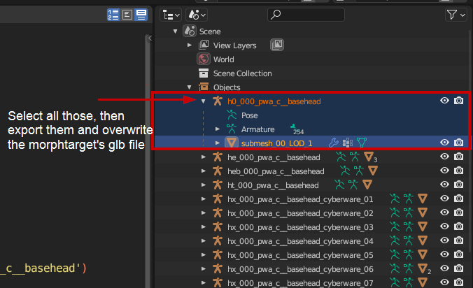

# A new head for V

## Summary

**Created by @manavortex**\
**Published September 30 2023**


This guide is a rough draft. Unlike my other guides, it has not been excessively tested, so you might run into issues. In this case, feel free to hit up  `#mod-dev-chat` on the [redmodding Discord server](https://discord.gg/redmodding), or [sign up](https://app.gitbook.com/invite/-MP5ijqI11FeeX7c8-N8/H70HZBOeUulIpkQnBLK7) and improve it!



If you want to edit other files for V, you may be able to find their paths in [cheat-sheet-body.md](../../references-lists-and-overviews/cheat-sheet-body.md "mention") or one of the surrounding pages.


## Step 0: Prerequisites

* You have [a Wolvenkit project](https://app.gitbook.com/s/-MP\_ozZVx2gRZUPXkd4r/wolvenkit-app/usage/wolvenkit-projects#create-a-new-wolvenkit-mod-project)
* You have downloaded [the NPV example files](https://www.nexusmods.com/cyberpunk2077/mods/8328) from Nexus, as you will need the .blend file from there

## Step 1: Preparing the files


We will do the same thing here as in the guide[npv-preparing-the-head-in-blender.md](npv-v-as-custom-npc/npv-preparing-the-head-in-blender.md "mention"), just that our files will be in a different path. This section will tell you which files to add and where to put the .blend file; for detailed instructions, see the other guide.


1. Look up on [cheat-sheet-head](../../references-lists-and-overviews/cheat-sheet-head/ "mention")-> [#head-file-paths](../../references-lists-and-overviews/cheat-sheet-head/#head-file-paths "mention") where to find the files you need.
2. Add all the files with the corresponding extension to your Wolvenkit project.
3. Export them all via Wolvenkit Export Tool (see [#step-2-exporting-head](npv-v-as-custom-npc/npv-preparing-the-head-in-blender.md#step-2-exporting-head "mention"))
4. In the NPV example files that you downloaded, find the following file:

```
source\raw\tutorial\npv\your_female_character\head
```

6. Copy it to `h0_000_pwa_c__basehead` in your Wolvenkit project's `raw` folder

These steps will become obsolete after the 2.0 update of the NPV example files, but aren't obsolete yet.

7. Open the `.blend` file in Blender. You should now see the script `00_import_files.py`

You're good to go and can proceed to step 2.

## Step 2: Getting the head shape right


If you don't want to apply any shapekeys, you can set their values to 1


1. Follow the [NPV guide](npv-v-as-custom-npc/) until the shapekeys are applied.&#x20;
2. Apply custom edits if you want - see [here](../items-equipment/recolours-and-refits/r-and-r-refitting-step-by-step.md#step-4-refitting) or [here](../../3d-modelling/mesh-sculpting-techniques.md) for tips
3. Go back to the NPV guide and follow the steps until you have run the export script - this will write the `.mesh` files
4. You need to [export the .morphtargets](../../3d-modelling/morphtargets.md#editing-morphtargets) as well. Check the linked section on the [morphtargets.md](../../3d-modelling/morphtargets.md "mention")page for how to do that.
5.  Do that with each armature in the .blend file, overwriting the `.morphtarget.glb` files in the `morphtargets` directory.

    <figure><figcaption></figcaption></figure>
6. Import the files back into Wolvenkit (see the [NPV guide](npv-v-as-custom-npc/npv-preparing-the-head-in-blender.md#step-3-importing-head) and the [morphtargets](../../3d-modelling/morphtargets.md#editing-morphtargets) page as for how)

## Step 3: Testing

If everything has worked, you should now have a broken character creator and a not-broken head. Otherwise, the right place to ask for help is `#mod-dev-chat` on the [redmodding Discord server](https://discord.gg/redmodding).&#x20;

Happy modding!
