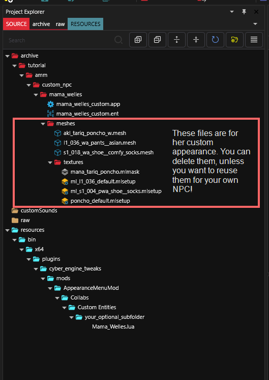
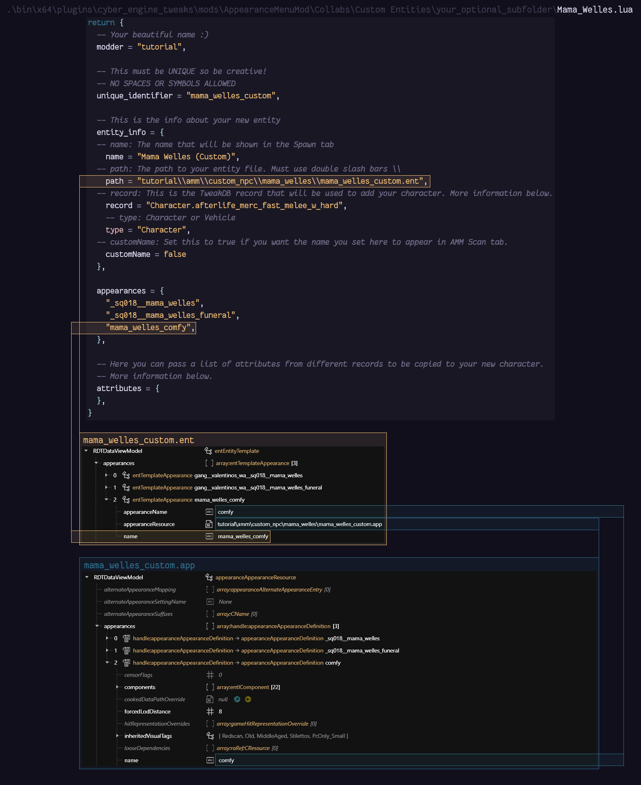

# AMM: Custom NPCs

**Summary**

**Created by @manavortex**\
**Published Nov 27 2023**

This guide will show you how to create fully custom NPCs for AMM.&#x20;

**It has been tested using the following versions:**

* Cyberpunk 2077 game version >= 2.02
* [WolvenKit](https://github.com/WolvenKit/WolvenKit-nightly-releases/releases) >= 8.11.1
* [AppearanceMenuMod](https://www.nexusmods.com/cyberpunk2077/mods/790) >= 2.5.2 and its dependencies
  * [Cyber Engine Tweaks](https://www.nexusmods.com/cyberpunk2077/mods/107) >= 1.28.1
  * [Codeware](https://www.nexusmods.com/cyberpunk2077/mods/7780) >= 1.5.0

## Wait, that's not what I want!

* If you want to create [custom-props](../../everything-else/custom-props/ "mention") instead, check the link.
* If you want to add new appearances to already existing NPCs, check [amm-custom-npc-appearances.md](amm-custom-npc-appearances.md "mention")
* If you want to add V as an NPC, check [npv-v-as-custom-npc](../npv-v-as-custom-npc/ "mention"). (It's a more advanced version of this workflow)

In this tutorial, we're creating a custom entity for Mamá Welles, because right now, she's .app-sharing with all the female Valentinos in the world (`base\characters\appearances\gang\gang__valentinos_wa.app`), and frankly, she deserves better.&#x20;

So we're moving her out of there and setting her up with her own files. We're also giving her a comfy outfit to wear at home.

We will be creating a new character, which we can spawn **in addition to** the regular Mamá Welles. That's because adding appearances to an existing character is simpler, so it has its own guide under [amm-custom-npc-appearances.md](amm-custom-npc-appearances.md "mention").

## Step 0: Setting up

1. Create a [Wolvenkit project](https://app.gitbook.com/s/-MP\_ozZVx2gRZUPXkd4r/wolvenkit-app/usage/wolvenkit-projects) and give it a name that you can remember
2. Download the example project from [Nexus](https://www.nexusmods.com/cyberpunk2077/mods/11268/)
3. Extract the downloaded zip file into your project's root directory (the `source` folders should merge).
4. You should now see the following files:

<figure><figcaption></figcaption></figure>

## Step 1: The files

Any links in this section will go to the NPV guide, which is a more complex version of this guide. You can read the theory and then come back here, or you can go along and find out later.

The archive contains&#x20;

* [#the-.lua-file](../npv-v-as-custom-npc/npv-creating-a-custom-npc.md#the-.lua-file "mention")to tell AMM about our files
* [#the-root-entity](../npv-v-as-custom-npc/npv-creating-a-custom-npc.md#the-root-entity "mention"), which is where we register our appearances with the game (it's a copy of `base\quest\tertiary_characters\mama_welles.ent`)
* [#the-app-file](../npv-v-as-custom-npc/npv-creating-a-custom-npc.md#the-app-file "mention"), which actually contains the appearances (it's a copy of `base\characters\appearances\gang\gang__valentinos_wa.app`)
* … and a bunch of custom meshes for the `mama_welles_comfy` appearance.

When you're making your own NPC, you should make sure to take the root entity from a compatible character — what animation template and which set of facial expressions they use. If you don't know what that means, just look at Takemura-san and Viktor when they walk.

Alright, here's how you go about making changes:

### A different NPC

Read this section if you want to take the example project and mod a different NPC than Mamá Welles. Otherwise, you can check out [#adding-more-appearances](./#adding-more-appearances "mention") below.

1. Find the NPC's `.app` or `.ent` file by using the [Wolvenkit Search](https://app.gitbook.com/s/-MP\_ozZVx2gRZUPXkd4r/wolvenkit-app/usage/wolvenkit-search-finding-files).
2. If you've found an `.app`, use "[find files using this](https://app.gitbook.com/s/-MP\_ozZVx2gRZUPXkd4r/wolvenkit-app/editor/asset-browser#find-files-using-this)" to find the correct `.ent`
3. [Add them both to your project](https://app.gitbook.com/s/-MP\_ozZVx2gRZUPXkd4r/wolvenkit-app/editor/asset-browser#adding-files-to-projects)
4. Replace the .ent and the .app in your project with the NPC's original files
5. Adjust the .lua:&#x20;
   1. `entity_info` => `path` **must** point at your `.ent` file
   2. The list `appearances` I won't repeat it here — this section will only tell you how to change things.  hold entries corresponding to the `name` field in your .ent. This is how AMM populates the dropdown and activates the right appearance:

<figure><figcaption></figcaption></figure>

6. Optional, but recommended: before you start custompathing, change your folder structure. Since this will **break your mod**, can check [#finishing-and-cleaning-up](./#finishing-and-cleaning-up "mention") for how to go about that.

### Adding more appearances

1. In the `.lua` file, add an appearance to the `appearances` array to register it with AMM.
2. In the `.ent` file, open the `appearances` array at the top of the file.
3. Optional, but recommended: Delete all appearances that you don't want, but keep one for the next step.
4. Create a new appearance:
   1. Select an existing item
   2. Right-click and select "[Duplicate item in Array/Buffer](https://app.gitbook.com/s/-MP\_ozZVx2gRZUPXkd4r/wolvenkit-app/editor/file-editor#duplicate-item-in-array-buffer "mention")" from the context menu. This will create an exact copy of your existing appearance.
   3. In the new entry, change the following fields:
      1. `name`: must match the name that you just registered in the `.lua`
      2. `appearanceName`: must match the name that you are going to use in the .app file in step 3.3
5. In the `.app` file, open the `appearances` array at the top of the file.&#x20;
6. Optional, but recommended: Delete all appearances that you don't want, but keep one for the next step.
7. Create a new appearance:
   1. Select an existing appearance
   2. Right-click and select "[Duplicate item in Array/Buffer](https://app.gitbook.com/s/-MP\_ozZVx2gRZUPXkd4r/wolvenkit-app/editor/file-editor#duplicate-item-in-array-buffer "mention")" from the context menu. This will create an exact copy of your existing appearance.
   3. Change the appearance's `name` to the value you used in step 2.3.2

Now it's time to adjust the components. This guide won't go into detail about this — see [appearances-change-the-looks.md](../appearances-change-the-looks.md "mention") for more intel on the process.

## Finishing and cleaning up

If everything is working: Congratulations! You have successfully made a mod!

But before you can share it, you need to do one last thing, which is changing the file structure. Otherwise, everyone will overwrite the same tutorial files, and only one of those mods will work.

You can find a full guide on how to do that [here](../../everything-else/moving-and-renaming-in-existing-projects.md).

