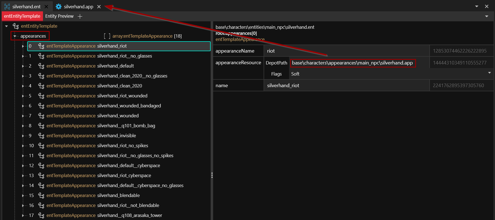
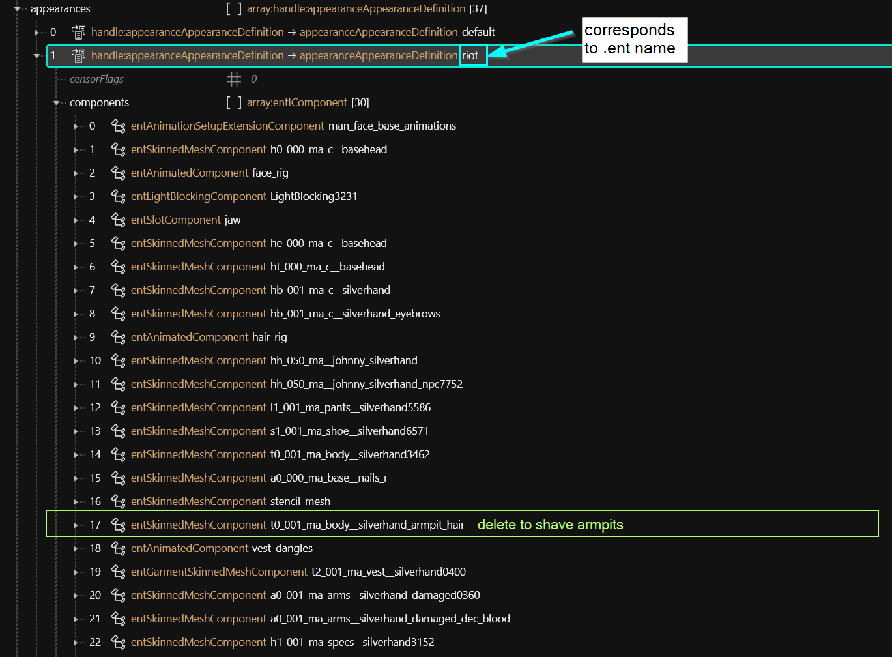
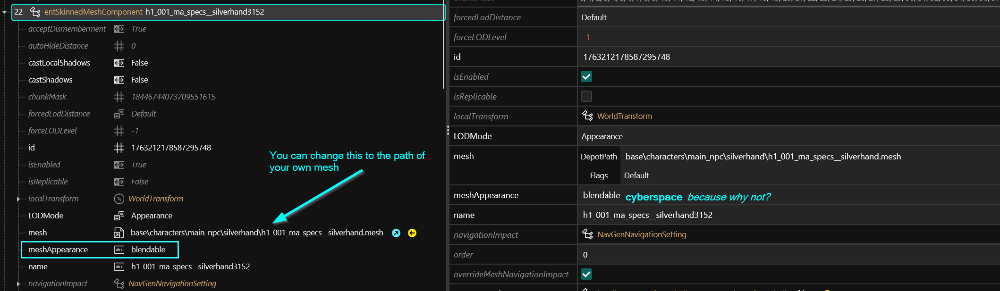
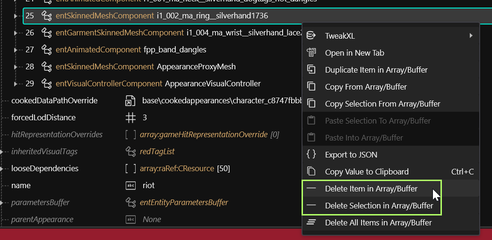
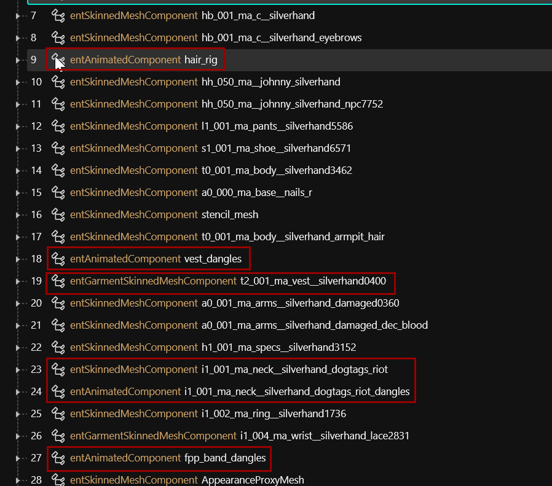
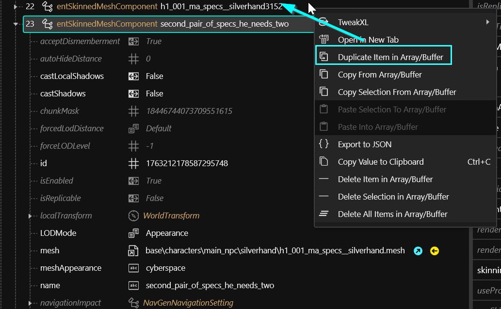
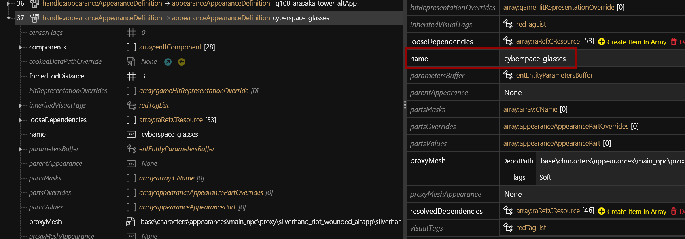

# Appearances: change the looks


If you want to create a custom NPC from scratch, look [here](../community-guides/external-npvs-v-as-npc-custom-npcs.md).

You can find another guide about this linked on the [Community Guides](../community-guides/) page ([direct link)](https://docs.google.com/document/d/1uwfc1IGSuNUAkVeR7esI-7P\_gnzSc8pw0Pq24JEnI2I/edit)


**Created by @manavortex**\
**Published December 27 2022**

This guide will walk you through **editing NPC appearances** for Cyberpunk 2077.

**It uses the following versions:**

* Cyberpunk 2077 game version >= 1.6
* [WolvenKit](https://github.com/WolvenKit/WolvenKit-nightly-releases/releases) >= 8.7.1-nightly.2022-11-04
* (only if you want to add new appearances) [AppearanceMenuMod](https://www.nexusmods.com/cyberpunk2077/mods/790) >= 1.15


Assumed skill level: You're able to read.


## The .ent file

The game's first point of contact is the .ent file. You can find it by searching WolvenKit like this:

```
<npcName>*.ent
```

If you come up blank, try around with variations. E.g., Johnny is "silverhand", Viktor is "ripperdoc".&#x20;


You don't need to add the **.ent** file to your project, unless you want to [add more appearances](appearances-change-the-looks.md#adding-new-appearances).


&#x20;However, the file contains the path to an **.app** file. Find and add it to your project.

<figure><figcaption><p>If you are using <a href="https://www.nexusmods.com/cyberpunk2077/mods/790">Appearance Menu Mod</a>, this list will look familiar.</p></figcaption></figure>


Major NPCs have their own .app files: \
`base\characters\appearances\main_npc\`.&#x20;

Others are not so lucky - e.g., Mamá Welles is lobbed in with the other valentino goons: \
`base\characters\appearances\gang\gang__valentinos_wa.app`


## The .app file

The array **appearances** will contain a list with every appearance that's defined for this NPC, matching the key **appearanceName** in the .ent file.&#x20;


Not all of these have been "published" (as in "hooked up to .ent files"). For an example of this, check `base\characters\appearances\citizen\citizen__children_mc.app`


The only thing you need to care about is the `components` array, where you can add, remove, or modify parts of an NPC's appearance:

<figure><figcaption></figcaption></figure>


The names of components need to (read: "should") be unique so you can [manipulate them outside of the .app file](../items-equipment/influencing-other-items.md#summary).

CDPR's style of unique naming allows us to find components and their usage across the game files, which will come on handy when we're trying to add items.


This is where the magic happens.

## Changing and removing components

**Change** items by selecting a [different appearance](../items-equipment/editing-existing-items/changing-materials-colors-and-textures.md) or a [different mesh](../items-equipment/editing-existing-items/replace-a-player-item-with-an-npc-item.md):

<figure><figcaption><p>Wake up, Johnny! … Follow the white rabbit, Johnny!</p></figcaption></figure>

**Remove** items by deleting their entries from the list:

<figure><figcaption><p>no more ring!</p></figcaption></figure>

### Animations: if you can't avoid them, copy them as well!

Anything of the type `entAnimatedComponent` means that components are **animated**. That's mostly the case for physics-enabled stuff influenced by gravity, such as coats, jackets, or long hair.&#x20;


Physics gave us the atomic bomb. _(It also gave us computers, but this is besides the point right now.)_


Animations are usually unique to meshes on a by-pixel basis and do not react kindly to edits or swaps. (Try splitting the obi from Saburo's kimono into its own submesh if you don't believe me).&#x20;

If you copy an animated component (e.g. Johnny's vest), then you need to copy the corresponding `entAnimatedComponent` as well, or the mesh won't move.

<figure><figcaption><p>Any of these are an indicator that there is TROUBLE</p></figcaption></figure>


If you delete a physics-enabled component, you can safely delete the corresponding AnimatedComponent.&#x20;


## (Safely) adding components


If you want to exchange an NPC's hair, check [here](npv-v-as-custom-npc/npv-creating-a-custom-npc.md#hair).


The obvious thing to do if you want to add a new item is to duplicate another component and then act as if it was just another change:

<figure><figcaption><p>This is usually safe, as long as you are sticking to <strong>entSkinnedMeshComponent</strong>s.</p></figcaption></figure>

And this might work. Or it might end up leaving them standing in an exploded pixel cloud. In case of animated components, editing them will almost certainly break them.


Anything of the type `entGarmentSkinnedMeshComponent` will not take kindly to manipulation.


In that case, you need to browse the files for any occurances of the component you want to add and copy the relevant components. For example, if you want to put Johnny into a different kind of vest, this is how you'd go about it:&#x20;

1. Search for the mesh name of the vest that you want to use (e.g. `ma_vest__high_collar*.mesh`)
2. Select the mesh, then "find files using this": \
   &#x20;\
   If you run into an error, make sure that you have the "Wolvenkit Resources" plugin installed!I
3. Find an .app file that looks promising - for example Scorpion's: \
   \
   Open it without adding it to the project (you don't need the file).&#x20;
4. Find and select the components in the other NPC's appearance list:\
   
5. Select "Copy Selection From Array/Buffer"
6. Go back to your original .app file and select either the "components" array or any component inside it. Now right-click and select "Paste Selection From Array/Buffer".\
   &#x20;
7. If you haven't done that yet, delete the original component(s) and animations:\
   


Save the .app file, pack your mod, and go testing!


## Adding new appearances


This part of the guide requires [Appearance Menu Mod](https://www.nexusmods.com/cyberpunk2077/mods/790)


Adding a new appearance to AMM requires you to register it in three files:&#x20;

1. the .lua
2. the .ent
3. the .app

If you are using HotReload, don't forget to "reload all mods" to make AMM pick up the changes in the script.

### The .lua file

To tell AMM about your new appearances and make them available, you have to create a LUA file in the following folder: `Cyberpunk 2077\bin\x64\plugins\cyber_engine_tweaks\mods\AppearanceMenuMod\Collabs\Custom Appearances`. Let's call it `AMM_JohnnyTutorial.lua`.

Give it the following content:&#x20;

```lua
return {
  modder = "tutorial",
  unique_identifier = "tutorial_johnny_appearances",
  entity_id = "0x5E611B16, 24",
  appearances = {
    "cyberspace_glasses",
    "fluffy_socks",
  },
}
```


The entity\_id is unique for each NPC and tells AMM which file to load.


You can find the correct entity ID by looking at the character with AMM: \



If the NPC doesn't yet exist, you can create a custom entity. For an example file, check one of [these](https://www.nexusmods.com/cyberpunk2077/mods/6111/?tab=posts\&BH=0) [mods](https://www.nexusmods.com/cyberpunk2077/mods/6680)_._&#x20;


Now, we have to hook up the new appearances.

### The .ent file

Find the .ent file that you've identified in the [first step of this guide](appearances-change-the-looks.md#the-.ent-file), and add it to your WolvenKit project. Open it, then duplicate the last item in the appearances array. Now, change the new entry to match your custom appearance:

|                |                                 |
| -------------- | ------------------------------- |
| appearanceName | cyberspace\_glasses             |
| name           | silverhand\_cyberspace\_glasses |

<figure><figcaption><p>leave the rest alone, unless you know what you're doing</p></figcaption></figure>

### The .app file

In the app file, duplicate one of the already existing appearances, and change the name of the new item to the one you specified in the .ent file:\


<figure><figcaption><p>You can now change components around as <a href="appearances-change-the-looks.md#changing-and-removing-components">specified above</a>!</p></figcaption></figure>


Congratulations — that's it! Install your mod and go testing!


## Troubleshooting

### My new component won't move at all!

You may have forgotten to copy the animation file. Look for an **entAnimatedComponent** inside the .app — they're usually called something like `xxx_dangle(s)` or `collar.`[ (See here)](appearances-change-the-looks.md#animations-if-you-cant-avoid-them-copy-them-as-well)

### I added an appearance, but a random one is showing when I select it

That's what happens when the game can't find the appearance you picked. You're probably trying to add an AMM appearance. Check the spelling between your lua file with the appearance name, the mapping entry inside the .ent, and the appearance's name in the .app file.


#### For further troubleshooting steps, see [here](../../3d-modelling/troubleshooting-your-mesh-edits.md).
