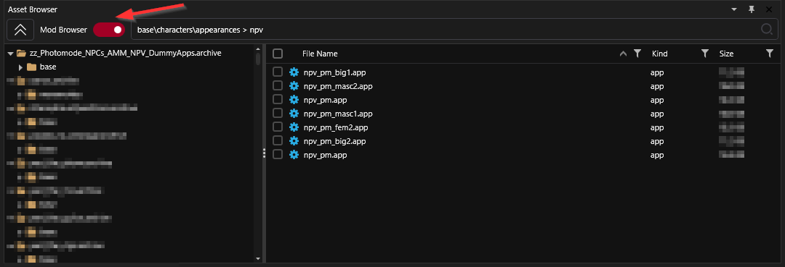
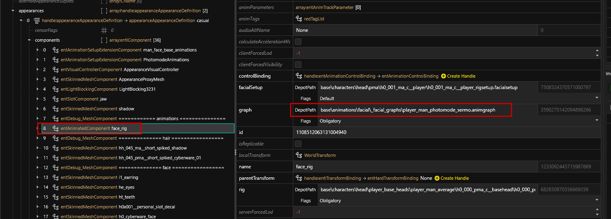

# NPV: AMM Nibbles Replacer

This guide is part of the guide for creating an [.](./ "mention"). It will teach you how to make your NPV compatible with xBaebsae's awesome [Nibbles to NPCs 2.0](https://www.nexusmods.com/cyberpunk2077/mods/8125) mod, letting you use your NPV in the game's photo mode.

## Requirements:

|                                                                          | minimum version                              |
| ------------------------------------------------------------------------ | -------------------------------------------- |
| [AppearanceMenuMod](https://www.nexusmods.com/cyberpunk2077/mods/790)    | the latest version compatible with your game |
| [Nibbles to NPCs 2.0](https://www.nexusmods.com/cyberpunk2077/mods/8125) | >= 3.5                                       |
| an NPV as per [the tutorial](./)                                         |                                              |


You can find the original instructions in the [mod description](https://www.nexusmods.com/cyberpunk2077/mods/8125) under **Creating an NPC+/NPV Replacer** inside the spoiler tags.


## Compatibility: NPV < 2.0.0

For NPV projects >= v2.0.0 (30. October 2023), you can skip to [#the-photo-mode-.app-file](npv-amm-nibbles-replacer.md#the-photo-mode-.app-file "mention").

For earlier versions, or if you have not been using the example project, you need to add the photo mode animations component.&#x20;

Download Wkit Project - NPC App from the mod's [optional files](https://www.nexusmods.com/cyberpunk2077/mods/8125?tab=files).&#x20;

<details>

<summary>If you don't care about the expression pack</summary>

you can also lift the component from Johnny's photo mode app file:&#x20;

```
base\characters\appearances\main_npc\silverhand_photomode.app
```

If you're doing that, then the component you need will be near the bottom of the appearance.

</details>

1. In the .app file, open the first appearance
2. Open the `components` array
3. Find the `entAnimationSetupExtensionComponent` with the name of `PhotomodeAnimations`&#x20;
4. Copy it to each appearance in your NPV's .app file.

## Step 1: The photo mode .app file

You enable the feature by overwriting the dummy .app file for your chosen NPV. Instead of looking up the path in the [mod description](https://www.nexusmods.com/cyberpunk2077/mods/8125?tab=description), we're lazy and overwrite the template file, which we find in the [Mod Browser](https://app.gitbook.com/s/-MP\_ozZVx2gRZUPXkd4r/wolvenkit-app/editor/asset-browser#mod-browser) by using the following [search query](https://app.gitbook.com/s/-MP\_ozZVx2gRZUPXkd4r/wolvenkit-app/usage/wolvenkit-search-finding-files):

```
base\characters\appearances > npv
```


If you don't find those files, your [AMM Nibbles Replacer](https://www.nexusmods.com/cyberpunk2077/mods/8125) isn't installed correctly. You'll want to fix this before proceeding.


<figure><figcaption></figcaption></figure>

Find the file that you want to use, and [add it to your project](https://app.gitbook.com/s/-MP\_ozZVx2gRZUPXkd4r/wolvenkit-app/editor/asset-browser#adding-files-to-projects).


If a file name shows up more than once, you already have an NPV with photo mode replacer support installed. In that case, you'll want to pick the other file — there are two for each body type.&#x20;

Adding support for more than two .app files requires you to edit both the photo mode replacer and AMM, so it won't be covered in this tutorial.


## Step 2: Overwrite the file

Instead of the dummy file, you will want to put **your own app file** there. You can copy the file by holding the `ctrl` key while dragging in the Wolvenkit Project Browser.

<details>

<summary>Can I move my file instead?</summary>

No, you can't do that, because the photo mode expressions are using a different graph for the facial setup. CDPR solved that by pulling in different entity files, but (for now) we can't do that, so we have to have duplicate files.

</details>

## Step 3: Appearance names

The photo mode replacer assumes that your appearances will be named like this:

```
appearance_01
appearance_02
…
appearance_100
```

For the sake of clarity, the NPV appearances are not named this way. Open the photo mode .app that you copied in the previous step, and change the names of your appearances.

<details>

<summary>I don't want the numbers, can I keep my names?</summary>

In theory, yes. In practice, you'd have to edit both AMM and the Nibbles Replacer, so the answer is probably no.

</details>

## Step 4: Changing the facialsetup graph

1. For each appearance definition in In your photomode .app file, find the component with the name `face_rig`.
2. Make sure that the `depotPath` is of the `graph` is set to the correct `.animgraph` depending on your body gender:

<pre><code><strong>/base\animations\facial\_facial_graphs\player_woman_photomode_sermo.animgraph   
</strong>base\animations\facial\_facial_graphs\player_man_photomode_sermo.animgraph
</code></pre>

<figure><figcaption></figcaption></figure>

3. Save the file. You now have photo mode expressions, but no more AMM expressions. Can only have one…

## Step 5: Pack and test

After you have changed the appearance names and saved the file, you can [install and launch](https://app.gitbook.com/s/-MP\_ozZVx2gRZUPXkd4r/wolvenkit-app/menu/toolbar#install-and-launch) your Wolvenkit project.&#x20;

Before entering photo mode, select the correct replacer in AMM:&#x20;

1. Open the AMM overlay
2. Switch to Settings -> Photomode Nibbles Replacer
3. Select the correct replacer corresponding to your file

## Step 5 (optional): Edit pose packs


The paths that you need to replace are in the [mod description](https://www.nexusmods.com/cyberpunk2077/mods/8125) under **Adding your Pose Packs to Nibbles Replacer** inside the spoiler tags. For your convenience, there's a duplicate in the expandable box below. If that's not working, please check the mod description!


To add more compatibility to a pose pack, you only have to edit the mod's .xl file, which you can do with a text editor. An entry looks like this:

```yaml
  - entity: base\characters\entities\photomode_replacer\photomode_npc_woman_average.ent
    set: manavortex\animations\quality_time\pwa.anims
```

There might be one or multiple entries for each supported `.ent` file. Find out which entry or entries belong together, then **duplicate** them and replace the paths with the one to your NPV replacer's .ent file.


Make sure that you keep the indent at the beginning (the number of spaces) exactly the same as it is for the other entries, or the file will break. If that happens, you'll see an entry in the [ArchiveXL log file](#user-content-fn-1)[^1] .

To make sure that your file is okay, run it through [yamllint](https://www.yamllint.com/).


<details>

<summary>.ent file paths</summary>

This is **a copy** for your convenience. If the paths below aren'Ät working, please check the [mod description](https://www.nexusmods.com/cyberpunk2077/mods/8125) under **Adding your Pose Packs to Nibbles Replacer** inside the spoiler tags.

```
base\characters\entities\photomode_replacer\photomode_npc_woman_average.ent
base\characters\entities\photomode_replacer\photomode_npc_man_average.ent
base\characters\entities\photomode_replacer\photomode_npc_man_big.ent
base\characters\entities\photomode_replacer\photomode_npc_npv_fem1.ent
base\characters\entities\photomode_replacer\photomode_npc_npv_fem2.ent
base\characters\entities\photomode_replacer\photomode_npc_npv_masc1.ent
base\characters\entities\photomode_replacer\photomode_npc_npv_masc2.ent
base\characters\entities\photomode_replacer\photomode_npc_npv_big1.ent
base\characters\entities\photomode_replacer\photomode_npc_npv_big2.ent
```

</details>

## Troubleshooting

### (Most of) my NPV isn't moving in photo mode!

Force a refresh - select a different pose.&#x20;

If that isn't working, refresh the appearance:&#x20;

1. Open the AMM overlay
2. Switch to the Tools tab
3. Click the `Target Replacer` button
4. In the `scan` tab or the target tools, assign a different appearance. You can switch back right away.


[^1]: Cyberpunk 2077\red4ext\plugins\ArchiveXL\ArchiveXL.log

