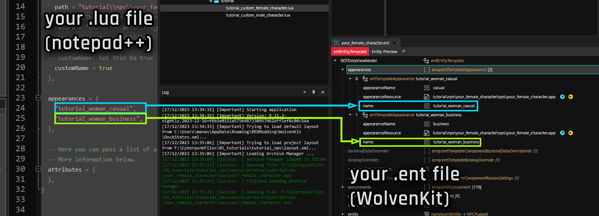

# NPV: Cleanup and troubleshooting

## Re-path your folder

Why are we doing this?

When **packing** a mod, Wolvenkit generates an .archive file with the files in your project's `source` folder. The problem here is that each file can only be **modified once**.&#x20;

Assume both you and your friend make an NPV. They made Alice, you are making Bob. And because your friend was lazy, they didn't complete this step. And since their project is called `Alice_NPV.archive`,  none of your changes will even show!

That's why you'll have to re-path your folder. If you don't, you will ruin someone's day.

You need to **re-name the template folders**. Unless you want to make more NPVs, it will be enough to re-name `tutorial` to `your_username`. Find a full guide to the process under [moving-and-renaming-in-existing-projects.md](../../everything-else/moving-and-renaming-in-existing-projects.md "mention").

## My NPV doesn't show!

Read [#why-are-we-doing-this](npv-cleanup-and-troubleshooting.md#why-are-we-doing-this "mention") in the [#re-path-your-folder](npv-cleanup-and-troubleshooting.md#re-path-your-folder "mention") section: make sure to disable all other NPVs.

## My NPV loads, but I'm getting a random appearance!

That happens when you're loading an appearance that the game doesn't know about — the problem is between your .lua file and your root entity. The names must match exactly, and must contain not typos or leading/trailing spaces.

<figure><figcaption></figcaption></figure>

If that was not it, double-check the `path` in your lua file and make sure that it points to the correct .ent file, and not to a backup or backup project.&#x20;


This particular problem is **always** between those two files. Other mistakes will have other effects.


## I'm getting errors in Wolvenkit!


You can check the [Troubleshooting](https://app.gitbook.com/s/-MP\_ozZVx2gRZUPXkd4r/getting-started/troubleshooting "mention")page on the Wolvenkit wiki.


#### It installs, but doesn't launch

Just install the mod via WKit, launch Cyberpunk the way you normally do.

