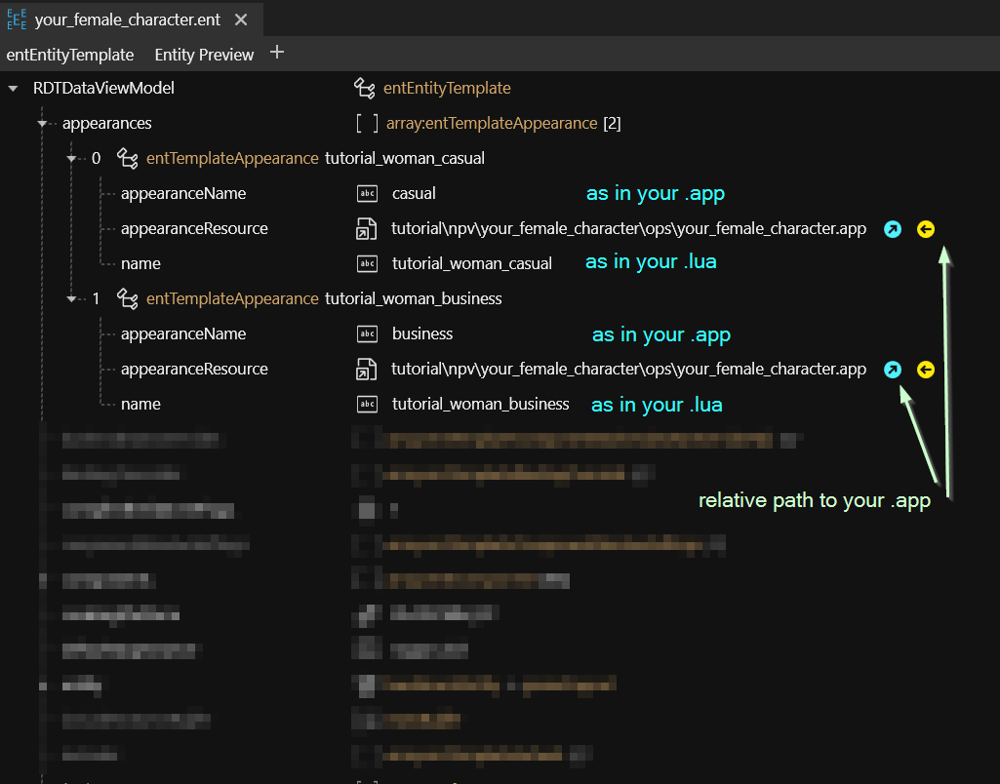
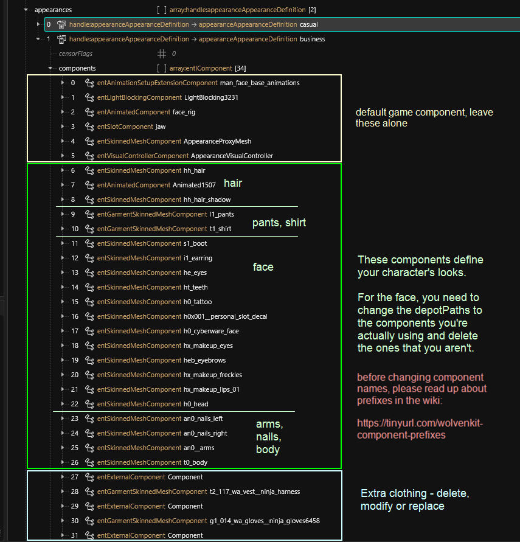
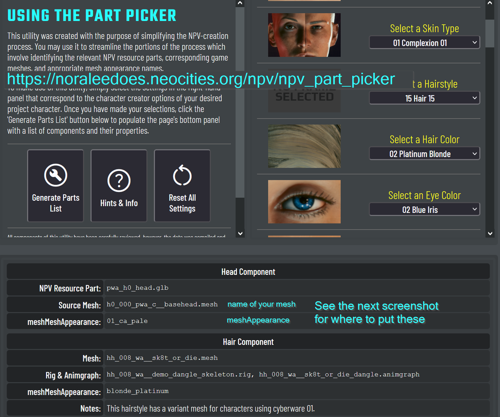
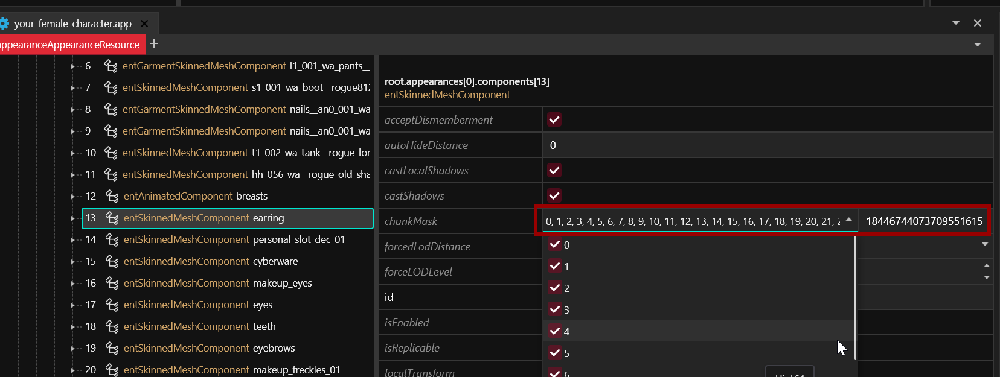
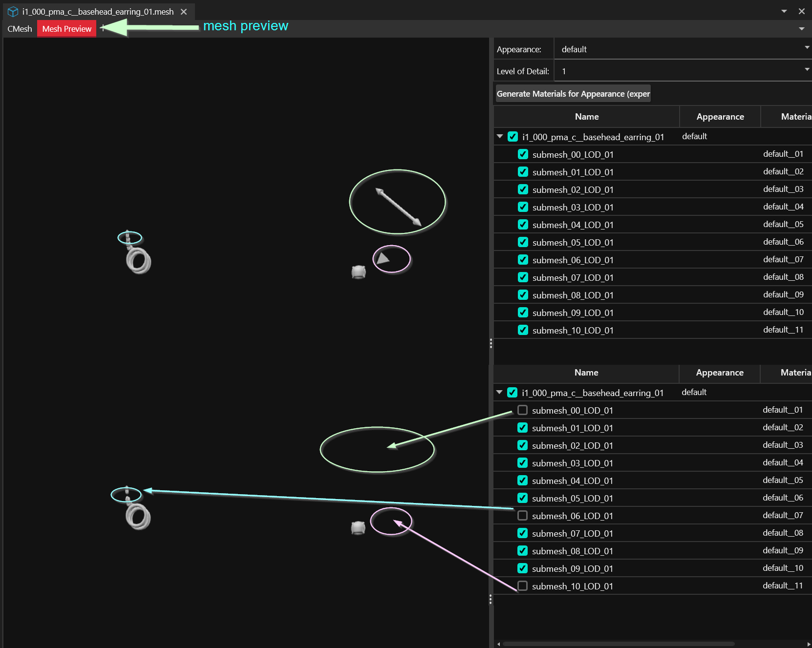
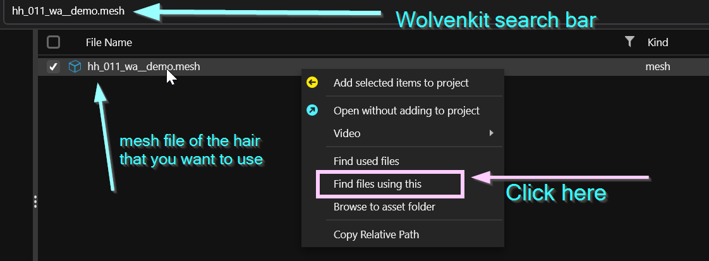
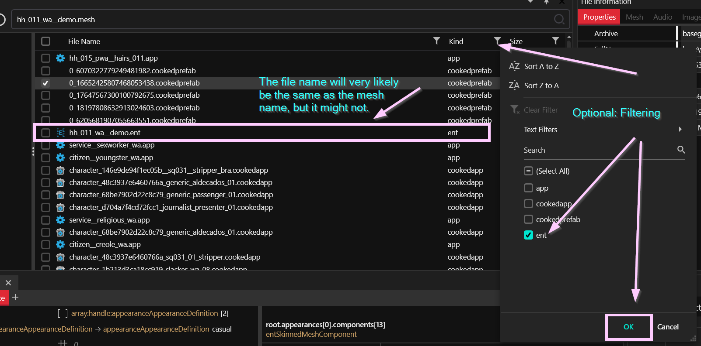
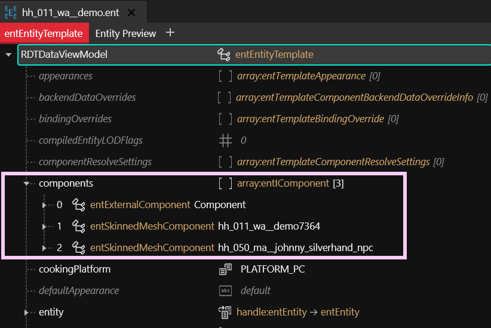

# NPV: Creating a custom NPC

## Summary

**Created by @manavortex**\
**Published May 13 2023**


As much of the information here has been documented in [other guides](../appearances-change-the-looks.md), the information below will be kept initially brief. Might write more to a later point, but there is a lot of documentation already.


This page is a part of the [NPV guide](./). It will show you how to use the [provided example project](./#preparation) to create a custom NPC for Cyberpunk 2077, whom you can then spawn with AppearanceMenuMod.


This guide assumes that&#x20;

* you already have a head mesh (see [this section](npv-preparing-the-head-in-blender.md) otherwise)
* that you're using a set of default paths (if not, read the last paragraph of this box)
  * the corresponding files are in either of these folders\
    `tutorial\npv\your_female_character\head` \
    `tutorial\npv\your_male_character\head`
  * the meshes are named like their in-game equivalents, e.g. `h0_000_pwa_c__basehead.mesh`

It's not a problem if you use your own custom paths, although it is easier to [change it at the end](../../everything-else/moving-and-renaming-in-existing-projects.md). If you decide to go for it, keep in mind that your paths are different and that you need to put different values into the provided .ent and .app file.



At any time during the tutorial, you can **install** the Wolvenkit project (Wolvenkit has a button in the toolbar) and spawn **Tutorial Man** and **Tutorial Woman** via AMM to check out your progress.


## Skipping and skimming

This guide contains as little fluff as possible. Extra information&#x20;

## The .lua file

We're registering our NPC with AppearanceMenuMod via a .lua file, which needs to end up in AMM's `Custom Entities` folder. The full path in the Cyberpunk directory will be this:

`bin\x64\plugins\cyber_engine_tweaks\mods\AppearanceMenuMod\Collabs\Custon Entities`

I have prepared two example files in the Wolvenkit's project's `resources`. Delete the one that you aren't using, then let's take a look at the other one:

`tutorial_custom_female_character.lua`

`tutorial_custom_male_character.lua`

### The file structure

This is the file content for the female example:

```lua
return {
  -- Your beautiful name :)
  modder = "tutorial",

  -- This must be UNIQUE so be creative!
  -- NO SPACES OR SYMBOLS ALLOWED
  unique_identifier = "tutorial_female_character",

  -- This is the info about your new entity
  entity_info = {
  -- name: The name that will be shown in the Spawn tab
    name = "Tutorial Woman",
  -- path: The path to your entity file. Must use double slash bars \\
    path = "tutorial\\npv\\your_female_character\\ops\\your_female_character.ent",
  -- record: This is the TweakDB record that will be used to add your character. More information below.
    record = "Character.afterlife_merc_fast_melee_w_hard",
  -- type: Character or Vehicle
    type = "Character",
  -- customName: Set this to true if you want the name you set here to appear in AMM Scan tab.
    customName = true
  },

  appearances = {
    "tutorial_woman_casual", 
    "tutorial_woman_business", 
  },  

  -- Here you can pass a list of attributes from different records to be copied to your new character.
  -- More information below.
  attributes = {
  },
}
```

It loads our [root entity](npv-creating-a-custom-npc.md#the-root-entity) from  `tutorial\npv\your_female_character\ops\your_female_character.ent`. That's the file which tells the game what to load.


You can and should change this file — see the inline documentation above for what to change.


## The root entity

You find the root entity for your character here:

```
tutorial\npv\your_female_character\ops\your_female_character.ent
tutorial\npv\your_male_character\ops\your_male_character.ent
```


[Would you like to know more?](../../../files-and-what-they-do/entity-.ent-files.md#root-entity)


The root entity hooks up your .app file and the appearance names in the .lua file, and that's about everything there is to say about it. Here's how it looks:

<figure><figcaption><p>Adjust entries as needed. If you want to </p></figcaption></figure>


If you want to add more appearances:

* duplicate an existing entry
* change the last key `name` to match the one in your .lua
* change the first key `appearanceName` to the one you want to put in your `.app`


Let's look at the .app file now.

## The app file

This section will tell you how to edit your NPV's appearance – their skin colour, chrome, piercings, tattoos. We will do this in the .app file.


When changing component names, you want to leave the [#component-prefixes](../../../3d-modelling/garment-support-how-does-it-work.md#component-prefixes "mention") (t1\_) in place — the game needs them to calculate collisions!


This is where all of your NPC's appearances are defined (`appearanceDefinition`,  linked to the root entity via `name`). The appearanceDefinition's components **define** your NPV's properties, pulling in equipment, facial expressions, hair and skin.


[Would you like to know more?](../../../files-and-what-they-do/appearance-.app-files.md)


It looks like this:

<figure><figcaption><p>Before renaming </p></figcaption></figure>


The next section, [#how-do-i-know-what-to-put](npv-creating-a-custom-npc.md#how-do-i-know-what-to-put "mention"), will help you find the right appearance names.

If you feel completely lost, you can read up on [how to change NPC appearances](../appearances-change-the-looks.md) – the concept is exactly the same.



If you want to add another appearance

* duplicate an existing entry
* change the key `name` to match the one in your root entity
* change the components


### How do I know what to put?

To find out which variants and appearances to use, I suggest that you use NoraLee's excellent [NPV Part Picker](https://noraleedoes.neocities.org/npv/npv\_part\_picker). It will look like this:

<figure><figcaption><p>Find it at <a href="https://noraleedoes.neocities.org/npv/npv_part_picker">https://noraleedoes.neocities.org/npv/npv_part_picker</a></p></figcaption></figure>


The NPV picker does this for you, but here's how to select your eyebrow appearance by hand:

* &#x20;open up the mesh file and expand the first list `appearances`
* see a bunch of entries with naming schemas like `colour_01`
* the numbers correspond with the type of eyebrow in the character editor (look them up [here](../../../references-lists-and-overviews/cheat-sheet-head/hair.md))
* Select the correct colour and appearance number


### Customizing Cyberware


If you skip this step, you will end up with invisible cyberware or the wrong colour/appearance.


When selecting a different cyberware than the preconfigured one, you **have** to set the appearance name, or the whole thing will show up in grey. The appearance names are usually identical to the cyberware (`cyberware_01`, `cyberware_02` etc.), but if you are uncertain, you can also open the mesh file and check the `appearances` list at the top.

### Customizing piercings and chrome: Chunkmasks


If you skip this step, you will end up with the wrong or too many piercings and cyberware.


You have the full piercing or cyberware file, but you're only using parts of it — yet the game stubbornly shows you the whole mesh.&#x20;

Fortunately, you don't have to edit it in Blender, because you can hide the parts you aren't using via chunkmasks. \
Find the `piercing` or `cyberware` component in your `.app` file:

<figure><figcaption><p>This is where you can turn off submeshes</p></figcaption></figure>

#### How do I know which numbers to put?

You can see that inside the .mesh file (which you can see in the component's `depotPath`). Open it in Wolvenkit, then switch to the `Mesh Preview` tab and toggle the checkboxes on the right; those directly correspond to the boxes you need to uncheck in the `.app` file:

<figure><figcaption><p>Here we see the indices of these three submeshes: this is what we need to uncheck in the .app file</p></figcaption></figure>

To hide those bits in the .app, we simply need to uncheck the corresponding boxes - check the previous screnshot!

## Hair

This section will teach you how to add another hair mesh to your NPV. We will first remove the default hair, then replace it with the one you want.


To use modded hair, find the correct files [inside the mod](../../../modding-cyberpunk-2077/analysing-other-mods.md) and add them to your project.


1. Delete the current hair from the .app — there should be 2-3 components, their names will start with either `hair_` or `hh_0`
2. Find the correct hair mesh. You have three options for this:
   1. Looking it up on [our nifty list](../../../references-lists-and-overviews/cheat-sheet-head/hair.md#name-in-files-by-index)
   2. Using [NoraLee's NPV Part Picker](https://noraleedoes.neocities.org/npv/npv\_part\_picker)&#x20;
   3. Filtering the files and clicking through their previews: \
      female: `base\characters\common\hair > wa_ > .mesh > !shadow`\
      male: `base\characters\common\hair > ma_ > .mesh > !shadow`
3. Enter the name of the hair mesh that you want to use into the Asset Browser's search bar (see next screenshot) and hit Return.
4. Once you have found the correct mesh file, right-click it and select "Find Files Using This":

<figure><figcaption></figcaption></figure>

4.  This will give you a list of files, which you can mostly ignore. The only thing we care about is the hair's `.ent` file:

    <figure><figcaption><p>This is how you find the hair's .ent file</p></figcaption></figure>
5.  Open the `.ent` file and expand the `components` array. You will find three components in there, which you can now copy over to your `.app`!

    <figure><figcaption><p>Copy these and move them over to your .app</p></figcaption></figure>

### And that's the gist of it!

Go forth and create custom apperances!&#x20;

You can [check this guide](../appearances-change-the-looks.md), or look through the .app files for other NPCs for ideas. If you need further details, I highly recommend checking out NoraLee's [much more detailed tutorial](https://docs.google.com/document/d/1clFJhpi7H5jk73vUQPnjIwjkuQV6VnYkKMoXt1eYMb0/edit), which will also give you all the context you could possibly need.

For guides on how to export a whole animated character to Blender, you can check [here](https://wiki.redmodding.org/wolvenkit/guides/modding-community/exporting-to-blender/exporting-rigs-and-anims).&#x20;


Please remember that **before sharing your NPV**, you **have** to change the paths! You can find a full guide on the fastest way to do that [here](../../everything-else/moving-and-renaming-in-existing-projects.md).



Don't forget, you can **pack** the Wolvenkit project by pressing the green button in Wolvenkit's toolbar, spawning `Tutorial Man` and `Tutorial Woman` via AMM to check out your progress.

