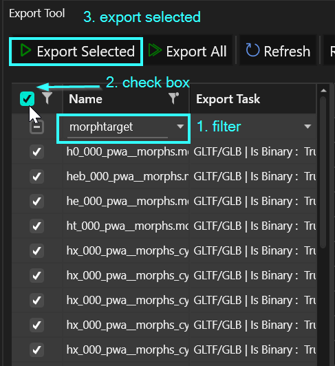
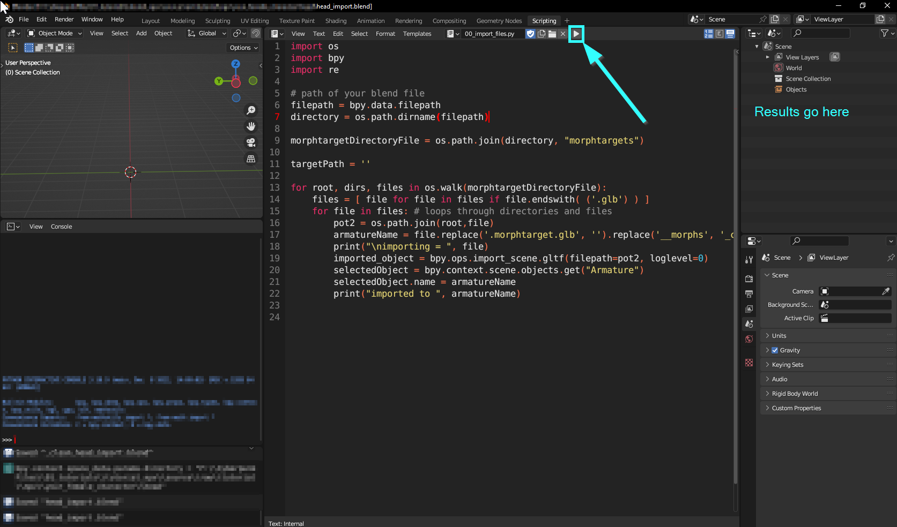
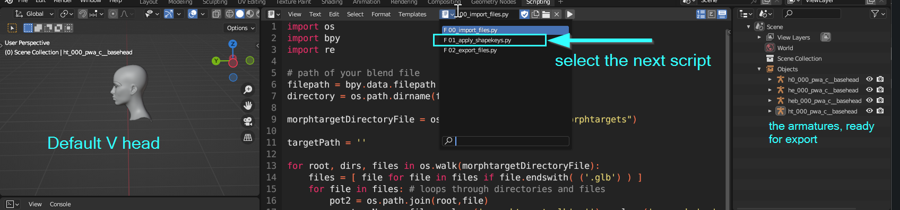
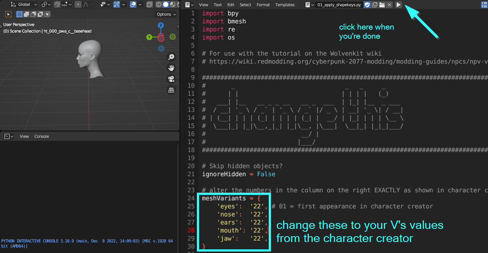
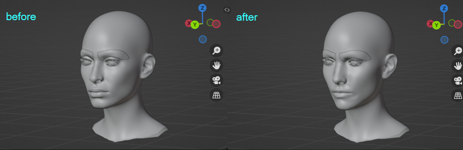
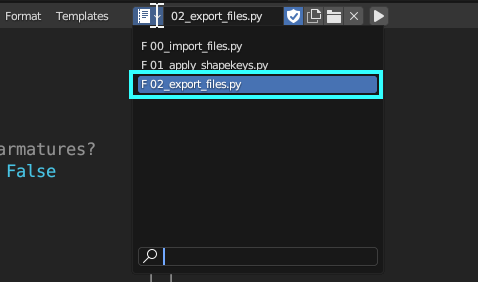

# NPV: Preparing the head in Blender

**Created by @manavortex**\
**Published May 13 2023**


This page is a part of the [NPV guide](./). It will show you how to create your V's head in Blender.&#x20;

You need the **prepared Wolvenkit project**, which is linked on the [main page](./#preparation).


## Step 1: Getting head

1. Open the `head` folder
   1. **Optional:** Be confused and/or panic about why there are over 9000 files.&#x20;
2. Look into the `head/morphtargets` folder
   1. **Optional:** Be confused and/or panic about why there are over 9000 files **again**.&#x20;
3. Delete all those files that you aren't using (read on as for how)


**It's too many of them!**

True! That's because I included all options for any given V. After you have deleted the ones that you won't be using, you should be left with a maximum of **7** files for female V and 8 files for male V.


I have included all meshes and morphtargets from the game files. We'll now thin out the options.

### The convenient option


The best and most convenient tool for the job is [NoraLee's NPV picker](https://noraleedoes.neocities.org/npv/npv\_part\_picker). It will give you a list of files that you need to keep.&#x20;

The list will give you a number of **Source Mesh** entries like `h0_000_pwa_c__basehead.mesh`.&#x20;

You need to keep these files inside the `head` folder and the `.morphtarget` file in the subfolder `morphtargets`. If you want to understand why, keep reading; otherwise, you can proceed to [Deleting Files](npv-preparing-the-head-in-blender.md#deleting-files).


### What the actual fuck are all these files?


If you don't care and just want to know what to delete, go [here](npv-preparing-the-head-in-blender.md#deleting-files).


#### Meshes vs Morphtargets

We actually only care about the mesh, since that is the file we'll be loading. But because of the customization options, we also need the morphtargets, which will deform the meshes dynamically.&#x20;

For our NPV, we won't do anything dynamic. We will apply the morphtargets in Blender and then never use them again, but I have included them in the files **for the sake of transparency**.

#### Okay, and all those numbers?

The different variants in the character creator correspond to the different meshes. For example, if you select cyberware 3 in the character creator, the mesh that will get loaded is `cyberware_03`. Not so difficult, is it?

Here's what the prefixes mean:

|       |                                                                                                                                         |
| ----- | --------------------------------------------------------------------------------------------------------------------------------------- |
| h0\_  | head (with ears)                                                                                                                        |
| hb\_  | male V only: beard                                                                                                                      |
| heb\_ | eyebrows                                                                                                                                |
| he\_  | eyes                                                                                                                                    |
| ht\_  | teeth                                                                                                                                   |
| hx\_  | <p>applied on top of h0: </p><ul><li>cyberware</li><li>makeup</li><li>freckles</li><li>pimples</li><li>tattoos</li><li>scars </li></ul> |
| l1\_  | ear ring (01-04)                                                                                                                        |

### Finding the right piercing


If your V isn't using any piercings, you can skip this step and go directly to [Deleting Files](npv-preparing-the-head-in-blender.md#deleting-files).


In the files, you will see four files for jewelry:&#x20;

```
tutorial\npv\your_female_character\head\i1_000_pwa_c__basehead_earring_01.mesh
tutorial\npv\your_female_character\head\i1_000_pwa_c__basehead_earring_02.mesh
tutorial\npv\your_female_character\head\i1_000_pwa_c__basehead_earring_03.mesh
tutorial\npv\your_female_character\head\i1_000_pwa_c__basehead_earring_04.mesh
```

… none of which is your V's exact piercings. Instead, there are full sets of jewellery, most of which will be **hidden**.

You have to look at the meshes and find the file that includs your set of piercings. We'll go about hiding the excess in one of the later steps.

### Deleting files


Number in file name <=> Number in character creator


Many of the files are **variants** and your V will be using **one or none of them.** That means you have a bunch of files to delete. If you have chosen [the convenient option](npv-preparing-the-head-in-blender.md#the-convenient-option) above, you should already have a list of files that you need to keep. Otherwise, the table below should give you some oversight.

When deleting files that you aren't using, you need to renive both the `.mesh` file in the `head` folder and the `.morphtarget` file in the `head/morphtargets` folder.

The following table will show you examples on what to **keep** (as in, you **delete everything else**):

<table><thead><tr><th width="247">Body gender/variant</th><th>Files not to delete from variants</th></tr></thead><tbody><tr><td>female V, cyberware 03</td><td><pre><code><strong>tutorial\npv\your_female_character\head\hx_000_pwa_c__basehead_cyberware_03.mesh
</strong>tutorial\npv\your_female_character\head\morphtargets\hx_000_pwa__morphs_cyberware_03.morphtarget
</code></pre></td></tr><tr><td>male V, scars 01</td><td><pre><code>tutorial\npv\your_male_character\head\hx_000_pma_c__basehead_scars_01.mesh
tutorial\npv\your_male_character\head\morphtargets\hx_000_pma__morphs_scars_01.morphtarget
</code></pre></td></tr><tr><td>male V, big beard</td><td><pre><code>tutorial\npv\your_male_character\head\hx_000_pma_c__basehead_scars_01.mesh
tutorial\npv\your_male_character\head\hb_000_pma_c__basehead_big_beard.mesh
</code></pre></td></tr><tr><td>female V, tattoo 09</td><td><pre><code>tutorial\npv\your_female_character\head\hx_000_pwa_c__basehead_tattoo_09.mesh
tutorial\npv\your_female_character\head\morphtargets\hx_000_pwa__morphs_tattoo_09.morphtarget
</code></pre></td></tr><tr><td>male V, no earring</td><td><p>Files to delete (0* means "01 - 04"):</p><pre><code>tutorial\npv\your_male_character\head\i1_000_pma_c__basehead_earring_0*.mesh
tutorial\npv\your_male_character\head\morphtargets\i1_000_pma__morphs_earring_0*.morphtarget
</code></pre></td></tr></tbody></table>

#### Expected result

After deletions, both `head` and `head/morphtargets` should hold only the files that your V is actually using.&#x20;

For a list, see the [table above](npv-preparing-the-head-in-blender.md#okay-and-all-those-numbers).

Once you're done, you should have this many files:

| minimum number of files | 4                                  |
| ----------------------- | ---------------------------------- |
| maximum number of files | <p>13 (female)</p><p>14 (male)</p> |

## Step 2: Exporting head

1.  Find the Export Tool (Tools -> Export)

    1. Click into the empty row under "name" and write "`morphtarget`"
    2. Check the box in the header to select everything
    3. Click "Export Selected"


    <figure><figcaption><p>Export all your morphtargets. Mesh files will be auto-generated for you.</p></figcaption></figure>


2. Switch to your project's `raw` folder or Wolvenkit's `raw` perspective. You will find the entire file structure mirrored there.
3. Navigate to the `head` folder again and find the file `head_import.blend` there.


It's a utility file for exactly this process. It needs to go into the `head` folder, because it will automatically import and export the files for you.


4. Open it in Blender. It will take you to the **scripting** perspective, where you'll see something like this:

<figure><figcaption><p>Looks scary, but you don't have to do anything here!</p></figcaption></figure>

5. Press the play button.
6. The script will now import a bunch of armatures from the `morphtargets` folder. You will see them showing up in the topright corner (see the next screenshot under 7. for how it should look)
7. Switch to the next script in the file, but **don't run it yet**:

<figure><figcaption><p>select "01_apply_shapekeys.py" from the dropdown menu</p></figcaption></figure>


If you've been previously afraid of scripting: This is a good place to stop! :))


8. Find line 32 and following in the script, and alter the values to those of your V (which you get from **the character preset**, see [here](npv-preparing-the-head-in-blender.md#the-character-preset) for further explanation).&#x20;

<figure><figcaption></figcaption></figure>


You don't need to select the eyebrows here, as those are "painted on" later via mesh appearance. The mesh only needs to have the right shape, which is what we're doing here.


9. After you've changed the values to those of your V, click the "play" button again. This will apply the morphs to your V's face:

<figure><figcaption></figcaption></figure>


Some shapekeys don't correspond 1:1 with their numbers in the character creator. If a part of your shape is shaped subtly wrong, **undo** your changes (Ctrl+Z), add or subtrat 1 from the corresponding shape key, and run the script again.


## Step 3: Importing head


Start by deleting the morphtargets — we don't need them anymore.

Remove the entire folder, both from `raw` and `archive`. From now on, it's meshes only!


### Exporting from Blender

Now that your head looks the way you want, it's time to run the final script, which will export your changed head to .glb for you:

<figure><figcaption><p>Select and run it</p></figcaption></figure>

This will overwrite already existing files, leaving you with a set of import-ready mesh files.&#x20;

Now it's time to get them back into Wolvenkit.

1. Find the Import Tool (Tools -> Import Tool)
2. Click "Import All"
3. You're done!


You can now start the game and look at your V's face to make sure that your head and eyes are showing up correctly . If it does, read on how to [hook up stuff for the game files](npv-creating-a-custom-npc.md). Otherwise, keep reading.


### Can I have that with textures?

Yes, you absolutely can! Once you have imported them back into Wolvenkit, you can use the With Materials option and the Wolvenkit Blender Plugin to get a fully textured and shaded set.&#x20;

## Step 4: Troubleshooting

Optimally, this process just runs with no hitches. However, during beta testing and troubleshooting, people ran into a few issues, so I'm listing them here.

#### The piercings are in the wrong position!

The problem went away after the person having it upgraded Blender to 3.5.&#x20;

#### V was imported, but the textures are all wrong!

This happens when the UV maps are flipped. 8.9 doesn't implement that feature yet, so you might have to use a [more recent version](https://github.com/WolvenKit/WolvenKit-nightly-releases/releases/) of Wolvenkit — the Nightly from [2023-04-29](https://github.com/WolvenKit/WolvenKit-nightly-releases/releases/tag/8.9.1-nightly.2023-04-29) is currently stable.&#x20;

Alternatively, you can use the last script in the file, which will attempt to flip the UV maps for you. It might have an offset, though.

##
