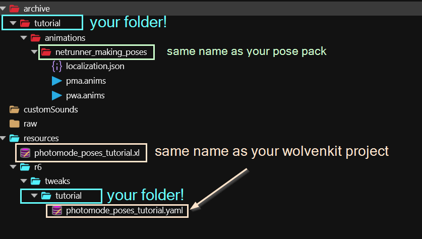
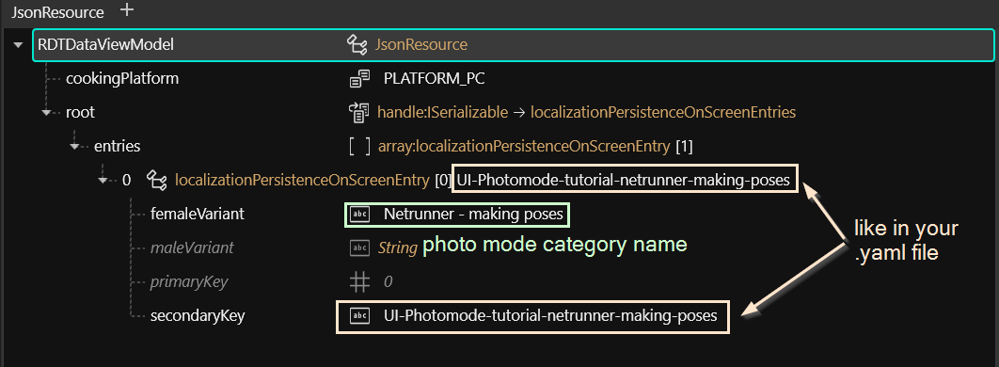
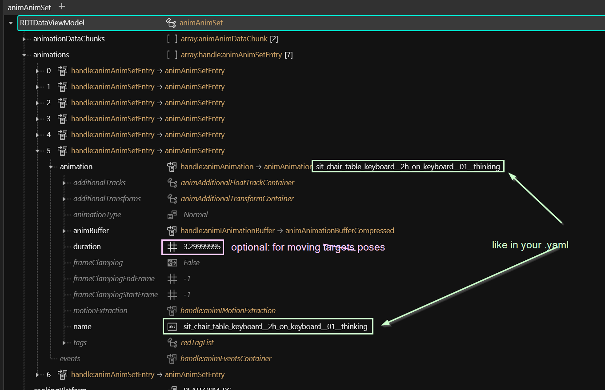
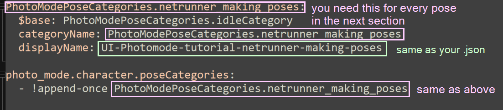
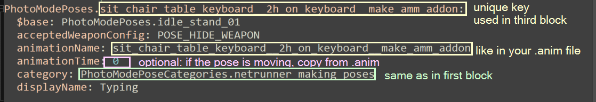
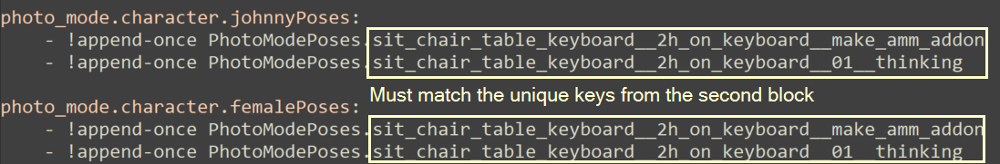

# ArchiveXL: adding Photo Mode Poses

## Summary <a href="#summary" id="summary"></a>

**Created by @manavortex**\
**Published May 09 2023**

This guide will walk you through **adding poses** to Cyberpunk 2077's photo mode with **ArchiveXL**.

**Difficulty:** You know how to read ;)&#x20;

**It uses the following versions:**

* Cyberpunk 2077 game version 1.6.2 Hotfix
* [WolvenKit](https://github.com/WolvenKit/WolvenKit-nightly-releases/releases) >= 8.9.0
* [TweakXL](https://www.nexusmods.com/cyberpunk2077/mods/4197) 1.1.4
* [ArchiveXL](https://www.nexusmods.com/cyberpunk2077/mods/4198) 1.4.5 (the first version supporting this feature)
* [Red4ext](https://www.nexusmods.com/cyberpunk2077/mods/2380) 1.12.0


This guide assumes that you already have an .anims file with poses or animations. If you want to make your own, check [here](../animations/).



You do not need any pose mode extender like PMU or MPAF anymore, although the ArchiveXL feature is compatible wiith all of them.


## Getting the files

Download either of these files:&#x20;

* full Wolvenkit project ([mana's mega](https://mega.nz/file/eI1VHT4C#YCIqNPTQ9y1DZHLmfXg910b2hctIWY\_RCTJdLM\_\_BS4) | [Nexus](https://www.nexusmods.com/cyberpunk2077/mods/8287))
* Wolvenkit source folder ([mana's mega](https://mega.nz/file/nBFxnQyQ#zSdyPMBGQhB-ApSb-H5GCckznapbLC0ZeNhVu0RP\_h4) | [Nexus](https://www.nexusmods.com/cyberpunk2077/mods/8287))

## Setting up the files

### Step 1: Rename the folders


This step is optional, but if you want to release your mod, you **have** to complete it (or cause mod conflicts for your users. Don't cause mod conflicts for your users.)


We usually do this at the very end and I'm leaving you alone with it. However, this time we start by renaming the folders.

The screenshot below shows **suggestions**. Name your files and folders whatever you want, as long as they have no uppercase letters.

<figure><figcaption></figcaption></figure>

### The .xl file

This file tells Cyberpunk to load your custom poses and will be in the same folder as the .archive file for your mod. It looks like this:

```
animations:
  - entity: base\characters\entities\player\photo_mode\player_wa_photomode.ent
    set: tutorial\animations\netrunner_making_poses\pwa.anims
  - entity: base\characters\entities\player\photo_mode\player_ma_photomode.ent
    set: tutorial\animations\netrunner_making_poses\pma.anims
  - entity: base\characters\entities\player\photo_mode\johnny_photomode.ent
    set: tutorial\animations\netrunner_making_poses\pma.anims    
localization:
  onscreens:
    en-us: tutorial\animations\netrunner_making_poses\localization.json

```

You have to adjust the paths under `set` and `en-us` to your new changed folder structure.

Here's what those things do:

`animations:` A list of entities and animation files that you want to add to them\
`animations/entity:` The relative path to the photomode .ent file. There are just three of them.\
`animations/set:` The relative path to the .anims file in your Wolvenkit project.\
`localization/onscreens/en-us:` A file with translation strings. Holds the name of your photo mode pose set.

### localization.json


You can name this file whatever you want, just make sure that you change the path and name in the .xl file.


* Change the yellow box `UI-Photomode-tutorial-netrunner-making-poses` to something unique to your mod.&#x20;
* The green text is the name that will show up in photo mode — the female variant is the default.

<figure><figcaption></figcaption></figure>

### The .anim file(s)

You should know these files — after all, you made them. But just as a reminder, here's how they look:

<figure><figcaption></figcaption></figure>

You will need the green text in your [.yaml file](archivexl-adding-photo-mode-poses.md#the-.yaml-file).&#x20;


Optional: If you want your pose to move, you can set the duration in the .yaml as well!


### The .yaml file

This file will go into `r6/tweaks/yourfolder` and appends the poses that you defined to the photo mode. Without this file, the animations will be in the entity, but the photo mode won't know about them. It has three sections:

#### Adding the category

The first block will introduce your new category to the photo mode.&#x20;


I recommend doing search and replace on `netrunner_making_poses`, because it's used a bunch of times.


* `PhotoModePoseCategories.netrunner_making_poses`: This is the name of the category, used to assign individual pose entries to your category.
* `displayName:` This must match the `secondaryKey` in your .json

<figure><figcaption></figcaption></figure>

#### Define the pose entries


If one of your poses is called `idle_stand`, that will break a bunch of other mods. Please re-name it in both the .anims file and the .yaml before releasing.


Now comes a long list of entries. They'll look like this:

<figure><figcaption></figcaption></figure>


You need to add one of those for every pose from your .anim file that you want to show up in photo mode.


`PhotoModePoses.sit_chair_table_keyboard__2h_on_keyboard__make_amm_addon`: This is the unique key to assign your pose to your pose set. You'll need it in the third block. \
`animationName`: This must match the animation name in your [.anim file](archivexl-adding-photo-mode-poses.md#the-.anim-file-s) (the green box).\
`category`: This must match the category in the first block.\
`displayName`: What'll show up in photo mode

### Telling photo mode about the poses


```
photo_mode.character.malePoses
photo_mode.character.johnnyPoses
photo_mode.character.femalePoses
```

An entry looks like this:

<figure><figcaption></figcaption></figure>

The entries in the list must match the unique keys that you've defined in the second block, and you need one entry per pose. If you have different names for differently-gendered poses, you need to use the correct lists.

## The result


You can install and launch the Wolvenkit project as you downloaded it — just remember to delete the files afterwards!


<figure><figcaption><p>She has no idea what she's doing</p></figcaption></figure>

<figure><figcaption><p>Fortunately, you can hire specialists</p></figcaption></figure>
