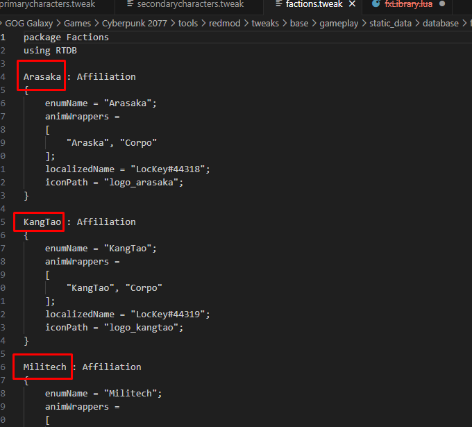
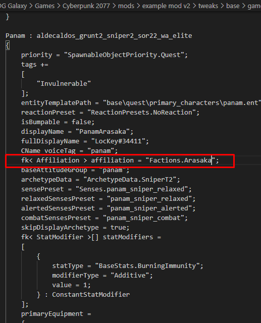
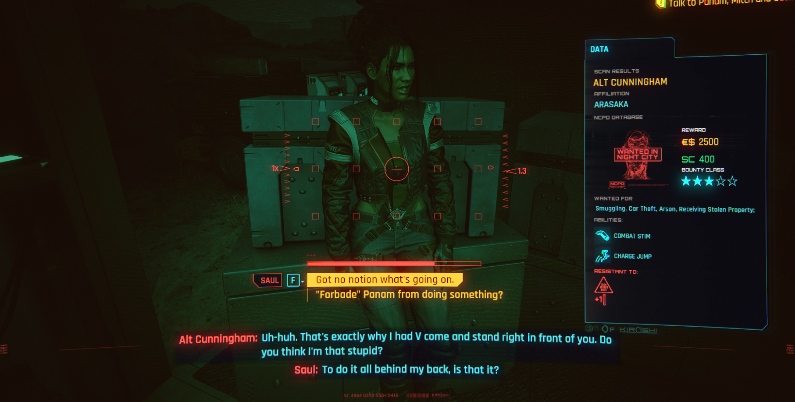

# 👪 Changing NPCs - Tweak edit (REDMod)

**Created by** [daemon2077](https://app.gitbook.com/u/XREbvwu6Q0e6vAu65AnL9ntMvAD3 "mention")\
**Published October 19 2023**\
**Game Version 2.01**

This tutorial will show you how to use REDmod to edit an NPC's TweakDB record, changing their info when scanning them with your Kiroshis. In this tutorial we will edit Panam

If you want to learn more about the Tweak database, check [tweaks](../../files-and-what-they-do/tweaks/ "mention").

## Prerequisites

* the free REDMod DLC (you can get it [here](https://www.cyberpunk.net/en/modding-support))
* An IDE to edit .json files. I prefer [Visual Studio Code](https://code.visualstudio.com/download), but you can also use[ Notepad++](https://notepad-plus-plus.org/downloads/)

## Preparation

Since we are using REDmod, we need to [structure our project](../../modding-tools/redmod/#folder-structure) accordingly.&#x20;

1. Open your [Cyberpunk 2077 game directory](#user-content-fn-1)[^1] in the Windows Explorer.
2. Find the folder `mods`. If it doesn't exist, create it.
3. Inside `mods`, create a folder for your custom mod — call it however you want. For this tutorial, we will name ours "example mod"
4. Inside your mod folder, create an empty text file with the name of [`info.json`](../../modding-tools/redmod/#info.json). This file will tell Cyberpunk how to load your mod.
5. Copy the following template and paste it into your empty file:

<pre class="language-json"><code class="lang-json"><strong>{
</strong>  "name": "YOURMODNAME",
  "version": "1.0",
  "customSounds": []
}
</code></pre>

6. Inside your mod folder, create the following nested folders:\
   tweaks\\`base\gameplay\static_data\database\characters\npcs\records\quest\main_characters`
7. Copy the following file to the folder `main_characters` inside your mod directory:\
   `Cyberpunk 2077\tools\redmod\tweaks\base\gameplay\static_data\database\characters\npcs\records\quest\main_characters\primarycharacters.tweak`

Your mod folder should now look like this:

```
- example mod
    info.json
  - tweaks
    - base
      - gameplay
        - static_data
          - database
            - characters
              - npcs
                - records
                  - quest
                    - main_characters
                        primarycharacters.tweak
```

## Editing the .tweak file


To make changes inside, find an NPC with the properties that you want, and copy/paste the values into the record that you want to edit.


Open primarycharacters.tweak in your IDE and search for "`Panam`". You will find the following record:

<details>

<summary>Panam's full character record (as of 2.02</summary>

```swift

Panam : aldecaldos_grunt2_sniper2_sor22_wa_elite
{
	priority = "SpawnableObjectPriority.Quest";
	tags += 
	[
		"Invulnerable"
	];
	entityTemplatePath = "base\quest\primary_characters\panam.ent";
	reactionPreset = "ReactionPresets.NoReaction";
	isBumpable = false;
	displayName = "LocKey#34412";
	fullDisplayName = "LocKey#34413";
	CName voiceTag = "panam";
	baseAttitudeGroup = "panam";
	archetypeData = "ArchetypeData.SniperT2";
	sensePreset = "Senses.panam_sniper_relaxed";
	relaxedSensesPreset = "panam_sniper_relaxed";
	alertedSensesPreset = "panam_sniper_alerted";
	combatSensesPreset = "panam_sniper_combat";
	skipDisplayArchetype = true;
	fk< StatModifier >[] statModifiers = 
	[
		{
			statType = "BaseStats.BurningImmunity";
			modifierType = "Additive";
			value = 1;
		} : ConstantStatModifier
	];
	primaryEquipment = 
	{
		equipmentItems = 
		[
			{
				item = "Items.Preset_Grad_Panam";
				equipSlot = "AttachmentSlots.WeaponRight";
				onBodySlot = "AttachmentSlots.ItemSlotGenericRanged";
				equipCondition = 
				[
					"WeaponConditions.SniperPrimaryWeaponSniperEquipCondition"
				];
				unequipCondition = 
				[
					"WeaponConditions.SniperPrimaryWeaponSniperUnequipCondition"
				];
			} : NPCEquipmentItem, 
			{
				item = "Items.Preset_Base_Copperhead";
				equipSlot = "AttachmentSlots.WeaponRight";
				onBodySlot = "AttachmentSlots.ItemSlotGenericRanged";
				equipCondition = 
				[
					"WeaponConditions.SniperPrimaryWeaponRangedEquipCondition"
				];
				unequipCondition = 
				[
					"WeaponConditions.SniperPrimaryWeaponRangedUnequipCondition"
				];
			} : NPCEquipmentItem
		];
	};
	statModifierGroups += 
	[
		"NPCStatPreset.VeryHighHealth", "NPCStatPreset.PanamSniperDamage", "NPCStatPreset.FollowerDamageAgainstBosses"
	];
	savable = true;
	bountyDrawTable = 
	{
		bountyChoices = 
		[
			{
				bountySetter = "Factions.NCPD";
				transgressions = 
				[
					{
						localizedDescription = "LocKey#48952";
					}
				];
				reward = "BountyReward.bounty_panam";
			}
		];
	};
}

```

</details>

### Properties

We will take a look at some of the properties.

<table><thead><tr><th width="212.33333333333331">property name</th><th>value in Panam's template</th><th>explanation</th></tr></thead><tbody><tr><td><code>fullDisplayName</code></td><td><a href="https://app.gitbook.com/s/-MP_ozZVx2gRZUPXkd4r/wolvenkit-app/editor/lockey-browser">LocKey#34413</a></td><td>Which text is displayed in scan tab?</td></tr><tr><td>displayName</td><td><a href="https://app.gitbook.com/s/-MP_ozZVx2gRZUPXkd4r/wolvenkit-app/editor/lockey-browser">LocKey#34412</a></td><td>Which text is displayed in dialogues and choices?</td></tr><tr><td>archetypeData</td><td><code>ArchetypeData.SniperT2</code></td><td>base template (how she fights)</td></tr></tbody></table>

### Changing an NPC's faction

All existing factions are defined in the following file:

```
Cyberpunk 2077\tools\redmod\tweaks\base\gameplay\static_data\database\factions\factions.tweak
```

<figure><figcaption><p>What you need to look for</p></figcaption></figure>

To change an NPC's affiliation, you will need to add the following line to their template:

```swift
fk< Affiliation > affiliation = "Factions.FACTION_NAME_HERE"
```

<figure><figcaption><p>Panam works for Arasaka now.</p></figcaption></figure>

## Results

That's, save your work, deploy your mod and hop in the game to see the results.

<figure><figcaption></figcaption></figure>

If you have any questions, you're welcome to join us on [discord](https://discord.gg/Epkq79kd96).

[^1]: The folder where you installed Cyberpunk 2077. Your client (Steam/Epic/GOG) can take you there if you select its "browse local files" option.
