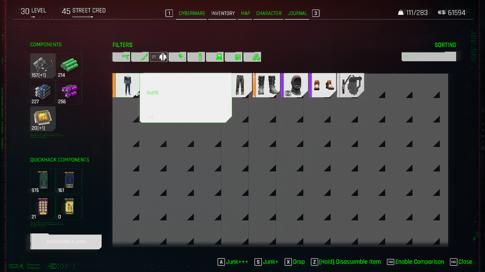

# How to YAML: Tweak modding basics


This is a tutorial created with new modders in mind. Some terms may not be correct, but you will be able to create a functional tweak with this method. It's not optimal; it's slow, tedious, and redundant. However, it was the only way I could understand how to make YAML tweaks.

Take into consideration that I'm not an expert, but I've helped a lot of people to start on tweaks and this knowledge will allow you to, at least, navigate more easily at first.


For this tutorial, you need:

* [Wolvenkit](https://github.com/WolvenKit/WolvenKit/releases/)
* [Visual Studio Code](https://code.visualstudio.com/download) (or [Notepad++](https://notepad-plus-plus.org/downloads/), but the tutorial will show you VSCode)
* [TweakXL](https://github.com/psiberx/cp2077-tweak-xl/releases)
* [RED4ext](https://github.com/WopsS/RED4ext/releases)
* [This bible in your bookmarks](https://github.com/psiberx/cp2077-tweak-xl/wiki/YAML-Tweaks)
* A bookmark for [YAMLlint](https://www.yamllint.com/) (you can check your YAML files for indentation errors)
* Patience, _lots of patience_. Please, read this guide completely and **re-read** if needed.

After downloading and installing all the requirements (and yes, **SAVE** that bookmark, trust me), let's start with the basics.

***

## Understanding YAML Tweaks

YAML tweaks are like a `decompiled` version of the **.tweaks** files that you can find inside the REDmod folder. YAML format is easier to read and understand, but have some differences with REDmod syntax. You can also try and make tweaks using the [REDmod syntax inside TweakXL](https://github.com/psiberx/cp2077-tweak-xl/wiki/RED-Tweaks), but personally I have no experience with that yet.

There are some concepts you need to understand before starting:

### Indentation

Indentation organizes code using blank spaces, as shown below:

```
This
  is
    indentation
```

In the past, using indentation wasn't mandatory and mostly used by pro coders to order their files as a good practice. However, for YAML files, **indentation is MANDATORY**. If you indent wrong, **your mod won't work**, simple as.

The best way to indent, in my opinion, is using 2 blank spaces (pressing `space bar` twice) to make indentations.&#x20;

"_But what about just using tab?_" you may think. **DON'T. DON'T USE TAB FOR INDENTATION.** Using tab for indentation could cause issues, because not all text editors interpret tab in the same way.&#x20;

Using double space will guarantee your file will keep the same structure everywhere. It even feels natural and **VSCode** will put nice and useful lines to show your indentation.

***

### Records

Think of records as **unique containers** grouping multiple properties — which can be **other records**, or [#flats](how-to-yaml-tweak-modding-basics.md#flats "mention").&#x20;

<figure><figcaption><p>Don't worry, it gets easier to understand over time.</p></figcaption></figure>


Record names **must** be unique!

You can't create two records with the same name — they will overwrite each other!


You can learn more on [psiberx's github readme](https://github.com/psiberx/cp2077-tweak-xl/wiki/YAML-Tweaks#records), or head over to [types-of-tweak-records.md](../../tweaks/tweaks/types-of-tweak-records.md "mention")

***

### Flats

Flats are **values**. They can be numbers (integers <_like 1 or 2_> or floats <_like 1.5 or 2.3_>), characters (_even entire words_) or boolean (_True or False_). They can be more complex things, for that I suggest you to read [what Psiberx has to say about this](https://github.com/psiberx/cp2077-tweak-xl/wiki/YAML-Tweaks#flats).

***

### Inlines

This is where most new modders make mistakes.&#x20;

**Inline** is a way to create records without nesting them under a record name, but coded and nested directly in the property of another record. Yeah, I know, it's hard to understand. Let's do some examples.

* This example is a named record with other named records nested on it:

```
MyBigRecord:
  $type: gamedataGameplayLogicPackage_Record
  statModifiers:
   - RecordOne
   - Record2

RecordOne:
  $type: gamedataConstantStatModifier_Record
  value: 1
  modifierType: Additive
  statType: BaseStats.ExampleBaseStat1

Record2:
  $type: gamedataConstantStatModifier_Record
  value: 4
  modifierType: Additive
  statType: BaseStats.ExampleBaseStat2
```

* This is the same as above but with inline coding:

```
MyBigRecord:
  $type: gamedataGameplayLogicPackage_Record
  statModifiers:
   - $type: gamedataConstantStatModifier_Record
     value: 1
     modifierType: Additive
     statType: BaseStats.ExampleBaseStat1
   - $type: gamedataConstantStatModifier_Record
     value: 4
     modifierType: Additive
     statType: BaseStats.ExampleBaseStat2
```

_When to use inlines or whole named records?_ That depends on your project. Sometimes creating a record with a **UNIQUE name** will save you more space and work than creating it on inlines every single time. Sometimes it's the other way around. It's ok to even not using inlines at all if you aren't comfortable with them.

Later in this tutorial, you'll see that some records are named to something like this `RecordName_inline0`, `RecordName_inline1`, etc. Those `inlineX` names are created automatically for easier reading and the number can change **without ANY warning** on every single game update. The number generated will be dependent on the position of the inline record inside another record. Inline means literally "_**this is IN LINE X**_".


**NEVER use**`inlineX` **records as base in your items**, that will only create headaches for the future you. Using `inlineX` records as base for your items is a **BAD PRACTICE** and could prevent your mod from working on **ANY update**.&#x20;

**Please, DON'T USE** `inlineX` **RECORDS AS BASE FOR YOUR OWN RECORDS.**


Let me explain it better with more examples:

* In this example, this a record using inlines in update 2.1

```
MyBigRecord:
  $type: gamedataGameplayLogicPackage_Record
  statModifiers:
   - $type: gamedataConstantStatModifier_Record
     value: 1
     modifierType: Additive
     statType: BaseStats.ExampleBaseStat1
   - $type: gamedataConstantStatModifier_Record
     value: 4
     modifierType: Additive
     statType: BaseStats.ExampleBaseStat2
```

* In this example, is the same record, but on update 2.2

```
MyBigRecord:
  $type: gamedataGameplayLogicPackage_Record
  statModifiers:
   - $type: gamedataConstantStatModifier_Record
     value: 8
     modifierType: Additive
     statType: BaseStats.ExampleBaseStat3
   - $type: gamedataConstantStatModifier_Record
     value: 4
     modifierType: Additive
     statType: BaseStats.ExampleBaseStat2
```

In this example, `MyBigRecord_inline0` will have a completely different value depending on the update.&#x20;

In update 2.1 the value**`1`** and related to `BaseStats.ExampleBaseStat1`, but then in update 2.2 the value will be **`8`** and related to `BaseStats.ExampleBaseStat3`.&#x20;

If you used `MyBigRecord_inline0` in your item code, your item would stop working as intended. It doesn't matter that popular modders do this, **DON'T USE INLINES AS BASE FOR YOUR RECORDS**.&#x20;

[Check psiberx's YAML bible about inline records](https://github.com/psiberx/cp2077-tweak-xl/wiki/YAML-Tweaks#inline-records).

***

### Prereqs

You'll see this word a lot inside [TweakDB](https://github.com/psiberx/cp2077-tweak-xl/wiki/TweakDB). Prereqs means **`Prerequisites`** and, as the name states, is used to check that certain conditions are met to start, for example, something like an **`Effector`**.

You can find more about this under [types-of-tweak-records.md](../../tweaks/tweaks/types-of-tweak-records.md "mention") -> [#prereq](../../tweaks/tweaks/types-of-tweak-records.md#prereq "mention"), or find a full list under [cheat-sheet-prereqs.md](../../references-lists-and-overviews/cheat-sheet-tweak-ids/cheat-sheet-prereqs.md "mention").

***

### Effector

Those are records that are used to be activated under certain conditions depending on their Prereqs. So Effector means "_**Something that activates some Effect**_". That effect could be almost anything, from stats to [visual effects](https://www.youtube.com/watch?v=n50N4IrdX2g).

You can find more about this under [types-of-tweak-records.md](../../tweaks/tweaks/types-of-tweak-records.md "mention") -> [#effector](../../tweaks/tweaks/types-of-tweak-records.md#effector "mention")

***

### TweakDB

**Tweaks and Scripts are 2 sides of the same coin.**

On its own, a tweak does nothing — the engine makes use of the records via **scripts**.&#x20;


Think of a script as the **instruction**, and a tweak as the **definition**. That way, a script doesn't actually need to understand what it's doing, and all the logic is neatly encapsulated. \
\
For example: Take 500g (_the **instruction**)_ of `Items.Flour` (_the **definition**_).


In this tutorial we will use [**Wolvenkit Tweak Browser**](https://wiki.redmodding.org/wolvenkit/wolvenkit-app/editor/tweak-browser). There are many ways of [browsing-the-tweak-database.md](../../tweaks/tweaks/browsing-the-tweak-database.md "mention"), but you can save them for later, when you are more advanced (or feeling bold).

***

## How to make a research for your YAML Tweak mod

Having clarified some very basic concepts, let's start this guide:

### 1: Find the thing you want to do

Let's say you want to do a new item that have the Thrusters mechanics from Rogue Boots that you use in certain endings.&#x20;

What's the best approach to this? Using those Thrusters boots logic in your item.

Unfortunately, most items don't share the same internal name as the name you can see in the description. The best way I've found to deal with this, is going to the community Cyberpunk wiki and looking for your specific item, in this case, [those cool Boots](https://cyberpunk.fandom.com/wiki/Retrothrusters\_\(from\_Rogue\)).

Internally, that item is called `q115_thrusters`. Now that we know that, we can search the item in **Wolvenkit Tweak Broswe**r.


Read [spawn-codes-baseids-hashes.md](../../references-lists-and-overviews/equipment/spawn-codes-baseids-hashes.md "mention") for how to find an item's unique ID.


***

### 2: Using Wolvenkit Tweak Browser

Open Wolvenkit and [create a project](https://app.gitbook.com/s/-MP\_ozZVx2gRZUPXkd4r/wolvenkit-app/usage/wolvenkit-projects#create-a-new-wolvenkit-mod-project) (for example, I have one project dedicated to research called TEST, which I use every time I need to search something on Wolvenkit), then open it.&#x20;

Open the Tweak Browser tab and pin it. It should look like this:

<figure><figcaption><p>I love Wolvenkit, and you should too.</p></figcaption></figure>

Paste `q115_thrusters` into the search bar and click on `Filter...` and activate `Show inline records`. This should look like this:

<figure><figcaption><p>Look at those beautiful records.</p></figcaption></figure>

Do a right click into the first item and select `Add TweakXL Override`. Do the same for the `inline0` and `inline1`, but ignore the `rogue` and `weyland` versions, we don't need that, just the first 3 results shown in this image:

<figure><figcaption><p>This is going to take a while if you have more inlines to override.</p></figcaption></figure>

Those tweaks should be stored in the left panel inside these folders in the image:

<figure><figcaption><p>Will be inside Tweaks directly or in a folder inside Tweaks.</p></figcaption></figure>

Put the cursor above the YAML files and click on the yellow folder to open the folder containing those tweaks in Windows Explorer:

<figure><figcaption><p>All your overrides will be stored in the same folder.</p></figcaption></figure>

***

### 3: Working with the YAML files

Open the 3 YAML files in **VSCode**:

<figure><figcaption><p>You probably will have less cooler colors, sorry choom.</p></figcaption></figure>

Now, from the latest inline (`inline1` in this example), copy the whole contents and paste it below the anterior record (in this case, `inline0`):

<figure><figcaption><p>CTRL + A to select everything, CTRL + C to copy, CTRL + V to paste.</p></figcaption></figure>

Now, copy the mixed contents and paste them into the base record (the item on this case). This is how it should look:

<figure><figcaption><p>Almost there, keep going...</p></figcaption></figure>

Those records below the main item record (`inline0` and `inline1`) are the ones that manages the Thrusters logic/mechanics.&#x20;

You can add them to almost any item, but you'll have to research on your own how to do it on each case. Not all items needs the effects nested in the same places, and not all effects needs to be nested like this.&#x20;


ALWAYS FIND A WORKING EXAMPLE IN THE BASE GAME IF YOU ARE NEW ON THIS AND IF YOU WANT TO KEEP YOUR SANITY. \
_**Trust me.**_


Now, the importance of VSCode in this tutorial. VSCode has an incredibly powerful and useful highlighting system for text by just doing `double click` on **ANY WORD**. With this system, you'll understand how things are nested on ANY item you find. Look at this example:

<figure><figcaption><p>I love VSCode, look at this beauty.</p></figcaption></figure>

If you pay attention to the miniature code on the right side and the scroll bar, there is a highlight that will point you exactly where things are nested:

<figure><figcaption><p>You can scroll on the miniature too. The big vertical gray bar is your scroll bar, and the tiny horizontal lines are the highlights.</p></figcaption></figure>

If you move over that highlight, you will finally have your answer.

<figure><figcaption><p>inline0 was nested inside OnEquip parameter, which is inside the main item record.</p></figcaption></figure>

***

## Final thoughts

This tutorial logic can be applied to **ANYTHING** that can be found in TweaksDB, how many inline records you are going to find will depend on each particular case. I picked a simple example to not extend this too much, but some items have more than 30 inlines... **You are warned**.

I've tested this method with many users, and all of them have been able to create their mods. This is not a way to do all items you have in mind, because is extremely inefficient, but once you understand how things are nested and how records are structured, you'll have a better time creating items afterwards.

I hope this will be helpful for you.

Thank you for reading, and **good luck in your projects**!&#x20;


[**REMEMBER TO BOOKMARK THE PSIBERX YAML TWEAK BIBLE**](https://github.com/psiberx/cp2077-tweak-xl/wiki/YAML-Tweaks)

You can also use [this online tool](https://www.yamllint.com/) to see if your YAML file has errors

