# Boe6's vehicles: Import/export meshes


To import vehicles models from **Wolvenkit** into **Blender**, use [**THIS GUIDE**](https://wiki.redmodding.org/wolvenkit/modding-community/exporting-to-blender/exporting-vehicles) .

This update method allows for import all components and rigs together as one model. I recommend following it before continuing with this guide, as it has more valuable information.


## Add the proxy mesh to the project.

To add our models for the different parts, we’ll be looking mostly in the `.app` file, under our main appearance.

Open the “`AppearanceVisualController`” in the appearance’s item list. It should be the last item in the list. Then select the “`meshProxy`” value.

<figure>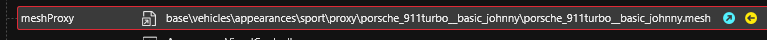<figcaption></figcaption></figure>

Go ahead and add this mesh to the project by clicking the yellow arrow.

This mesh is used at distance, before your vehicle is loaded fully. We’ll be using it as a reference for our modeling in blender, as it is a low poly, complete model with wheels and all.&#x20;

Open the **Export Tool**, under the **Tools** menu on the top of **wkit**.

Hit **refresh** to load all items, and select your proxy mesh you just added, then hit “**Export Selected**”. This should have created a `.glb` and `.json` file under the new “`raw`” folder above the resources in the **Project Explorer**.&#x20;

Example:

<figure><figcaption></figcaption></figure>

Open a new project in blender, delete the base cube. Hit `File > Import > Cyberpunk GLTF` and load the `proxymesh.glb`

Your proxy mesh should now load in blender.&#x20;

Example:

<figure>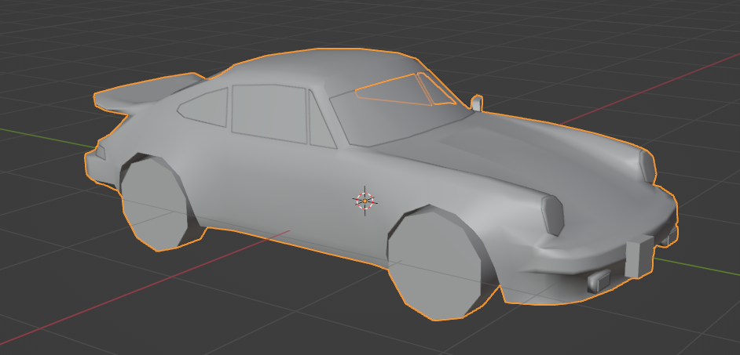<figcaption></figcaption></figure>

You can now import your source 3d models for your vehicle.&#x20;

The proxy mesh will initially be positioned offset from other vanilla meshes. This is due to the vehicle’s `.rig` file settings(will be discussed later).&#x20;

Example showing the offset:

<figure>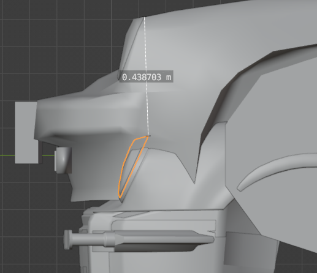<figcaption></figcaption></figure>

To get the exact offset, open the `.rig` file located at this path in the `.ent` file:

* `RDTDataViewModel > components > deformation_rig > rig`

Open the `boneNames` list and look for the index (number to the left) of “`Base`”, in this case 2:\

<figure>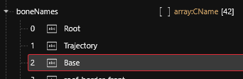<figcaption></figcaption></figure>

Then close `boneNames` and open `boneTransforms`. Open the same index value as “`Base`” and look at the translation values:

<figure>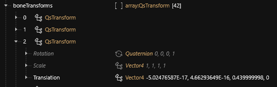<figcaption></figcaption></figure>

(Values that are set at “`_.___E-17`” are in scientific notation, and if the `E` number is negative as they are here, the number is close to 0)

Look at the `Z` value and noticee how it is `0.4399999` in the example. (\~0.44) This is the number we will translate the proxy mesh by. Return to blender and select the proxymesh object. Translate it by the same value just found in the `.rig` file by using the `Transform Location` values in the `Object Properties` menu: (positive to negative)

<figure>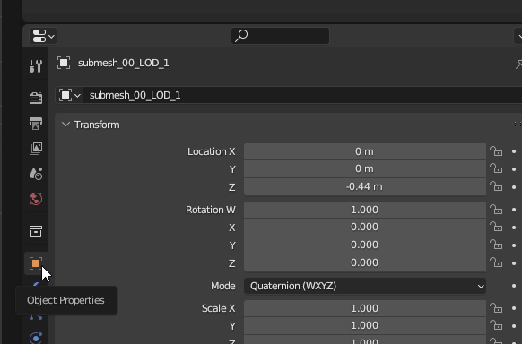<figcaption></figcaption></figure>

Repeat the translation for all objects in the proxymesh collection:

<figure>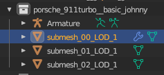<figcaption></figcaption></figure>

The proxy mesh can be used as a reference in blender for scale. Note the porsche is especially convenient, as it has real-world dimensions available online. If you don’t know your source car’s size, (length, wheelbase, width) You can compare in-game between it and the Porsche, then convert those numbers as appropriate.

Import the source 3D model for your mod into the same project.

Your model will likely be scaled incorrectly.

Find the correct scale of your vehicle in reference to the proxy mesh.

* Example: A mini cooper has a wheelbase of 97.1”, and a porsche 911 has a wheelbase of 89.45”. So, Mini cooper wheelbase should be 8.55% longer in Blender once scaled correctly.

Fix positioning with the **move**, **rotate**, and **scale tools**. “**Numpad 5**” can be used for orthographic perspective, which is useful for comparing wheelbase accurately. I recommend matching the wheel bottoms at the same height, and matching the driver seat position as close as you can. This will save some steps later for poses.

Example with both rendered:

<figure>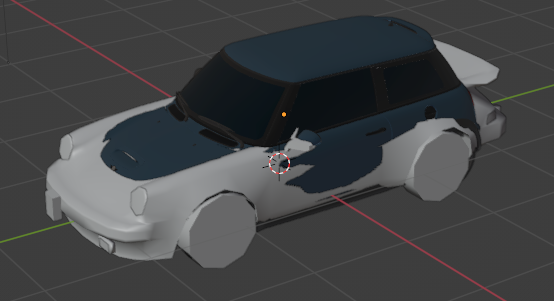<figcaption></figcaption></figure>

Disable visibility on the proxy mesh for now, but leave it in the project as we’ll need it later.

Now we can setup the model so it can be converted into meshes for Cyberpunk.

Depending on your source model, you may need to either split or join your model into groups for different meshes in game. These “groups” are the components list/array in the `.app` file.

Here’s a quick reference for the major groupings to look for:

* 2 tire models, one for font and back (left and right mirror the model)
* 2 wheel/rim models, see ↑
* Body
* Engine
* Window front & window back
* Chassis
* Various lights, backleft, backright, body, reverse, break,
* Wipers
* Door left & door right, front/back
* Window left & right, front/back
* Hood
* Trunk
* Interior
* Mirror
* Steering wheel
* License plate
* Bumper front / back


May be more or less of different components. Depends on source model.


Join objects by selecting multiple, and using **Object > Join**:

<figure><figcaption></figcaption></figure>

I recommend creating “collections” or folders in blender, one for each component. Split and join the files as necessary to organize them together. Feel free to add more categories and you see fit. Keep it categorized in a way that works for you. I start by separating body and body trim, and keeping car badges or small details separate until I decide how to add them to my model.

Example of blender object structure:

<figure>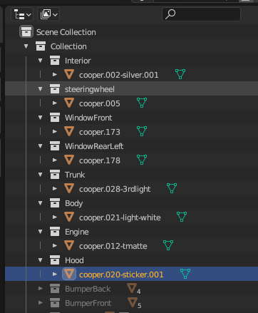<figcaption></figcaption></figure>

Apply all transformations to all objects in blender.

Make a backup of your blender project. I suggest keeping multiple copies as you work with your model. While splitting/joining objects you might not realize certain components need to be different until later on in the mod project, and an older project file will be very helpful.

Now we’ll import our first mesh into Cyberpunk.

In **wkit**, open the `.app` file and navigate to the default appearance. Open the components and find “`body_01`” and expand it. Look for the “`mesh`” value, and add it to your project.&#x20;

Example:

<figure>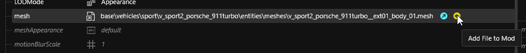<figcaption></figcaption></figure>

Use the **export tool** as we did with the proxy mesh to convert it to a `.glb` file.&#x20;

Import this `body.glb` file into the blender project.

Prepare your custom body mesh and ensure the replacement is one object. Join relevant objects together if needed.


Make sure your body mesh is less than `65,635 vertices`. If any `.glb` file has more than this, the import into the game will fail.


You can check the face count in the top left of your blender window:

<figure>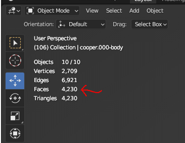<figcaption></figcaption></figure>


This number counts all visible objects in blender. Turning off an object’s visibility removes it from the count


As a general rule, keep the count low if you can to preserve performance in-game. Higher polygon count will increase quality, but decrease game performance.

Use the **decimate** modifier (or other methods) to reduce the face count if needed.

Example adding decimate modifier:

<figure>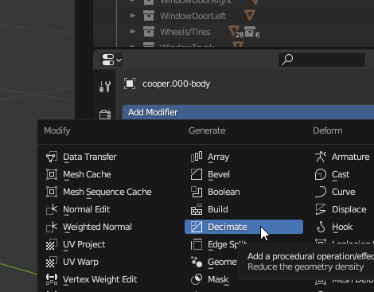<figcaption></figcaption></figure>

For simplicity, we’ll join all the parts of the body into one object for exporting. We can split them as submeshes later, when we want to indicate separate materials within a mesh.

With the body object selected, go to **File > Export > Export Selection to GLB for Cyberpunk**:

<figure>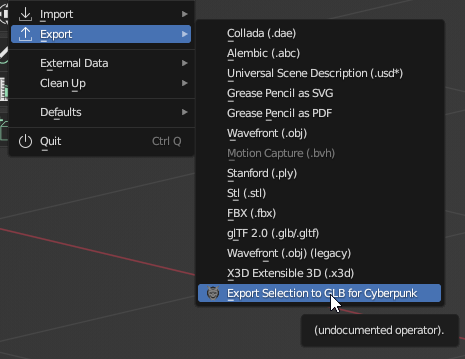<figcaption></figcaption></figure>

Save it to a new folder for your project’s `.glb` files.

Copy the `.glb` file into the folder with the original exported body mesh.

<figure>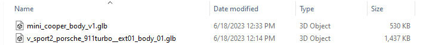<figcaption></figcaption></figure>

Copy the original file’s name, delete it, and rename your new part with the old file’s name.

Open the import tool in wkit, find the correct body `.glb` and import it into the game.

Select the updated `.mesh` file in the **Project Explorer**, and it will open in the **File Information** window. It should show your new mesh. \
Example:

<figure><figcaption></figcaption></figure>

Rename your new `.mesh` file to a project-specific name, and move it to a custom folder. \
Example:

“`boe6\mini_cooper\meshes\boe6_mini_cooper_body.mesh`”

Update your .app file with the path to the new body file. You’ll need to update it in 2 places:

* `RDTDataViewModel > appearances > 0 > components > body_01 > mesh`
* `RDTDataViewModel > appearances > 0 > components > AppearanceVisualController > appearanceDependancy > body_01 > mesh`

Test the mod in-game. It should look very wrong since we only replaced one mesh. \
Example:

<figure><figcaption></figcaption></figure>

Next, make all other visible components invisible while we’re modeling.

Easiest way to mark components as invisible is to break the `entVisualControllerComponent` appearances path.&#x20;

* “`RDTDataViewModel > appearances > 0 > components > entVisualControllerComponent > appearanceDependency > partname > mesh`”

I do this by renaming the file with an added “`-disabled`” in the name. This breaks the file path, and notes that it is disabled for reference later. example:

<figure><figcaption></figcaption></figure>


**TheSpliffz** said : _" Not sure if this is due to 2.0 but only adding '`-disabled`' to the meshes name in the `EntVisualControllerComponent` doesn't seem to work._

_Adding '`-disabled`' to "`RDTDataViewModel > appearances > 0 > components > entMeshComponent/entPhysicalMeshComponent > meshname > mesh`" does seem to work. "_


You will receive warning in the log when saving the .mesh if you use this method, be aware:

<figure>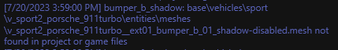<figcaption></figcaption></figure>

Save and test in-game. The renamed component should now not render in-game. Note that this only removes the visual mesh. The interactions still exist. \
Example:

<figure><figcaption></figcaption></figure>

Continue to change components until all except the modded body and wheels remain. Start with the major parts, bumpers, doors, etc. Test in-game frequently. Only disable parts that render in-game.

Once you have disabled all the other components, you can see your model clearly and notice any initial problems. Expect the textures to be broken. Opposite sides may not render as we still need to add an interior. Example:

<figure>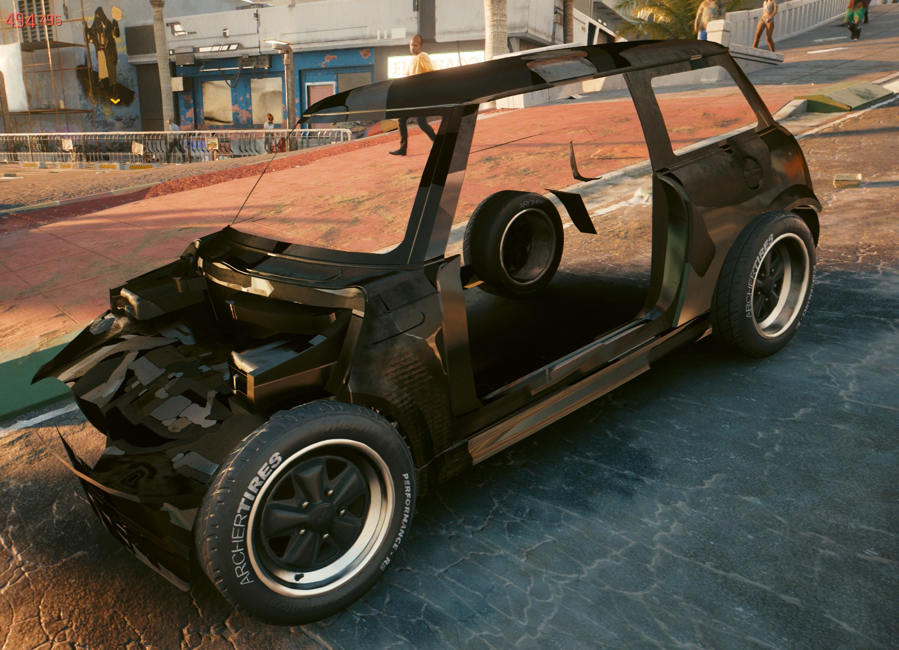<figcaption></figcaption></figure>

Some model issues may show themselves at this point. Check out the [“Fixing Body Glitches”](https://docs.google.com/document/d/1a5Xvviw\_GQxcvbxEwc3GoboaNk0igxlhiyS7ux34sIs/edit#heading=h.ftp5gbi7im8z) section of this document below.

You can use the `body_01` instructions for creating most non-moving parts. (engine, trim, chassis, etc)

For the non-moving windows, we’ll start by enabling the mesh in the `entVisualController`, removing the “`-disabled`”. Then we can add the mesh to our project. Move/rename is appropriate. \
Example:

“`boe6\mini_cooper\meshes\boe6_mini_cooper_window_f.mesh`”

Update the `.app` file with both `.mesh` paths for the component.

Export it to `.glb`, replace it with your model’s window, and import it back.&#x20;

Save and Test.

Repeat for each non-moving window. (door windows are done after doors)

* Similar materials can be copy/pasted as meshes, and then import/exported, and entered into the `.app` file. This is instead of importing from the original car that is being mirrored. This saves time on moving files.

Save and test.

To add a new component instead of replacing a default one, you can duplicate the `entVisualControllerDependency` of the most similar component by right-clicking and selecting “`Duplicate Item in Array/Buffer`”. \
Example:

<figure>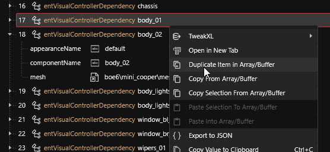<figcaption></figcaption></figure>

Edit the new component’s “`componentName`”, here I use “`body_02`”, as it is for exterior trim bodywork.

Edit the “`mesh`” value to the correct new `.mesh` file. \
Example:

“`boe6\mini_cooper\meshes\boe6_mini_cooper_body_trim.mesh`”

Duplicate the `entPhysicalMeshComponent` of the part you are copying. Rename it with the “`name`” value to the one you used earlier, (`body_02`). Set the “`mesh`” value to the same mesh path. \
Example:

<figure>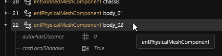<figcaption></figcaption></figure>

<figure>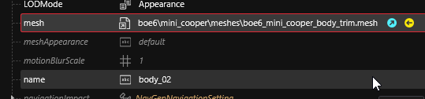<figcaption></figcaption></figure>
