# Interaction collider .phys files

Add the `.phys` file to your project, rename, and move the file as appropriate. It is linked through the `.ent` file. \
Path:

* `.ent file > RDTDataViewModel > components > chassis > collisionResource`

Convert the `.phys` to a `JSON` file:

<figure>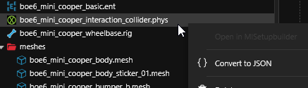<figcaption></figcaption></figure>

Now you’ll need 2 python scripts created by “_The Magnificent Doctor Presto!_”. They can be downloaded on github here:

[https://github.com/DoctorPresto/Cyberpunk-Helper-Scripts](https://github.com/DoctorPresto/Cyberpunk-Helper-Scripts)

Download both **export\_phys.py** and **import\_.phys.py**

In **Blender**, open the “**Scripting**” workspace:\

<figure>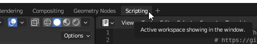<figcaption></figcaption></figure>

At the top of the text editor that just openned, use the folder icon to find the importing `.py` file we just downloaded.

<figure>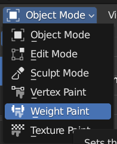<figcaption></figcaption></figure>

This should open the `.py` file into the text editor. It should look like this:

<figure>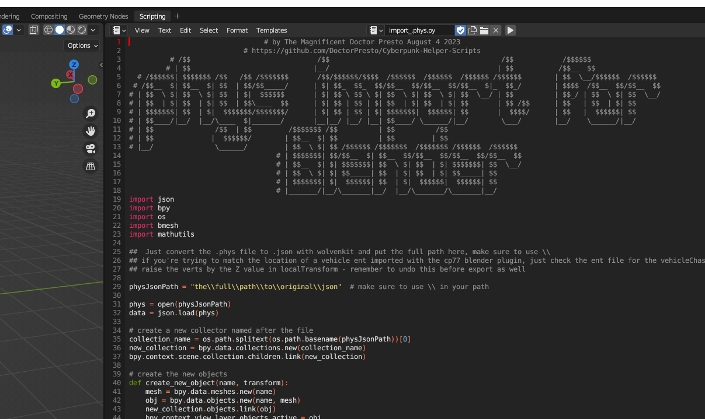<figcaption></figcaption></figure>

Edit the “`physJsonPath`” value to the converted `phys.json` file. \
Example:

<figure>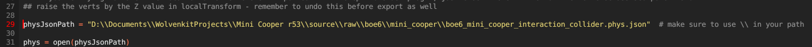<figcaption></figcaption></figure>

Once you’ve run the script, you should have vertices that look close to the outline of the original car model. Notice the outline similar to the porsche:

<figure>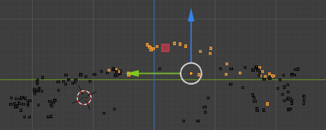<figcaption>
(left is the front of the car, right is the back with spoiler fin)
</figcaption></figure>

`.phys` files don’t like complex meshes, so they use only vertices without faces or edges. Each “submesh” is a small object shape, with no [concave angles](https://www.google.com/search?q=concave+angle+in+polygon\&tbm=isch\&sclient=img). Each submesh is then joined to create the overall collision mesh.

Switch back to the Layout workspace.

The easiest way to edit these in blender is to enable your vehicle’s body mesh, is to switch to Wireframe shading, by holding Z, and moving your mouse to “Wireframe”. \
Example:

<figure>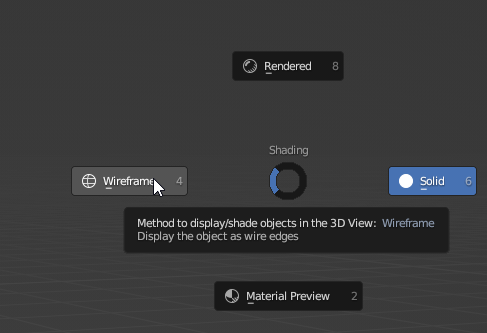<figcaption></figcaption></figure>

This will allow you to see your body mesh, but also see vertices behind and around it. \
Example:\

<figure>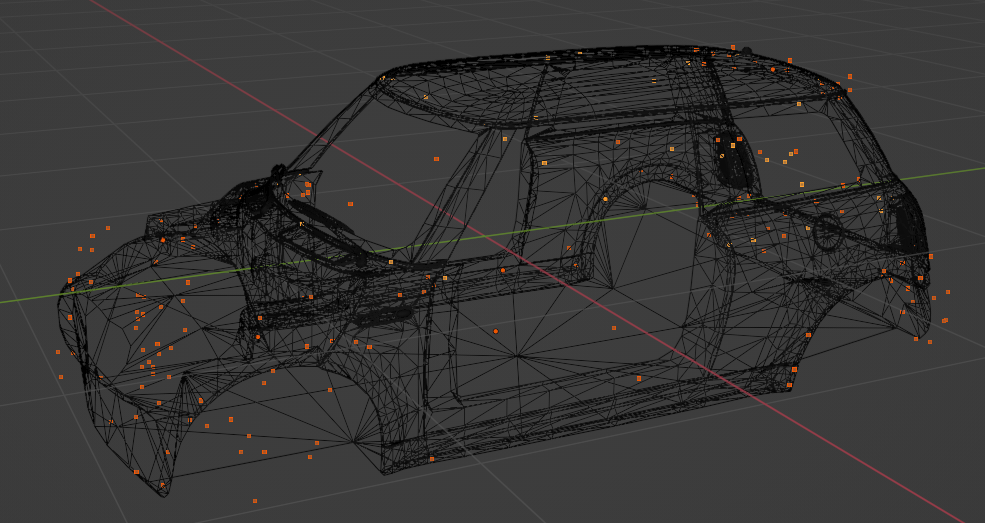<figcaption></figcaption></figure>

Once done editing, select all the vertices objects and run the **export\_phys.py**, similar to the import script.

The `.phys` file should now be finished. Import from `json`, update path references, and test in-game. Make sure to update the `physJsonPath` again, as this is the path it will save the new `.json` to.

<figure>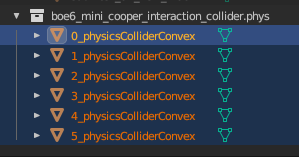<figcaption></figcaption></figure>

<figure>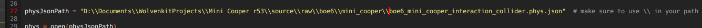<figcaption></figcaption></figure>

Once the script has been run, you should have a new file with the “`new_`” prefix added in the same folder as the `phys.json`. \
Example:

<figure>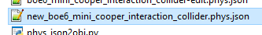<figcaption></figcaption></figure>

This file can now be converted back from json and used in game. \
Example:

<figure>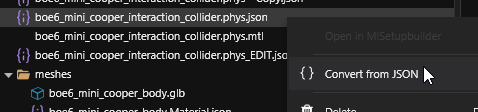<figcaption></figcaption></figure>
