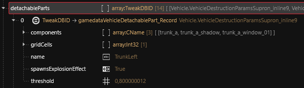

# 🏳️‍🌈 Adding components to CrystalCoat

## Create a WorldWidgetComponent

Each mesh component that you want to make colorable needs its own WorldWidgetComponent. For example you want the `body_01_painted_custom` component to be colored so you need to create a new item in the component list with type WorldWidgetComponent.

Now we will set it up for CrystalCoat. Some of its fields shall use specific values.

```
limitedSpawnDistanceFromVehicle = False
sceneWidgetProperties.IsAlwaysVisible = True
screenAreaMultiplier = 2
spawnDistanceOverride = 80
staticTextureResource = engine\ink\textures\4x4_transparent.xbm
```

For both the `meshTargetBinding` and `parentTransform` fields you shall create a handle. To do this click on the field, then on the right create a handle and select the only available type. Finally write the name of the mesh component into the `bindName` field of it. In this example the component name is `body_01_painted_custom`.

The name of the WorldWidgetComponent can use a pattern that will allow the script to handle any component for CrystalCoat. In order for this to work you must always use a name like this:

```
visual_customization_<mesh component name>
```

For this example the name will be `visual_customization_body_01_painted_custom`.

Now for the `widgetResource` field you must give it the InkWidget file that defines how the color will be wrapped onto the mesh.

The game uses a InkWidget that is customized for the Rayfield Caliburn or for the Rayfield Aerondight vehicles so it is unlikely to be usable as it is for any other vehicle without displaying unmatching patterns.

The details of how this InkWidget is structured and how to modify it will be covered into another paragraph. We will start in easy mode for now so we want a InkWidget that can be used on any part of any vehicle.

I have modified the InkWidget from the Rayfield Caliburn of the game `v2.12a` so it will display only a primary color on the entire UV map.

I will explain into another paragraph how the InkWidget is structured, how it works and how you can modify it to define a secondary color for your specific vehicle.

### Deploy the CrystalCoat InkWidget


CrystalCoat InkWidget


This ZIP archive contains 6 files:

* `primary_color.inkatlas`: this file uses a simple white square texture from the base game in order to apply a primary color for widgets.
* `secondary_color.inkatlas`: this file will be useful to add a secondary color mask to the widget.
* `secondary_color.xbm`: the mask texture associated with the InkAtlas.
* `vvc_car_appearance_widget.inkwidget`: this widget is meant to apply both a primary color and a secondary color on the vehicle. The secondary color will be applied using a mask. This is the most advanced widget we will use at the end of the tutorial.
* `vvc_full_primary_only.inkwidget`: we will use this widget at the beginning. It only applies a primary color on the entire component it is bound to.
* `vvc_full_primary_and_secondary.inkwidget`: this widget applies both a primary color and a secondary color on the entire component it is bound to. It does not use a mask file for the secondary color.

You must deploy these files into your project's unique folder, for example into a `widget` folder. Then we need to update the relative to the InkAtlas files into the three widgets.

When it comes to modifying a resource path into a InkWidget file it is more reliable to convert the widget into JSON and to modify the text file.

<figure><figcaption><p>Convert the InkWidget into JSON</p></figcaption></figure>

Right-click on the InkWidget file and click on `Convert to JSON`. This will create a clear-copy of the file as readable JSON into the `raw` folder. Open it with a text editor and replace the **3 occurrences** of:

```
hgyi56_modding\\widget\\primary_color.inkatlas
```

By your relative path to `primary_color.inkatlas` (you must use double-backslashes `\\`). Next, replace the **2 occurrences** of:

```
hgyi56_modding\\widget\\secondary_color.inkatlas
```

By your relative path to `secondary_color.inkatlas` (you must use double-backslashes `\\`).

Then save the file and right-click on the readable JSON file in the `raw` folder of the Project Explorer and click on `Convert from JSON` to rebuild the InkWidget file.

<figure><figcaption><p>Convert the JSON file back into InkWidget</p></figcaption></figure>


**Repeat this process with the other InkWidget files**

* `vvc_full_primary_and_secondary.inkwidget` contains **5 occurrences** of `primary_color.inkatlas` and none of `secondary_color.inkatlas`.
* `vvc_full_primary_only.inkwidget` contains **3 occurrences** of `primary_color.inkatlas` and none of `secondary_color.inkatlas`.


Now your InkWidget files are ready to be used by any component. For now we will only use the `vvc_full_primary_only.inkwidget`. Copy the relative path to your InkWidget file and write it into the `widgetResource` field of the WorldWidgetComponent.

<figure><figcaption><p>Create a WorldWidgetComponent</p></figcaption></figure>

You now have a WorldWidgetComponent properly configured for CrystalCoat. All you have to do in order to work with another mesh component is to duplicate this WorldWidgetComponent and then update its `meshTargetBinding > bindName` and `parentTransform > bindName` fields with the new component name.

You can finally test your mod !

<figure><figcaption><p>Colored body component</p></figcaption></figure>

> Wait ! My doors are not colored ! This is not good !

### Connect all the other components to CrystalCoat

This is great ! Now we need to apply CrystalCoat to all 6 doors and the side mirrors which correspond to these components:

* Driver door: `door_fl_a`
* Front passenger door: `door_fr_a`
* Back left door: `door_bl_a`
* Back right door: `door_br_a`
* Trunk left door: `trunk_a`
* Trunk right door: `trunk_b`
* Left mirror: `mirror_fl_01`
* Right mirror: `mirror_fr`

All you have to do is to follow this tutorial for each part of the vehicle.

<figure><figcaption><p>CrystalCoat with all components</p></figcaption></figure>

> Wait ! This is cheap CrystalCoat ! What kind of green is this ?

As you can see the base color of the vehicle under the CrystalCoat is still present and modifies the resulting color. When applying CrystalCoat on a vehicle we shall use dark gray or black color as the base color. I will cover this modification later in the tutorial.

## Update detachable parts

Now you have added all 6 doors and side mirrors to CrystalCoat, you need to make the new components detachable along with their original component.

Use the Tweak Browser and look into the vehicle record in the `destruction > detachableParts`. Then look for the parts that correspond to the one you have duplicated.

<figure><figcaption><p>TrunkLeft detachable part corresponding to trunk_a</p></figcaption></figure>

In this picture you can see the `TrunkLeft` detachable part that corresponds to the `trunk_a` component. As we have duplicated this one to create the `trunk_a_painted_custom`, we need to add it into the list of components for this detachable part.

In order to create a YAML file dedicated to detachable parts, right-click on the `detachableParts` array and create a TweakXL override.

Then right-click on the `TrunkLeft` element and select `TweakXL > Copy to clipboard`. Finally erase the YAML file content with this data.

We want to append a new element to the components array.

```yaml
Vehicle.VehicleDestructionParamsSupron_inline9.components:
  - !append trunk_a_painted_custom
```

Then repeat the same operation for all relevant detachable parts of the list. You should now have a YAML file with this content.

```yaml
Vehicle.VehicleDestructionParamsSupron_inline9.components:
  - !append trunk_a_painted_custom

Vehicle.VehicleDestructionParamsSupron_inline11.components:
  - !append trunk_b_painted_custom

Vehicle.VehicleDestructionParamsSupron_inline19.components:
  - !append door_fl_a_painted_custom

Vehicle.VehicleDestructionParamsSupron_inline20.components:
  - !append door_fr_a_painted_custom

Vehicle.VehicleDestructionParamsSupron_inline21.components:
  - !append door_bl_a_painted_custom

Vehicle.VehicleDestructionParamsSupron_inline22.components:
  - !append door_br_a_painted_custom

Vehicle.VehicleDestructionParamsSupron_inline17.components:
  - !append mirror_fl_01_painted_custom

Vehicle.VehicleDestructionParamsSupron_inline18.components:
  - !append mirror_fr_painted_custom
```

Concerning the `trunk_a` part, you can see that it is also present into the `destruction > deformableParts` array.

So you need to perform [the same operation](creating-a-new-customizable-component.md#update-deformable-parts) that we did for the `body_01_painted_custom` component.
