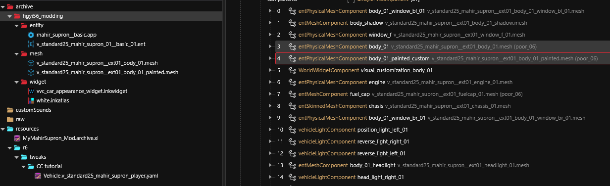
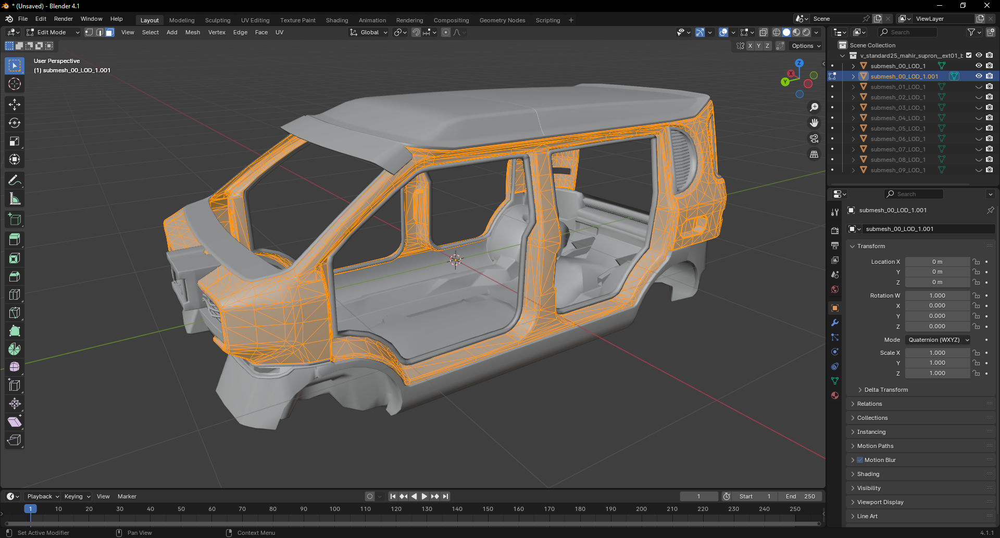
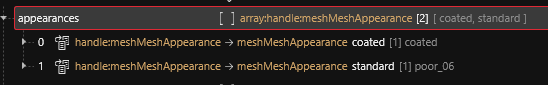
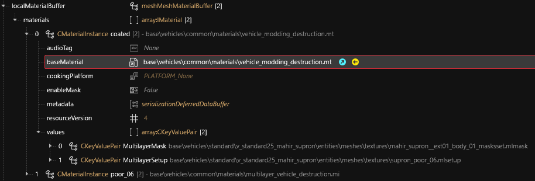
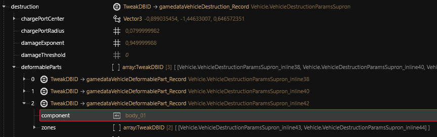

# 🐚 Creating a new customizable component

## Configure the mesh component

When you know how to implement CrystalCoat for one mesh component you can apply the same work on the other components.

I will use the example of the `body_01` component which is the biggest one of the vehicle. The idea is always the same: submesh the component into multiple ones so you can customize as many sub-parts of the component as you wish and treat them automatically with a script.

## Submesh the painted areas into a new component

On the picture above of the Mahir Supron, you only want to color the light brown areas which correspond to the painted parts of the vehicle. Coloring the entire mesh wouldn't make sense.

### Duplicate the component into a customizable one

We will isolate the painted parts into a new component with a single chunk. First go into the APP file and duplicate the `body_01` component into a new one called `body_01_painted_custom`. Adding a common suffix to all our customizable components will be helpful for the scripting part of the mod.

The name of all the customizable components of the vehicle will end with `_custom`. Add the mesh file of the `body_01` to your project and duplicate it. Then add the `_painted` suffix to the duplicated file so we know what it contains. Finally assign these files to the `body_01` and `body_01_painted_custom` components.

You should now have this project structure.

<figure><figcaption><p>Creating the body_01_painted_custom component</p></figcaption></figure>

### Edit mesh files using Blender

Export both mesh files and then open one of them in Blender. You can see that the interesting chunk is the first one with index 0 so you can hide the other ones.&#x20;

Select the faces that correspond to the painted areas and press `P` then choose `Selection` to create the submesh. Now export the new submesh alone into the mesh file that corresponds to `body_01_painted_custom` and then export the other submeshes to the base mesh file.


Be careful not to duplicate submeshes between multiple files !


<figure><figcaption><p>Isolate the painted areas into a new submesh</p></figcaption></figure>

## Define appearances and materials

Import both files back into WolvenKit. Now we need to configure the new mesh component to allow it to be colored.

First open the APP file and set the `meshAppearance` of `body_01_painted_custom` to `standard`.&#x20;

Then open the mesh file of `body_01_painted_custom`and remove all appearances. Create two appearances named respectively `standard` and `coated`.

The `standard` appearance will have a single chunk that uses the original material `poor_06`. This appearance will be used when CrystalCoat is turned off. The `coated` appearance will use a single chunk named `coated`. This appearance will be used when CrystalCoat is turned on.

Next, we know that the original material for this mesh is named `poor_06` so remove all entries from `localMaterialBuffer > materials` and `materialEntries` arrays except this one. Then duplicate it in both arrays and name the new ones `coated`.


You must rebuild the index of the `materialEntries` array after you have finished to reorganize it. Right-click on it and choose `Recalculate child index properties`.


You should now have this appearance list.

<figure><figcaption><p>Mesh appearances</p></figcaption></figure>

Check `coated` material and see that it only contains the MultilayerMask and MultilayerSetup parameters using the `multilayer_vehicle_destruction.mi` as the base material.

CrystalCoat requires the mesh to use a specific base material in order to be colorable. So you need to modify the base material of `coated` material with this one.

```
baseMaterial = base\vehicles\common\materials\vehicle_modding_destruction.mt
```

<figure><figcaption><p>Mesh materials definition</p></figcaption></figure>

CrystalCoat is meant to apply a color on vehicle parts but it must look like something pretty, with a glossy coating. To do this add the following parameters in the `values` array. The easiest way is to copy the existing parameters from the Rayfield Caliburn vehicle and paste them into yours.

Open this mesh file from the Rayfield Caliburn and go into `localMaterialBuffer > materials > premium_ext_07_customizable > values`. Then copy this list of parameters by right-clicking on them and choosing `Copy Selection From Array/Buffer`.

<figure><figcaption><p>Copy coating parameters from the Rayfield Caliburn</p></figcaption></figure>

Then right-click on the `values` array of your vehicle's body `coated` material and choose `Paste Selection To Array/Buffer`.

## Update the AppearanceVisualController

When you perform one of these operations on a component into the APP file you must terminate your work by updating the list of components in the `entVisualControllerComponent` named `AppearanceVisualController` at the end of the component list.

* Add or remove a component
* Modify a component's name, mesh file path or mesh appearance.

As we can modify a lot of components, the most reliable way to update the list is to right-click on the APP component list and then choose `Regenerate Appearance Dependencies`. This will rebuild the entire list in the `AppearanceVisualController`.

## Update deformable parts

Each vehicle has a list of deformable parts. If you look into the vehicle record using the Tweak Browser into the `destruction` element you will see that the `body_01` component is a deformable part.

<figure><figcaption><p>Deformable parts</p></figcaption></figure>

As we have divided it into multiple components we need to add the duplicates to the list of deformable parts. To do this we must create a TweakXL override. Right-click on the `deformableParts` array and create a TweakXL override. This will create another TweakXL file into the folder `resources/r6/tweaks`.

We want to create a new entry, but as you can see the entry contains other entries. We must proceed from bottom to top in order to create our new deformable part.

The lowest level of entry is the `zones` array. Deploy it and right-click on the first entry then click on `TweakXL > Copy to clipboard`.

Edit your new YAML file and replace its content with it. Lines starting with `#` are comments. They help to visually organize our file so it can be read more easily.

```yaml
##############################
### body_01_painted_custom ###

Vehicle.VehicleDestructionParamsSupron_inline43:
  $type: gamedataVehicleDeformableZone_Record
  gridCells:
    - 6
    - 7
  shapes:
    - 7
    - 8
    - 10
```

This is an existing entry we want to duplicate so add the suffix `_1` after its name. Do the same for the second zone entry.

Then we are going to duplicate the level above `zones` which is the deformable part entry. Append the data into the file and append the suffix to its name. Then use the previous zone entries you have duplicated to populate the `zones` array of this new deformable part. Don't forget to update the component name too.

You should now have this file content.

```yaml
##############################
### body_01_painted_custom ###

Vehicle.VehicleDestructionParamsSupron_inline43_1:
  $type: gamedataVehicleDeformableZone_Record
  gridCells:
    - 6
    - 7
  shapes:
    - 7
    - 8
    - 10

Vehicle.VehicleDestructionParamsSupron_inline44_1:
  $type: gamedataVehicleDeformableZone_Record
  gridCells:
    - 0
    - 1
  shapes:
    - 15
    - 16
    - 17

Vehicle.VehicleDestructionParamsSupron_inline42_1:
  $type: gamedataVehicleDeformablePart_Record
  component: body_01_painted_custom
  zones:
    - Vehicle.VehicleDestructionParamsSupron_inline43_1
    - Vehicle.VehicleDestructionParamsSupron_inline44_1
    
##############################
```

Now we have duplicated the deformable part entry, we can finally append our new entry to the `deformableParts` array. Using `!append` tells TweakXL not to erase the entire array content but instead append the element into it.

```yaml
Vehicle.VehicleDestructionParamsSupron.deformableParts:
  - !append Vehicle.VehicleDestructionParamsSupron_inline42_1
```

You see that the YAML file is defined in a reversed order. First we define low-level entries (zones), then as we go through the file we define the deformable part and finally we append it into the top-level array.

This is just like building a house: you build it from the basement up to the roof.
