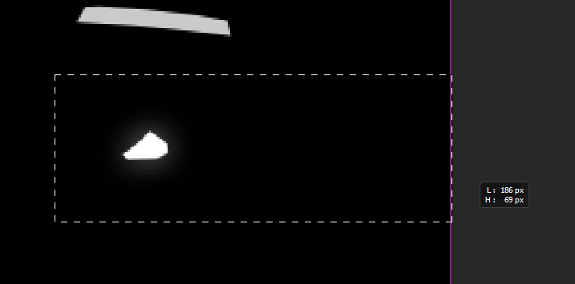

# 🎨 Customizing the color picker widget

Creating a custom color picker widget for your vehicle requires to handle an image editor like Adobe Photoshop or a free alternative and to have a bit of creativity in order to get a decent result. I will explain in details how I do so you can do it more easily.

### Add the color picker InkWidget to your project

The color picker widget displayed in the game is defined by a InkWidget file that you must copy into your project so we can modify it.

```
base\gameplay\gui\widgets\notifications\vehicle_visual_customization.inkwidget
```

### Hide the inner circle for secondary color

This InkWidget is a bit complicated to edit visually in WolvenKit so you will want to convert it to JSON and edit it with a text editor. Right-click on the InkWidget file and convert it to JSON.

Then into the readable JSON file perform the following search using a case-sensitive research.

```
"inner-circle"
"select-empty"
"wheel_2"
"paint_icon"
```


You must include quote characters ( `"` ) into the search.


For each of these keywords (including quotes) you will find exactly 4 results.

* Results 1 and 2 concern the inner color circle
* Results 3 and 4 concern the outer color circle.

As we do not have defined a secondary color yet, we want to hide the inner circle. For results 1 and 2 of these researches you need to change the `visible` field that is a few lines under the matching word. Change its value to `"visible": 0`.

<figure><figcaption><p>Toggle visibility to 0</p></figcaption></figure>

You should have performed **8 modifications**.

Now we must make the inner circle unselectable both for mice and gamepads. To do this search for `inkCircleInnerWidget`. You will find 2 occurrences. For each of them you need to go a few lines up from the matching word until you see `isInteractive` field.

Change its value to `"isInteractive": 0`. You should have performed **2 modifications**.

But this won't be enough for gamepads because they trigger the circle activation from code.

### Prevent gamepads from triggering the inner circle

We need to complete this by some code. Append this code into your project's script file. It will prevent gamepads from triggering the inner circle when switching modes.


```swift
// Prevents secondary color from being selectable by gamepads
@wrapMethod(vehicleColorSelectorGameController)
private final func GetNextValidMode(currentMode: vehicleColorSelectorActiveMode, opt direction: Int32) -> vehicleColorSelectorActiveMode {
  let player: ref<PlayerPuppet> = this.GetPlayerControlledObject() as PlayerPuppet;
  let gi: GameInstance = player.GetGame();

  let returnValue: vehicleColorSelectorActiveMode = wrappedMethod(currentMode, direction);

  if IsDefined(player.m_mountedVehicle)
  && NotEquals(Utils.Get(gi).IsTargetVehicle(player.m_mountedVehicle), ESupportedVehicle.Invalid)
  && Equals(returnValue, vehicleColorSelectorActiveMode.Secondary) {

      returnValue = wrappedMethod(returnValue, direction);
  }

  return returnValue;
}
```


### Modify the vehicle manufacturer name

We want to update the title of the widget so it will display `CrystalCoat™ by <manufacturer>` for your vehicle. For this we need to create a localized resource that can be translated to other languages.

Create a new folder for localization data in your project, then add a `File > New File` of JSON type named `en-us.json` into that folder. Now append this text into your existing XL file to allow your mod to handle localized strings.


Update the relative path to your JSON file in this text.


```
localization:
  onscreens:
    en-us: mynickname_modding\localization\en-us.json
```

Use English language as the default language if the user's language is not found. The first language code in the list will be the default fallback language. Then you can add any other language under it in any order with its own JSON file.

Convert your `en-us.json` file into readable JSON by right-clicking on it then choose `Convert to JSON`. Write this content into it and update these elements:

* Update the manufacturer name by one of your choice if needed (line 23).
* Create a new secondary key to use into the `secondaryKey` field (line 26). A secondary key is a unique identifier to identify the localized string. It is the same key across all languages. You should use something unique like a combination of words separated by dashes. For example use your nickname followed by your mod name followed by what your key is referring to: `mynickname-MyModName-colorpicker_title`


```yaml
{
  "Header": {
    "WolvenKitVersion": "8.14.0",
    "WKitJsonVersion": "0.0.8",
    "GameVersion": 2120,
    "ExportedDateTime": "2024-05-19T12:23:22.1993578Z",
    "DataType": "CR2W",
    "ArchiveFileName": ""
  },
  "Data": {
    "Version": 195,
    "BuildVersion": 0,
    "RootChunk": {
      "$type": "JsonResource",
      "cookingPlatform": "PLATFORM_PC",
      "root": {
        "HandleId": "0",
        "Data": {
          "$type": "localizationPersistenceOnScreenEntries",
          "entries": [
            {
              "$type": "localizationPersistenceOnScreenEntry",
              "femaleVariant": "CrystalCoat™ by Mahir",
              "maleVariant": "",
              "primaryKey": "0",
              "secondaryKey": "<use a secondary key here>"
            }
          ]
        }
      }
    },
    "EmbeddedFiles": []
  }
}
```


You can then convert your readable JSON file back into CR2W by right-clicking on the `en-us.json.json` file into the `raw` folder then choose `Convert from JSON`.

You can repeat the same process for any other language that you know:

* Create a dedicated JSON file
* Add the JSON file entry into the XL file using a new language code.
* Convert the JSON into readable JSON.
* Modify the JSON file content **using the same secondary key** as the other files.
* Convert the readable JSON back into CR2W.

InkWidget files need to use a primary key in order to identify a localized string. So we cannot directly use the secondary key into the InkWidget file.

Instead, we need to generate a hash number of our secondary key using a specific algorithm and then use this resulting number into the InkWidget file.

To create the hash number go into WolvenKit and use the menu `Tools > Hash Tool`. Copy your secondary key and paste it into the `Text` field of the new window.

<figure><figcaption><p>Creating a hash number</p></figcaption></figure>

As soon as your enter a text value into the `Text` field, you will see lot of numbers automatically generated into the other fields. This is what hashing is all about: translating an input data into a number that is unique and consistent regarding the input data.

This means that as long as you enter the same text you will always obtain the same hash number. Thus we can say that the hash number represents your input text. This operation is made possible by the hash algorithm (FNV1A64) that is a complex mathematical algorithm that you really don't want to know about.

What you need here is to copy the `CName` field value. Then, in your readable JSON file corresponding to the InkWidget, search for `LocKey#96050` and replace it with `LocKey#<your hash number>`.

On the example above, the new LocKey would be `LocKey#17052470697381502790`. You should have replaced **2 occurrences**.

You can now convert your JSON file back into InkWidget.


You must **not** write the generated hash number into the `en-us.json` file or into any other JSON language file.


### Allow your mod to display a custom color picker widget

Now we want the user to display our custom color picker widget when he his using the relevant vehicle. To do this append the following code to your script and replace the widget path (line 16) by the relative path to yours using double-backslashes (`\\`).

You may also need to modify the vehicle model `ESupportedVehicle.Supron` that is right above it (line 15).

<pre class="language-swift" data-line-numbers><code class="lang-swift">// Use a custom color picker widget
@wrapMethod(PopupsManager)
private final func SpawnVehicleVisualCustomizationSelectorPopup() -> Void {
  let player: ref&#x3C;PlayerPuppet> = this.GetPlayerControlledObject() as PlayerPuppet;
  let gi: GameInstance = player.GetGame();

  if IsDefined(player.m_mountedVehicle) {
    
    let vehicleModel: ESupportedVehicle = Utils.Get(gi).IsTargetVehicle(player.m_mountedVehicle);
    if NotEquals(vehicleModel, ESupportedVehicle.Invalid) {
      
      let data: ref&#x3C;inkGameNotificationData> = new inkGameNotificationData();

      switch vehicleModel {
<strong>        case ESupportedVehicle.Supron:
</strong><strong>          data.notificationName = n"hgyi56_modding\\widget\\colorpicker\\vehicle_visual_customization.inkwidget";
</strong>          break;
      }

      data.queueName = n"VehicleVisualCustomization";
      data.isBlocking = true;
      data.useCursor = true;
      this.m_vehicleVisualCustomizationSelectorToken = this.ShowGameNotification(data);
      this.m_vehicleVisualCustomizationSelectorToken.RegisterListener(this, n"OnVehicleVisualCustomizationCloseRequest");
      this.m_blackboard.SetBool(this.m_bbDefinition.Popup_CarColorPicker_IsShown, true);
    }
    else {
      wrappedMethod();
    }
  }
  else {
    wrappedMethod();
  }
}
</code></pre>

Now you can test your mod.

<figure><figcaption><p>Custom color picker with primary color only</p></figcaption></figure>

> Wait ! There is still a sports car displayed ! This is not my vehicle !

## Using a custom vehicle image

The most accurate way to represent the actual vehicle into the widget is to use the 3D model of the vehicle unless you would be an artist able to create a wonderful artwork by hand.

To do this we must export it from WolvenKit and import it into Blender.

### Create a temporary project to build the entity

Into WolvenKit create a new temporary project, find the ENT file of the vehicle in the Asset Browser then add it to your project.

```
base\vehicles\standard\v_standard25_mahir_supron_01__basic_01.ent
```


Do not use your CrystalCoat project to perform this step or it will be populated with dozen of undesired files !


Select the ENT file in your project then go into the menu `Tools > Script Manager`. Select `Export_Vehicle_Ent` and click on the green arrow next to it to run the script. Then wait for it to finish adding files to your project.

### Import the entity into Blender

Open Blender and in the import menu select `Cyberpunk Entity (.json)`. Then in the dialog window find the `*.ent.json` file of your vehicle into the `raw` folder of the temporary project.

Before validating, be sure to enter the entity appearance to load in the upper right corner. For the Mahir Supron we want to load `mahir_supron__basic_player_01`. This is the value in the `appearanceName` field of the vehicle record.


Uncheck "With Materials" before validating or the import will be unnecessarily long.


<figure><figcaption><p>Import the entity into Blender</p></figcaption></figure>

Now hide the armature and remove all decals you see around the vehicle. The idea is to obtain a clean 3D model and take a screenshot of it. Then we will dump the project.

Decals are all these flat rectangle elements. Click on them and remove them all. Generally they are grouped together for each component so selecting one will select a group of decals.

<figure><figcaption><p>Remove all decals from the model</p></figcaption></figure>

If you notice that some elements are not placed correctly like the license plate you can simply remove them, if this is a window it is better to move it to the right place.

Once the vehicle is clean and ready, create a plane mesh under its wheels that we will use as a background. Then make this plane to display as green to make the image editing easier.

To display it as green, select the plane then on the right menu go into the materials tab (red sphere icon) click on `New` to add a material to the plane.

Then in the material definition go into the `Viewport Display` section and set the color to full green.

<figure><figcaption><p>Prepare the background plane</p></figcaption></figure>

Now activate the `TexturePaint` mode in the upper left corner of the viewport, place the camera from the top by clicking on the Z axis node in the upper right corner of the viewport. Zoom and center the view on the vehicle then take a screenshot of it. Be sure to keep a few space around the vehicle model.

<figure><figcaption><p>Take a screenshot of the vehicle from the top view</p></figcaption></figure>

### Open the screenshot in your favorite image editor

I will use Adobe Photoshop in order to prepare the vehicle image but you can certainly do the same with another image editor. However you will have to find the corresponding tools.

First isolate the model by leaving a few space around. Then use the **magic wand** to select the green areas.&#x20;


Some vehicles may also have holes from the top view. In this case do not forget to select these green areas too.


<figure><figcaption><p>Isolate the model and select all the green areas</p></figcaption></figure>

Once you have selected all the green areas, invert the selection by right-clicking on it and select "Invert" (I don't use English so I may be wrong on the exact word).

The selection will now select everything except the green areas. Press CTRL + C to copy the model then on the lower right corner create a new layer by using the `+` icon. Then press CTRL + V to paste the model into it so you get rid of the green background.

You can now delete the layer containing the green background.

<figure><figcaption><p>Isolate the model into a new layer</p></figcaption></figure>

Now we want to make this model look a bit more like a drawing so what I do is first increase the brightness of the picture by 50%.

<figure><figcaption><p>Increase the brightness by 50%</p></figcaption></figure>

Next apply a filter on the picture to make it look a bit more like a drawing. Use the `Filter > Filter Gallery...` menu. Then select `Artistic > Paint Daubs` (French is "Barbouillage") with parameters `Brush Size = 2`, `Sharpness = 20`and `Brush Type = Simple`.

<figure><figcaption><p>Apply Paint Daubs filter</p></figcaption></figure>

Finally reduce the Saturation of the image by 100% to remove pink borders.

<figure><figcaption><p>Reduce the saturation by 100%</p></figcaption></figure>

Our model is now ready to be used into WolvenKit.


Create a backup of this model picture so you will be able to reuse this picture later to create a mask for the secondary color.


### Create a texture for the color picker widget

In order to use our model into the color picker widget we need to use a XBM texture file and to modify it. Add this one to your project and then use the `Tools > Export Tool` to convert it into TGA.

```
base\gameplay\gui\widgets\notifications\vehicle_visual_customization_car_preview.xbm
```

<figure><figcaption><p>Export the XBM texture to TGA</p></figcaption></figure>

Open the TGA file into your image editor. You will see that it uses 5 channels: RGB, Red, Green, Blue and Alpha. When you click on the RGB channel it displays all the three colored channels together while if you click on the Alpha channel it will display another image with only gray shades.

When we modify something in the picture we need to modify it both in the RGB channel and also in the Alpha channel. When we manipulate layers they will only apply in the RGB channel.

<figure><figcaption><p>Texture parts and channels</p></figcaption></figure>

On the picture we can see multiple parts. The idea is to replace the main model by our vehicle and then eventually to replace the secondary color mask with ours or to hide it. Finally replace the light beam, and both the headlight and tail light elements. We will leave the white square mask and the Cosmetic\_Troll data code as they are.

We can eventually make the picture larger if our elements do not fit into it but we must keep the same vertical size so the widget will display them correctly. Especially concerning the vehicle and the secondary color mask parts.

### Changing the vehicle model part

Now use the RGB channel and paste your model layer in the image. Then resize it while keeping its aspect ratio and make it the same vertical size as the original image.

When your model is placed and resized correctly select the original layer eventually unlock it if necessary and then select a large area to cover the entire original vehicle part. Then fill the areas with black color to remove the original vehicle picture.

<figure><figcaption><p>Place the new model and remove the original one</p></figcaption></figure>

Then go into the Alpha channel and remove the vehicle part using a black area.

<figure><figcaption><p>Remove the original model in the Alpha channel</p></figcaption></figure>

Now go back into the RGB channel, select your model layer then hold CTRL key and left-click on the layer image to create a selection around it.

<figure><figcaption><p>Create a selection around your model</p></figcaption></figure>

Then go into the Alpha channel and fill your selection with white color. It should be placed at the exact same position as the model image on the RGB channel.

<figure><figcaption><p>Modify the alpha channel for the model</p></figcaption></figure>

Finally go back into RGB channel, then layers tab and merge the model layer with the base layer.

### Changing the headlight part

Now you know how to modify one part of the texture for both the RGB and Alpha channels. As we currently don't have a secondary color we can remove the secondary color mask from both channels.

All you have to do is to fill the secondary color mask area with black color on both channels. The next step is to modify the headlight element.

First we want to know where is the element into the game when headlights are turned on. For the Mahir Supron there are several light elements the create.

<figure><figcaption><p>Headlights components</p></figcaption></figure>

To keep things simple, we will only create a single light component on the right of the vehicle. In the image editor let's create a simple shape in a new layer at the same position as the main headlight component.

<figure><figcaption><p>Create a new headlight component and fill it</p></figcaption></figure>

Now we have a new headlight component in a dedicated layer, let's move it at the position of the existing one and replace it for the RGB channel like we did for the previous part.

Concerning the Alpha channel we will do differently. Once the element is placed correctly, duplicate the layer using CTRL + J in the RGB channel and create a style on it to make it full white. To do so right-click on the new layer and select the first element of the list. Then add a color coating with white color.

<figure><figcaption><p>Create a new element for the alpha channel</p></figcaption></figure>

Then merge the style you have just created with the layer itself by right-clicking on it and choose this option.

<figure><figcaption><p>Merge layer style</p></figcaption></figure>

Now your alpha element is placed right over the RGB element. Select the alpha element layer then hold CTRL and left click on the layer image to create a selection around your element. Then press CTRL + C.

Go into the Alpha channel and paste using CTRL + V. Your pasted element shall be at the same location as the one in the RGB channel. Now you can click anywhere to validate. Go back into the layers tab and delete the one you have just created.

Finally switch back and forth from RGB channel to Alpha channel to check that both elements are at the same location. You should see a white element in the Alpha channel while it is a little bit darker one in the RGB channel.

You can finally merge the headlight layer with the base layer.

<figure><figcaption><p>Comparing the RGB and Alpha channels</p></figcaption></figure>

### Changing the tail light part

Now we are going to repeat the same process for the tail light element. Except that instead of filling it with gray color, we are going to use the gradient tool with a dark red and a light red color.

<figure><figcaption><p>Tail light location on the vehicle</p></figcaption></figure>

Create a new layer, then create a simple selection at the tail light location and select the gradient tool. Select the basic gradient and fill the selection.

<figure><figcaption><p>Create the tail light element</p></figcaption></figure>

Now place the element at the location of the existing one. Right-click on the layer and add a new style with a red external glowing effect in order to create a similar effect as the original element.

<figure><figcaption><p>Create a glowing effect on the tail light element</p></figcaption></figure>

Now remove the original tail light element as usual (both in RGB and Alpha channels) and place the new one at the same spot. Before merging the style with the layer, duplicate the layer and modify its style to have a white glowing effect and a white filling color for the alpha element.

Then merge the style of the alpha element, then select both this layer and the base layer and merge them.

<figure><figcaption><p>Merge the alpha element with the base layer</p></figcaption></figure>

Now create a rectangle selection that goes from the right border of the picture until you have the alpha element into it. Then copy the selection, go into the Alpha channel and paste it so it will be at the same location.

<figure><figcaption><p>Copy the alpha element from the RGB channel to the Alpha channel</p></figcaption></figure>

Go back into the RGB channel and delete the alpha element by selecting the spot and filling it with black color. Show the red tail light element back and merge its style then merge the layer with the base layer.

### Changing the light beam part

The last element we need to change is the light beam. Essential it will consist in modifying its base area so it complies with the shape of our headlight element. On some vehicles it is also necessary to enlarge it if the headlight component is larger.

First create a new layer containing a copy of the light beam by selecting a rectangle along the top and right borders.

<figure><figcaption><p>Create a new light beam element from the existing one</p></figcaption></figure>

Now click on the base layer and use the magic wand tool to select the headlight component area then move the selection by dragging it (not the headlight element) up to the light beam until it is all into it. Click on the new light beam layer. Also hide the base layer to better see the result. Then hit the DELETE key to remove pixels in the selection for our new layer. Then delete the remainings below it too.

<figure><figcaption><p>Remove pixels into the selection on the light beam element</p></figcaption></figure>

Then toggle the visibility of the light beam element to OFF and turn the base layer back ON. Remove the original light beam both in the RGB and Alpha channels as we did for the previous parts.

Then toggle the new light beam layer back ON and merge it with the base layer. The select the area of the light beam and paste it in the Alpha channel.

You should now have this final result.

<figure><figcaption><p>RGB and Alpha channels for the texture</p></figcaption></figure>


Your image should not be larger than 1200 pixels or the InkWidget won't display the texture parts correctly.


Now save the picture as TARGA / TGA image and be sure to select 32-bits/pixel and import it back into WolvenKit using the `Tools > Import Tool`.

<figure><figcaption><p>Save to TGA using 32-bits/pixel option</p></figcaption></figure>

### Setting the texture parts

Now you have imported the TGA file back into XBM we must use a InkAtlas file in order to create texture parts from our XBM file.

Add this file into your project at the same location as the XBM.

```
base\gameplay\gui\widgets\notifications\vehicle_visual_customization_car_preview.inkatlas
```

Then open it and set the relative path to your XBM file in place of the three elements of the `slots` array.

<figure><figcaption><p>Set the XBM relative path in the InkAtlas file</p></figcaption></figure>

Now go into the `Part Mapping` tab and see that eventually all parts are already well placed so you won't have to modify parts. In the case you need to modify some of them. Let's explain how it works.

In the Part Mapping tab, click on a part then see on the right there are informations like Left, Top, Width, Height using pixel unit. The rectangle of the texture part is defined like this:

* Left: number of pixels between the left border of the image and the left border of the part
* Width: number of pixels between the left border of the part and the right border of the part
* Top: number of pixels between the top border of the image and the top border of the part
* Height: number of pixels between the top border of the part and the bottom border of the part

But the issue is that you cannot set the new part area from here, you can only play with the pixel values to define a new visual area that you find better. You cannot save this information like this. But instead once you have finished to define your new part area, remember the pixel values of Left, Width, Top, Height fields.

Then know the size of your texture image. Let's say the picture size is 960 x 850 pixels. You can calculate the ratio between your part area borders and the image size.

Let's use the example of the headlight element. Its rectangle area is Left: 770, Width: 170, Top: 240 and Height: 40 then you have to calculate into a 0:1 UV space the equivalent of these coordinates.

On the horizontal axis, 0 is the left border of the image, 1 is the right border of the image. On the vertical axis, 0 is the top border of the image, 1 is the bottom border of the image. Then you find this result:

Left: 770 / 960 = 0,8020833333333333

Right: (770 + 170) / 960 = 0,9791666666666667

Top: 240 / 850 = 0,2823529411764706

Bottom: (240 + 40) / 850 = 0,3294117647058824

The decimals are important in order to keep precision. Then go back into the first tab and open the first slot element then update the fields with these values to define the new part area.

<figure><figcaption><p>Define new UV coordinates of the texture parts</p></figcaption></figure>

If you want to check the new visual area after you have modified the coordinates you need to save the file and reopen it. Do this for all required parts until none of them overlaps another.

Finally remove the elements 1 and 2 of the `slots` array and duplicate the first element twice so they are all 3 identical.

Before we can test the result, we need to actually use the InkAtlas file into the InkWidget file. To do this convert your InkWidget into JSON then replace all occurrences of this path by the relative path to your InkAtlas file using double-backslashes (`\\`).

```
base\\gameplay\\gui\\widgets\\notifications\\vehicle_visual_customization_car_preview.inkatlas
```

Then convert your JSON file back into InkWidget. You can now test your mod.

<figure><figcaption><p>Testing the widget with our new model</p></figcaption></figure>

> Wait ! Light components do not correspond to what is on the actual vehicle !

Well we are almost there ! As you can see the widget automatically duplicate the light components symetrically for headlights, tail lights and light beams. We can also see that it applies a mirror effect on half of them.

For this vehicle we need to use only one of each and to place them differently. This must be done into the InkWidget file.

### Place light parts on the widget

For this step we can edit the widget directly in WolvenKit. Open the file and go into this element hierarchy `libraryItems > package > rootWidget > children > container > children > CenterGroup > children > Car > children`.

<figure><figcaption><p>Light components into the InkWidget</p></figcaption></figure>

Here you have the list of elements related to the vehicle.

* `CarColorPrintC1` is the main model
* `CarColorPrintC2` is the secondary color mask
* `CarColorPrintLights1` and 2 are the tail lights
* `CarColorPrintLightsFront1` and 2 are the headlights
* `CarColorPrintLightsFront1Beam` and 2Beam are the light beams.

We will keep the right headlight component as it is the closest to the actual location we need. But as you noticed it has been mirrored so we will change this and its location.

Go into `CarColorPrintLightsFront1` which is the left headlight and uncheck the `visible` field so it will be hidden.

Into the `CarColorPrintLightsFront2` set `mirrorType` to `NoMirror`. Then into `layout > margin` you will set its relative position in pixels. There is no fast method to find the right values you need to try new values and save the file, install the mod and test the mod and so on until it matches.

If you are creating the same mod as me, I will save you some time and give you my values for the Mahir Supron. Left: 99, Top: -432.

Go into `CarColorPrintLights1` which is the left tail light and uncheck the `visible` field so it will be hidden.

Into the `CarColorPrintLights2` set `mirrorType` to `NoMirror`. Then modify the position into `layout > margin`. For the Mahir Supron I have used Left: 138, Top: 352.

Go into `CarColorPrintLightsFront1Beam` which is the left light beam and uncheck the `visible` field so it will be hidden.

Into the `CarColorPrintLightsFront2Beam` set `mirrorType` to `NoMirror`. Then modify the position into `layout > margin`. For the Mahir Supron I have used Left: 109, Top: -528.

If you test the mod now you may see that details of the outer circle have disappeared. This may occur if you modify the file from WolvenKit. To fix this convert your InkWidget into JSON and [refer to this paragraph](customizing-the-color-picker-widget.md#hide-the-inner-circle-for-secondary-color). For each of the keywords, set the field `visible: 1` for results 3 and 4.

Now let's see the result.

<figure><figcaption><p>Custom color picker widget</p></figcaption></figure>

> Wonderful ! My color picker widget is now perfect !
>
> But wait ! I am a bit disappointed with my CrystalCoat. I would like to have a more _premios_ result !
>
> My Supron feels cheap !
