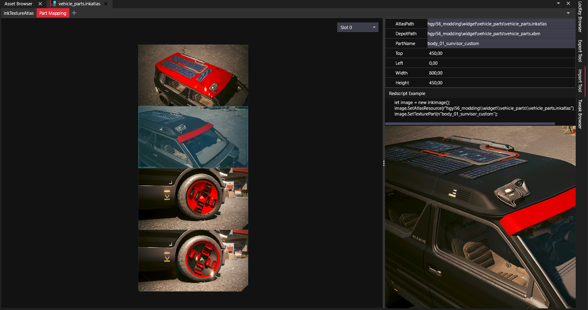

# 🕹️ Improving mod settings

We have added customizable parts in the mod settings [in this paragraph](customizing-the-roof.md#add-a-new-feature-to-the-script). So we can define parts appearance when CrystalCoat is ON and also when it is OFF. Most of the time, users will want to customize only one of the CrystalCoat states at a time.

So it would be nice to be able to hide all CrystalCoat ON/OFF settings. Mod Settings allows to do this natively using dependencies.

In the general settings category we need to add two toggle settings.


The toggle for CrystalCoat OFF settings is disabled by default. Because unless wanted by the user, you want your vehicle to revert to its original appearance and keep the custom settings for the CrystalCoat appearance.


<pre class="language-swift"><code class="lang-swift">@runtimeProperty("ModSettings.mod", "MyModName")
@runtimeProperty("ModSettings.category", "MyNickName-MyModName-general-cat")
@runtimeProperty("ModSettings.category.order", "1")
@runtimeProperty("ModSettings.displayName", "MyNickName-MyModName-general-enable_cc_on")
@runtimeProperty("ModSettings.description", "MyNickName-MyModName-general-enable_cc_on-desc")
public let enableCCOnSettings: Bool = true;

@runtimeProperty("ModSettings.mod", "MyModName")
@runtimeProperty("ModSettings.category", "MyNickName-MyModName-general-cat")
@runtimeProperty("ModSettings.category.order", "1")
@runtimeProperty("ModSettings.displayName", "MyNickName-MyModName-general-enable_cc_off")
@runtimeProperty("ModSettings.description", "MyNickName-MyModName-general-enable_cc_off-desc")
<strong>public let enableCCOffSettings: Bool = false;
</strong></code></pre>

You must replace the [secondary keys](customizing-the-color-picker-widget.md#modify-the-vehicle-manufacturer-name) and the mod name with yours. Then into your JSON language files you must define 4 new keys.

```yaml
{
  "$type": "localizationPersistenceOnScreenEntry",
  "femaleVariant": "Show CrystalCoat™ ON settings",
  "maleVariant": "",
  "primaryKey": "0",
  "secondaryKey": "MyNickName-MyModName-general-enable_cc_on"
},
{
  "$type": "localizationPersistenceOnScreenEntry",
  "femaleVariant": "Show settings concerning the CrystalCoat™ ON state.",
  "maleVariant": "",
  "primaryKey": "0",
  "secondaryKey": "MyNickName-MyModName-general-enable_cc_on-desc"
},
{
  "$type": "localizationPersistenceOnScreenEntry",
  "femaleVariant": "Show CrystalCoat™ OFF settings",
  "maleVariant": "",
  "primaryKey": "0",
  "secondaryKey": "MyNickName-MyModName-general-enable_cc_off"
},
{
  "$type": "localizationPersistenceOnScreenEntry",
  "femaleVariant": "Show settings concerning the CrystalCoat™ OFF state.",
  "maleVariant": "",
  "primaryKey": "0",
  "secondaryKey": "MyNickName-MyModName-general-enable_cc_off-desc"
}
```

Then for each setting that concerns the CrystalCoat OFF state, we need to add a new `runtimeProperty` to create a dependency with the OFF toggle setting we have just created.

```swift
@runtimeProperty("ModSettings.dependency", "enableCCOffSettings")
```

Each setting that concerns the CrystalCoat ON state needs a new `runtimeProperty` to create a dependency with the ON toggle setting we have just created.

```swift
@runtimeProperty("ModSettings.dependency", "enableCCOnSettings")
```

When you disable either one of the toggle settings, their associated settings we be hidden from the mod settings page. This will allow for a better readability of your settings page.

<figure><figcaption><p>Only show settings that concern a CrystalCoat state</p></figcaption></figure>

## Display vehicle parts

Another cool feature would be to display the vehicle parts associated with each setting so the user easily understand what he is modifying.

<figure><figcaption><p>Display the vehicle areas affected by each setting</p></figcaption></figure>

This feature requires to use additional files to add to your project.


Widget and resources associated with vehicle parts


This ZIP archive contains 3 files:

* `vehicle_part.inkatlas`: this file acts like an organizer for the following texture so the script can select only a portion of it.
* `vehicle_part.xbm`: a texture that contains one vehicle picture for each setting.
* `vehicle_picture.inkwidget`: this widget will display the vehicle image into the mod settings page.

Regroup these files into a folder then open the InkAtlas file and update its `slots` array by using the XBM texture file path into the `texture` field of each array element.

<figure><figcaption><p>Update the InkAtlas file using the XBM file path</p></figcaption></figure>

In order to create pictures for your settings you can use the photo mode of the game while your vehicle is using a specific appearance. In the example picture of the Caliburn above I have used a black matte paint with only the relevant component using a red glossy appearance.

## Create a matte paint aspect

First lets create the matte paint aspect [following this paragraph](creating-a-custom-paint.md#creating-a-glossy-paint). I will only talk about the differences. Concerning the mlsetup, the base mltemplate file to use is this one.

```
base\surfaces\materials\plastic\plastic_hq\plastic_tech_hq_01_30.mltemplate
```

And the mlsetup parameters are these ones.

```
Offset U = 0.0
Offset V = 0.0
Roughness In = null
Roughness Out = (0.2953,0.498)
Normals = (undefined)
Metalness Out = (0,0.5)
ColorCode = 3eaf77_d42857
µBlends texture = base\surfaces\microblends\default.xbm
µBlends tiles = 10,1000004
µBlends contrast = 1
µBlends normals = 0
µBlends offset U = 0
µBlends offset V = 0
```

<figure><figcaption><p>MLSB matte paint aspect</p></figcaption></figure>

Next, for each impacted mesh file in the `matte` material remove all parameters except the MultilayerMask and MultilayerSetup.

<figure><figcaption><p>Matte material definition</p></figcaption></figure>

## Create a red appearance

Now we want all customizable components to be able to use a red glossy appearance. In order to do this [follow this paragraph](customizing-the-roof.md#define-a-new-mesh-appearance-and-material). I will only talk about the differences here.


Customizable components are the roof, the sun visor, the wheels inserts and the wheels painted areas.


In order to a have a deep color we need to create a custom mltemplate and define color codes into it. Then use this mltemplate file into the mlsetup instead of the original one. Add this file to your project and open it in WolvenKit.

```
base\surfaces\materials\plastic\plastic_hq\plastic_tech_hq_01_30.mltemplate
```

Go into `overrides > colorScale > c2162c_null > v` and set these values `(1, 0, 0)` for a deep red color. It uses a RGB float code. Index 0 is red, index 1 is green and index 2 is blue. Value 0 is black, 1 is white. Now save the file and copy its relative path.

In the mlsetup file use the path to your custom mltemplate file and then use the red color code we have modified `c2162c_null`. Then into the red material definition of the mesh files, set these parameters values.

```
CoatTintFwd = (red:127, green:127, blue:127, alpha:255)
CoatTintSide = (red:127, green:127, blue:127, alpha:255)
CoatSpecularColor = (red:191, green:191, blue:191, alpha:255)
```

<figure><figcaption><p>Red material definition</p></figcaption></figure>


Now our parts can all be turned into black matte paint and red except for the sun visor. So we need to allow the sun visor to use paint materials. Let's make all of our parts be able to use the same materials. It will offer more options to the users.


For this we need to modify the type used by the sun visor setting field related to CrystalCoat ON state.

<pre class="language-swift" data-full-width="false"><code class="lang-swift">@runtimeProperty("ModSettings.mod", "MyModName")
@runtimeProperty("ModSettings.category", "MyNickName-MyModName-body-cat")
@runtimeProperty("ModSettings.category.order", "2")
@runtimeProperty("ModSettings.displayName", "MyNickName-MyModName-body-on-sunvisor")
@runtimeProperty("ModSettings.description", "MyNickName-MyModName-body-on-sunvisor-desc")
@runtimeProperty("ModSettings.displayValues.Standard", "MyNickName-MyModName-enum-standard")
<strong>@runtimeProperty("ModSettings.displayValues.Coated", "MyNickName-MyModName-enum-coated")
</strong><strong>@runtimeProperty("ModSettings.displayValues.Painted", "MyNickName-MyModName-enum-painted")
</strong>@runtimeProperty("ModSettings.displayValues.Black", "MyNickName-MyModName-enum-black")
<strong>@runtimeProperty("ModSettings.displayValues.Red", "MyNickName-MyModName-enum-red")
</strong>@runtimeProperty("ModSettings.dependency", "enableCCOnSettings")
<strong>public let sunvisorAppearanceCC: EMeshAppearanceCC = EMeshAppearanceCC.Black;
</strong></code></pre>

Next we need to create a WorldWidgetComponent to enable CrystalCoat coloring on the sun visor.

<figure><figcaption><p>Create a widget for the sun visor</p></figcaption></figure>

Finally we need to copy the missing `appearances`, `materialEntries` and `localMaterialBuffer > materials` entries from the roof component and paste them into the sun visor mesh file.


We can simply copy them because both components have been created from the same `body_01` component so they share the same mlmask.


We need to copy the `coated`, `metallic`, `glossy` and `matte` appearances and materials. Now our vehicle is ready for a photo shoot.

<figure><figcaption><p>Red roof with black matte components</p></figcaption></figure>

## Create the vehicle parts texture

We have added a file named `vehicle_parts.xbm` to our project. This file contains a matrix of pictures for each of the customizable components of the vehicle. In order to populate this texture we will use Adobe Photoshop or another image editor.

Now take clean screenshots of the vehicle focused on the red part. We need one picture for each customizable component.

Into your image editor create a new project with a size of 2000x2000 pixels and a transparent background. We are going to append our pictures stick to each other from top to bottom and apply some color correction. As we only have 4 pictures we can simply put them one under the other.

Import your pictures one by one and resize them to 800px large by using `Edit > Free Transform`. Then use the `Image > Auto Tone` to fix the overall colors. You must have one picture per layer. So you need to apply the color correction on each of them seperately.

Now we need to enhance the red color to make it more visible. To do this select the areas that correspond to the red parts using the menu `Select > Color Range`. Then use a tolerance of 100 and once you are done, remove any part of the selection that wouldn't correspond to the red areas of the vehicle component.

Next use the menu `Image > Adjustments > Vibrance` and set a saturation of 100 and a vibrance of 50.

Next we need to crop the bottom corners so the images will fit into the widget. To do this create a rectangle selection with size 70x70 pixels. Then use `Select > Transform Selection` to rotate it to 45° so you get a diamond-shaped selection. Now save your selection using the menu `Select > Save Selection` and name it "big diamond".

<figure><figcaption><p>Create a diamond-shaped selection</p></figcaption></figure>

Now move your selection to the bottom-right corner of the first picture so the center of the selection is aligned with the corner. Then select the corresponding layer, right-click on it and select `Rasterize Layer`. Then hit the DEL key to remove the pixels. Repeat this operation for the other pictures.

<figure><figcaption><p>Crop the bottom-right corner of all images</p></figcaption></figure>

Now create a new selection with size 16x16 pixels and repeat the same operation with the bottom-left corner of all the pictures. You should now have this final result.

<figure><figcaption><p>Texture ready to be used</p></figcaption></figure>

Export the vehicle\_parts.xbm file into PNG using the `Tools > Export Tool`. Now erase the PNG file with your new texture. Then import it back into WolvenKit using these options.

<figure><figcaption><p>Import options for the vehicle parts texture</p></figcaption></figure>

## Organize the texture parts

The next step is to open the `vehicle_parts.inkatlas` and define the different parts of the texture. To do this go into the `slots > [0] > parts` array. Edit the `part_name` element by changing its name with the component name `body_01_roof_custom`.

Then into the `clippingRectInUVCoords` field we need to define the texture area corresponding to the picture. UV coordinates goes from 0 to 1 in both axis. (0;0) is the top left corner of the texture, and (1;1) is the bottom-right corner. As we have defined 4 pictures vertically we must divide the parts as following.

Create duplicate this element in the parts array to create the other ones.

* `body_01_roof_custom: Bottom:0,25, Left:0, Right:1, Top:0`
* `body_01_sunvisor_custom: Bottom:0,5, Left:0, Right:1, Top:0,25`
* `wheel_01_painted_custom: Bottom:0,75, Left:0, Right:1, Top:0,5`
* `wheel_01_inserts_custom: Bottom:1, Left:0, Right:1, Top:0,75`

Now save the file and go into the `Part Mapping` tab to check the result. You should be able to select your pictures individually.

<figure><figcaption><p>Vehicle parts inkatlas</p></figcaption></figure>

## Add a new feature using script

In order for the mod settings menu to use your pictures and display a widget we need to add some code to create this new feature.

First add the new class into your script. Then perform some case-sensitive replacements into it.

* Replace `MyNickName.MyModName` with your module name (line 13).
* Replace `path\\to\\vehicle_picture.inkwidget` with the relative path to yours. You must use double-backslashes (`\\`) at line 18.

<pre class="language-swift" data-line-numbers data-full-width="true"><code class="lang-swift">public class VehiclePart_WidgetHandler extends ScriptableSystem {
  
  public let modList: ref&#x3C;inkWidget>;
  public let modListProxy: ref&#x3C;inkAnimProxy>;

  public let widget: wref&#x3C;inkWidget>;
  public let atlasResource: ResRef;
  public let texturePart: CName;

  public let shouldBeVisible: Bool = false;

  public static func Get(gi: GameInstance) -> ref&#x3C;VehiclePart_WidgetHandler> {
<strong>    return GameInstance.GetScriptableSystemsContainer(gi).Get(n"MyNickName.MyModName.VehiclePart_WidgetHandler") as VehiclePart_WidgetHandler;
</strong>  }

  public func CreateWidget(parentWidget: ref&#x3C;inkWidget>, settingsSelector: ref&#x3C;SettingsSelectorController>) {
    if !IsDefined(this.widget) {
<strong>      let widgetResource: ResRef = r"path\\to\\vehicle_picture.inkwidget";
</strong>      this.widget = settingsSelector.SpawnFromExternal(parentWidget, widgetResource, n"Root");
    }
  }
  
  protected cb func ChangeVehiclePart(e: ref&#x3C;inkAnimProxy>) -> Bool {
    if IsDefined(this.widget) {

      let imageWidget = (this.widget as inkCompoundWidget).GetWidgetByPathName(n"hint/car") as inkImage;
      imageWidget.SetAtlasResource(this.atlasResource);
      imageWidget.SetTexturePart(this.texturePart);

      if this.shouldBeVisible {
        this.FadeWidget(true);
      }
    }
  }

  public func FadeWidget(visible: Bool) -> ref&#x3C;inkAnimProxy> {
    let targetOpacity = visible ? 1.0 : 0.0;
    let targetModListOpacity = visible ? 0.05 : 1.0;

    if !IsDefined(this.widget) {
      return null;
    }

    if IsDefined(this.modListProxy)
    &#x26;&#x26; !this.modListProxy.IsFinished() {
      this.modListProxy.Stop();
    }

    let alphaAnim = new inkAnimTransparency();
    alphaAnim.SetStartTransparency(this.modList.GetOpacity());
    alphaAnim.SetEndTransparency(targetModListOpacity);
    alphaAnim.SetType(inkanimInterpolationType.Quartic);
    alphaAnim.SetMode(inkanimInterpolationMode.EasyOut);
    alphaAnim.SetDuration(0.5);
    
    if !visible {
      alphaAnim.SetStartDelay(1.0);
    }
    
    let animDef = new inkAnimDef();
    animDef.AddInterpolator(alphaAnim);
    this.modListProxy = this.modList.PlayAnimation(animDef);

    alphaAnim = new inkAnimTransparency();
    alphaAnim.SetStartTransparency(this.widget.GetOpacity());
    alphaAnim.SetEndTransparency(targetOpacity);
    alphaAnim.SetType(inkanimInterpolationType.Quartic);
    alphaAnim.SetMode(inkanimInterpolationMode.EasyInOut);
    alphaAnim.SetDuration(0.2);
    
    animDef = new inkAnimDef();
    animDef.AddInterpolator(alphaAnim);

    return this.widget.PlayAnimation(animDef);
  }
  
  public func ShowVehiclePart(atlasResource: ResRef, texturePart: CName, parentWidget: ref&#x3C;inkWidget>, settingsSelector: ref&#x3C;SettingsSelectorController>) {
    this.atlasResource = atlasResource;
    this.texturePart = texturePart;
    this.shouldBeVisible = true;

    this.CreateWidget(parentWidget, settingsSelector);
    let animProxy = this.FadeWidget(false);

    if IsDefined(animProxy) {
      animProxy.RegisterToCallback(inkanimEventType.OnFinish, this, n"ChangeVehiclePart");
    }
  }
}
</code></pre>

Next we need to add these two methods (outside of any class). Then perform some case-sensitive replacements into it.

* Replace `MyModName` with the name of your mod that you have used in the `runtimeProperty` elements of your mod settings (line 49). This should be the name as it appears in the mod list.
* Replace `path\\to\\vehicle_parts.inkatlas` by the relative path to yours. You must use double-backslashes (`\\`) at line 62.

Then as you can see we are using `if` blocks (lines 66-93) to identify settings category (line 66) and field (line 68) using secondary keys. You must use your own keys there. Then we assign the texture part name into the widget (line 70) so you may need to update these part names too with what you have set into the InkAtlas file.


You must trigger a vehicle part picture for both the CrystalCoat ON setting and the CrystalCoat OFF setting. Example at lines 68-69.


<pre class="language-swift" data-line-numbers data-full-width="true"><code class="lang-swift">@wrapMethod(SettingsSelectorController)
protected cb func OnHoverOver(e: ref&#x3C;inkPointerEvent>) -> Bool {

  let parent = this.GetRootWidget().parentWidget as inkCompoundWidget;

  let currentWidget = this.GetRootWidget() as inkCompoundWidget;
  let currentLabelWidget = currentWidget.GetWidgetByPathName(n"layout/labels/label");

  if IsDefined(currentLabelWidget) {
    let currentText = (currentLabelWidget as inkText).GetText();

    // Look backward in the list for the closest category
    let i = 0;
    let lastCategory: String = "";
    while i &#x3C; parent.GetNumChildren() { // Iterate over list elements
      let listItem = parent.GetWidgetByIndex(i) as inkCompoundWidget;

      // Iterate over list items from 0 until the selected one
      if currentWidget == listItem {
        break;
      }
      
      if Equals(listItem.GetName(), n"settingsCategory") {
        let label = listItem.GetWidgetByPathName(n"layout/inkCanvasWidget4/label");
        lastCategory = (label as inkText).GetText();
      }

      i += 1;
    }

    let widget = this.GetRootWidget().parentWidget.parentWidget.parentWidget.parentWidget.parentWidget.parentWidget as inkCompoundWidget;
    if IsDefined(widget) {

      // Check that the relevant mod is selected in the mod list
      widget = widget.GetWidgetByPathName(n"mod_settings") as inkCompoundWidget;
      let modList = widget.GetWidgetByPathName(n"mod_flex/mod_scroller/mods") as inkCompoundWidget;

      VehiclePart_WidgetHandler.Get(GetGameInstance()).modList = modList;

      let isValidModSelected = false;
      let i = 0;
      while i &#x3C; modList.GetNumChildren() {

        let child = modList.GetWidget(i) as inkCompoundWidget;
        let highlight = child.GetWidgetByPathName(n"txtValueHighlight");

        // Opacity = 1.0 means that the mod is selected
        if Equals(highlight.GetOpacity(), 1.0)
<strong>        &#x26;&#x26; Equals((highlight as inkText).GetText(), "MyModName") {
</strong>          isValidModSelected = true;
          break;
        }

        i += 1;
      }

      // Display the picture of the vehicle part
      if isValidModSelected {

        let widgetHandler = VehiclePart_WidgetHandler.Get(GetGameInstance());

<strong>        let atlasResource = r"path\\to\\vehicle_parts.inkatlas";
</strong>        let texturePart: CName;
        let showWidget: Bool = true;

        if Equals(lastCategory, GetLocalizedTextByKey(n"hgyi56-MyMahirSupron_Mod-body-cat")) {

          if Equals(currentText, GetLocalizedTextByKey(n"hgyi56-MyMahirSupron_Mod-body-on-roof"))
          || Equals(currentText, GetLocalizedTextByKey(n"hgyi56-MyMahirSupron_Mod-body-off-roof")) {
            texturePart = n"body_01_roof_custom";
          }
          else if Equals(currentText, GetLocalizedTextByKey(n"hgyi56-MyMahirSupron_Mod-body-on-sunvisor"))
          || Equals(currentText, GetLocalizedTextByKey(n"hgyi56-MyMahirSupron_Mod-body-off-sunvisor")) {
            texturePart = n"body_01_sunvisor_custom";
          }
          else {
            showWidget = false;
          }
        
          if showWidget {
            widgetHandler.ShowVehiclePart(atlasResource, texturePart, widget, this);
          }
        }
        else if Equals(lastCategory, GetLocalizedTextByKey(n"hgyi56-MyMahirSupron_Mod-wheels-cat")) {

          if Equals(currentText, GetLocalizedTextByKey(n"hgyi56-MyMahirSupron_Mod-wheels-on-painted"))
          || Equals(currentText, GetLocalizedTextByKey(n"hgyi56-MyMahirSupron_Mod-wheels-off-painted")) {
            texturePart = n"wheel_01_painted_custom";
          }
          else if Equals(currentText, GetLocalizedTextByKey(n"hgyi56-MyMahirSupron_Mod-wheels-on-inserts"))
          || Equals(currentText, GetLocalizedTextByKey(n"hgyi56-MyMahirSupron_Mod-wheels-off-inserts")) {
            texturePart = n"wheel_01_inserts_custom";
          }
          else {
            showWidget = false;
          }
        
          if showWidget {
            widgetHandler.ShowVehiclePart(atlasResource, texturePart, widget, this);
          }
        }
      }
    }
  }

  return wrappedMethod(e);
}

@wrapMethod(SettingsSelectorController)
protected cb func OnHoverOut(e: ref&#x3C;inkPointerEvent>) -> Bool {
  
  let widgetHandler = VehiclePart_WidgetHandler.Get(GetGameInstance());
  widgetHandler.shouldBeVisible = false;
  widgetHandler.FadeWidget(false);

  return wrappedMethod(e);
}
</code></pre>

Now you can test your mod and see that when you hover on the settings they fade out the mod list and make a picture appear to illustrate what this setting is refering to.

<figure><figcaption><p>Mod settings menu displaying vehicle parts</p></figcaption></figure>
