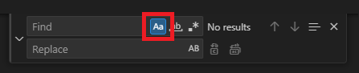
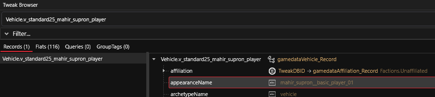

# ‼️ Scripting

## Implementing a new feature

In order to get a nice result for our CrystalCoat implementation we need to use some scripting. This script will also allow us to go deeper into the customization later.


Script template for CrystalCoat


Download this template, rename it with your mod name, and place it into your project at this location.

```
resources/r6/scripts/<mod name>/<mod name>.reds
```

Then edit the script using VSCode. You need to perform some replacements into the file to make it work for your mod. To replace text use CTRL + H.


Perform case-sensitive replacements to avoid mistakes.


<figure><figcaption><p>Case-sensitive replacement</p></figcaption></figure>

## Script setup

### Module name

First you need to define the name of your module at the top of the file. The module name acts as a namespace for your types definition so they won't collide with another mod. It also allows other mods to check if your mod is installed.

You must use a unique combination of words to define your module name. I recommend you to use your nickname followed by your mod name.

<pre class="language-swift"><code class="lang-swift">module MyNickName.MyModName
<strong>// Example: module Modder5874.CrystalCoat_Ferrari_F8
</strong></code></pre>

In order to change this perform a global replacement using CTRL + H. Replace `My_Nickname.My_Mod_Name` using the case-sensitive option.

You should have replaced **3 occurrences**.

### Vehicle record name

Next you need to use your vehicle record name. In this tutorial I am using the Mahir Supron with this record name `Vehicle.v_standard25_mahir_supron_player`.

If you are working with another vehicle then perform a global replacement of this sequence with yours. You should have replaced **1 occurrence**.

### Entity appearance name

Do you remember what I told you about how does the game use appearances when it loads a vehicle ?&#x20;

The script needs to monitor entity loading and it must hook only if this is the vehicle entity that your mod is working with. This is why you need to tell the script what is the entity ENT file and what is the entity appearance name to look for.

You need to replace `mahir_supron__basic_player_01` by the base appearance name of the vehicle you can find in the vehicle record using the Tweak Browser at the field named `appearanceName`. You should have replaced **1 occurrence**.

<figure><figcaption><p>Finding the base appearance of the vehicle</p></figcaption></figure>

### Entity file relative path

You need to replace the entity file path by the one from the base game, that is to say by the one that is actually loaded by the game during runtime **(not your own file !)**. Remember that our own ENT file only serves the purpose of having its content appended to the base game file.

You should have replaced **1 occurrence**.

```
base\\vehicles\\standard\\v_standard25_mahir_supron_01__basic_01.ent
```


You must use double-backslashes (`\\`) for file paths in the script file.


### Supported vehicle name

This script can be extended to support multiple vehicles so you will find an enumerated type.

```swift
enum ESupportedVehicle {
  Invalid = 0,
  Supron = 1
}
```

If you are not creating a mod for the Mahir Supron you should replace the model name in this type definition and also into the code. Replace the type definition manually, then replace usage occurrences by looking for `.Supron`

You should have replaced **2 usage occurrences**.
