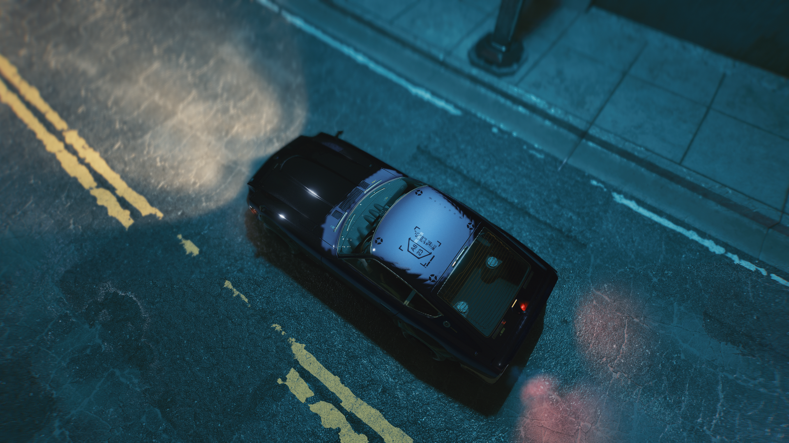

# interior and exterior of the vehicle

**If the reflection of the vehicle is strange in rainy weather Or if it rains inside the vehicle and water flows inside the interior**

<figure><figcaption></figcaption></figure>

This phenomenon is caused by the mismatch between indoor and outdoor boundaries

and

What distinguishes the interior and exterior of the vehicle is the "\_cutout" mesh

"_cutout" can be found in "RDTDataViewMode -> appearances -> components_" within ".app"

<figure><figcaption></figcaption></figure>

Make a mesh to fit the vehicle and replace it

<figure><figcaption></figcaption></figure>

<figure><figcaption></figcaption></figure>

<figure><figcaption></figcaption></figure>

<figure><figcaption></figcaption></figure>

<figure><figcaption></figcaption></figure>

There are things to watch out for when making the "cutout" mesh It should be smaller than the outdoors But if it's too small, the water will enter the inside\
There's some tolerance But it's better to be as accurate as possible\
\
When the mesh is done You can replace it with the old mesh
