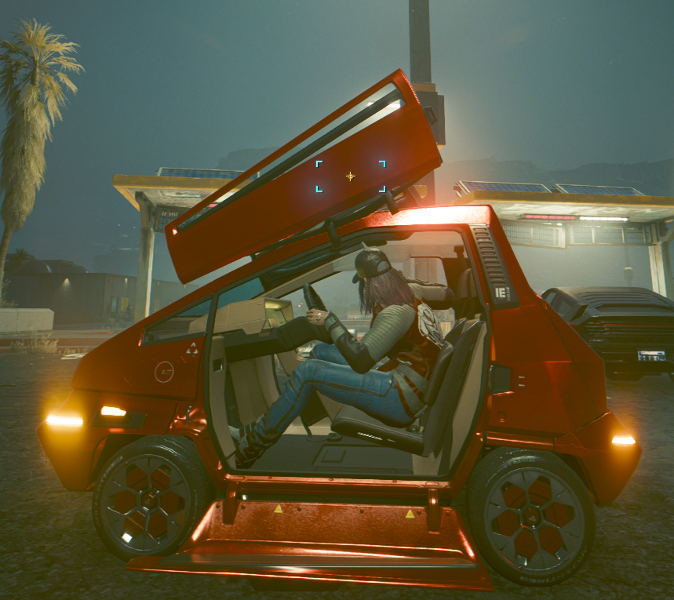
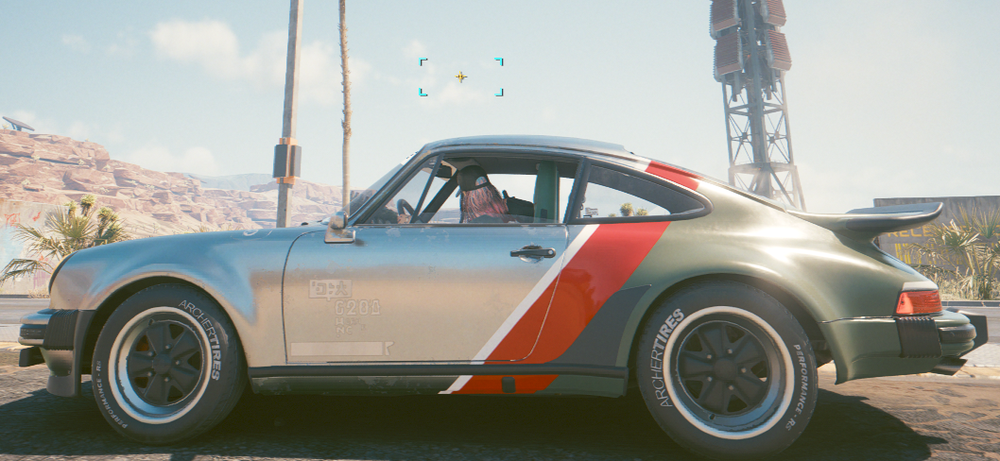
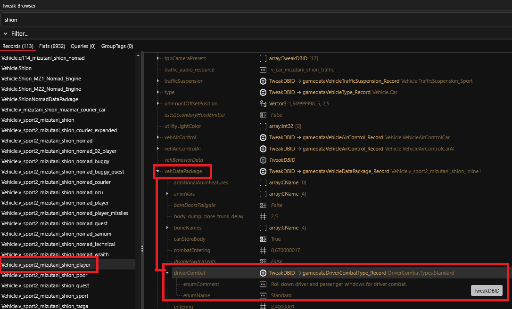
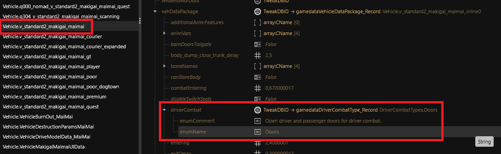
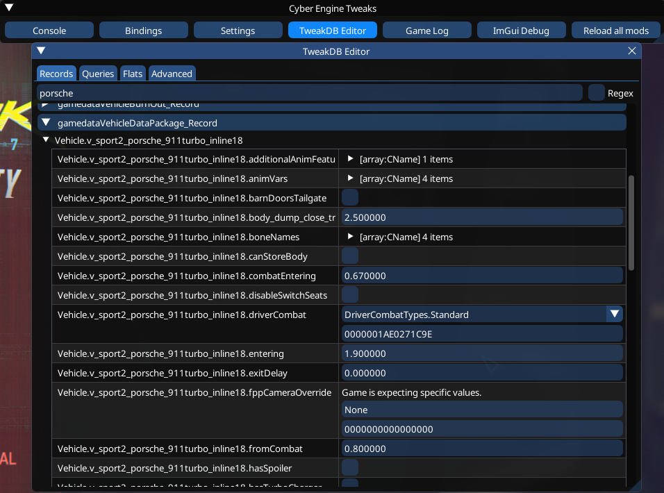
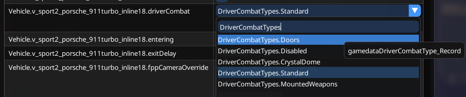

# 🪟 Windows & Doors opening + MountedWeapons clue

Most of the vehicles have the windows going down when you get your gun, allowing you to shoot without breaking it. Others have the door opening because the window can't retract itself, or because the glass is replaced by opaque screens.\
And special ones have mounted weapons, so no windows or doors, but big guns and missiles.

<figure><figcaption><p>Maimai with door open</p></figcaption></figure>

<figure><figcaption><p>Porsche with window open</p></figcaption></figure>

If you want to choose a specific opening for your custom vehicle, or just modifying existing ones, you can do it with couple of lines in a `.yaml` file.

The string you need to change looks like this : `DriverCombatTypes.Standard`

There's 5 variations of it:

* `DriverCombatTypes.Standard`\
  ("Roll down driver and passenger windows for driver combat.")
* `DriverCombatTypes.Doors`\
  ("Open driver and passenger doors for driver combat.")
* `DriverCombatTypes.MountedWeapons`\
  ("Doors and windows do not open, player controls mounted weapon(s) on the vehicle.") PS: You need to add all needed weapons components to your vehicle to make it work, in .app, .ent and .mesh. I still need to explore this part)
* `DriverCombatTypes.Disabled`\
  ("Driver combat disabled.")
* `DriverCombatTypes.CrystalDome`\
  ("Unsupported for now")


Note : the _MountedWeapons_ mode can only work if the vehicle has all the weapons and components equiped. If you try with no weapons, you will just have the visor.

(I will probably try to add more info about weapons if I have time to explore this)


Mounted weapons' locations are determined by the .ent file of the vehicle, and generally are identical to the base car .ent being used for the custom mesh. This can result in misplacement of the weapon _emitters_ - the parts which actually shoot a bullet/missile - and requires some work to change. In WolvenKit, open the .ent file directly. In the file editor, expand `RDTDataViewModel\components\vehicle_slots\slots` and scroll down, looking for the following entries, usually at the end:

* `VehiclePowerWeaponLeftSlotA`
* `VehiclePowerWeaponRightSlotA`
* `VehiclePowerWeaponLeftSlotB`
* `VehiclePowerWeaponRightSlotB`
* `VehiclePowerWeaponLeftSlotC`
* `VehiclePowerWeaponRightSlotC`
* `VehicleMissileLauncherA`
* `VehicleMissileLauncherB`
* `VehicleMissileLauncherC`

In these records, slots can be assigned to specific bones in the rig, or have their position and rotation adjusted.

###

### Finding the string

You can search for it using _Tweak Browser_ inside _WolvenKit._

Choose the vehicle name you want to find and look for this structure:

* `Vehicle.v_type_yourvehicle`

Once you are inside, follow the path and unwrap the sub-categories. Here's an example with the Shion car.

The path looks like this :

`▼ Vehicle.v_sport2_mizutani_shion_player`\
`∟ ▼ vehDataPackage`\
`­∟ ▼ driverCombat`\
`∟ enumeName : Standard`

Two examples in Wolvenkit:

<div align="center" data-full-width="false"><figure><figcaption><p>(click to expand)</p></figcaption></figure></div>

<figure><figcaption><p>(click to expand)</p></figcaption></figure>

You can see that `vehDataPackage` is also refered to `Vehicle.v_type_yourvehicle_inlineX` ( X = the line number inside the main file)

Result of the 2 previous example:

* `Vehicle.v_sport2_mizutani_shion_inline1`
* `Vehicle.v_standard2_makigai_maimai_inline0`

### Modify the value in game using CyberEngineTweaks

If you want to do some tests with various vehicles and see if it's working, you can do it using CET.\
In the TweakDB Editor, search for your current vehicle and look for `gamedataVehicleDataPackage_Record`.

You will have the content of the `vehDataPackage` with the corresponding `inline` number.

<figure><figcaption></figcaption></figure>

Look in the right column for the value of `driverCombat`.\
Expand the tab and write `DriverCombatTypes` to see all the variations.

<figure><figcaption></figcaption></figure>

Now let's try to change the Porsche from _Standard_ (windows) to _Doors_.

<figure><figcaption><p>Standard (windows)</p></figcaption></figure>

<figure><figcaption><p>Doors</p></figcaption></figure>


The door and the window will open at the same time if both have animations. (they probably use the same trigger)


<figure><figcaption><p>Doors open</p></figcaption></figure>


You can now drive with the doors open, but without collisions on it.


###

### Add the changes in your mod

If you want to add this setting on an existing car or inside your new custom vehicle, you can add some lines in your `.yaml` file like this :

```yaml
Vehicle.v_sport2_mizutani_shion_player:
  $base: Vehicle.v_sport2_mizutani_shion
  vehDataPackage:
    $base: Vehicle.v_sport2_mizutani_shion_inline1
    driverCombat: DriverCombatTypes.Doors
```

There's multiple ways to write the inlines records, as mentionned on the [TweakXL github](https://github.com/psiberx/cp2077-tweak-xl/wiki/YAML-Tweaks) by **psiberx**.
