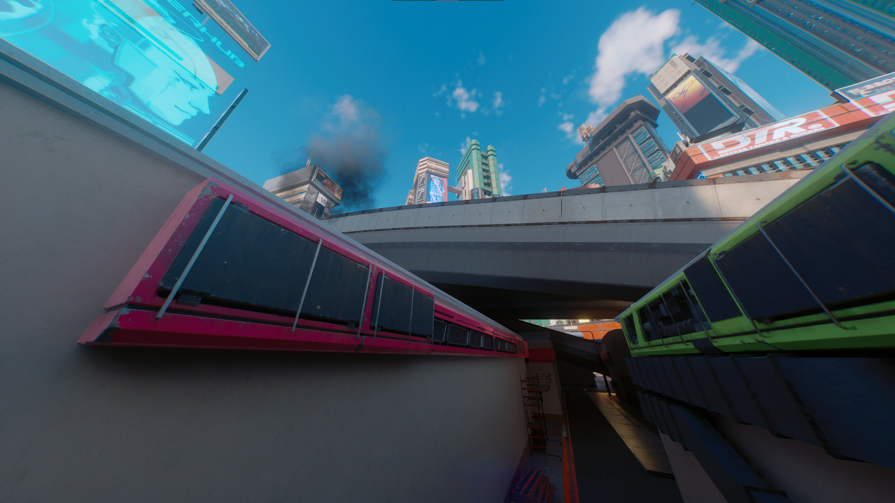
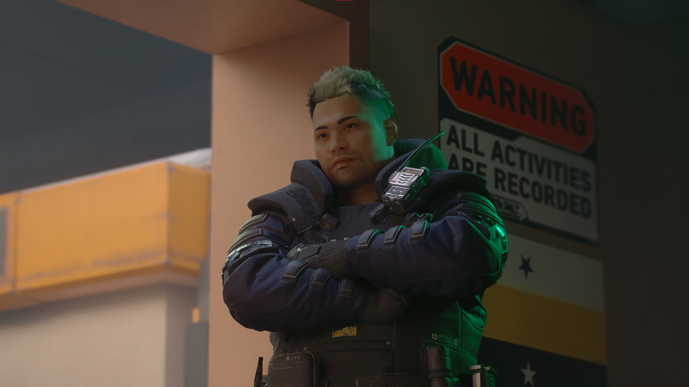

# Advanced: Reverse-Engineered LUT pipeline


This is a complex document meant for experts. Made hastily to finally get the method out there and let others experiment with it. Will be expanded as time goes on.


## Understanding CDPR's rendering pipeline

### Lighting

Lighting in REDengine is complex. Since the conception of it, REDengine has been using a probe-based global illumination system, which requires a single bake of lighting for all times of day. This method is inferior to baked RT, but is suitable for systems with dynamic time of day and weather.

However, this method has its limitation, several, and we see them being corrected with the initial implementation of fullly dynamic semi-global illumination in the form of Psycho RT. Differing from other quality levels, Psycho implements a pseudo-global illumination tech, instead of other RT levels simply tracing lighting for global light sources, such as the sun and the moon.

After patch 1.62, and after the creation of ReSTIR GI, we see now that CDPR has implemented a fully-realized RT pipeline. Each step of the way is handled by rays rather than normal approximations.

The benefits, other than the obvious ability for fully realized global illumination and direct illumination, are numerous. Each light can now cast shadows, use material parameters for nearly-perfect subsurface scattering, ideal light blending and intensity.

I will go further into detail on the new possibilities with PT in another entry, today, we will focus on...

### Color

Recently, I have been working on recreating a cinema-accurate and professional-quality workflow for color grading in Cyberpunk, and generally, trying to retrace the steps CDPR took to get such a unique, albeit, polarizing look to Cyberpunk.

#### A history lesson

Before 2020, while the game was in heavy development, CDPR used a different, more parametrizable method for handling HDR assets and lighting. They would simply running through a TMO (tone mapping operator) to get back to 8-bit range and afterwards apply color grading.

This, while convenient, did make handling HDR _display_ quite difficult. How could you apply a color grade made for SDR on top of HDR without losing precision or missing data? This required a full restructuring of the method.

Eventually, CDPR landed on the method I have been able to reproduce. They used a normal, neutral LUT texture and ran it through ACES (Academy Color Encoding System) transforms to go to a neutral color space, ACES AP1. I do not know the gamma they used (could be ACEScct or ACEScc, maybe even the linear ACEScg), but I do know that eventually, the HDR data was ran through the RRT (Reference Rendering Transform) as a tone mapper, then through the ODT to go to either HDR or SDR.

Unfortunately, I have not been able to single out a method to generate HDR LUTs from scratch, however, I have been able to create a workflow to create tone mapped LUTs for SDR.

## Tools used/required

* DaVinci Resolve\
  _Does not matter if it is studio, but studio will be required for the eventual HDR workflow._
* Photoshop
* WolvenKit
* NVTT Exporter and the respective Photoshop plugin.\
  _Can be found on NVIDIA developer, does require an account to download._

### Intermission: Troubleshooting DaVinci

Right here is where I almost gave up.

DaVinci refused to open. I tried all I could, searched the internet, tried every damn solution. Nothing worked.

BUT, looking at the log files, I was able to deduce the culprit.

SyManager.DeckLink failed to respond due to some USB issue, I even looked that up and well, no dice.

Eventually, I came to think that it may be an issue with the control panels utility for Resolve, as Blackmagic sells some cool decks and accessories for colorists to work faster. But, I'm not rich enough for those, so, I figured, why not just uninstall the entire framework for them.

Boom, DaVinci opened right after.

## Setting up your project

Some of you who are more familiar with DaVinci may be already going ahead and setting up ACES in the DaVinci color settings, changing and messing with color science and management, etc. Stop. We're gonna be using nodes.

Below are 2 sample pictures captured with the method, we will be getting a grasp with non-destructive color grading this way.

<figure><figcaption></figcaption></figure>

 

<figure><figcaption></figcaption></figure>

Insert these pictures into your timeline and head into the Color tab. Then, select your clips and add them to a group, the group name doesn't really matter. We'll only be doing this to use pre-clips and post-clips.

Head into the pre-clip level and apply an ACES transform node. Set your input transform to SRGB and output transform to ACEScct (ACEScct behaves better than ACEScc at times, use your preference) and don't forget to turn on the reference gamut compress.

Afterwards, go to the post-clip level and add another ACES transform node. Now set your input transform to ACEScct (or ACEScc) and set the output transform to SRGB.

Your clip level now has full range and fidelity. You can color grade to your heart's content in the clip level, but I won't be going into detail in how to do this. Or you could proceed onwards, if you do so, then ignore anything about importing your color graded LUT.

So, how do we put your grade into the game? Glad you asked. After you're done grading, turn off everything but your effects in the clip level. Generate a LUT from here. It doesn't matter if the image you see doesn't match up with the one you graded with, we'll be correcting for it further on when we generate the LUT.

## Generating a finished CUBE LUT

<figure><figcaption>
A LUT texture from the ReShade project. This will be useful when we output our grade to the game.
</figcaption></figure>

It's now good to mention that Cyberpunk outputs data with an ARRI LogC3 encoding, but SRGB color space. ACES, on the other hand, expects ARRI LogC3 encoding but ARRI Wide Gamut 3 color space as well. At the end, Cyberpunk expects SRGB data with SRGB gamma too, so you need a TMO to handle this conversion from HDR data encoded in a Log curve to fit in SDR range, but decoded and then put into the display gamut and dynamic range.

ACES is apt for the job.

Take the LUT texture above and add it to your timeline as well, and assign it to another group.

Go to the pre-clip level for your LUT clip and add a Color Space Transform node. Specify the input color space and gamma as SRGB, but output color space as ARRI Wide Gamut and output gamma of SRGB as well.

Subsequently after the CST (Color Space Transform) add your IDT (Input Device Transform) using an ACES transform node. Set the input transform to ARRI LogC3 with an exposure index of 800 and output transform of ACEScct (or ACEScc depending on what your color grade was made in/for). Make sure you enable color gamut compression, or else you will get horrible clipping in higher exposures.

At the post-clip level, add your ODT (Output Device Transform). Set your input transform to ACEScct/cc and output transform to SRGB. Once again, turn on reference gamut compress.

Now, in your clip level, add a corrector node and then drag your generated color grading CUBE LUT atop the corrector node (skip this if you didn't grade)

Once you have done all of this, right click and select "Generate LUT" and export a CUBE.

## Creating the LUT texture

Congrats! You have now reached the homestretch in the reverse-engineered LUT workflow. This part could be confusing for some, but it's easy enough if you're familiar with visual modding or handling XBM textures on a very high level.

Once your CUBE is done exporting, open the lut.png file you downloaded before in Photoshop. Here, you need to add a "Color Lookup" layer. Select the 3D LUT file to be your generated LUT from when you finished the CUBE LUT in the last step. Once it is applied, apply a channel mixer correction layer and flip the blue and green channels.

After this is done, export using the NVIDIA Texture Tools plugin as a 32x4f DDS with no mipmaps as well as highest quality compression.

Once you are done, put the texture into WolvenKit and import using these settings:

<figure><figcaption></figcaption></figure>

Afterwards, set the depth, height, and with properties to 32, then go to `renderTextureResource -> renderResourceBlobPC -> header -> sizeInfo` and set all of the properties there to 32 also. Don't forget to change the texture type to 3D in `textureInfo`!

There it is. Your tonemapped LUT from scratch.

## Footnotes

1. This initial revision is messy, very messy. Ideally I would've loved to make a video showing off the process in detail, being able to go on tangents and show you around exactly how I stumbled and developed upon the system, reasoning behind a few of the decisions I made in this entry, but I lack the resources right now (notably a microphone)
2. Normally I'd try to make the entire thing seem more accessible in general, but really, this is an extremely complex topic that would take some experts press their eyes in frustration. I know it happened to me a ton.
3. If you're looking for pre-made examples, I have a few right here:


Gamut compressed LUT using AWG3 gamut conversion, looks a bit desaturated.



A method which I didn't have the ability to go over in the entry, but gives surprisingly pleasant results in both AWG3 conversion and SRGB.



Gamut compressed, ACES-tone mapped without AWG3 gamut conversion. Has clipping problems that are simply inherent to the incorrect color due to not using AWG3 conversion, but has a very unique look.



A variant of the undocumented method that is similar to the ACES-tone mapped SRGB LUT but has less clipping.

