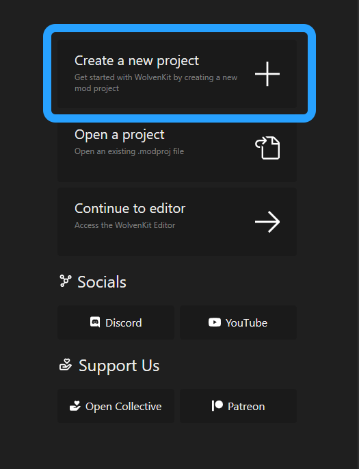

# Editing LUTs


**This article is severely out of date.** Please tread lightly.


## What is a LUT?

The term LUT has its origins in mathematics, where a Look-Up Table would be able to shorten certain math operations by containing readily-calculated values for any input value, or an operation for an input value for a desired outcome. This shortcut was quite efficient and sped up many operations, and was normally designed as a matrix of different numbers and variables. Soon enough, this improvement in speed would be applied in many other fields, and eventually reached computer graphics and film production.

LUTs are essentially a texture or text file containing **every single possible color** that can be displayed, and the transformation of an input color into an output color through it.

### Cyberpunk's use of LUTs

There are many different types of color-grading-related LUTs, such as `.CUBE` files and `.3DL` files, but video games often use a texture.

Initially, Cyberpunk took an approach like many other games, and encoding the LUT as an unwrapped 3D texture:

<figure><figcaption>
"3D" LUT texture from ReShade project.
</figcaption></figure>

Afterwards, Cyberpunk would repackage LUT textures with the blue and green channels inverted to get higher quality, as the human eye values green more than other colors and is more efficient to get all gradients laid on top of green instead of blue. _**Here we can safely assume is where the switch to using true 3D textures was also made, but we will not show a 3D texture due to redundancy and inability to do so, so just assume from now on all textures are actually just a 3D cube.**_

<figure><figcaption>
An edited version of the ReShade project's "3D" LUT texture to show the G-B inversion.
</figcaption></figure>

To get even more odd, Cyberpunk would then put the image tone mapping, the process in which HDR colors are processed into SDR, inside of the LUT! **This came with the conversion from using a normal sRGB transform, which is industry standard, to using an input of ARRI LogC1 and outputting a linear color which is afterwards processed into normal sRGB gamma by the linear tonemapping.**

<figure><figcaption>
The actual base-game LUT with tonemapping applied within. You can see the reason why there is so little highlight fidelity in SDR now! It all just gets mapped to white!!!
</figcaption></figure>

## Editing base-game LUTs

With all that backstory done--how do we start?!

**You will obviously need WolvenKit, but we also require Adobe Photoshop CS4 and on, preferrable Photoshop CC, and also NVIDIA Texture Tools Exporter's Photoshop plugin.**

All of these can be found with a quick Google search, but the last requirement is a bit strange. We need an _**old**_ version of CP77Tools. Pre-WolvenKit days. You can find it here:&#x20;


You're looking for the latest release. It requires .NET 5.0 runtime (desktop runtime preferred).


### **Okay, now we can get started!**

Create a new WolvenKit project and call it whatever you want.&#x20;

<figure><figcaption></figcaption></figure>

After that, import the file `base\weather\24h_basic\luts\cp2077_gen_lut_nge_v017.xbm` into your project.

<figure><figcaption></figcaption></figure>

Then open it, and change `depth` to `1`, `height` to `32`, and `width` to `1024`. After that, navigate to **`renderTextureResource/renderResourceBlobPC/header/sizeInfo`** and apply the same edits as before.

<figure><figcaption></figcaption></figure>

Export the file into a DDS...

<figure><figcaption></figcaption></figure>

Open it up in Photoshop and... _voila!_

<figure><figcaption></figcaption></figure>

We now successfuly have the 32-bit HDR LUT imported into Photoshop. You can do any color correction here, or do some ReShade edits in-game and then put that into a LUT image and then use a Photoshop plugin to import it and apply it ontop of this LUT. Make sure you _**DO NOT**_ simply replace this image with your exported LUT from ReShade or some other editing app, as you will completely ruin the tone mapping the base-game does. I recommend DaVinci Resolve as well and then exporting as as `.CUBE` file from inside of it.

**When you edit your LUT, make sure you flip the vertical axis (make it upside down) inside of Photoshop!**

### Re-importing your edited LUT.

**Let's say I just did some curves tweaking and contrast, etc., etc. Maybe make the green saturation lower and other saturation higher to get rid of the green tint. Now what?!**

Save back your DDS using NVTT and apply these settings:

* **Format: `32x4f RGBA 128bpp | floating-point`**
* **Generate Mipmaps: OFF**
* **Image Options - Compression Quality: Highest**

**If you forgot to flip your image inside of Photoshop, turn on the Image Options - Flip Vertically option inside of NVTT.**

<figure><figcaption></figcaption></figure>

We finally come to the hardest part of the process--as if the rest was not. Importing our LUT back into an XBM!

It's too much of a complex process to encapsulate in an image or two, so listen up:

1. Extract the downloaded CP77Tools archive somewhere safe and open it up in PowerShell
2. Copy the original XBM (`cp2077_gen_lut_nge_v017.xbm`) into the same place that your DDS file is.
3. Inside of the PowerShell window, type `.\CP77Tools.exe rebuild -b -t --keep --unsaferaw -p` and then drag the folder your DDS and XBM files are in onto the console window. It should fill in the path after the `-p`.
4. Hit enter, hopefully there are no errors.

When your XBM file imports, overwrite the original XBM file in the project.

Go back into the XBM and do the opposite of changng the depth, width, and height: setting them all back to 32. _Since we've already gone over this, you can just remind yourself how to do it by just doing the step where we stretched out our texture backwards._

After you've done all that, go ahead and test out your LUT mod. I personally added a bit more contrast and saturation in Photoshop, but go ahead and be as creative as you like.&#x20;

## Results!

| Before                                                                                            | After                                                                                   |
| ------------------------------------------------------------------------------------------------- | --------------------------------------------------------------------------------------- |
|  |                         |
| As you can see, vanilla's red saturation leaves more to be desired.                               | After our edits the red saturation is a lot better and the contrast is more satisfying! |
