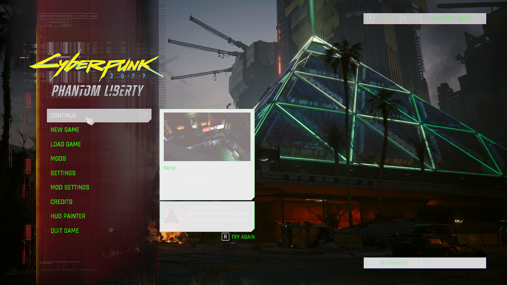
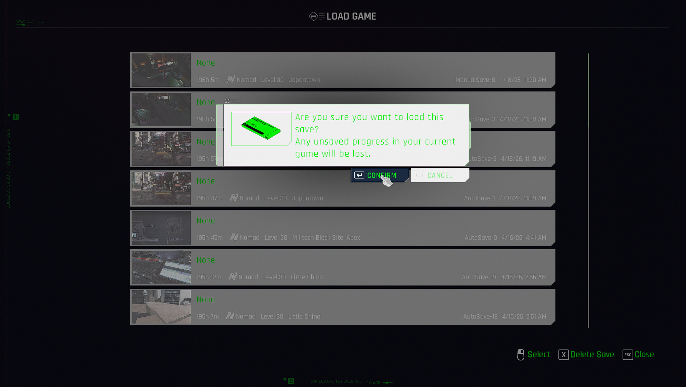

# 🌈 Creating a LUT from scratch


This method is for LDR. Little to none is known about HDR LUT creation, so please, do not expect anything on HDR LUTs.


## What is a LUT, really?

It's imperative to understand what LUT really is before starting. Often, beginners have a misconception caused by other software which often uses different formats for LUTs and different ways to apply them, such as ReShade.

Cyberpunk LUTs are distinctly different from ReShade LUTs due to two things:

1. They are 3D textures, not 2D textures with tiles describing different parts of the RGB cube, no, Cyberpunk LUTs are full-on 3D textures sampled with trilinear filtering.
2. They are applied with an input of ARRI LogC3 data with an sRGB color space. This means you can't go and use any ReShade LUTs, as they often do not expect LogC3 output. Along with this, many tools expect ARRI LogC3 data with an ARRI Wide Gamut 3 color space when generating your LUT. If you do not convert to it, you will end up with clipping colors.

But, aside from that, they are similar. Any LUT expects an input of a color, with an output of a new color. That's it. Cyberpunk's implementation is as simple as extracting the pixel out of the LUT texture that matches the input color, and if there isn't an exact match, it interpolates linearly to get a near-perfect approximation of the true output color.

&#x20;If you're still confused, I recommend looking at [this](https://reverend-greg.itch.io/lut-colouring-explained).

## Prerequisites



A backup of NVTT can be found here



If you don't trust a random exe file, that's good, but if you want to download it from the source you need to create or use your current NVIDIA account and add yourself to the developer program.





DaVinci's website prompts you to fill out some data before being able to download the software. You can fill this out with fake data, it doesn't really matter.



You can use Fusion Studio just as easily as well for parts of the guide, and DaVinci Resolve Studio is also recommended in general.



The essential tool for all Cyberpunk modding. Nightly is preferred (and what this guide has been made with), but stable works just as well with newer versions (older versions will have errors).





By the way, if you just wanna skip the steps on repeat projects, there is a reference GitHub repository containing NVTT settings, DaVinci Resolve and WolvenKit projects, as well as pre-made LUT files if you just wanna test them out quickly.



## Workflow

### WolvenKit

Create a new project in WolvenKit and import the file `base\weather\24h_basic\luts\cp2077_gen_lut_nge_v017.xbm` and export to a DDS, then rename it, removing the `xbm` file extension. You should have a dummy name with a file path containing that same file in the "raw" folder. You can delete the file in there, we only need the folder set up correctly.

<figure><figcaption>
How the Project Explorer should look like right now.
</figcaption></figure>

### DaVinci Resolve


If you have issues getting Resolve to run for the first time, uninstall the panels program. It causes crashes if you don't have any DaVinci panels or sliders.


Create a Resolve project, and head straight over to the Fusion tab, without importing any media. Add a LUT Cube Creator node, change the type to vertical and size to 32, 48, or 64. Remember this number, as you will use it later. Select for the generated Media Out node to output to both sides of the preview by enabling both of the circles below it. On one of the sides, select Views>3D Histogram. You should now have a LUT cube present. If you'd like more accuracy, right click and go to 3D Histogram and select solid with 1:1 sampling.

<figure><figcaption>
An example to show the current workspace should look like.
</figcaption></figure>

Right after the LUT Cube Creator node, add a Color Space Transform node, and matching the fact that tools expect ARRI Wide Gamut 3 with ARRI LogC3 data, but the game outputs sRGB with ARRI LogC3 gamma, we need to go from sRGB color space with ARRI LogC3 gamma to an output color space of ARRI Wide Gamut 3 with output gamma of ARRI LogC3

<figure><figcaption>
Settings for the Color Space Transform node.
</figcaption></figure>

After this, we need to go from this LogC3 data to sRGB, which is what our display expects.

#### ACES method (recommended)

This is the method used by the original game to go from the input LogC3 to sRGB output, so it's what's recommended.

Add an ACES Transform node after the Color Space Transform node. Set the input transform to ARRI LogC3 with an output transform of sRGB and use ACES reference gamut compression.

<figure><figcaption>
How the workspace should look like after using the ACES method.
</figcaption></figure>

#### ARRI LogC3 method

This method uses LUTs from ARRI themselves, and as such gives us two options: LogC3 and LogC3 "classic". I encourage you to use the normal LogC3 LUT, but experiment with Classic and see if you like it. Though, this method requires a change in the settings that are described later.



In the link above, select LogC wide gamut as the source format and destination format as video. Select your preference of ARRI Classic 709 and ARRI 709 in the conversion parameter. The file type can be either Blackmagic Fusion or Blackmagic DaVinci Resolve, it really doesn't matter.

Add a serial File LUT node and point to your downloaded file.&#x20;

<figure><figcaption>
The workspace after following the directions for the LogC3 method.
</figcaption></figure>

#### ARRI LogC4 method

It may share a name with the LogC3 method, but is distinct from it as it uses a more recent revision of the color science compared to the LogC3 method, but we will need to change things before and after this step if you decide to use this method.

Follow the same link described in the [#arri-logc3-method](creating-a-lut-from-scratch.md#arri-logc3-method "mention") section until you reach this part. Download the "ARRI LogC4 LUT Package".

<figure><figcaption>
The LogC4 LUTs we will use.
</figcaption></figure>

Once you have downloaded it, extract the Rec.709 Gamma 2.4 65-point .CUBE file from the zip file. Add a serial node after the Color Space Transform called File LUT and point the LUT file to your extracted .CUBE file.

We have to make some changes to the Color Space Transform node, change the output color space to ARRI Wide Gamut 4 (instead of 3) and then the output gamma to ARRI LogC4. Your LUT should now look correctly exposed.

You can mess with the Tone Mapping Method, but just select None as a good option.

We need to change an option afterward that will be described later for both the LogC3/4 methods.

<figure><figcaption>
How your workspace should look like, including the CST settings.
</figcaption></figure>

#### Resolve Color Managed method

This method uses DaVinci's integrated tone mappers to go from the LogC3 input to sRGB output. It produces a neutral and accurate output. It's also very minimal.

For this method to work, we just need to change the settings in the Color Space Transform.

Instead of having an output color space of ARRI Wide Gamut 3, set the color space to sRGB and gamma to sRGB as well. Then, change the tone mapping method to DaVinci, or some other method if you know what they mean.

<figure><figcaption>
Your workspace after this method. It's easy and minimal, but has very low contrast.
</figcaption></figure>

This method creates a color cube that is very "unbiased"--it has fidelity in all directions, which, while creating a good representation of true color, can result in unnatural saturation. To account for this, the saturation compression gamut compression method can be selected.&#x20;

<figure><figcaption>
The color cube after saturation compression.
</figcaption></figure>

After you have used your preferred method, you need to apply gamma correction. If you do not do this, you end up with incorrect gamma, which can mainly be seen on skin tones.&#x20;

For the ACES method, you need to add another Color Space Transform node, with input color space and gamma of sRGB, with the output color space of sRGB but output gamma of linear.

<figure><figcaption>
ACES method after gamma correction.
</figcaption></figure>

For both ARRI methods, nearly the exact same steps are taken as the ACES method, but, instead of sRGB input color space and gamma, we use an input color space of Rec.709, but input gamma of Gamma 2.4. Keep the output color space at sRGB and output gamma at linear.&#x20;

<figure><figcaption>
LogC4 after gamma correction.
</figcaption></figure>

For the Resolve Color Managed method, simply change the output gamma in the color space transform to linear, but turn on Apply Forward OOTF.

<figure><figcaption>
Gamma corrected RCM method.
</figcaption></figure>

This is the final stage. We now just need to output to an image, and use the right format. To do this, use a Resolve FX Transform>Transform node (not any other transform node) and switch on "Flip Vertical" to correctly output.

Right click on the LUT picture and save your image as a TGA or PNG file.

### NVIDIA Texture Tools

Drag on your exported file onto the NVTT window and tick off "Generate Mipmaps" and select format as 32x4f. Tick off KTX2 compression and tick on DXT10 header as well turn on Highest compression quality.

Turn on "Extract From Atlas" and set "Depth of Volume" to the exact size of your LUT that you set up when first creating it. To verify you got it right, you should see a Z slider on the top right of the NVTT interface. Drag it and see if there is any vertical shift in the texture. If there is not, you got it right.

<figure><figcaption>
NVTT correctly set up with the RCM (Resolve Color Managed) LUT in it.
</figcaption></figure>

Save as a DDS file (only DDS) and put it in the folder that was generated after you exported the XBM file at the start of the article.&#x20;

### WolvenKit again

You should now see it in the import tool in WolvenKit. Change its TextureGroup property to `TEXG_Generic_LUT`, turn off IsGamma, VFlip, GenerateMipMaps, IsStreamable, and PremultiplyAlpha. Set compression to `TCM_None`. If your file doesn't have RawFormat as `TRF_HDRFloat`, then something in the DDS importing went wrong, and you need to re-set the format as 32x4f in NVTT.

<figure><figcaption>
Settings set up correctly.
</figcaption></figure>

Import the DDS. We need to tell the file it is actually a 3D texture in the header (even if the 3D data is already there), so go to `renderTextureResource>renderResourceBlobPC>header>textureInfo>type` and change it from `TEXTYPE_2D` to `TEXTYPE_3D`.

<figure><figcaption>
Changing the texture type.
</figcaption></figure>

Make a copy of the XBM file and rename it to `cp2077_gen_lut_nge_v017`. Our dummy file there is for being able to quickly copy the filename, so, select your LUT XBM, C-c, C-v, select the dummy file, F2, C-c, select your LUT copy XBM, F2, C-v.

Your LUT is now correctly set up. You can install and launch now!

## Results

<figure><figcaption>
Vanilla
</figcaption></figure>

 

<figure><figcaption>
RCM
</figcaption></figure>

 

<figure><figcaption>
ACES
</figcaption></figure>

 

<figure><figcaption>
LogC4
</figcaption></figure>

