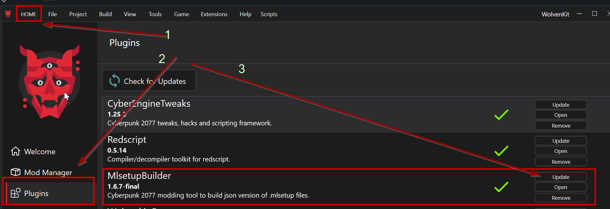
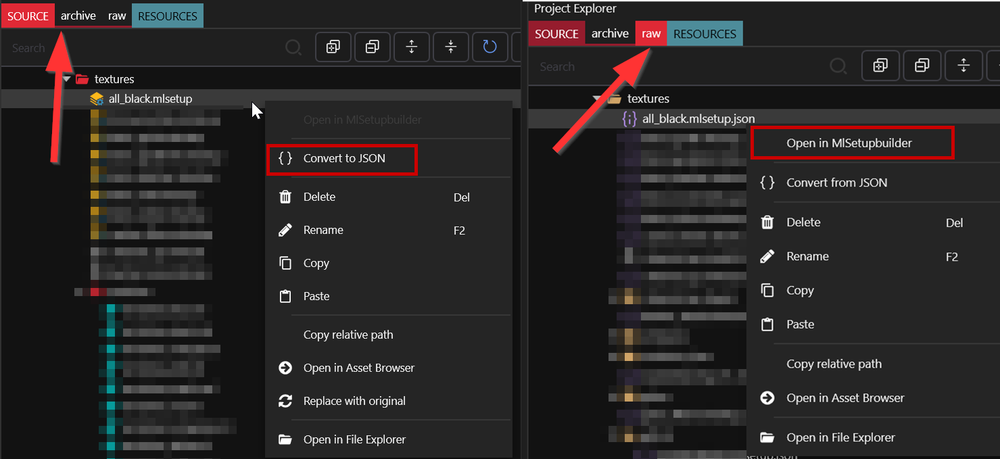
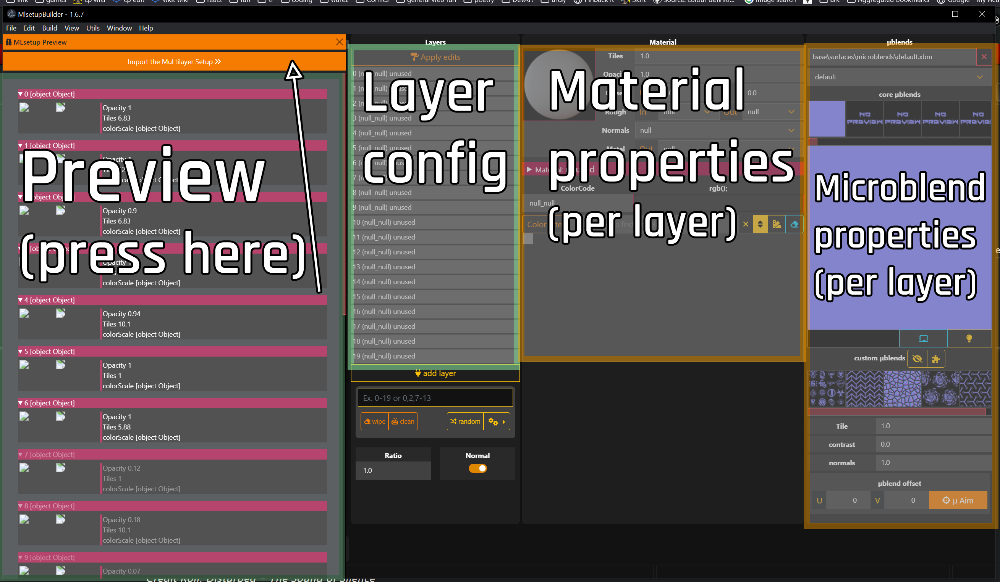
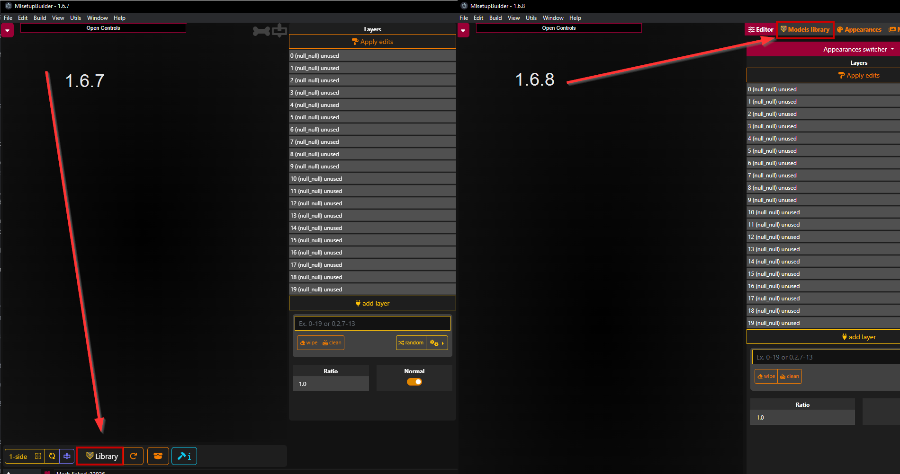
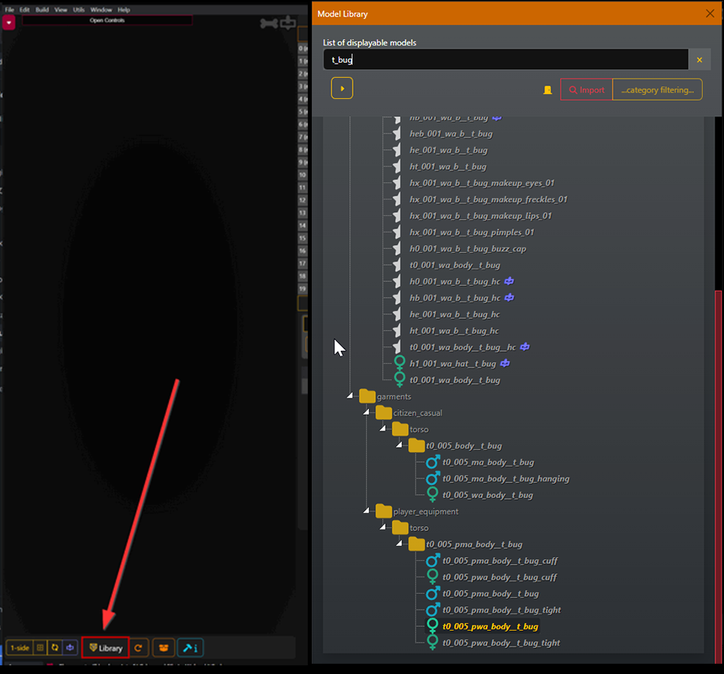
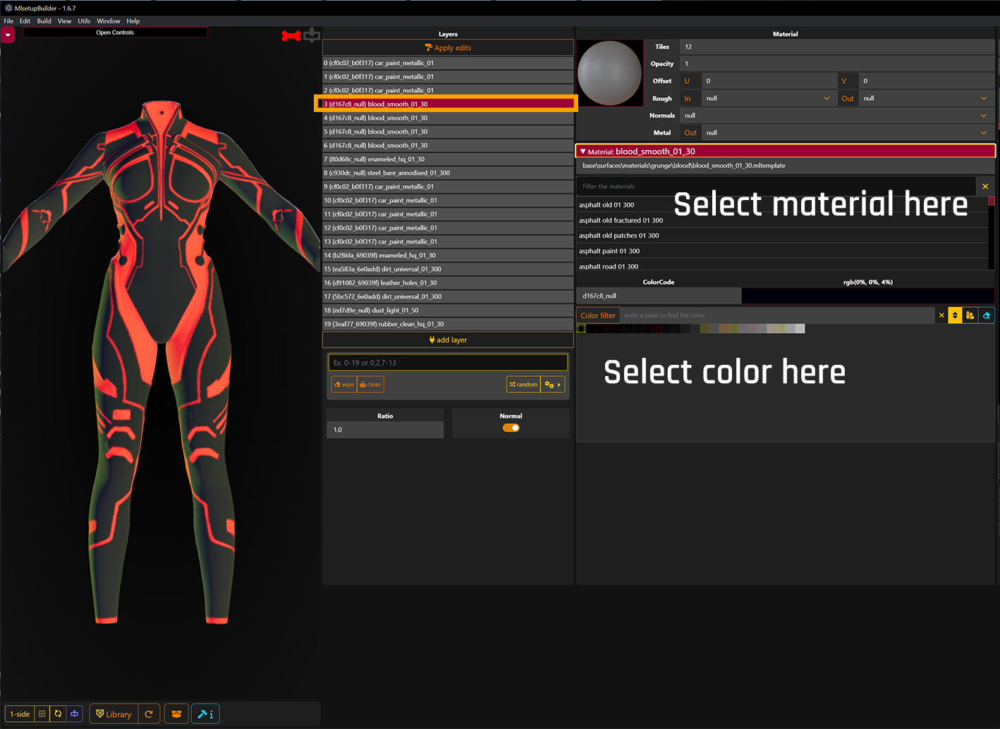
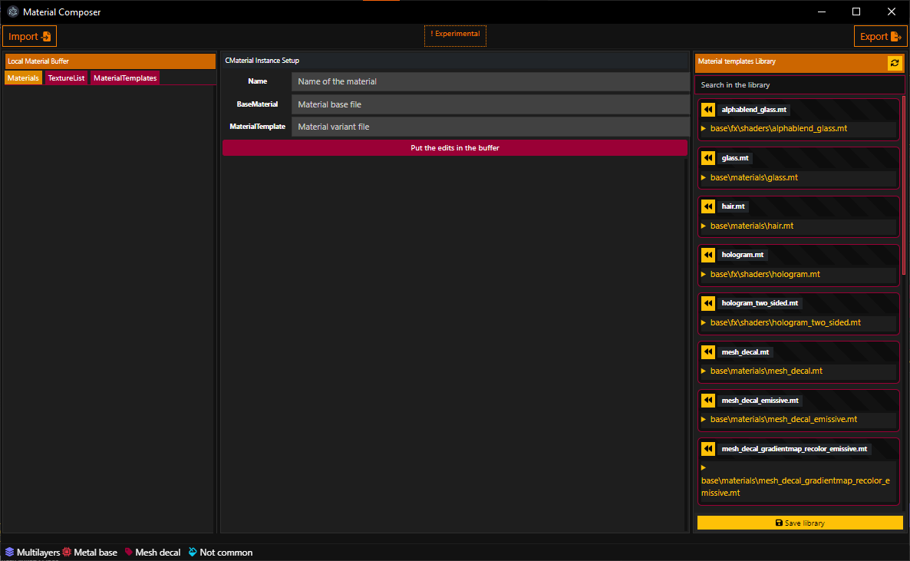

# MLSETUP Builder

### Summary

**Published:** ??? by [manavortex](https://app.gitbook.com/u/NfZBoxGegfUqB33J9HXuCs6PVaC3 "mention")\
**Last documented update:** Jan 20 2024 by [manavortex](https://app.gitbook.com/u/NfZBoxGegfUqB33J9HXuCs6PVaC3 "mention")

This page will teach you how to download and configure **MLSetupBuilder**, the tool of choice to edit multilayered materials in Cyberpunk.&#x20;

At the bottom of the page, you will find [#video-guides](./#video-guides "mention"). Keep in mind that they are outdated.


MLSB 1.6.7 does **not** include a full material preview. The 3d view will only show you which parts of a mesh are affected by your material. If you want to preview a material in colour, you'll have to do this in Blender — use the [wolvenkit-blender-io-suite](../wolvenkit-blender-io-suite/ "mention")'s [mesh import](../wolvenkit-blender-io-suite/wkit-blender-plugin-import-export.md#meshes).


### Wait, that's not what I want!

* To learn more about [multilayered](../../materials/multilayered/ "mention"), check the link
* To create your own mlmask, check [custom-multilayermasks.md](../../modding-guides/textures-and-luts/custom-multilayermasks.md "mention")
* To create your own normal map, check [self-made-normal-maps](../../modding-guides/textures-and-luts/self-made-normal-maps/ "mention")

## Introduction: What is MLSB?

**MLSetupBuilder** (commonly referred to as "MLSB") is a Cyberpunk 2077 modding tool to comfortably edit MLSetup files, developed and maintained by Neurolinked.



There is a dedicated channel on the [Redmodding Discord](https://discord.com/channels/717692382849663036/1082772930892664943) and a thread on the [Cyberpunk 2077 Modding Discord Server](https://discord.com/channels/705931815109656596/939510887188947014), where you can find a chat history full of (yet) undocumented features, along with previews and videos of the most recent development versions.

## Installation

For integration with Wolvenkit, install MLSB as a plugin:&#x20;

<figure><figcaption></figcaption></figure>

1. Click on "Home" in Wolvenkit's title bar
2. Select "Plugins" in the left sidebar
3. If MLSB is installed, you'll see an "Update" button, otherwise, it will say "Install". \
   Do that.
4. If that doesn't work for any reason, you can install it by hand: download the latest release from [Neurolinked's github](https://github.com/Neurolinked/MlsetupBuilder) and extract the files to following subfolder in your Cyberpunk game directory (the number must be the same as displayed in the WKit plugin list)\
   `Cyberpunk 2077\tools\neurolinked\mlsetupbuilder\MlsetupBuilder-1.6.7`

We will now launch MLSB and do the initial setup.

1. In Wolvenkit's Plugin view, click "Open", this will open a Windows Explorer with the install folder (`Cyberpunk 2077\tools\neurolinked\mlsetupbuilder`)
2. Navigate to the folder with the higest version (at the time of this guide, that is `MlsetupBuilder-1.6.7`)
3. Start `MlsetupBuilder.exe`
4. **Optional:** You can pin that file to your start menu or create a shortcut if you want to launch MLSB directly.

## Usage


To make the most of MLSB's features, you will want to [configure](./#configuration) it first. However, you can start using the tool right away.&#x20;


Here's how (or scroll down for the screenshot):

1. In the project explorer under Wolvenkit's `archive` folder, right-click on am `mlsetup` file\
   _This folder will only be visible in the "source" or "archive" tab of your_ [_project explorer_](https://app.gitbook.com/s/-MP\_ozZVx2gRZUPXkd4r/wolvenkit-app/editor/project-explorer)
2. Select  "[Convert to JSON](https://app.gitbook.com/s/-MP\_ozZVx2gRZUPXkd4r/wolvenkit-app/usage/import-export/import-export-as-json#export-as-json)"
3. This will generate an `mlsetup.json` file in your project's [`raw` folder](https://app.gitbook.com/s/-MP\_ozZVx2gRZUPXkd4r/wolvenkit-app/editor/project-explorer).\
   _This folder will only be visible in the "source" or "raw" tab of your project explorer_
4. Right-click on the newly created `mlsetup.json` file&#x20;
5. Select "Open in MLSetupBuilder"

<figure><figcaption></figcaption></figure>

### Using MLSB

As of Version 1.6.7, this is what you will see now:

<figure><figcaption></figcaption></figure>

Start by importing the file from the preview. That will populate the Layer Config box with the MLSetup that you just loaded.

The preview was hiding an empty 3d viewport. To [use that](./#about-that-3d-viewport), you will need to [configure](./#configuration) MLSB first, but you can already click through the individual layers and assign [material properties](../../materials/configuring-materials/multilayered-material-properties-1.md) (such as roughness, normal strength, base material and colour) from the "Material Properties" panel.&#x20;


Don't forget to hit "Apply" after you have changed a material.


Once you're done:

* select File -> Export&#x20;
* overwrite the original `mlsetup.json`
* switch back to Wolvenkit
* in the "`raw`" folder, right-click on your file
* select "Import/Convert from JSON"

Congratulations — you now have an `.mlsetup`! If you pack your mod and launch the game, you should now see your changes.

### About That 3d Viewport

This is where you can load models from the game for a direct preview which layer will affect which parts: simply click on the "Library" button.

#### MLSB Library

<figure><figcaption></figcaption></figure>

Here, you can either browse to your model directly, or use text search:

<figure><figcaption></figcaption></figure>

After selecting a model, you can close the library browser again. Now selecting a layer will show you directly which parts of the mesh it corresponds to.

<figure><figcaption></figcaption></figure>

That's it! Happy recoloring!

### Other Tools inside MLSB

<figure><figcaption>
List of tools inside MLSB
</figcaption></figure>

Inside MLSB there are some other tools, the most important one is the Material Composer.

<figure><figcaption>
Material Composer window
</figcaption></figure>

From this window you can import and export <mark style="color:yellow;">.Material.json</mark> files ( these files are exported by <mark style="color:red;">Wolvenkit</mark> with the <mark style="color:red;">WithMaterial</mark> option). You can edit the materials parameters, adding material or removing them from the material file.\
Material templates found in the .Material.json file can be put in the Library and then used later for another edit of materials of a completely different mesh.\
You can duplicate entries just changing the name of the material and putting them in the buffer again (that's what i did to have 10 different material colors that comes for the glass material of the <mark style="color:yellow;">Kendachi Monokatana</mark> mod).\
Material Composer will also display all the material parameters that comes with the material template (materials baked by the CDPR system have their parameters hidden if they were left as default before the baking of the release).

## Configuration

### Connecting to Wolvenkit

We're assuming that you have already configured Wolvenkit. If you haven't, please [do so now](https://wiki.redmodding.org/wolvenkit/modding-community/eli5-getting-started/configure-modding-tools#steps).

1. In Wolvenkit, extract a [partial depot](https://wiki.redmodding.org/wolvenkit/guides/modding-community/eli5-getting-started/create-depot#steps-partial-depot) (**Generate Materials)**. \
   Note that this window shows you the Depot Path for Step 5.
2. While it is doing that (it may take a few minutes), download [WolvenKit Console ](https://github.com/WolvenKit/WolvenKit/releases)and extract it to a folder of your choice.
3. Now, switch to MLSetupBuilder.
4. Select "File -> Preferences"
5. Apply the following settings:

|                      |                                                                                                                  |
| -------------------- | ---------------------------------------------------------------------------------------------------------------- |
| Game archives folder | `C:\Your\Path\To\Cyberpunk 2077\archive\pc\content`                                                              |
| uncook folder        | You can find this folder in your WolvenKit's settings as "Depot Path" (you've seen it in the window from Step 1) |
| Wolvenkit Depot Path | You can find this folder in your WolvenKit's settings as "Depot Path" (you've seen it in the window from Step 1) |
| Wolvenkit-CLI.exe    | The executable of Wolvenkit Console from Step 2                                                                  |

6. Press Ctrl+R to reload MLSB and make sure that the settings are applied.

### Building the depot

Again, this step is optional, you can [use MLSB](./#using-mlsb) straight away.&#x20;

1. Open the menu "Build" and select "Repository" to uncook the archives:

<figure><figcaption></figcaption></figure>

2. Select the following settings (if you want to uncook everything, this step can take several hours, so we'll only do the essentials for now)

<figure><figcaption></figcaption></figure>

3. Click "**Uncook**".&#x20;
4. Wait. Do not interact with the program in any way until the process has finished - especially interacting with the console might just freeze up the entire windows cmd process. This is not MLSB's fault, but due to a Windows standard implementation.


This process can take some time — if you have selected everything, it can be several hours on slow machines. (You should've listened during step 1, choomba ;))


5. When the process is complete, close the Depot Generator window.&#x20;
6. Optional: if you can't see any changes, press `Ctrl+R` to relaod MLSB.

### Building the Microblend Depot

1. Repeat Step 1 from [#extract-a-partial-depot](./#extract-a-partial-depot "mention"), but select **Microblends** this time
2. In the bottom left corner, hit "Start"
3. Wait.
4. When the process is complete, close the Depot Generator window.&#x20;
5. Optional: if you can't see any changes, press `Ctrl+R` to relaod MLSB.

That's it, you're done now and can use the [3d viewport](./#about-that-3d-viewport)!

## Troubleshooting

### Generic troubleshooting

Close MLSB, then open `%APPSETTINGS%\Mlsetupbuilder\config.json` in a text editor and decrement the version by one (e.g. `1.6.8` => `1.6.7`). This will force MLSB to re-check its settings.

Alternatively, you can also delete the file and reconfigure.

### Help, my Layer Config List says `object Object`

You need to [install the most recent version](https://github.com/Neurolinked/MlsetupBuilder/tags). If that doesn't make the error go away and your most recent version is something with 1.6.7, update the interface.js — download it [here ](https://github.com/Neurolinked/MlsetupBuilder/releases/tag/v1.6.7-final)from Neurolinked's github repository, then replace the file with the same name in MLSB's install directory, subfolder `resources\app\js`.&#x20;

If you have installed it as a Wolvenkit plugin, that directory will be `Cyberpunk 2077\tools\neurolinked\mlsetupbuilder`.

### There's an exception when generating my depot!&#x20;

Does the progress bar still move? If yes, then you're good - ignore this.

If not, you haven't left your fingers off MLSB and need to start over. Click "Uncook", then go afk until it's done.

If that doesn't help either, it's worth trying Wolvenkit Console's latest [Nightly](https://github.com/WolvenKit/WolvenKit-nightly-releases/releases).&#x20;

## Video Guides


Please keep in mind that these guides are seriously outdated. If things don't look as expected, check this guide, which is much more up-to-date, or find help on Discord (link in [#introduction-what-is-mlsb](./#introduction-what-is-mlsb "mention"))



Credits to EzioMavericks for the video



[A playlist by the original author](https://www.youtube.com/playlist?list=PLViyQUe4oow0l-amhDzneys9nzJxyH64n)

