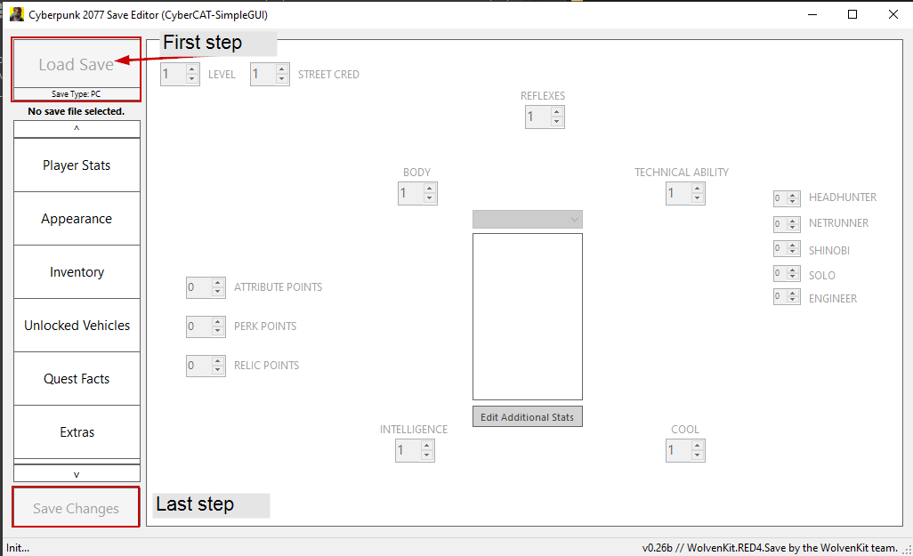

# Savegame Editor: CyberCAT

## This is the documentation for the [CyberCAT save editor](https://www.nexusmods.com/cyberpunk2077/mods/718).


Using the save editor puts you at risk of **creating a bricked savegame**. This means that the save will still load in Cyberpunk, but certain things in the game are broken (e.g. quests are stuck or won't trigger).&#x20;

If your savegame crashes on load, please check the [#troubleshooting](savegame-editor-cybercat.md#troubleshooting "mention") section.


## Version Compatibility

| Game Version          | CyberCAT version |
| --------------------- | ---------------- |
| 2.0 / Phantom Liberty | >= v0.26         |
| 1.63\_hotfix1         | ???              |

## Usage Instructions

On Windows, save games are stored in&#x20;

```
%USERRPROFILE%\Saved Games\CD Projekt Red\Cyberpunk 2077
```

1. Import your savegame
2. Make the necessary changes
3. Export your savegame again. Save it **in the same folder**.

<figure><figcaption></figcaption></figure>

## Known Issues

* Appearance editor is disabled until its fully fixed.&#x20;
  * Only gender and voice tone can be changed.&#x20;
  * Loading / Saving of presets still works
* Item additions might not fully work yet

## Troubleshooting

### Folder structure

Make sure that you export to a savegame folder. They contain the following files:

* metadata.9.json
* sav.dat
* screenshot.png

CyberCAT needs those files to correctly export the savegame.

### Asking for support


Please keep in mind that **nobody is paid** to work on this tool — CyberCAT is maintained by volunteers **in their free time**.&#x20;


Once you have exhausted all other means of support, you can find help in `#save-editing` on the [Wolvenkit Discord](https://discord.gg/redmodding). Please have the following things handy:

* [ ] The original save (before you edited it)
* [ ] The altered (damaged) save
* [ ] A description of what you did, as concise as possible
* [ ] The error.txt (if you have one)
