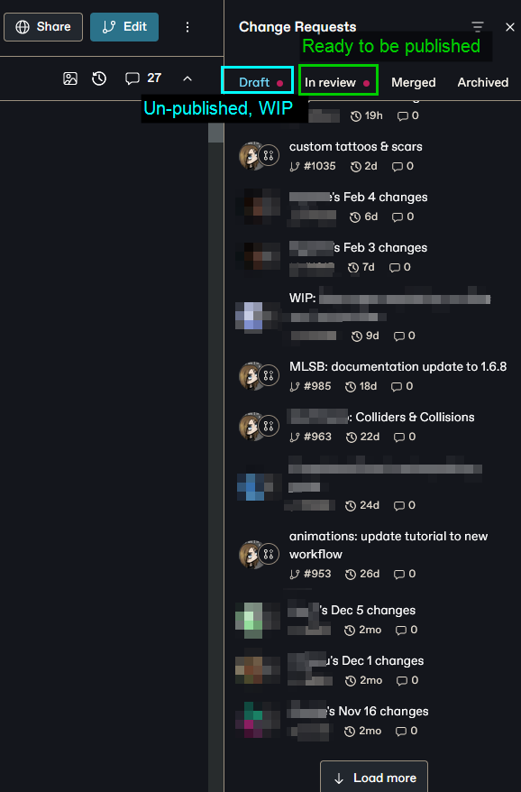
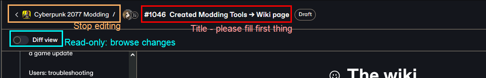
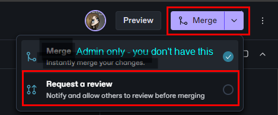

# The wiki

## Summary

Published: Feb 11 2024 by [manavortex](https://app.gitbook.com/u/NfZBoxGegfUqB33J9HXuCs6PVaC3 "mention")\
Last documented edit: Feb 11 2024 by [manavortex](https://app.gitbook.com/u/NfZBoxGegfUqB33J9HXuCs6PVaC3 "mention")

This page gives you some intel on how the wiki works and why you should start contributing.&#x20;

To skip the pep talk, you can jump directly to [#how-to-edit](the-wiki.md#how-to-edit "mention") or [#editor-sign-up-links](the-wiki.md#editor-sign-up-links "mention")

## Why you should edit the wiki

Wikis are the most open source thing since the invention of democracy, because everyone can edit them (that includes you!). They gather and share knowledge, facilitating all kinds of beautiful change — like the library of Alexandria before it was DDOSed by fire.

In terms of our wiki, that means:

* **Everyone** can learn how to make mods for Cyberpunk 2077\
  _You don't know shit about Netrunning? Doesn't matter,_ [_here's how you can make a t-shirt_](../modding-guides/items-equipment/adding-new-items/)_!_
* We don't have to research stuff all over\
  [_Here's what we have about glowing materials_](../materials/configuring-materials/emissive-material-properties.md)_. Want more than that? Here's where you can start digging..._
* You can easily find people who can help you\
  _Published: Feb 11 2024 by_ [manavortex](https://app.gitbook.com/u/NfZBoxGegfUqB33J9HXuCs6PVaC3 "mention")\
  _If you make any progress on this, please contact_ [manavortex](https://app.gitbook.com/u/NfZBoxGegfUqB33J9HXuCs6PVaC3 "mention") _on Discord_

Unfortunately, most people don't edit the wiki.

Of course there are plenty of good reasons, so let's go over them one by one.


You will never be bullied for sharing knowledge or skills on this wiki. If you ever feel as if you are, please get in touch with the mods on the [Wolvenkit Discord](http://discord.gg/redmodding), and we'll clear up the misunderstanding — because communication is hard and everyone here has the same goals.


### But I don't know how!

That's easy, just scroll down to [#how-to-edit](the-wiki.md#how-to-edit "mention") and find out!

### But I'll just ruin everything!

No, you won't. Every change you make has to be reviewed by one of our **wiki admins** before going live, so you really couldn't if you tried.

### But my English is bad!

I promise you, nobody else will care about this as much as you do. Personally, I'm so happy about the guide/wiki page's existence that I love the author all the more for not letting grammar get in the way.

That being said, if you really feel uncomfortable publishing anything in "bad English", we can solve that! You can either add it to the [title of your change request](the-wiki.md#change-request-titles) (e.g. "`PLEASE FIX GRAMMAR my guide about stuff`"), or run your text through ChatGPT (this is exactly what LLMs are for!)

### But this is just speculation! I haven't verified it!

No problem at all, just pop an info box at the top of your wiki page or section:


This stuff is **not verified**! If you can confirm it (or find out how it really works), please update this page or get in touch with (you) via (however)!


... and then go ahead. Remember, wikis are collaborative! Once you've put a foundation, others can pitch in and improve.

### But I have only half-understood this!

Imagine the following situation:&#x20;

In a world without wikis, you want to edit the colour of a car. After a bracing journey, you make it to the Discord server, where you find the `textures-and-materials` channel and ask. Someone cheerfully tells you:

> Cyberpunk doesn't use textured materials, so you'll have to edit a multilayered file. For that, you're gonna want MLSetupBuilder, it's linked all over the place, there's also a channel somewhere under tools, or was it a thread? I dunno!&#x20;
>
> \<they ping the tool's creator, who is not responding — presumably AFK>&#x20;
>
> Ah, nvm. Just use the search function, you'll find people talking about this!
>
> \<you use the search function. There are thousands of hits.>

That is why even a shitty wiki page is better than none. At the very least, it's a point to collect information and links.&#x20;

Besides, from personal experience — writing guides helps me to understand a process much better.

### But I'm just me! Why can't someone competent write this?

There are two kinds of people: those who can write documentation and those who don't. A lot of people simply _suck_ at explaining things (I'm sure you had at least one of those as a teacher), which rules them out for creating wiki guides.

That leaves a much smaller group, which again splits in two halves: those who hate writing documentation, and those who don't.

So you're looking for a competent person who is good at explaining things and doesn't hate making guides. That's not very many people, and most of them have other things to do besides writing wiki pages (making mods, developing tools, slaving away for a corporation to earn a living wage, you name it). Sure, if you wait long enough, someone will probably get around to it, but... chances are that it's someone just like you.

## How to edit

Before you can edit, you need to sign up to Gitbook (no way around it). It's integrated with github, so you can use that or your google log-in.&#x20;

As of today (February 2024), I've never received a single spam mail from them.

### Change requests&#x20;

You can't edit the wiki without a change request. You can check [gitbook's official documentation](https://docs.gitbook.com/content-editor/editor/change-requests) for this, or read the TL;DR below:


When creating a new change request, please give it a title **immediately** (see the screenshot under [#browsing-existing-change-requests](the-wiki.md#browsing-existing-change-requests "mention") as for why)


#### Browsing existing change requests

The link on the left side opens a side bar panel where you can browse existing change requests:

<figure><figcaption>
Who created a change request doesn't matter much - everyone can edit them
</figcaption></figure>

#### Creating new change requests

Click the "Edit" button to create a new change request:

<figure><figcaption></figcaption></figure>

### Requesting reviews

When you're done editing, you can request a review. The button is on the topright where the Edit button used to be:

<figure><figcaption></figcaption></figure>

... and that's it. After requesting a review, you don't have to do anything — your MR either gets merged directly, or the reviewer may change some things around (usually scatter some links), or they'll get back on you to clear things up.

## Editor sign-up links

* [Cyberpunk 2077 Modding](https://app.gitbook.com/invite/-MP5ijqI11FeeX7c8-N8/H70HZBOeUulIpkQnBLK7)
* [Wolvenkit](https://app.gitbook.com/invite/-MP5ijqI11FeeX7c8-N8/H70HZBOeUulIpkQnBLK7)
* Cyber Engine Tweaks: [English ](https://app.gitbook.com/invite/-MP5ijqI11FeeX7c8-N8/H70HZBOeUulIpkQnBLK7)| [Chinese](https://app.gitbook.com/invite/-MP5ijqI11FeeX7c8-N8/H70HZBOeUulIpkQnBLK7)
* [Redscript](https://app.gitbook.com/invite/-MP5ijqI11FeeX7c8-N8/H70HZBOeUulIpkQnBLK7)
* [Red4ext](https://app.gitbook.com/invite/-MP5ijqI11FeeX7c8-N8/H70HZBOeUulIpkQnBLK7)

