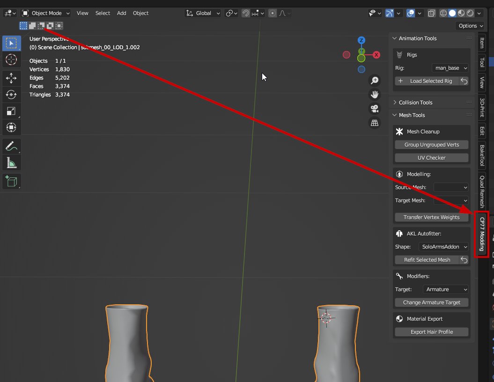
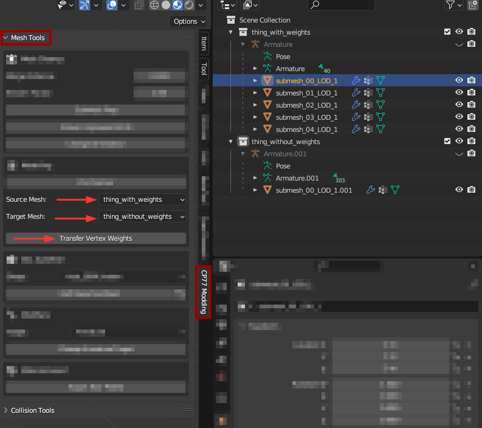

# Wolvenkit Blender IO Suite

You can find specific instructions for [installing-the-wolvenkit-blender-plugin.md](installing-the-wolvenkit-blender-plugin.md "mention") on the corresponding wiki page.

For the plugin's original readme, check [github](https://github.com/WolvenKit/Cyberpunk-Blender-add-on/).

## Compatibility

<table><thead><tr><th width="313.3333333333333">Game version</th><th width="155">Plugin version</th><th>Wolvenkit version</th></tr></thead><tbody><tr><td>2.0.0 or higher</td><td>latest (at least <a href="https://github.com/WolvenKit/Cyberpunk-Blender-add-on/releases/tag/1.5.0">1.5.0</a>)</td><td>>= 8.11.0 (<a href="https://github.com/WolvenKit/WolvenKit/releases/tag/8.11.0">stable</a> | <a href="https://github.com/WolvenKit/WolvenKit-nightly-releases/releases">nightly</a>)</td></tr><tr><td>up to 1.6.3_hotfix1 (but before 2.0)</td><td>&#x3C;= </td><td><a href="https://github.com/WolvenKit/WolvenKit/releases/tag/8.10.0">8.10.0</a></td></tr></tbody></table>


The plugin is developed on [Blender 3.6](https://www.blender.org/download/releases/3-6/) and [Blender 4.0](https://www.blender.org/download/releases/4-0/). For maximum compatibility, install the same version.


## Usage

As soon as you have a **mesh** or **armature** selected, the viewport toolbar (keyboard shortcut to hide/unhide: **`n`**) will show you the `CP77 Modding` tab:

<figure><figcaption></figcaption></figure>

## Features

### Animation Tools

If you have a **visible armature** selected, you will see the Animation Tools. Here, you can find

* shortcuts for playing, renaming and deleting existing animations
* shortcuts to add new actions and insert keyframes

… all outside of Blender's animation tab.

### Mesh Tools

#### Transfer Vertex Weights

Lets you transfer [vertex weights](../../3d-modelling/meshes-and-armatures-rigging.md) from one collection to the other:

<figure><figcaption>
Transfer weights with the click of a button!
</figcaption></figure>

Alternatively: By hand

You can only do this on a mesh-by-mesh basis, so you have to do all meshes in sequence.

To check out the more detailed process with a Transfer Weight modifier, check out the [custom-facial-piercings-prc-framework.md](../../modding-guides/npcs/custom-facial-piercings-prc-framework.md "mention") page, section [#weight-painting](../../modding-guides/npcs/custom-facial-piercings-prc-framework.md#weight-painting "mention")

1. Select the mesh with weights
2. Select the mesh that you want your weights transferred to
3. Press `Ctrl+L` and select `Transfer Mesh Data`
4. In the popup at the bottom left of your viewport, change the following properties:

#### 

5. Click anywhere else. You're done!

#### [AKL Autofitter](wkit-blender-plugin-akl-autofitter.md)

For documentation of the autofitter, see the [corresponding wiki page](wkit-blender-plugin-akl-autofitter.md).

#### Modifiers

Lets you change the armature target (the skeleton that'll move and deform your mesh)

#### Material Export: Hair

Lets you export a hair profile. For documentation, see [#hair-profiles-.hp](wkit-blender-plugin-import-export.md#hair-profiles-.hp "mention")


You can find a guide about [#creating-your-own-hair-colours](../../materials/configuring-materials/cyberpunk-hair-material.md#creating-your-own-hair-colours "mention") at the link.


#### UV Checker

With the press of a button, you can switch out the currently active material to a coloured and numbered grid for easier UV mapping.

If the UV checker is currently assigned, pushing the button again will restore the original material.

### Collision Tools

The collision tools and -generator can

* generate of convex colliders with the exact shape of your mesh\
  _The number of vertices to sample should be set to match the number set in the .phys file in order to ensure successful export_
* generate box and capsule colliders with either user specified sizing or sized automatically to match the selected mesh
* export edited collision bodies back to .phys \*\*\*currently requires a wolvenkit converted .phys.json file
