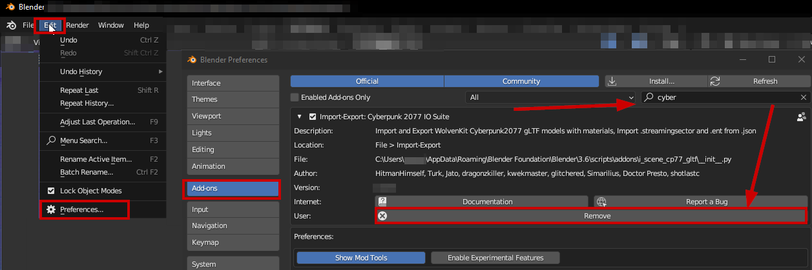
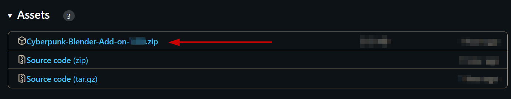
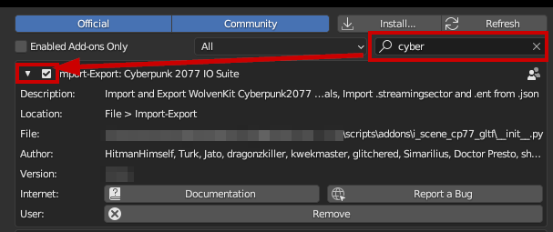

# Installing the Wolvenkit Blender Plugin

## Step 0: Uninstall the old version


If you never installed a previous version of the plugin, you can go straight to [#step-1-install-the-plugin](installing-the-wolvenkit-blender-plugin.md#step-1-install-the-plugin "mention")


1. Open the Blender Preferences (Toolbar: `Edit` -> `Preferences`) and select the `AddOns` tab

<figure><figcaption></figcaption></figure>

Complete either of the options below:

#### Click the  `Remove` button

The build-in Blender way. Should work. If it doesn't check the second option

#### Delete the files on your disk

Check the plugin's `file` entry. It will usually be something like this:

```
%APPDATA%\Blender Foundation\Blender\4.0\scripts\addons\i_scene_cp77_gltf
```

Navigate there with your Windows Explorer (Hotkey: `Windows+R`, paste the path above after changing your Blender version), and delete everything — either the entire folder, or all files inside.


Optional: Close and re-open Blender


## Step 1: Install the plugin

Download the latest version of the plugin from **github:**&#x20;

1. On the [releases](https://github.com/WolvenKit/Cyberpunk-Blender-add-on/releases) page, find the most recent release
2. Scroll past the change notes to the **Assets** section
3. Download the zip file with the plugin:

<figure><figcaption><p>Do not download anything called "Source code", unless you know what you're doing</p></figcaption></figure>

3. Start Blender
4. Open the Blender Preferences (Toolbar: `Edit` -> `Preferences`) and select the `AddOns` tab

<figure><figcaption></figcaption></figure>

5. Click the "Install" button and select the zip file you downloaded in step 2

## Step 2: Enable the plugin


You only need to do this if you never installed the plugin before.


After you have successfully installed the plugin, you can now use the search bar to find it:

<figure><figcaption></figcaption></figure>

Make sure the box is checked and restart Blender.

## Troubleshooting

### I can't (un)install the plugin!

You can do both by hand. Find your Blender install's plugin folder, the path will look something like this (replace 3.6 with your Blender version):

```
%APPDATA%\Blender Foundation\Blender\3.6\scripts\addons
```

Inside the plugins folder, the Wolvenkit Blender IO Suite will be installed to the subfolder `i_scene_cp77_gltf`.

To uninstall the plugin, delete the entire folder.

To install the plugin, find the folder in your downloaded zip file that contains the file **`__init__.py`**, move it here, and rename it.

Now, **restart Blender**.


