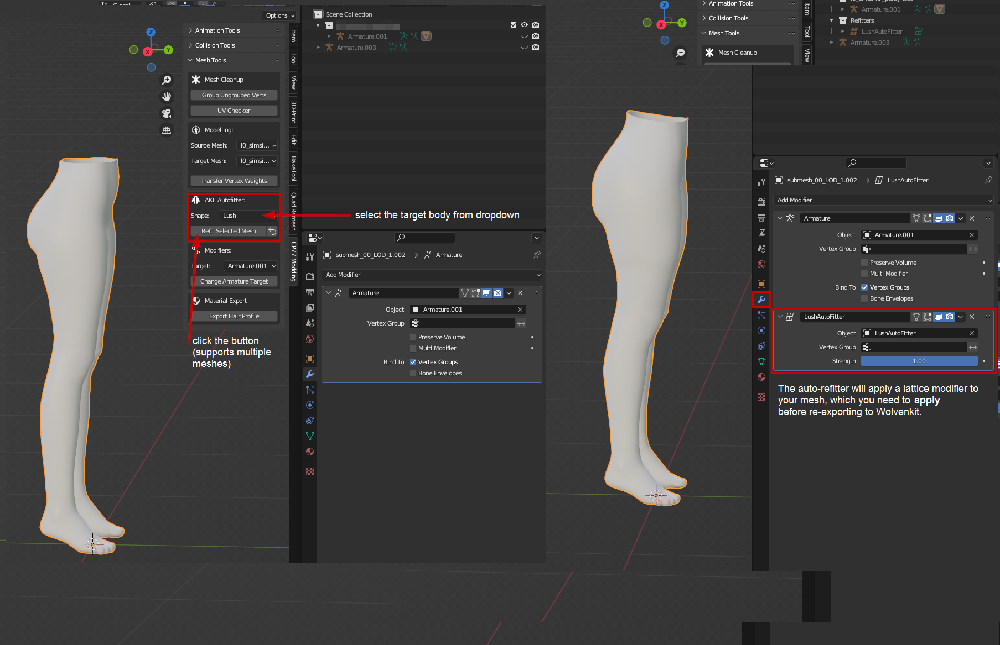
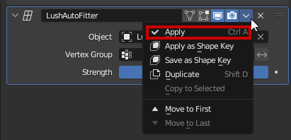

# WKit Blender Plugin: AKL Autofitter

The auto-refitter is a tool developed by [AllKnowingLion](http://127.0.0.1:5000/u/ntwa3K86ZPgEhR4Ds0rOU5qaKHm1 "mention") that automates the tedious process of refitting meshes for the various body mods.

With a mesh selected, you can find it in the **Mesh Tools** section of the **CP77** panel. Use the dropdown to select a target body, then click the button to apply the changes:

<figure><figcaption></figcaption></figure>

## Modifier cannot be applied to a mesh with shapekeys

Future versions of the plugin will make this process much easier. For now:

1. Duplicate the mesh (Hotkey: `Shift+D`, `Esc`)
2. [Delete the shapekeys](../../3d-modelling/troubleshooting-your-mesh-edits.md#option-2-guaranteed-to-work-delete-garmentsupport-from-the-mesh) from one of the meshes
3. Delete the modifier from the other mesh
4. After the shapekeys are gone, apply the modifier:

<figure><figcaption></figcaption></figure>

5. Select the mesh **without shapekeys** (the one you changed by applying the modifier)
6. Select the mesh **with shapekeys** (the one with the original shape)
7. Switch to the Data tab, select the first shapekey in the list, and transfer it:

<figure><figcaption></figcaption></figure>

8. Repeat the process with all other shapekeys
9. You can now delete the original mesh.

## The body I want is not supported!

The lattice modifier has to be created from hand and added to the Wolvenkit Blender IO suite.

TODO: This section will eventually document the steps how you can&#x20;

* add a body mod to your local version of the plugin
* share that edit with everyone else by having it added officially

