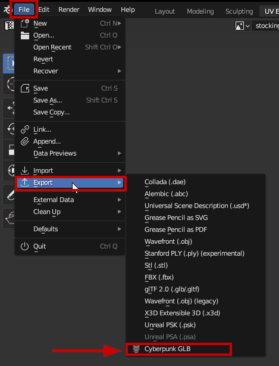
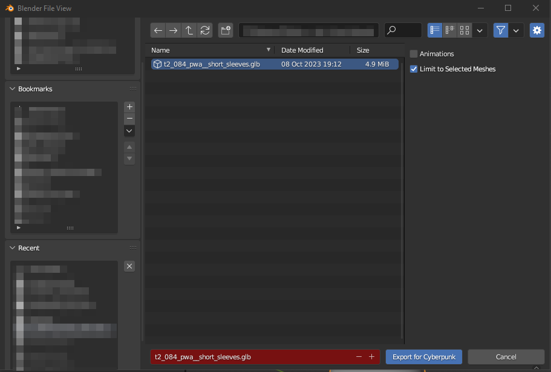
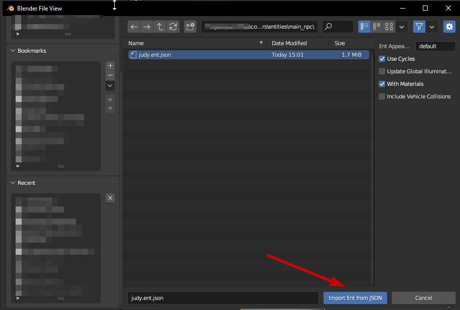
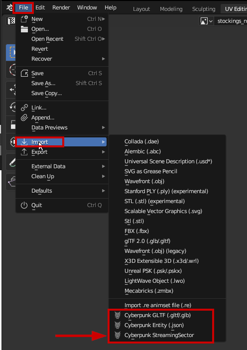
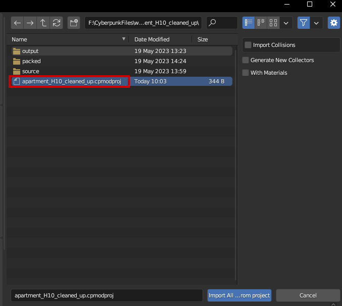

# WKit Blender Plugin: Import/Export

### Wait, this is not what I want!

Would you rather…

Check the following sub-pages instead:

[exporting-and-importing-meshes](../../3d-modelling/exporting-and-importing-meshes/ "mention") (Step-by-step)

[Import/Export](http://127.0.0.1:5000/s/-MP\_ozZVx2gRZUPXkd4r/wolvenkit-app/usage/import-export "mention") (Wolvenkit wiki)

[Blender Integration](http://127.0.0.1:5000/s/-MP\_ozZVx2gRZUPXkd4r/wolvenkit-app/usage/blender-integration "mention")(Wolvenkit wiki)

## Meshes

### Export from Wolvenkit

Wolvenkit will [export a mesh with materials](http://127.0.0.1:5000/s/-MP\_ozZVx2gRZUPXkd4r/wolvenkit-app/usage/blender-integration#how-do-i-use-the-blender-integration-features) by default. Simply use the [Import/Export tool](http://127.0.0.1:5000/s/-MP\_ozZVx2gRZUPXkd4r/wolvenkit-app/usage/import-export/models#exporting-mesh-files).

### Importing into Blender

Select File -> Import -> Cyberpunk GLTF

<figure><figcaption></figcaption></figure>

In the Blender File view, find the glb you exported from Wolvenkit. By default, the textures will be saved to your material depot in PNG format already.

<figure><figcaption></figcaption></figure>

### Exporting from Blender

Select File -> Export -> Cyberpunk GLB

<figure><figcaption></figcaption></figure>

In the file picker, **overwrite** the glb you were editing (you need to [overwrite an existing file](http://127.0.0.1:5000/s/-MP\_ozZVx2gRZUPXkd4r/wolvenkit-app/usage/import-export#import) to import back to Wolvenkit).

For an explanation of the sidebar settings on the right, read on below the picture.

<figure><figcaption></figcaption></figure>

#### Animations

Check this box if you are exporting a .glb file with animation data (it will be [imported into an .anim](../../modding-guides/animations/poses-animations-make-your-own.md#step-3-importing-and-testing))

#### Limit to Selected Meshes

By default, the Wolvenkit Blender IO Suite will only export **selected meshes** and their parent armatures. Unchecking this box will display the Export Visible Meshes checkbox, which is unchecked by default.&#x20;

If you don't check either of these boxes, the plutin will export **all meshes and armatures** into the same .glb file. You usually do not want this.

## Entities

### Export from Wolvenkit

You can export an entity by **adding it to your project** and running the corresponding script from inside Wolvenkit. Here are the relevant guides:

&#x20;[Exporting Vehicles](http://127.0.0.1:5000/s/-MP\_ozZVx2gRZUPXkd4r/modding-community/exporting-to-blender/exporting-vehicles "mention") (you can also use this for characters)

&#x20;[Exporting Characters to Blender](http://127.0.0.1:5000/s/-MP\_ozZVx2gRZUPXkd4r/modding-community/exporting-to-blender "mention")

&#x20;[Exporting Rigs & Anims](http://127.0.0.1:5000/s/-MP\_ozZVx2gRZUPXkd4r/modding-community/exporting-to-blender/exporting-rigs-and-anims "mention")

### Importing into Blender

After you have exported the entity from Wolvenkit via script, switch to Blender and select File -> Import -> Cyberpunk Entity (.json)

<figure><figcaption></figcaption></figure>

Navigate the file browser to the `ent.json` in your project's `raw` folder and import it.

<figure><figcaption></figcaption></figure>

#### Use Cycles

Will switch the workbench's rendering mode from Eevee to Cycles. This will make sure that the shaders work as intended.

#### Update Global Illumination

Will fix lighting

#### With Materials

Will read materials from `material.json` files, generating shaders in the process.

#### Include Vehicle Collisions

This option imports a vehicle entities collision bodies for editing. The collision bodies give substance to the mesh and determine how the world responds to the vehicle - without proper collision bodies, your character, NPCs and anything else your vehicle bumps into would pass right through the mesh. Unless you're adding a new vehicle or significantly altering an existing one, you generally want to leave this box unchecked.

### Exporting from Blender

Entity export is currently (1.5.0) not supported.

To export edited collision bodies back to .phys.json, simply press the "export collisions" button in the Collision Tools Panel and use the File View to navigate to your original .phys.json.

\*\* Currently only modifying existing .phys files is supported.

## Streaming Sectors

### Export from Wolvenkit

To export streamingsectors, you have to use the corresponding Wolvenscript. The workflow is documented [here](http://127.0.0.1:5000/s/-MP\_ozZVx2gRZUPXkd4r/modding-community/world-editing/exporting-streaming-sectors-to-blender).&#x20;

### Importing into Blender

After you have exported the streamingsector from Wolvenkit via script, switch to Blender and select File -> Import -> Cyberpunk StreamingSector

<figure><figcaption></figcaption></figure>

Navigate in the file view to your Wolvenkit project's root file, and select the .`cpmodproj` file:

<figure><figcaption></figcaption></figure>

### Exporting from Blender

The export process is not part of the plugin yet (1.5.0); it is documented [here](https://wiki.redmodding.org/wolvenkit/modding-community/world-editing/exporting-streaming-sectors-to-blender#importing-back-into-cyberpunk).&#x20;

### Exporting .HP files

The Cyberpunk IO suite supports exporting custom .hp(hair profile) files. Simply edit the gradient information of a vanilla hair profile, select the hair mesh the material is connected to and press the "Export Hair Profile" button in the Material Exports panel. Your new .hp.json file will be automatically deposited into your mod project at \
base\characters\common\hair\textures\hair\_profiles. You'll be able to identify the modified file by the prefix mod\_. You can name the material whatever you want within Blender and the .json will be named accordingly, but your material name must end with \_cards.

To learn more about .hp files and their paramaters [check here](https://wiki.redmodding.org/cyberpunk-2077-modding/for-mod-creators/materials/cyberpunk-hair-material)

