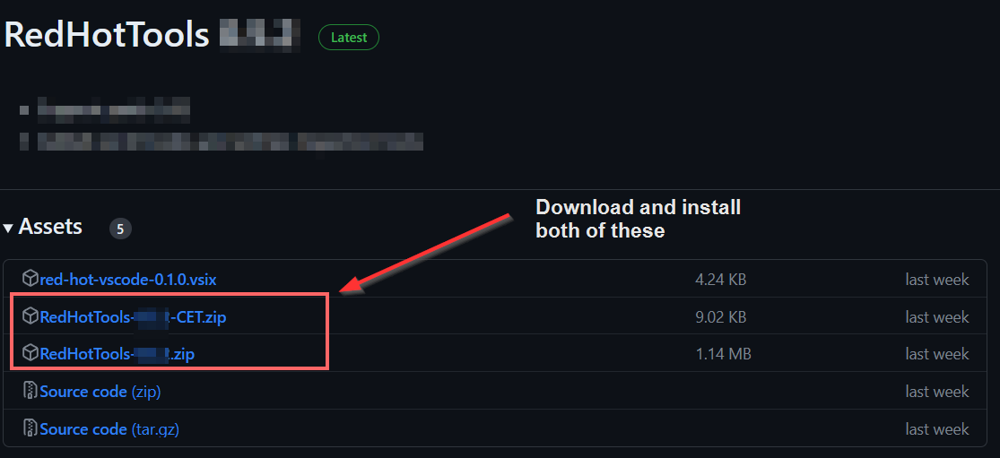
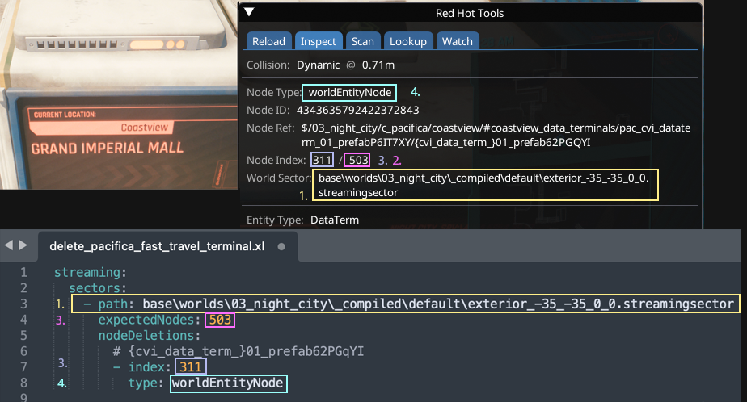

# Finding Locations

This page will show you **how to find** locations and sectors. If you already know them, check [world-editing](../../modding-guides/world-editing/ "mention")for guides on how to modify them.

## Existing lists

There are several overviews of interesting locations:

<table><thead><tr><th width="290"></th><th></th></tr></thead><tbody><tr><td><a data-mention href="./">.</a></td><td>Wiki: List of world sectors for e.g. V's apartment. Sign up and edit!</td></tr><tr><td><a href="https://wiki.redmodding.org/cyber-engine-tweaks/teleportation-locations">CET wiki</a></td><td>List of interesting locations for teleporting</td></tr><tr><td><a href="https://discord.com/invite/47jV2rNdgn">AMM DIscord</a></td><td>An entire channel dedicated to locations</td></tr></tbody></table>

## Getting an item's world sector

1.  Install [RedHotTools](https://github.com/psiberx/cp2077-red-hot-tools/releases/) >= 0.5.2. You need both the plugin and the extra zip for CET.

    <figure><figcaption></figcaption></figure>
2. Extract them directly into your Cyberpunk game directory and start the game.
3. Head to the location that you want to edit.
4. Look at the item
5. Open the CET overlay
6. Open RedHotTool's [#inspect](../../modding-tools/redhottools.md#inspect "mention") or [#scan](../../modding-tools/redhottools.md#scan "mention") tab and see the sector information:

<figure><figcaption></figcaption></figure>

## Legacy information

With the release of [RedHotTools](https://github.com/psiberx/cp2077-red-hot-tools/releases/) 0.5.2, the information in the box below has become obsolete and will only be preserved for posterity.&#x20;

### Getting the player's coordinates

Run the following command in CET's console:

```
print(GetPlayer():GetWorldPosition())
```

<details>

<summary>Finding sectors: Legacy information</summary>

## Finding a specific sector

For technical stuff about sectors and the really manual way to look for things go [here](https://wiki.redmodding.org/cyberpunk-2077-modding/for-mod-creators/files-and-what-they-do/the-whole-world-.streamingsector). For less masochistic methods read on.

### Prerequisite: Getting the coordinates

Complete [#getting-the-players-coordinates](places.md#getting-the-players-coordinates "mention"). Copy the result and put it into a txt file somewhere.

### Method 1: the Wolvenkit preview

1. In Wolvenkit, open the file `base\worlds\03_night_city\_compiled\default\blocks\all.streamingblock`
2. Switch to the second tab "All Sector Preview"
3. In the panel to the right, enter the coordinates that you copied from the game in step 2
4. Click "Search for Coordinate"
5. Optional: Zoom in

You can double-click on the red text to load the corresponding streamingsector file into the streamingblock's preview!


For details on how to find other LOD levels, check [here](https://wiki.redmodding.org/cyberpunk-2077-modding/modding-know-how/files-and-what-they-do/the-whole-world-.streamingsector#calculating-the-files).&#x20;

### Method 2: Following the meshes

If you know a mesh that's used inside the location, you can right-click the mesh file inside Wolvenkit's asset browser and use "**Find files using this**".&#x20;

You might want to consider using a unique mesh rather than a standard cup or bottle.


### Method 3: Via script

Go [here for PL](https://colab.research.google.com/github/Simarilius-uk/sectorStuff/blob/main/AllBlocks\_colab\_w\_streamingblock\_PL.ipynb) ([old link](https://colab.research.google.com/github/Simarilius-uk/sectorStuff/blob/main/AllBlocks\_colab\_w\_streamingblock.ipynb)) and either use the script in your webbrowser (recommended) or download the script locally to run it with Python.&#x20;

#### When running from browser:

Change the x, y and z coordinate to the coordinates that you found[ via CET](places.md#prerequisite-getting-the-coordinates):thumbsup:


#### When running locally:

The script requires you to have a local json export of `all.streamingblock` somewhere.&#x20;

Change line 11 to the absolute path of your json (remember the double slashes):

```
11     filepath = 'C:\\CyberpunkModding\\Files\\all.streamingblock.json'
```

You'll find the coordinates in line 31. Change them to the coordinates that you found [via CET](places.md#perquisite-getting-the-coordinates):

```
31     player_loc={'X':-1604.0522,'Y':353.99716,'Z':49.200005}
```

Now, run the script via Python. It'll give you a list of interior/exterior sector files together with the distance from your coordinates.

The blocks at the bottom can be used to generate a streamingblock json file for just the results, which can be imported to wolvenkit to preview them as per Method 1. if running the script locally you will need to download the sectors.streamingblock file from the github and edit the templatepath variable to point at it.


</details>

