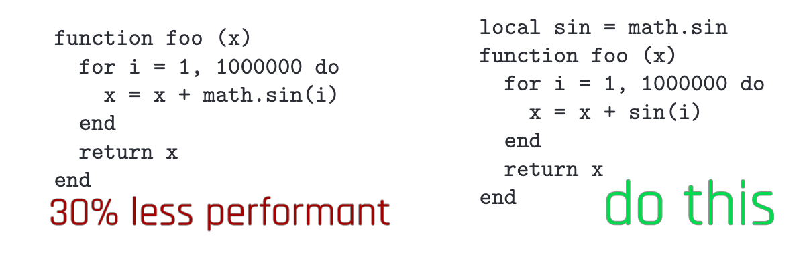

# Best practices / pitfalls

## LUA

### Gain performance: Early Return

You're probably used to coding like this:

<pre><code><strong>local function myMethod()
</strong><strong>  if condition then 
</strong><strong>    -- do a little dance, make a little love…
</strong><strong>  end
</strong><strong>end
</strong></code></pre>

In LUA, you can skim a few processing cycles by using the early return style:&#x20;

<pre><code><strong>local function myMethod()
</strong><strong>  if not condition then return end
</strong><strong>  -- do a little dance, make a little love…
</strong><strong>end
</strong></code></pre>

You can gain a **significant** amount of performance this way, especially when doing this in a loop.&#x20;

### Fixing/preventing nil access

LUA throws an exception if it encounters `nil` in unexpected places. The corresponding error will look like this:

<pre><code><strong>attempt to access local '&#x3C;variable name>' (a nil value)
</strong>stack traceback: 
  my_example.lua:1234 in function 'MyFunctionName
</code></pre>

Open the corresponding file, find the correct line, and check what is being accessed there. It will look like `variable.property`, or perhaps something will be concatenated to a string (`"something something text" .. variable`).&#x20;

You can assign a **default value** to the property in question:&#x20;

```
myString = <original string assignment> or ""
myNumber = <original number assignment> or 0
myEverythingElse = <original object assignment> or {}
```


While that won't solve any other problems, it will at least make the error go away.


### Switch in LUA: Lookup Tables

Who doesn't know the problem? You want to know if your string is A, B, or C, but not D — and LUA doesn't have a switch statement.&#x20;

Fortunately, there is a built-in and performant way to&#x20;

### Performance killers: strings

String concatenation and comparison can be the difference between a brief stutter and a complete freeze or even crash to desktop. This is not a joke — see [here](https://www.lua.org/gems/sample.pdf) for more detail.

#### Comparing/Searching

Lua internalizes strings. That means these two strings will share a single representation in memory:

```
local string1 = "This is the same object!"
local string2 = "This is the same object!"
```

The comparison between those two strings will be almost-instant.&#x20;

This becomes a problem when comparing strings in a loop (see [Scopes](scripting-best-practices-pitfalls.md#scopes)):

```
for (_, mystring) in ipairs(mytable) do
    if mystring == "This is the same object!" then
        -- do something
    end
end
```

Every single pass of the loop will create a memory representation of  "This is the same object!" and then discard it again.&#x20;

<pre><code><strong>local myCompareString = "This is the same object!"
</strong><strong>for (_, mystring) in ipairs(mytable) do
</strong>    if mystring == myCompareString then
        -- do something
    end
end
</code></pre>


Takeaway:

If at all possible, define things outside the scope of loops!


#### Finding in strings

Lua's regex implementation is very limited. There is a limitation for pipes. For example, the following example will **actually iterate twice** after creating internal string representations:

```
if string.find("catastrophe",  "dog|cat") then 
  -- do something
end
```

It is faster to just do this:

```
if string.find("catastrophe",  "dog") or string.find("catastrophe",  "cat") then 
  -- do something
end
```

On top of that, `string.match` will return the entire string if no match is found:

```
local match = string.match("catastrophe",  "dog")
if match ~= "catastrophe" then
  -- do something
end
```

The alternative:

```
if string.find("catastrophe",  "dog")
  -- do something
end
```


Takeaway:

* Avoid regex
* prefer `String.find()` over `String.match()`


#### Concatenation


For a performance analysis of different kinds of string concatenation, check [here](https://dannyguo.medium.com/how-to-concatenate-strings-in-lua-d2164cc5922f).


### Scopes

<figure><figcaption></figcaption></figure>


