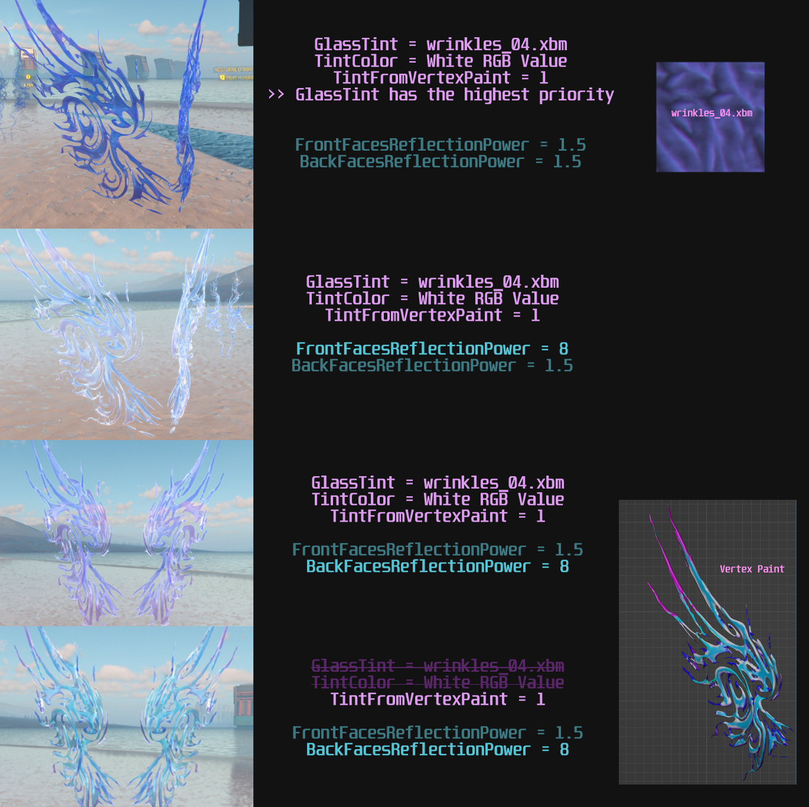
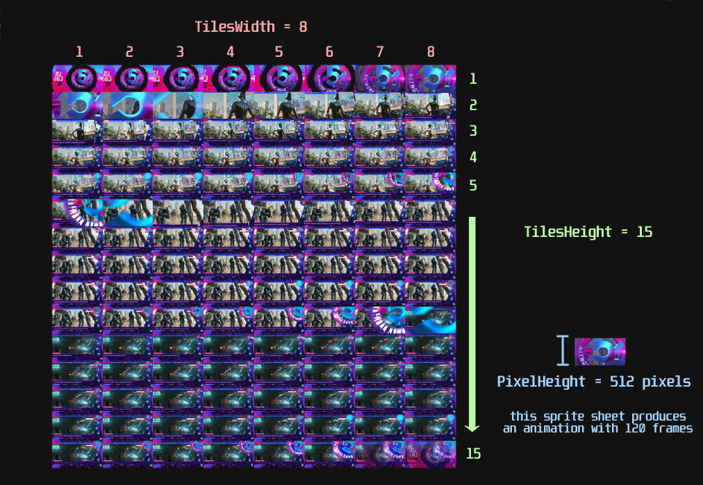

# Shader Docs

## Understanding and leveraging RED4 shaders

We do not have official documentation from CDPR about how shaders are used by artists. Thus any 2d/3d artist is looking at hundreds of black-box shaders with unknown usage. This is extremely demotivating for anyone looking to bring new assets to life with REDengine. The following list of tables is an attempt to make life easier for artists by using the community to document commonly used shaders.

## About the documentation

* The name and path of each shader will be documented by the header.
* Next we are using a table for each texture parameter with the _exact name_ listed by CDPR in the w2mg file, how REDengine uses each specific RGBA channel, and the usable range of the channel if not 0-1/0-255.
* When applicable, vertex color properties will be listed underneath the texture table with a similar format.
* Scalar, vector, color, and other properties will follow with their own unique description table.
* An asterisk (\*) is used to notate some degree of uncertainty, or need for more independent testing.

## Shaders

### `skin`

```
base/materials/skin.mt
```

| Texture            |       Red       |      Green      |            Blue            | Alpha |
| ------------------ | :-------------: | :-------------: | :------------------------: | :---: |
| Albedo             |      Color      |      Color      |            Color           |   ?   |
| SecondaryAlbedo    |        ?        |        ?        |              ?             |   ?   |
| Normal             |      Normal     |      Normal     |            None            |   ?   |
| DetailNormal       | Additive Normal | Additive Normal |            None            |   ?   |
| Roughness          |    Roughness    |       None      | MicroDetail mask (0.5-1)\* |   ?   |
| MicroDetail        | Additive Normal | Additive Normal |            None            |   ?   |
| TintColorMask      |        ?        |        ?        |              ?             |   ?   |
| Detailmap\_Stretch | Additive Normal | Additive Normal |            None            |   ?   |
| Detailmap\_Squash  | Additive Normal | Additive Normal |            None            |   ?   |
| EmmisiveMask       |        ?        |        ?        |              ?             |   ?   |
| Bloodflow          |        ?        |        ?        |              ?             |   ?   |

| Vertex Colors |          Description          |
| ------------- | :---------------------------: |
| Red           |      Ambient Occlusion\*      |
| Green         |   Subsurface Scattering Mask  |
| Blue          | Improved Facial Lighting Mask |

| Properties                        |               Description              |
| --------------------------------- | :------------------------------------: |
| SecondaryAlbedoInfluence          |                    ?                   |
| SecondaryAlbedoTintColorInfluence |                    ?                   |
| DetailRoughnessBiasMin/Max        |                    ?                   |
| MicroDetailUVScale01/02           |                    ?                   |
| MicroDetailInfluence              |  Controls MicroDetail normal intensity |
| TintColor                         |                    ?                   |
| TintScale                         |                    ?                   |
| SkinProfile                       |                    ?                   |
| EmissiveEV                        |                    ?                   |
| CavityIntensity                   |                    ?                   |
| BloodColor                        |                    ?                   |
| DetailNormalInfluence             | Controls DetailNormal normal intensity |

#### Notes

* The DetailNormal texture contains generic normal details that are shared between most faces. This is _not_ a tiling/procedural texture. The DetailNormalInfluence scalar parameter can be used to lower the intensity to simulate makeup or synthetic skin.\\
* The MicroDetail texture contains a microblend tiling texture used to add procedural detail to the normal map. We believe the Roughness texture blue channel is used to mask parts of the face from exhibiting this detail, such as the lips, eyelids, and ears.

### `mesh_decal`

```
base/materials/mesh_decal.mt
```

| Texture                  |     Red     |    Green    |     Blue    |     Alpha    |
| ------------------------ | :---------: | :---------: | :---------: | :----------: |
| DiffuseTexture           |    Color    |    Color    |    Color    | Opacity Mask |
| SecondaryMask            |      ?      |      ?      |      ?      |       ?      |
| NormalTexture            |    Normal   |    Normal   |     None    |       ?      |
| NormalAlphaTex           |      ?      |      ?      |      ?      |       ?      |
| NormalsBlendingModeAlpha |      ?      |      ?      |      ?      |       ?      |
| RoughnessTexture         | Roughness\* | Roughness\* | Roughness\* |       ?      |
| MetalnessTexture         | Metalness\* | Metalness\* | Metalness\* |       ?      |

| Properties               |    Description   |
| ------------------------ | :--------------: |
| VertexOffsetFactor       |         ?        |
| DiffuseColor             | Procedural Color |
| DiffuseAlpha             |       Alpha      |
| UVOffsetX/Y              |         ?        |
| UVRotation               |         ?        |
| UVScaleX/Y               |         ?        |
| SecondaryMaskUVScale     |         ?        |
| SecondaryMaskUVInfluence |         ?        |
| NormalAlpha              |         ?        |
| UseNormalAlphaTex        |         ?        |
| NormalsBlendingMode      |         ?        |
| RoughnessScale           |         ?        |
| RoughnessBias            |         ?        |
| MetalnessScale           |         ?        |
| MetalnessBias            |         ?        |
| AlphaMaskContrast        |         ?        |
| RoughnessMetalnessAlpha  |         ?        |
| AnimationSpeed           |         ?        |
| AnimationFramesWidth     |         ?        |
| AnimationFramesHeight    |         ?        |
| DepthThreshold           |         ?        |

#### Notes

* DiffuseColor multiplies against the texture color to add procedural color

### glass

```
base\materials\glass.mt
```

| Texture     |    Red    |   Green   |    Blue   | Alpha |
| ----------- | :-------: | :-------: | :-------: | :---: |
| GlassTint   |   Color   |   Color   |   Color   |   ?   |
| MaskTexture |     ?     |     ?     |     ?     |   ?   |
| Roughness   | Roughness | Roughness | Roughness |   ?   |
| Normal      |   Normal  |   Normal  |   Normal  |   ?   |

| Vertex Colors | Description |
| ------------- | :---------: |
| Red           |    Color    |
| Green         |    Color    |
| Blue          |    Color    |

| Properties                |                                                          Description                                                          |
| ------------------------- | :---------------------------------------------------------------------------------------------------------------------------: |
| TintColor                 |                                                        Procedural Color                                                       |
| Opacity                   |                                                        Overall Opacity                                                        |
| OpacityBackFace           |                                                      Opacity of back face                                                     |
| TintFromVertexPaint       | Control how much vertex color will tint the glass color. If set to max value, vertex color will completely replace TintColor. |
| FrontFacesReflectionPower |                                               How much front face reflect light                                               |
| BackFacesReflectionPower  |                                                How much back face reflect light                                               |
| IOR                       |                                                      Index of Refraction?                                                     |
| RefractionDepth           |                                                               ?                                                               |
| FresnelBias               |                                                               ?                                                               |
| GlassSpecularColor        |                                              Color of light reflected from glass                                              |
| NormalStrength            |                                            Control how much normal map affects mesh                                           |
| NormalMapAffectsSpecular  |                                      Control how much normal map affects reflected light                                      |
| SurfaceMetalness          |                                                           Metalness                                                           |
| MaskOpacity               |                                                               ?                                                               |
| GlassRoughnessBias        |                                                               ?                                                               |
| MaskRoughnessBias         |                                                               ?                                                               |
| BlurRadius                |                                                               ?                                                               |
| BlurByRoughness           |                                                               ?                                                               |

#### Note

* There are a number of ways you can colorize your glass. GlassTint is the texture used to determine glass color. TintColor is procedural color. TintFromVertexPaint value determines how much vertex color affects the glass color. GlassTint seemingly has the highest priority, as in it will override other color parameters. Below is a test result from the process of making a glass wing.

<figure><figcaption><p>How glass color is affected by different parameters</p></figcaption></figure>

* There are many different other glass shaders, this one is just the most basic that is used for small objects.

### television\_ad

```
base\fx\shaders\television_ad.mt
```

| Texture     |  Red  | Green |  Blue | Alpha |
| ----------- | :---: | :---: | :---: | :---: |
| AdTexture\* | Color | Color | Color | Color |
| DirtTexture | Color | Color | Color | Color |

| Properties               |                           Description                          |
| ------------------------ | :------------------------------------------------------------: |
| TilesWidth\*             |  How many tiles are on the horizontal axis of the sprite sheet |
| TilesHeight\*            |   How many tiles are on the vertical axis of the sprite sheet  |
| PlaySpeed                |               Speed of which animation will play               |
| InterlaceLines           |               How much screen scanline is visible              |
| PixelsHeight\*           |                    Height of sprite in pixel                   |
| EmissiveEV               |                Energy Voltage of light emission                |
| EmissiveEVRaytracingBias |         Energy Voltage of light emission by Raytracing         |
| EmissiveDirectionality   |                                ?                               |
| EnableRaytracedEmissive  |                    Enable Raytraced Emission                   |
| BlackLinesIntensity      |                                ?                               |
| BlackLinesRatio          |                                ?                               |
| BlackLinesSize           |                                ?                               |
| LinesOrDots              |                                ?                               |
| DistanceDivision         |                                ?                               |
| Metalness                |                                ?                               |
| Roughness                |                                ?                               |
| IsBroken                 | If enabled, the animation will have a broken TV overlay effect |
| UseFloatParameter        |                                ?                               |
| UseFloatParameter1       |                                ?                               |
| AlphaThreshold           |                                ?                               |
| DirtOpacityScale         |                     Opacity of Dirt Texture                    |
| DirtRoughness            |                        Roughness of Dirt                       |
| DirtUvScaleU             |                    UV Scale of Dirt Texture                    |
| DirtUvScaleV             |                    UV Scale of Dirt Texture                    |
| HUEChangeSpeed           |                                ?                               |

#### Note

* AdTexture: TV screen will play looping animations that are actually sprites like a .gif. We believe this is for optimization purposes since videos are heavy.&#x20;
* TilesWidth, TilesHeight, and PixelsHeight combine will help the game define the dimension of your tile (sprite) on the sprite sheet.
* You should calculate your sprite sheet dimension so it completely fits in a square sheet. For example, a simple dimension is 5x5 tiles with 300x300 pixel sprite. Such a dimension will produce animation with 25 frames of a square sprite.
* More examples of such sprite sheets can be found in the path below

```
base\environment\decoration\advertising\digital\textures\animated\textures
```


It's recommended that you use free tools like [Ezgif.com](https://ezgif.com/gif-to-sprite) to make .gif and convert it into a sprite sheet for AdTexture


<figure><figcaption><p>AdTexture as Sprite Sheet Example. This is the Trauma Team news in the game.</p></figcaption></figure>

* There are many screen shaders, this one is used for small TV screens.


If used cleverly with a properly done mesh, you can make use of this shader to put animation on your clothing or other items

