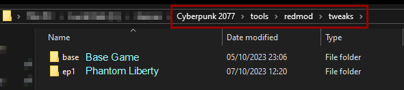

# Browsing the tweak database

### Summary

**Published:** Jan 13 2024 by [manavortex](https://app.gitbook.com/u/NfZBoxGegfUqB33J9HXuCs6PVaC3 "mention")\
**Last documented edit:** Jan 13 2024 by [manavortex](https://app.gitbook.com/u/NfZBoxGegfUqB33J9HXuCs6PVaC3 "mention")

This page tells you how to **browse** the TweakDB. \
If you don't know what that is, you might want to read [.](./ "mention") first.


If you're looking for all tweak database entries of the type XYZ, you might be lucky to find a list under [cheat-sheet-tweak-ids](../../references-lists-and-overviews/cheat-sheet-tweak-ids/ "mention"). If there isn't one, please **make one** once you have found what you're looking for!


## Introduction

By browsing the TweakDB, you can inspect the game's database and change [entity ](#user-content-fn-1)[^1]properties in real time.&#x20;

To inspect the TweakDB, you have three options. This page will document each of them.

* To explore the game's existing records, check [#browsing-the-.tweak-files](browsing-the-tweak-database.md#browsing-the-.tweak-files "mention") (requires the [redmod](../../../for-mod-users/users-modding-cyberpunk-2077/redmod/ "mention") DLC)
* To fuck around and find out, check [#editing-values-with-cyber-engine-tweaks](browsing-the-tweak-database.md#editing-values-with-cyber-engine-tweaks "mention")
* To create new tweak files, read [#the-wolvenkit-tweak-browser](browsing-the-tweak-database.md#the-wolvenkit-tweak-browser "mention")


A big part of tweak modding is exploration — poking through tweaks until you find just the right thing to copy or change, or looking for something specific in hundreds of files.&#x20;


## Editing values with Cyber Engine Tweaks

You can do this **directly in your game**. Changes will not persist if you restart, and sometimes you may have to reload for them to become active, but this is the fastest and most comfortable way to fuck around and find out.


For documentation of the [TweakDB Editor](https://app.gitbook.com/s/-MP5jWcLZLbbbzO-\_ua1-887967055/console/usage-1 "mention"), please refer to the [Cyber Engine Tweaks](https://app.gitbook.com/o/-MP5ijqI11FeeX7c8-N8/s/-MP5jWcLZLbbbzO-\_ua1-887967055/ "mention") wiki.


## The Wolvenkit Tweak Browser

The easiest way to create tweaks is to use the Wolvenkit [Tweak Browser](https://app.gitbook.com/s/-MP\_ozZVx2gRZUPXkd4r/wolvenkit-app/editor/tweak-browser "mention"). This will generate tweak files for you which contain the current record's properties, whether they're directly defined or inherited from other records.


For an example on how to do this, check [#step-2-choose-the-weapon-and-create-an-override](../../modding-guides/items-equipment/adding-new-items/weapons/new-iconic-weapon-tutorial-for-dummies.md#step-2-choose-the-weapon-and-create-an-override "mention") from the [new-iconic-weapon-tutorial-for-dummies.md](../../modding-guides/items-equipment/adding-new-items/weapons/new-iconic-weapon-tutorial-for-dummies.md "mention") guide.


### Example: Using the Wolvenkit Tweak browser

If you search for `WilsonWeaponModAbility` in the Wolvenkit [Tweak Browser](https://app.gitbook.com/s/-MP\_ozZVx2gRZUPXkd4r/wolvenkit-app/editor/tweak-browser "mention"), you will find something like this:

```yaml
Items.WilsonWeaponModAbility:
  $type: gamedataGameplayLogicPackage_Record
  stackable: False
  UIData: Items.WilsonWeaponModAbility_inline0
  animationWrapperOverrides: []
  effectors:
    - Items.WilsonWeaponModAbility_inline1
    - Items.WilsonWeaponModAbility_inline2
  items: []
  statPools: []
  stats: []
```

As it's next to impossible to understand the item's structure like this, check the next section about [#browsing-the-.tweak-files](browsing-the-tweak-database.md#browsing-the-.tweak-files "mention") and [#example-browsing-.tweak-files](browsing-the-tweak-database.md#example-browsing-.tweak-files "mention").

## Browsing the `.tweak` files


You need the [REDmod DLC](../../../for-mod-users/users-modding-cyberpunk-2077/redmod/#installation) for this.


In your game directory  [`Cyberpunk 2077`](#user-content-fn-2)[^2], find the subfolder `tools\redmod\tweaks` ("**tweak folder**"):

<figure><figcaption><p>If these folders are missing, make sure that you have a valid REDmod <a data-mention href="../../../for-mod-users/users-modding-cyberpunk-2077/redmod/#installation">#installation</a></p></figcaption></figure>

These folders contain a bunch of `.tweak` files, which you can open with a text editor of your choice. If you don't have one yet, here are your options:

1. [Notepad++](https://notepad-plus-plus.org/downloads/) (free)\
   This is fastest, and you can use this text editor for a lot of Cyberpunk modding. Press the hotkey `Ctrl+Shift+F` (Edit -> Find in Files) and search under the tweak folder.
2. An IDE (e.g. [Visual Studio Code](https://code.visualstudio.com/download) (free), [IntelliJ](https://www.jetbrains.com/idea/download/)):\
   This is the most comfortable. Simply open the tweak folder and use the built-in search (hotkey for VSCode: `Ctrl+Shift+F`) to find your way along the files.
3. [Agent Ransack](https://www.mythicsoft.com/agentransack/) (free)\
   A command line search interface

### Searching .tweak files with powershell

If you're just looking for occurrences of a certain string (e.g. all vendors), you can run the following powershell script from the tweaks directory:

```powershell
# Which file should your findings be written to?
$outfile = "Output.txt"

# adjust this too - what you're looking for. Treated as regular expression
$searchString = '"BaseStats\.'

Clear-Content -Path $outfile

$UniqueFindList = [Collections.Generic.HashSet[string]]::new( [StringComparer]::InvariantCultureIgnoreCase )

Get-ChildItem -Recurse -Filter *.tweak | ForEach-Object {
	Get-Content $_.FullName | Select-String "$searchString" | ForEach-Object {
		$_.Line.Trim() -replace '^[^"]+"' -replace '^"' -replace '";?$' -replace '",.*$'
	} | Where-Object { $UniqueFindList.Add($_) }
} | Sort-Object | Out-File -FilePath "$outfile"


```

### Example: browsing .tweak files


The example uses IntelliJ to look up a weapon record — [Visual Studio Code](https://code.visualstudio.com/download) is functionally identical.&#x20;



This was initially a part of [new-iconic-weapon-tutorial-for-dummies.md](../../modding-guides/items-equipment/adding-new-items/weapons/new-iconic-weapon-tutorial-for-dummies.md "mention"), where you can also find explanations of various weapon properties.&#x20;


In this example, we want to learn about Wilson's iconic gun and the effects of its WeaponMod. Check [#wilsons-iconic-iron](../../modding-guides/items-equipment/adding-new-items/weapons/new-iconic-weapon-tutorial-for-dummies.md#wilsons-iconic-iron "mention") for the integrated version, or start searching:

Press `Ctrl + Shift + F` to open up the search dialog box and search for `Preset_Lexington_Wilson`.

You will find it in the following path:

```
tweaks/base/gameplay/static_data/database/items/weapons/ranged/handguns/lexington/preset_base_lexington.tweak
```

<figure><figcaption><p><code>Preset_Lexington_Wilson</code>, but in .tweak format.</p></figcaption></figure>

This is the same tweak you'd find in the [Tweak Browser](https://app.gitbook.com/s/-MP\_ozZVx2gRZUPXkd4r/wolvenkit-app/editor/tweak-browser), but it's much easier to read and understand.

To follow this weapon's iconic weapon mod, find the section where it is defined:

```
{
    slot = "AttachmentSlots.IconicWeaponModLegendary";
    itemPartPreset = "Items.WilsonWeaponMod";
}
```

This will take us to `iconic_mods.tweak`. \
The file holds `WilsonWeaponModAbility` with a bunch of `statModifiers`:&#x20;

<details>

<summary><code>iconic_mods.tweak</code> -> <code>WilsonWeaponMod</code> </summary>

```swift
WilsonWeaponMod : IconicWeaponModBase
{
    OnAttach = 
    [
       "Items.WilsonWeaponModAbility"
    ];
    statModifiers += 
    [
       {
          statType = "BaseStats.ReloadTimeBonus";
          modifierType = "Additive";
          value = -0.1f;
       } : ConstantStatModifier, 
       {
          statType = "BaseStats.RecoilKickMin";
          modifierType = "Multiplier";
          value = 0.8f;
       } : ConstantStatModifier, 
       {
          statType = "BaseStats.RecoilKickMax";
          modifierType = "Multiplier";
          value = 0.8f;
       } : ConstantStatModifier, 
       {
          statType = "BaseStats.SpreadDefaultX";
          modifierType = "Multiplier";
          value = 0.66f;
       } : ConstantStatModifier, 
       {
          statType = "BaseStats.SpreadMaxX";
          modifierType = "Multiplier";
          value = 0.66f;
       } : ConstantStatModifier, 
       {
          statType = "BaseStats.HitDismembermentFactor";
          modifierType = "Multiplier";
          value = 3f;
       } : ConstantStatModifier, 
       {
          statType = "BaseStats.HitWoundsFactor";
          modifierType = "Multiplier";
          value = 3.f;
       } : ConstantStatModifier, 
       {
          statType = "BaseStats.EffectiveRange";
          modifierType = "Multiplier";
          value = 0.75;
       } : ConstantStatModifier
    ];
    buyPrice = [];
    sellPrice = [];
}
```


</details>

… which aren't too different from the weapon modifiers. Let's ignore them for now and focus on the interesting part:

```swift
    OnAttach = 
    [
       "Items.WilsonWeaponModAbility"
    ];
```

Searching for this will take us to `mods_abilities.tweak`, which holds the information we care about.

<details>

<summary><code>mods_abilities.tweak</code></summary>

```
WilsonWeaponModAbility : IconicWeaponModAbilityBase
{
    UIData = 
    {
       iconPath = "ability_offensive";
       localizedDescription = "LocKey#50743";
    };
    effectors = 
    [
       {
          prereqRecord = "Prereqs.ProcessHitTriggered";
          percentMult = 0.25f;
          unitThreshold = 10f;
       } : MultiplyDamageWithVelocity, 
       {
          prereqRecord = "Perks.IsHitQuickMelee";
          value = 1.5f;
       } : MultiplyDamage
    ];
}
```


</details>

For an explanation of these properties, refer to [types-of-tweak-records.md](types-of-tweak-records.md "mention") -> [#effector](types-of-tweak-records.md#effector "mention").

To see how this file would look in the Tweak Browser (and why browsing the .tweak files is superior), check [#example-using-the-wolvenkit-tweak-browser](browsing-the-tweak-database.md#example-using-the-wolvenkit-tweak-browser "mention").

[^1]: An entity is any "object" in the game - an NPC, a weapon, a door or an exploding barrel.

[^2]: The directory where you installed the game
